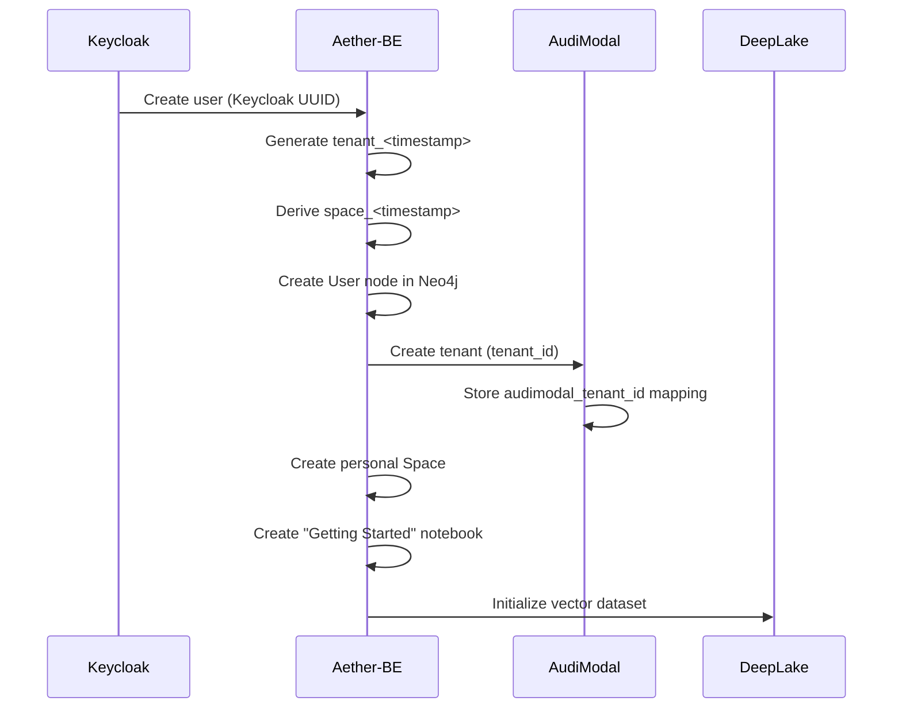

# TAS Platform Data Models

**Comprehensive data model documentation for all Tributary AI Services**

This directory contains centralized, authoritative documentation for all data models used across the TAS platform. Use this as the single source of truth for understanding data structures, relationships, and flows between services.

## Table of Contents

- [Overview](#overview)
- [Service Data Models](#service-data-models)
- [Cross-Service Integration](#cross-service-integration)
- [Validation & Testing](#validation--testing)
- [Migration Guides](#migration-guides)

---

## Overview

The TAS platform implements a **space-based multi-tenancy model** with the following core principles:

- **Spaces**: Top-level isolation boundaries (personal and organization spaces)
- **Tenants**: Logical groupings with pattern `tenant_<timestamp>` for unique identification
- **Space IDs**: Derived from tenant IDs as `space_<timestamp>`
- **Data Isolation**: All queries filter by `tenant_id` and `space_id` for security

### Platform Architecture

```
┌─────────────┐     ┌──────────────┐     ┌────────────┐
│  Keycloak   │────▶│  Aether-BE   │────▶│  AudiModal │
│   (Auth)    │     │   (Neo4j)    │     │   (Files)  │
└─────────────┘     └──────────────┘     └────────────┘
                           │
                    ┌──────┴──────┐
                    │             │
             ┌──────▼─────┐ ┌────▼─────┐
             │  DeepLake  │ │   TAS    │
             │  (Vectors) │ │  Router  │
             └────────────┘ └──────────┘
```

For detailed architecture diagrams, see [cross-service/diagrams/](./cross-service/diagrams/).

---

## Service Data Models

### Core Application Services

#### 1. [Keycloak](./keycloak/) - Identity & Access Management
**Technology**: Keycloak 23+ (OIDC/OAuth2)
**Data Store**: Internal PostgreSQL

- [**Realms**](./keycloak/realms/) - Isolated identity spaces (e.g., "aether" realm)
- [**Users**](./keycloak/users/) - User accounts with attributes and credentials
- [**Clients**](./keycloak/clients/) - OAuth2/OIDC clients (aether-frontend, aether-backend)
- [**Roles**](./keycloak/roles/) - Permission assignments (user, admin, owner)
- [**Tokens**](./keycloak/tokens/) - JWT structure and claims

**Key IDs**: Keycloak User ID (UUID) → Aether User ID, Realm names

---

#### 2. [Aether-BE](./aether-be/) - Graph Database Backend
**Technology**: Go 1.21+ | Neo4j 5.x
**Data Store**: Neo4j Graph Database

- [**Nodes**](./aether-be/nodes/)
  - User, Organization, Team, Space
  - Notebook, Document, Chunk
  - Entity, ProcessingJob, AuditLog
- [**Relationships**](./aether-be/relationships/)
  - BELONGS_TO, MEMBER_OF, CONTAINS
  - EXTRACTED_FROM, REFERENCES
- [**Queries**](./aether-be/queries/) - Common Cypher patterns
- [**Indexes**](./aether-be/indexes/) - Performance optimization indexes

**Key IDs**: User ID, Notebook ID, Document ID, tenant_id, space_id

---

#### 3. [Aether](./aether/) - React Frontend
**Technology**: React 19 | TypeScript | Vite
**Data Store**: Browser localStorage + Redux state

- [**Models**](./aether/models/) - Core TypeScript interfaces
- [**Types**](./aether/types/) - Type definitions and enums
- [**State**](./aether/state/) - Redux store structure
- [**Components**](./aether/components/) - Component prop interfaces

**Key IDs**: Synced with Aether-BE (User ID, Notebook ID, etc.)

---

#### 4. [AudiModal](./audimodal/) - Multi-Modal Document Processing
**Technology**: Go 1.21+ | PostgreSQL
**Data Store**: PostgreSQL + MinIO (S3)

- [**Entities**](./audimodal/entities/)
  - Tenant, File, ProcessingJob
  - ExtractionResult, SecurityScan
- [**Schemas**](./audimodal/schemas/) - PostgreSQL table definitions
- [**API**](./audimodal/api/) - REST API contracts

**Key IDs**: Tenant ID (audimodal_tenant_id), File ID, Job ID

---

#### 5. [TAS Agent Builder](./tas-agent-builder/) - Dynamic Agent Generation
**Technology**: Go 1.21+ | PostgreSQL
**Data Store**: PostgreSQL

- [**Entities**](./tas-agent-builder/entities/)
  - Agent, Execution, AgentTemplate
  - Tool, Capability
- [**Schemas**](./tas-agent-builder/schemas/) - PostgreSQL table definitions
- [**API**](./tas-agent-builder/api/) - REST API contracts

**Key IDs**: Agent ID, Execution ID, Space ID

---

#### 6. [DeepLake API](./deeplake-api/) - Vector Database
**Technology**: Python 3.9+ | DeepLake
**Data Store**: DeepLake Vector Store

- [**Vectors**](./deeplake-api/vectors/) - Vector embeddings structure
- [**Embeddings**](./deeplake-api/embeddings/) - Embedding models and metadata
- [**Datasets**](./deeplake-api/datasets/) - Dataset organization
- [**API**](./deeplake-api/api/) - REST API contracts

**Key IDs**: Dataset ID, Vector ID, Tenant ID

---

#### 7. [TAS LLM Router](./tas-llm-router/) - Secure LLM Gateway
**Technology**: Go 1.21+ | Stateless
**Data Store**: Redis (caching only)

- [**Requests**](./tas-llm-router/requests/) - LLM request structures
- [**Responses**](./tas-llm-router/responses/) - LLM response formats
- [**Models**](./tas-llm-router/models/) - Model configurations

**Key IDs**: Request ID, Model ID, User ID (from JWT)

---

#### 8. [TAS-MCP](./tas-mcp/) - Model Context Protocol Federation
**Technology**: Go + gRPC | Protocol Buffers
**Data Store**: Redis + Registry JSON

- [**Proto**](./tas-mcp/proto/) - Protocol Buffer definitions
- [**Events**](./tas-mcp/events/) - MCP event structures
- [**Federation**](./tas-mcp/federation/) - Server registry (1,535+ servers)
- [**Registry**](./tas-mcp/registry/) - Server metadata and discovery

**Key IDs**: Server ID, Tool ID, Resource ID

---

#### 9. [TAS-MCP-Servers](./tas-mcp-servers/) - Pre-built MCP Integrations
**Technology**: Various (Go, Node.js, Python)
**Data Store**: N/A (proxies to external services)

- [**Servers**](./tas-mcp-servers/servers/) - Individual server implementations
- [**Integrations**](./tas-mcp-servers/integrations/) - External API integrations

**Note**: Currently a placeholder - documentation TBD when servers are implemented

---

#### 10. [TAS-Workflow-Builder](./tas-workflow-builder/) - AI Workflow Orchestration
**Technology**: TBD
**Data Store**: TBD

- [**Workflows**](./tas-workflow-builder/workflows/) - Workflow definitions
- [**Steps**](./tas-workflow-builder/steps/) - Individual step configurations
- [**Templates**](./tas-workflow-builder/templates/) - Reusable workflow templates

**Note**: Currently a placeholder - documentation TBD when service is implemented

---

### Infrastructure Services

#### 11. [Aether-Shared](./aether-shared/) - Shared Infrastructure
**Technology**: Docker Compose | Kubernetes
**Components**: PostgreSQL, Redis, Kafka, MinIO, Prometheus, Grafana, Loki

- [**Infrastructure**](./aether-shared/infrastructure/) - Deployment configs
- [**Configs**](./aether-shared/configs/) - Service configurations
- [**Secrets**](./aether-shared/secrets/) - Secrets management patterns

**Shared Services**: Keycloak, PostgreSQL, Redis, Neo4j, MinIO, Kafka, Prometheus, Grafana, Loki

---

## Cross-Service Integration

### ID Mapping and Transformations

Understand how identifiers flow between services:

- [**Mappings**](./cross-service/mappings/) - ID transformation chains
- [**Flows**](./cross-service/flows/) - Data flow sequence diagrams
- [**Diagrams**](./cross-service/diagrams/) - Visual architecture representations
- [**Transformations**](./cross-service/transformations/) - Data format conversions

### Example: User Onboarding Flow



See [cross-service/flows/](./cross-service/flows/) for more detailed sequences.

---

## Validation & Testing

### Automated Validation

Run these scripts to ensure data consistency across services:

```bash
# Validate schema definitions
./validation/scripts/validate-schema.sh

# Check cross-service ID references
./validation/scripts/validate-cross-references.sh

# Verify MCP event contracts
./validation/scripts/validate-mcp-events.sh

# Test data flows end-to-end
./validation/scripts/test-data-flows.sh
```

- [**Scripts**](./validation/scripts/) - Automated validation tools
- [**Tests**](./validation/tests/) - Test cases and fixtures
- [**Schemas**](./validation/schemas/) - JSON Schema definitions

---

## Migration Guides

When data models change, follow these guides:

- [**Guides**](./migrations/guides/) - Step-by-step migration instructions
- [**Examples**](./migrations/examples/) - Sample migration scripts
- [**Versions**](./migrations/versions/) - Version compatibility matrix

### Example Migrations

- [Space Model Migration](./migrations/guides/001-space-model.md) - Migrating to space-based tenancy
- [Keycloak Sync](./migrations/guides/002-keycloak-sync.md) - Syncing Keycloak users to Neo4j
- [Vector Store Updates](./migrations/guides/003-vector-store.md) - DeepLake schema changes

---

## Quick Reference

### Tenant & Space ID Patterns

```
Keycloak User UUID:     570d9941-f4be-46d6-9662-15a2ed0a3cb1
↓
Aether User ID:         570d9941-f4be-46d6-9662-15a2ed0a3cb1 (same)
↓
Tenant ID:              tenant_1767395606
Space ID:               space_1767395606
AudiModal Tenant:       9855e094-36a6-4d3a-a4f5-d77da4614439 (shared backend)
```

### Common Query Patterns

**Neo4j - Get user's notebooks in a space:**
```cypher
MATCH (u:User {id: $userId})-[:OWNS]->(n:Notebook)
WHERE n.space_id = $spaceId AND n.tenant_id = $tenantId
RETURN n
```

**PostgreSQL - Get AudiModal files for tenant:**
```sql
SELECT * FROM files
WHERE tenant_id = $tenantId
AND deleted_at IS NULL
ORDER BY created_at DESC;
```

**API - Aether-BE authenticated request:**
```bash
curl -H "Authorization: Bearer $TOKEN" \
     -H "X-Space-ID: space_1767395606" \
     https://aether-api.tas.scharber.com/api/v1/notebooks
```

---

## Documentation Standards

All model documentation in this directory follows these standards:

### File Naming
- Entity files: `{entity-name}.md` (e.g., `user.md`, `notebook.md`)
- All lowercase, hyphen-separated
- Markdown format for readability

### Required Sections
Each model document must include:
1. **Overview** - Purpose and context
2. **Schema** - Field definitions with types
3. **Relationships** - Connections to other entities
4. **Indexes** - Performance optimization (if applicable)
5. **Validation Rules** - Constraints and business logic
6. **Examples** - Sample data and queries
7. **Cross-Service References** - Where this model is used

### Metadata
Each document includes a header:
```markdown
---
service: aether-be
model: User
database: Neo4j
version: 1.0
last_updated: 2026-01-03
---
```

---

## Contributing

When adding or modifying data models:

1. **Update the model documentation** in the appropriate service directory
2. **Update cross-service mappings** if IDs or relationships change
3. **Run validation scripts** to ensure consistency
4. **Update migration guides** if breaking changes are introduced
5. **Update service CLAUDE.md** to reference new models

---

## Version History

- **v1.0** (2026-01-03) - Initial centralized data model documentation
  - Established directory structure
  - Documented space-based tenancy model
  - Added Keycloak as infrastructure service
  - Created validation framework

---

## References

- [TAS Platform Overview](../../README.md)
- [Space-Based Tenancy](../../SPACE_BASED_IMPLEMENTATION_PLAN.md)
- [Aether-Shared Infrastructure](../../aether-shared/README.md)
- [Services & Ports](../../aether-shared/services-and-ports.md)

---

**Maintained by**: TAS Platform Team
**Last Updated**: 2026-01-03
**Questions**: See individual service CLAUDE.md files or root CLAUDE.md
