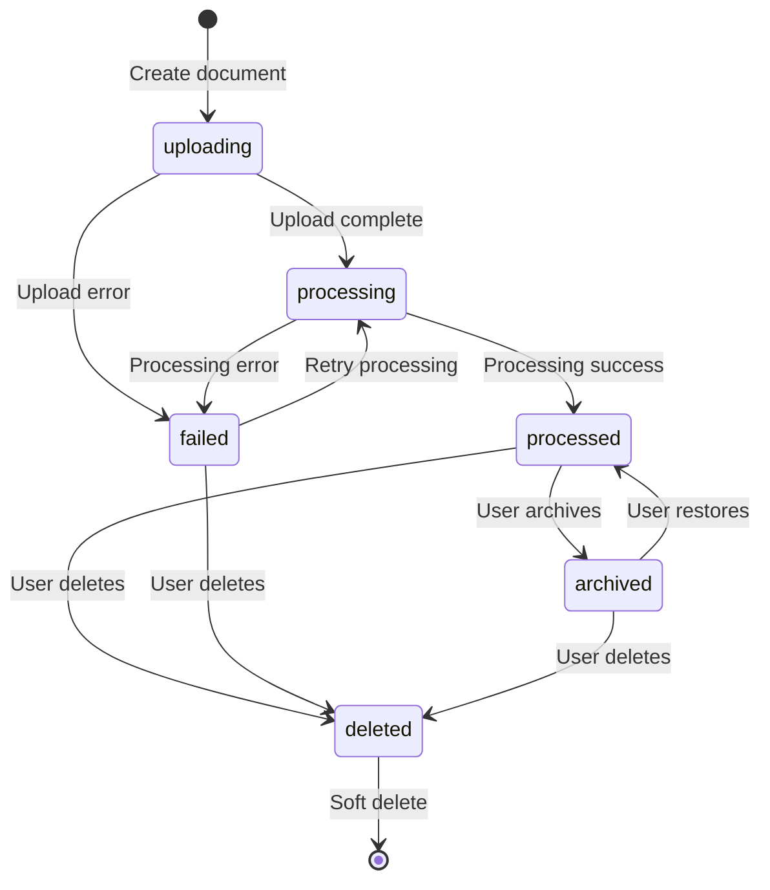

# Document Node

---

**Metadata**

```yaml
service: aether-be
model: Document
database: Neo4j
node_label: Document
version: 1.0
last_updated: 2026-01-05
status: production
```

---

## 1. Overview

### Purpose
The Document node represents individual files uploaded to the TAS platform for AI-powered processing, analysis, and retrieval. It manages the complete document lifecycle from upload through processing, chunking, embedding generation, and archival.

### Key Characteristics
- **Multi-format support**: PDF, Word, Excel, PowerPoint, images, audio, video, text files
- **Processing pipeline integration**: Integrates with AudiModal for document extraction and DeepLake for vector storage
- **Chunking strategies**: Supports multiple text segmentation approaches for optimal AI processing
- **Full-text search**: Maintains searchable text fields for rapid content discovery
- **Multi-tenancy isolation**: Enforces tenant_id and space_id boundaries
- **State-based lifecycle**: Six-state processing workflow (uploading → processing → processed/failed)

### Business Context
Documents are the primary content artifacts in the Aether platform. Each document is:
- **Contained** by exactly one Notebook
- **Owned** by one User (inherited from Notebook owner)
- **Isolated** within a Space/Tenant boundary
- **Processed** asynchronously via AudiModal service
- **Chunked** into semantic segments for AI analysis
- **Embedded** as vectors in DeepLake for similarity search

---

## 2. Schema Definition

### Core Identity Fields

| Property | Type | Required | Default | Description |
|----------|------|----------|---------|-------------|
| `id` | UUID string | Yes | `uuid.New()` | Unique identifier for the document |
| `name` | string | Yes | from request | Display name (1-255 chars) |
| `description` | string | No | `""` | Optional description (max 1000 chars) |
| `type` | string | Yes | from MIME type | Document category (pdf, document, spreadsheet, etc.) |
| `status` | string | Yes | `"uploading"` | Processing state (see lifecycle section) |

**Validation Rules**:
- `name`: Must be 1-255 characters, valid filename
- `description`: Max 1000 characters, safe string
- `type`: Auto-determined from MIME type
- `status`: Must be one of: `uploading`, `processing`, `processed`, `failed`, `archived`, `deleted`

### File Metadata Fields

| Property | Type | Required | Default | Description |
|----------|------|----------|---------|-------------|
| `original_name` | string | Yes | from upload | Original filename with extension |
| `mime_type` | string | Yes | from upload | MIME type (e.g., "application/pdf") |
| `size_bytes` | int64 | Yes | from file | File size in bytes (min 0) |
| `checksum` | string | No | from file | MD5/SHA256 checksum for integrity |

**MIME Type Examples**:
```
application/pdf                                          → type: "pdf"
application/msword                                       → type: "document"
application/vnd.openxmlformats-officedocument.wordprocessingml.document → type: "document"
application/vnd.ms-excel                                 → type: "spreadsheet"
image/png, image/jpeg                                    → type: "image"
audio/mpeg, audio/wav                                    → type: "audio"
video/mp4, video/quicktime                               → type: "video"
text/plain                                               → type: "text"
```

### Storage Information Fields

| Property | Type | Required | Default | Description |
|----------|------|----------|---------|-------------|
| `storage_path` | string | No | set on upload | Path in MinIO/S3 bucket |
| `storage_bucket` | string | No | set on upload | Bucket name (usually "aether-storage") |

**Storage Path Pattern**: `{tenant_id}/{space_id}/documents/{document_id}/{original_name}`

### Content and Processing Fields

| Property | Type | Required | Default | Description |
|----------|------|----------|---------|-------------|
| `extracted_text` | string | No | from AudiModal | Full text extracted from document |
| `processing_result` | map[string]interface{} | No | from AudiModal | Complete processing metadata (Neo4j compatible) |
| `processing_time` | *int64 | No | from AudiModal | Processing duration in milliseconds |
| `confidence_score` | *float64 | No | from AudiModal | AI confidence score (0.0-1.0) |
| `metadata` | map[string]interface{} | No | from request | User-defined metadata (Neo4j compatible) |

**Processing Result Structure** (from AudiModal):
```json
{
  "extracted_text": "Full document text...",
  "page_count": 12,
  "language": "en",
  "entities": [...],
  "processing_time_ms": 3421,
  "confidence": 0.95
}
```

### Search and Indexing Fields

| Property | Type | Required | Default | Description |
|----------|------|----------|---------|-------------|
| `search_text` | string | No | auto-generated | Searchable text (name + description + tags + extracted_text) |
| `tags` | []string | No | from request | User-defined tags for categorization |

**Search Text Composition**:
```
search_text = name + " " + description + " " + tags.join(" ") + " " + extracted_text
```

### Relationship Fields

| Property | Type | Required | Default | Description |
|----------|------|----------|---------|-------------|
| `notebook_id` | UUID string | Yes | from request | Parent notebook UUID |
| `owner_id` | UUID string | Yes | from context | User who owns the document (inherited from notebook) |

### Multi-Tenancy Fields

| Property | Type | Required | Default | Description |
|----------|------|----------|---------|-------------|
| `space_type` | enum | Yes | from notebook | `"personal"` or `"organization"` |
| `space_id` | string | Yes | from notebook | Space identifier (`space_<timestamp>`) |
| `tenant_id` | string | Yes | from notebook | Tenant identifier (`tenant_<timestamp>`) |

**Critical Rule**: All queries MUST filter by BOTH `tenant_id` AND `space_id` to ensure proper isolation.

### Processing and Chunking Fields

| Property | Type | Required | Default | Description |
|----------|------|----------|---------|-------------|
| `processing_job_id` | string | No | from AudiModal | AudiModal processing job UUID |
| `processed_at` | *time.Time | No | on completion | Timestamp when processing completed |
| `chunking_strategy` | string | No | default | Strategy used: "fixed", "semantic", "recursive", etc. |
| `chunk_count` | int | No | 0 | Number of chunks created (min 0) |
| `average_chunk_size` | int64 | No | 0 | Average chunk size in bytes |
| `chunk_quality_score` | *float64 | No | nil | Average quality score across all chunks (0.0-1.0) |

**Chunking Strategies**:
- `fixed`: Fixed-size chunks (e.g., 512 tokens)
- `semantic`: Semantic boundary detection (paragraphs, sections)
- `recursive`: Recursive splitting with overlap
- `sliding`: Sliding window with configurable overlap

### Timestamp Fields

| Property | Type | Required | Default | Description |
|----------|------|----------|---------|-------------|
| `created_at` | time.Time | Yes | `time.Now()` | Document creation timestamp |
| `updated_at` | time.Time | Yes | `time.Now()` | Last modification timestamp |

---

## 3. Relationships

### Outgoing Relationships

#### 1. CONTAINED_IN → Notebook
**Purpose**: Links document to its parent notebook container

**Properties**: None

**Cardinality**: Many-to-One (required)

**Query Pattern**:
```cypher
MATCH (d:Document {id: $documentId})-[:CONTAINED_IN]->(n:Notebook)
WHERE d.tenant_id = $tenantId
  AND d.space_id = $spaceId
RETURN n
```

#### 2. HAS_CHUNK → Chunk
**Purpose**: Links document to its text chunks for AI processing

**Properties**:
```
chunk_index: int        // Sequential chunk number (0-based)
chunk_type: string      // "text", "table", "image", etc.
created_at: datetime    // When chunk was created
```

**Cardinality**: One-to-Many (optional)

**Query Pattern**:
```cypher
MATCH (d:Document {id: $documentId})-[r:HAS_CHUNK]->(c:Chunk)
WHERE d.tenant_id = $tenantId
  AND d.space_id = $spaceId
RETURN c
ORDER BY r.chunk_index ASC
```

#### 3. PROCESSED_BY → ProcessingJob
**Purpose**: Links to AudiModal processing job for tracking and auditing

**Properties**:
```
started_at: datetime
completed_at: datetime
status: string          // "pending", "running", "completed", "failed"
```

**Cardinality**: One-to-One (optional)

**Query Pattern**:
```cypher
MATCH (d:Document {id: $documentId})-[:PROCESSED_BY]->(j:ProcessingJob)
WHERE d.tenant_id = $tenantId
  AND d.space_id = $spaceId
RETURN j
```

### Incoming Relationships

#### 1. User -[:OWNS]-> Document
**Purpose**: Establishes document ownership (usually inherited from notebook owner)

**Properties**: None

**Cardinality**: Many-to-One (required)

**Query Pattern**:
```cypher
MATCH (u:User {id: $userId})-[:OWNS]->(d:Document)
WHERE d.tenant_id = $tenantId
  AND d.space_id = $spaceId
  AND d.status = "processed"
RETURN d
ORDER BY d.updated_at DESC
```

#### 2. Notebook -[:CONTAINS]-> Document
**Purpose**: Notebook containment relationship (inverse of CONTAINED_IN)

**Properties**: None

**Cardinality**: One-to-Many

**Query Pattern**:
```cypher
MATCH (n:Notebook {id: $notebookId})-[:CONTAINS]->(d:Document)
WHERE n.tenant_id = $tenantId
  AND n.space_id = $spaceId
  AND d.status != "deleted"
RETURN d
ORDER BY d.created_at DESC
```

### Relationship Graph

```
(User)-[:OWNS]->(Document)-[:CONTAINED_IN]->(Notebook)
                    |
                    +-[:HAS_CHUNK]->(Chunk)
                    |
                    +-[:PROCESSED_BY]->(ProcessingJob)
```

---

## 4. Validation Rules

### Field Validation

#### Name Validation
```go
validate:"required,filename,min=1,max=255"
```
- Must be valid filename (no path separators, special chars)
- Length: 1-255 characters
- Cannot be empty or whitespace-only

#### Description Validation
```go
validate:"omitempty,safe_string,max=1000"
```
- Optional field
- Max 1000 characters
- Must be safe string (no SQL injection, XSS attempts)

#### Status Validation
```go
validate:"required,oneof=uploading processing processed failed archived deleted"
```
- Must be one of six valid states
- State transitions are controlled (see lifecycle section)

#### MIME Type Validation
```go
validate:"required"
```
- Must be valid MIME type string
- Used to determine document type

#### Size Validation
```go
validate:"min=0"
```
- Cannot be negative
- Maximum size enforced at upload layer (typically 100MB-1GB depending on tier)

#### Chunk Validation
```go
chunk_count: validate:"min=0"
average_chunk_size: validate:"min=0"
chunk_quality_score: validate:"omitempty,min=0,max=1"
```
- Chunk counts cannot be negative
- Quality scores must be 0.0-1.0 if present

#### Metadata Validation
```go
validate:"omitempty,neo4j_compatible"
```
- Must be compatible with Neo4j property storage
- No circular references
- Primitive types + arrays + maps only

### Business Logic Validation

#### 1. Notebook Existence
Before document creation:
```cypher
MATCH (n:Notebook {id: $notebookId})
WHERE n.tenant_id = $tenantId
  AND n.space_id = $spaceId
  AND n.status = "active"
RETURN n
```
- Notebook must exist
- Notebook must be active (not archived/deleted)
- Notebook must be in same tenant/space

#### 2. User Permission
User must have write access to the notebook:
```cypher
MATCH (u:User {id: $userId})-[:OWNS]->(n:Notebook {id: $notebookId})
WHERE n.tenant_id = $tenantId
  AND n.space_id = $spaceId
RETURN u, n
```
- User must own the notebook OR
- User must have shared write permission (if shared notebook)

#### 3. Storage Quota
Before upload, check space quota:
```cypher
MATCH (s:Space {id: $spaceId})
RETURN s.storage_used_bytes, s.storage_quota_bytes
```
- `storage_used_bytes + document.size_bytes <= storage_quota_bytes`

#### 4. File Type Restrictions
Some spaces may restrict file types:
```cypher
MATCH (s:Space {id: $spaceId})
RETURN s.allowed_file_types
```
- If `allowed_file_types` is set, check MIME type against list

---

## 5. Lifecycle and State Transitions

### State Machine



### State Descriptions

#### 1. `uploading` (Initial State)
- **Entry**: Document created, file upload in progress
- **Activities**:
  - File being transferred to MinIO/S3
  - Checksum calculation
  - Storage path assignment
- **Exit Conditions**:
  - Upload completes → `processing`
  - Upload fails → `failed`

#### 2. `processing`
- **Entry**: File successfully uploaded to storage
- **Activities**:
  - AudiModal job created and submitted
  - Text extraction in progress
  - Entity recognition
  - Security scanning
- **Exit Conditions**:
  - Processing succeeds → `processed`
  - Processing fails → `failed`

#### 3. `processed` (Success State)
- **Entry**: AudiModal processing completed successfully
- **State**:
  - `extracted_text` populated
  - `processing_result` contains metadata
  - `processed_at` timestamp set
  - Chunks created (if chunking enabled)
  - Embeddings generated in DeepLake
- **Exit Conditions**:
  - User archives → `archived`
  - User deletes → `deleted`

#### 4. `failed` (Error State)
- **Entry**: Upload or processing encountered error
- **State**:
  - `processing_result` may contain error details
  - Document visible to user with error indicator
- **Exit Conditions**:
  - User retries → `processing`
  - User deletes → `deleted`

#### 5. `archived`
- **Entry**: User archives processed document
- **State**:
  - Not visible in default views
  - Still searchable if explicitly included
  - Chunks and embeddings preserved
- **Exit Conditions**:
  - User restores → `processed`
  - User deletes → `deleted`

#### 6. `deleted` (Soft Delete)
- **Entry**: User deletes document
- **State**:
  - Not visible in any queries (unless admin)
  - `deleted_at` timestamp set
  - Storage marked for cleanup (30-90 day retention)
  - Chunks and embeddings marked for deletion
- **Exit Conditions**: None (terminal state)

### State Transition Rules

#### Allowed Transitions
```
uploading    → processing, failed
processing   → processed, failed
processed    → archived, deleted
failed       → processing, deleted
archived     → processed, deleted
deleted      → (none - terminal)
```

#### Forbidden Transitions
- Cannot go from `processed` back to `uploading`
- Cannot go from `deleted` to any other state
- Cannot skip `processing` state when uploading

### Timestamp Updates

All state transitions update `updated_at`:
```go
func (d *Document) UpdateProcessingStatus(status string, result map[string]interface{}, errorMsg string) {
    d.Status = status
    d.ProcessingResult = result
    if status == "processed" {
        now := time.Now()
        d.ProcessedAt = &now
    }
    d.UpdatedAt = time.Now()
}
```

---

## 6. Examples

### Create Document (Upload Initiation)

#### Cypher
```cypher
// 1. Verify notebook exists and user has access
MATCH (u:User {id: $userId})-[:OWNS]->(n:Notebook {id: $notebookId})
WHERE n.tenant_id = $tenantId
  AND n.space_id = $spaceId
  AND n.status = "active"

// 2. Create document node
CREATE (d:Document {
  id: $documentId,
  name: $name,
  description: $description,
  type: $type,
  status: "uploading",
  original_name: $originalName,
  mime_type: $mimeType,
  size_bytes: $sizeBytes,
  checksum: $checksum,
  notebook_id: $notebookId,
  owner_id: $userId,
  space_type: n.space_type,
  space_id: n.space_id,
  tenant_id: n.tenant_id,
  tags: $tags,
  search_text: $searchText,
  chunk_count: 0,
  created_at: datetime(),
  updated_at: datetime()
})

// 3. Create relationships
CREATE (u)-[:OWNS]->(d)
CREATE (d)-[:CONTAINED_IN]->(n)

// 4. Update notebook document count
SET n.document_count = n.document_count + 1,
    n.total_size_bytes = n.total_size_bytes + $sizeBytes,
    n.updated_at = datetime()

RETURN d
```

#### Go Code
```go
func NewDocument(req DocumentCreateRequest, ownerID string, fileInfo FileInfo, spaceCtx *SpaceContext) *Document {
    now := time.Now()
    return &Document{
        ID:           uuid.New().String(),
        Name:         req.Name,
        Description:  req.Description,
        Type:         determineDocumentType(fileInfo.MimeType),
        Status:       "uploading",
        OriginalName: fileInfo.OriginalName,
        MimeType:     fileInfo.MimeType,
        SizeBytes:    fileInfo.SizeBytes,
        Checksum:     fileInfo.Checksum,
        NotebookID:   req.NotebookID,
        OwnerID:      ownerID,
        SpaceType:    spaceCtx.SpaceType,
        SpaceID:      spaceCtx.SpaceID,
        TenantID:     spaceCtx.TenantID,
        Tags:         req.Tags,
        Metadata:     req.Metadata,
        SearchText:   buildSearchText(req.Name, req.Description, req.Tags),
        CreatedAt:    now,
        UpdatedAt:    now,
    }
}
```

### Read Document by ID

#### Cypher
```cypher
MATCH (d:Document {id: $documentId})
WHERE d.tenant_id = $tenantId
  AND d.space_id = $spaceId
  AND d.status != "deleted"
OPTIONAL MATCH (d)-[:CONTAINED_IN]->(n:Notebook)
OPTIONAL MATCH (u:User)-[:OWNS]->(d)
RETURN d, n, u
```

#### Go Code
```go
func (r *DocumentRepository) GetByID(ctx context.Context, documentID, tenantID, spaceID string) (*Document, error) {
    query := `
        MATCH (d:Document {id: $documentId})
        WHERE d.tenant_id = $tenantId
          AND d.space_id = $spaceId
          AND d.status <> 'deleted'
        RETURN d
    `
    result, err := r.session.Run(ctx, query, map[string]interface{}{
        "documentId": documentID,
        "tenantId":   tenantID,
        "spaceId":    spaceID,
    })
    // ... parse result
}
```

### Update Document Status (After Processing)

#### Cypher
```cypher
MATCH (d:Document {id: $documentId})
WHERE d.tenant_id = $tenantId
  AND d.space_id = $spaceId
SET d.status = $status,
    d.processing_result = $processingResult,
    d.extracted_text = $extractedText,
    d.processing_time = $processingTime,
    d.confidence_score = $confidenceScore,
    d.chunk_count = $chunkCount,
    d.processed_at = datetime(),
    d.search_text = d.search_text + " " + $extractedText,
    d.updated_at = datetime()
RETURN d
```

#### Go Code
```go
func (d *Document) UpdateProcessingStatus(status string, result map[string]interface{}, errorMsg string) {
    d.Status = status
    if result != nil {
        d.ProcessingResult = result
    }

    if status == "processed" && result != nil {
        if extractedText, ok := result["extracted_text"].(string); ok {
            d.ExtractedText = extractedText
            d.SearchText = buildSearchText(d.Name, d.Description, d.Tags) + " " + extractedText
        }
        now := time.Now()
        d.ProcessedAt = &now
    }

    d.UpdatedAt = time.Now()
}
```

### List Documents in Notebook

#### Cypher
```cypher
MATCH (n:Notebook {id: $notebookId})-[:CONTAINS]->(d:Document)
WHERE n.tenant_id = $tenantId
  AND n.space_id = $spaceId
  AND d.status IN $allowedStatuses
RETURN d
ORDER BY d.updated_at DESC
SKIP $offset
LIMIT $limit
```

#### Go Code
```go
func (r *DocumentRepository) ListByNotebook(ctx context.Context, notebookID, tenantID, spaceID string, opts *ListOptions) ([]*Document, error) {
    query := `
        MATCH (n:Notebook {id: $notebookId})-[:CONTAINS]->(d:Document)
        WHERE n.tenant_id = $tenantId
          AND n.space_id = $spaceId
          AND d.status IN $allowedStatuses
        RETURN d
        ORDER BY d.updated_at DESC
        SKIP $offset
        LIMIT $limit
    `
    // ... execute and parse
}
```

### Search Documents by Content

#### Cypher (Full-Text Search)
```cypher
CALL db.index.fulltext.queryNodes('documentSearchIndex', $query)
YIELD node, score
WITH node AS d, score
WHERE d.tenant_id = $tenantId
  AND d.space_id = $spaceId
  AND d.status = "processed"
RETURN d, score
ORDER BY score DESC
LIMIT 20
```

#### Go Code
```go
func (r *DocumentRepository) Search(ctx context.Context, query, tenantID, spaceID string) ([]*Document, error) {
    cypherQuery := `
        CALL db.index.fulltext.queryNodes('documentSearchIndex', $query)
        YIELD node, score
        WITH node AS d, score
        WHERE d.tenant_id = $tenantId
          AND d.space_id = $spaceId
          AND d.status = 'processed'
        RETURN d, score
        ORDER BY score DESC
        LIMIT 20
    `
    // ... execute and parse
}
```

### Delete Document (Soft Delete)

#### Cypher
```cypher
MATCH (d:Document {id: $documentId})
WHERE d.tenant_id = $tenantId
  AND d.space_id = $spaceId

// Update notebook counts
OPTIONAL MATCH (d)-[:CONTAINED_IN]->(n:Notebook)
SET n.document_count = n.document_count - 1,
    n.total_size_bytes = n.total_size_bytes - d.size_bytes,
    n.updated_at = datetime()

// Soft delete document
SET d.status = "deleted",
    d.updated_at = datetime()

// Mark chunks for deletion
WITH d
OPTIONAL MATCH (d)-[:HAS_CHUNK]->(c:Chunk)
SET c.deleted_at = datetime()

RETURN d
```

### Get Document with Chunks

#### Cypher
```cypher
MATCH (d:Document {id: $documentId})
WHERE d.tenant_id = $tenantId
  AND d.space_id = $spaceId
  AND d.status = "processed"
OPTIONAL MATCH (d)-[r:HAS_CHUNK]->(c:Chunk)
WHERE c.deleted_at IS NULL
RETURN d, collect({
  chunk: c,
  index: r.chunk_index,
  type: r.chunk_type
}) AS chunks
ORDER BY r.chunk_index ASC
```

---

## 7. Cross-Service References

### AudiModal Integration

#### Document Upload Flow
```
1. Aether Backend creates Document node (status: "uploading")
2. File uploaded to MinIO/S3
3. Document status → "processing"
4. Aether Backend calls AudiModal API:
   POST /api/v1/tenants/{tenant_id}/files
   {
     "file_id": "{document_id}",
     "file_name": "{original_name}",
     "mime_type": "{mime_type}",
     "storage_path": "{storage_path}"
   }
5. AudiModal processes file, returns:
   {
     "job_id": "...",
     "status": "processing",
     "extracted_text": "...",
     "metadata": {...}
   }
6. Aether Backend updates Document:
   - processing_job_id = job_id
   - status = "processing"
7. AudiModal sends completion webhook:
   POST /api/v1/webhooks/audimodal
   {
     "job_id": "...",
     "status": "completed",
     "result": {...}
   }
8. Aether Backend updates Document:
   - status = "processed"
   - extracted_text = result.extracted_text
   - processing_result = result
   - processed_at = now
```

#### AudiModal API Reference
- **Base URL**: `http://audimodal:8080/api/v1` (internal) or `http://localhost:8084/api/v1` (external)
- **Authentication**: JWT token from Keycloak
- **Endpoints**:
  - `POST /tenants/{tenant_id}/files` - Submit file for processing
  - `GET /tenants/{tenant_id}/files/{file_id}` - Get processing status
  - `GET /tenants/{tenant_id}/jobs/{job_id}` - Get job details

### DeepLake Integration

#### Embedding Generation Flow
```
1. Document reaches "processed" status
2. Aether Backend creates chunks via chunking strategy
3. For each chunk:
   POST /api/v1/embeddings
   {
     "tenant_id": "{tenant_id}",
     "space_id": "{space_id}",
     "document_id": "{document_id}",
     "chunk_id": "{chunk_id}",
     "text": "{chunk_text}",
     "metadata": {...}
   }
4. DeepLake generates embedding and stores in vector database
5. Chunk node updated with embedding_id reference
```

#### DeepLake API Reference
- **Base URL**: `http://deeplake-api:8000/api/v1` (internal)
- **Endpoints**:
  - `POST /embeddings` - Generate and store embedding
  - `POST /search` - Semantic similarity search
  - `DELETE /embeddings/{embedding_id}` - Delete embedding

### MinIO/S3 Storage

#### Storage Structure
```
aether-storage/
└── {tenant_id}/
    └── {space_id}/
        └── documents/
            └── {document_id}/
                └── {original_name}
```

**Example**:
```
aether-storage/tenant_1767395606/space_1767395606/documents/
  └── 123e4567-e89b-12d3-a456-426614174000/
      └── quarterly-report-q4-2025.pdf
```

#### Storage Operations
```go
// Upload file to MinIO
storagePath := fmt.Sprintf("%s/%s/documents/%s/%s",
    doc.TenantID, doc.SpaceID, doc.ID, doc.OriginalName)

_, err := minioClient.PutObject(ctx, "aether-storage", storagePath, fileReader, fileSize, minio.PutObjectOptions{
    ContentType: doc.MimeType,
})

// Update document
doc.UpdateStorageInfo(storagePath, "aether-storage")
```

---

## 8. Tenant and Space Isolation

### Multi-Tenancy Enforcement

#### Critical Query Pattern
**EVERY query accessing documents MUST include**:
```cypher
WHERE d.tenant_id = $tenantId
  AND d.space_id = $spaceId
```

#### Space Inheritance
Documents inherit space context from parent notebook:
```cypher
// Document creation inherits from notebook
MATCH (n:Notebook {id: $notebookId})
WHERE n.tenant_id = $tenantId
  AND n.space_id = $spaceId

CREATE (d:Document {
  ...
  space_type: n.space_type,
  space_id: n.space_id,
  tenant_id: n.tenant_id
})
```

### Space-Based Queries

#### List Documents in User's Personal Space
```cypher
MATCH (u:User {keycloak_id: $keycloakId})
MATCH (u)-[:OWNS]->(d:Document)
WHERE d.tenant_id = u.personal_tenant_id
  AND d.space_id = u.personal_space_id
  AND d.status != "deleted"
RETURN d
ORDER BY d.updated_at DESC
```

#### List Documents in Organization Space
```cypher
MATCH (u:User {keycloak_id: $keycloakId})-[:MEMBER_OF]->(s:Space {id: $spaceId})
WHERE s.space_type = "organization"
MATCH (d:Document)
WHERE d.space_id = s.id
  AND d.tenant_id = s.tenant_id
  AND d.status = "processed"
RETURN d
ORDER BY d.updated_at DESC
```

### Cross-Tenant Isolation Verification

#### Query Audit Pattern
```cypher
// ❌ WRONG - Missing tenant/space filters (SECURITY VIOLATION)
MATCH (d:Document {id: $documentId})
RETURN d

// ✅ CORRECT - Proper isolation
MATCH (d:Document {id: $documentId})
WHERE d.tenant_id = $tenantId
  AND d.space_id = $spaceId
RETURN d
```

#### Repository Pattern Enforcement
```go
// All repository methods enforce isolation
func (r *DocumentRepository) GetByID(ctx context.Context, documentID, tenantID, spaceID string) (*Document, error) {
    // tenantID and spaceID are REQUIRED parameters
    query := `
        MATCH (d:Document {id: $documentId})
        WHERE d.tenant_id = $tenantId
          AND d.space_id = $spaceId
        RETURN d
    `
    // ...
}
```

---

## 9. Performance Considerations

### Indexes

#### Required Indexes
```cypher
// Primary key index
CREATE CONSTRAINT document_id_unique IF NOT EXISTS
FOR (d:Document) REQUIRE d.id IS UNIQUE;

// Tenant/Space isolation indexes
CREATE INDEX document_tenant_id IF NOT EXISTS
FOR (d:Document) ON (d.tenant_id);

CREATE INDEX document_space_id IF NOT EXISTS
FOR (d:Document) ON (d.space_id);

// Composite index for isolation queries
CREATE INDEX document_tenant_space IF NOT EXISTS
FOR (d:Document) ON (d.tenant_id, d.space_id);

// Status filtering
CREATE INDEX document_status IF NOT EXISTS
FOR (d:Document) ON (d.status);

// Notebook relationship queries
CREATE INDEX document_notebook_id IF NOT EXISTS
FOR (d:Document) ON (d.notebook_id);

// Owner queries
CREATE INDEX document_owner_id IF NOT EXISTS
FOR (d:Document) ON (d.owner_id);

// Full-text search index
CREATE FULLTEXT INDEX documentSearchIndex IF NOT EXISTS
FOR (d:Document)
ON EACH [d.search_text, d.name, d.description, d.extracted_text];

// Timestamp-based sorting
CREATE INDEX document_updated_at IF NOT EXISTS
FOR (d:Document) ON (d.updated_at);

CREATE INDEX document_created_at IF NOT EXISTS
FOR (d:Document) ON (d.created_at);
```

### Query Optimization

#### Use Pagination
```cypher
// Always paginate large result sets
MATCH (d:Document)
WHERE d.tenant_id = $tenantId
  AND d.space_id = $spaceId
RETURN d
ORDER BY d.updated_at DESC
SKIP $offset
LIMIT $limit
```

#### Limit Relationships Traversed
```cypher
// ❌ Inefficient - Unlimited traversal
MATCH (d:Document)-[:HAS_CHUNK]->(c:Chunk)
RETURN d, collect(c)

// ✅ Efficient - Limit chunks returned
MATCH (d:Document {id: $documentId})-[r:HAS_CHUNK]->(c:Chunk)
RETURN d, collect(c)[0..10] AS first_10_chunks
```

#### Use EXISTS for Relationship Checks
```cypher
// ❌ Slower
MATCH (d:Document {id: $documentId})
OPTIONAL MATCH (d)-[:HAS_CHUNK]->(c:Chunk)
WITH d, count(c) AS chunkCount
WHERE chunkCount > 0
RETURN d

// ✅ Faster
MATCH (d:Document {id: $documentId})
WHERE EXISTS((d)-[:HAS_CHUNK]->(:Chunk))
RETURN d
```

### Caching Strategy

#### Redis Caching
```go
// Cache frequently accessed documents
func (r *DocumentRepository) GetByIDWithCache(ctx context.Context, documentID, tenantID, spaceID string) (*Document, error) {
    cacheKey := fmt.Sprintf("doc:%s:%s:%s", tenantID, spaceID, documentID)

    // Try cache first
    if cached, err := r.redis.Get(ctx, cacheKey).Result(); err == nil {
        var doc Document
        json.Unmarshal([]byte(cached), &doc)
        return &doc, nil
    }

    // Cache miss - query Neo4j
    doc, err := r.GetByID(ctx, documentID, tenantID, spaceID)
    if err != nil {
        return nil, err
    }

    // Cache for 5 minutes
    docJSON, _ := json.Marshal(doc)
    r.redis.Set(ctx, cacheKey, docJSON, 5*time.Minute)

    return doc, nil
}
```

#### Cache Invalidation
```go
// Invalidate on updates
func (r *DocumentRepository) Update(ctx context.Context, doc *Document) error {
    // Update in Neo4j
    err := r.updateInNeo4j(ctx, doc)
    if err != nil {
        return err
    }

    // Invalidate cache
    cacheKey := fmt.Sprintf("doc:%s:%s:%s", doc.TenantID, doc.SpaceID, doc.ID)
    r.redis.Del(ctx, cacheKey)

    return nil
}
```

### Large File Handling

#### Streaming Uploads
```go
// Use streaming for large files
func (h *DocumentHandler) HandleUpload(c *gin.Context) {
    file, header, err := c.Request.FormFile("file")
    if err != nil {
        c.JSON(400, gin.H{"error": "No file uploaded"})
        return
    }
    defer file.Close()

    // Stream to MinIO
    info, err := h.minioClient.PutObject(ctx, bucket, path, file, header.Size, minio.PutObjectOptions{
        ContentType: header.Header.Get("Content-Type"),
    })
}
```

#### Chunked Processing
For very large documents, process in chunks:
```go
// Process document in 10MB chunks
const chunkSize = 10 * 1024 * 1024 // 10MB

func processLargeDocument(doc *Document) {
    for offset := 0; offset < doc.SizeBytes; offset += chunkSize {
        chunk := readChunk(doc, offset, chunkSize)
        processChunk(chunk)
    }
}
```

---

## 10. Security and Compliance

### Access Control

#### Permission Verification
Before any document operation, verify user has access:
```cypher
// Check user can access document via notebook ownership
MATCH (u:User {id: $userId})-[:OWNS]->(n:Notebook)-[:CONTAINS]->(d:Document {id: $documentId})
WHERE d.tenant_id = $tenantId
  AND d.space_id = $spaceId
RETURN d

// OR check via shared notebook permission
MATCH (d:Document {id: $documentId})-[:CONTAINED_IN]->(n:Notebook)
WHERE d.tenant_id = $tenantId
  AND d.space_id = $spaceId
WITH d, n
MATCH (u:User {id: $userId})-[r:SHARED_WITH]->(n)
WHERE r.permission IN ["read", "write", "admin"]
RETURN d
```

### Data Encryption

#### At-Rest Encryption
- MinIO/S3 buckets use server-side encryption (SSE)
- Neo4j data encrypted at filesystem level
- Redis optional TLS encryption

#### In-Transit Encryption
- All API calls use HTTPS/TLS
- Internal service communication uses TLS (production)
- JWT tokens contain encrypted claims

### Audit Logging

#### Document Operations Audit
```cypher
// Create audit log entry
CREATE (a:AuditLog {
  id: $auditId,
  user_id: $userId,
  action: $action,           // "document_created", "document_viewed", "document_deleted"
  resource_type: "Document",
  resource_id: $documentId,
  tenant_id: $tenantId,
  space_id: $spaceId,
  ip_address: $ipAddress,
  user_agent: $userAgent,
  timestamp: datetime(),
  metadata: $metadata
})
```

#### Audit Query Example
```cypher
// Get all document access for compliance audit
MATCH (a:AuditLog)
WHERE a.resource_type = "Document"
  AND a.tenant_id = $tenantId
  AND a.timestamp >= datetime($startDate)
  AND a.timestamp <= datetime($endDate)
RETURN a
ORDER BY a.timestamp DESC
```

### GDPR Compliance

#### Right to Access
```cypher
// Export all documents for user
MATCH (u:User {id: $userId})-[:OWNS]->(d:Document)
RETURN d {
  .id,
  .name,
  .type,
  .created_at,
  .size_bytes,
  .status
}
```

#### Right to Deletion (Hard Delete)
```cypher
// GDPR hard delete (vs soft delete)
MATCH (d:Document {id: $documentId})
WHERE d.owner_id = $userId
  AND d.tenant_id = $tenantId

// Delete relationships
DETACH DELETE d

// Schedule file deletion from MinIO
// Schedule embedding deletion from DeepLake
// Create audit log of deletion
```

### Security Scanning

#### AudiModal Security Checks
Documents are scanned for:
- Malware/virus signatures
- Embedded scripts
- Suspicious content patterns
- PII (Personally Identifiable Information)

If security issues detected:
```go
if securityResult.HasThreats {
    doc.Status = "failed"
    doc.ProcessingResult = map[string]interface{}{
        "error": "Security scan failed",
        "threats": securityResult.Threats,
    }
}
```

---

## 11. Migration History

### Version 1.0 (2026-01-05) - Initial Implementation

#### Changes
- Created Document node schema
- Implemented six-state lifecycle
- Added AudiModal integration
- Added DeepLake embedding support
- Implemented multi-tenancy isolation
- Created full-text search indexes
- Added chunking strategy support

#### Migration Script
```cypher
// Create Document nodes from existing data
MATCH (n:Notebook)
CREATE (d:Document {
  id: apoc.create.uuid(),
  name: "Migrated Document",
  status: "processed",
  space_id: n.space_id,
  tenant_id: n.tenant_id,
  created_at: datetime(),
  updated_at: datetime()
})
CREATE (n)-[:CONTAINS]->(d)
CREATE (u:User)-[:OWNS]->(d);

// Create indexes
CREATE CONSTRAINT document_id_unique IF NOT EXISTS
FOR (d:Document) REQUIRE d.id IS UNIQUE;

CREATE INDEX document_tenant_space IF NOT EXISTS
FOR (d:Document) ON (d.tenant_id, d.space_id);
```

---

## 12. Known Issues

### Issue #1: Processing Timeout Handling
**Status**: ⚠️ Needs Enhancement

**Description**: Long-running AudiModal jobs (>5 minutes) may timeout without proper retry mechanism.

**Impact**: Large PDF files may fail processing without user notification.

**Workaround**: Manually retry processing via API.

**Fix Plan**: Implement exponential backoff retry with max 3 attempts.

---

### Issue #2: Concurrent Upload Race Condition
**Status**: ⚠️ Needs Investigation

**Description**: Concurrent uploads to same notebook may cause incorrect document_count.

**Impact**: Notebook.document_count may be off by ±1-2 documents.

**Workaround**: Recalculate counts periodically:
```cypher
MATCH (n:Notebook)-[:CONTAINS]->(d:Document)
WHERE d.status != "deleted"
WITH n, count(d) AS actualCount
SET n.document_count = actualCount
```

**Fix Plan**: Use database-level atomic counter or transaction locking.

---

### Issue #3: Large Extracted Text Performance
**Status**: 🟡 Known Limitation

**Description**: Documents with >10MB extracted text slow down queries that return full document.

**Impact**: List queries may be slow if including extracted_text field.

**Workaround**: Exclude extracted_text from list queries:
```cypher
RETURN d {.id, .name, .status, .created_at}  // Don't return .extracted_text
```

**Fix Plan**: Consider storing extracted_text as separate node or external blob.

---

## 13. Related Documentation

### Internal Documentation
- [User Node](./user.md) - Document ownership and permissions
- [Notebook Node](./notebook.md) - Document containment and organization
- [Chunk Node](./chunk.md) - Document text segmentation (TODO)
- [OWNS Relationship](../relationships/owns.md) - Ownership patterns (TODO)
- [CONTAINS Relationship](../relationships/contains.md) - Containment patterns (TODO)

### Cross-Service Documentation
- [AudiModal API](../../audimodal/README.md) - Document processing service
- [DeepLake API](../../deeplake-api/README.md) - Vector embedding storage
- [MinIO Storage](../../aether-shared/README.md#minio) - Object storage configuration

### Platform Documentation
- [ID Mapping Chain](../../cross-service/mappings/id-mapping-chain.md) - Data flow patterns
- [Multi-Tenancy Guide](../../SPACE_BASED_IMPLEMENTATION_PLAN.md) - Space/tenant architecture
- [Security Guide](../../SECURITY.md) - Platform security patterns (TODO)

### API Documentation
- [Document API Endpoints](../../aether-be/api/documents.md) - REST API reference (TODO)
- [Webhook Integration](../../aether-be/api/webhooks.md) - AudiModal callbacks (TODO)

### Development Resources
- [Backend Design](../../aether-be/BACKEND-DESIGN.md) - Overall architecture
- [Developer Guide](../DEVELOPER-GUIDE.md) - Quick reference patterns
- [Quick Start](../overview/QUICK-START.md) - Common query patterns

---

**Document Status**: ✅ Complete (Phase 2)
**Last Reviewed**: 2026-01-05
**Next Review**: 2026-02-05
**Maintainer**: TAS Platform Team
