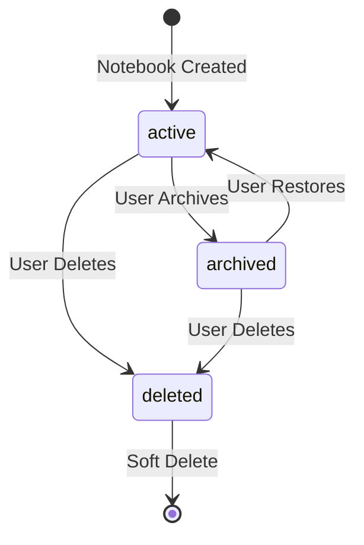
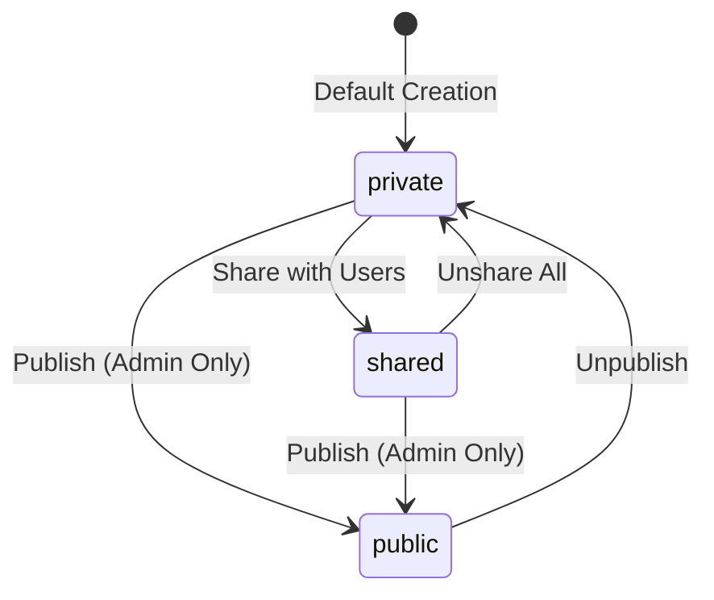
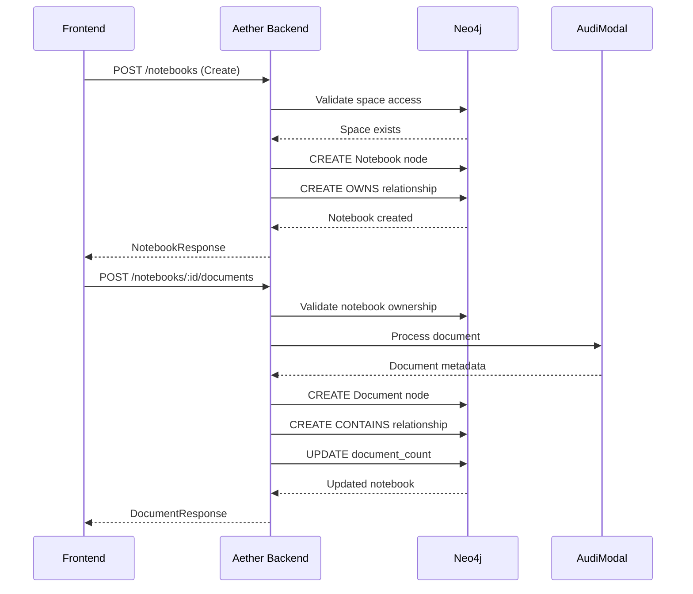

# Notebook Node - Aether Backend

---
**service**: aether-be
**model**: Notebook
**database**: Neo4j
**version**: 1.0
**last_updated**: 2026-01-05
**author**: TAS Platform Team
---

## 1. Overview

**Purpose**: The Notebook node represents a hierarchical container for organizing documents in the TAS platform. Notebooks support space-based multi-tenancy, hierarchical nesting, and flexible permission models.

**Lifecycle**:
- Created by users within their personal or organization spaces
- Can be archived (soft delete) or fully deleted
- Automatically created during user onboarding ("Getting Started" notebook)
- Can contain child notebooks for hierarchical organization
- Document count/size updated automatically as documents are added/removed

**Ownership**: Aether Backend service owns and manages this model

**Key Characteristics**:
- Hierarchical structure via parent-child relationships
- Space-based isolation (personal and organization spaces)
- Three visibility levels: private, shared, public
- Automatic document counting and size tracking
- Full-text search via searchable text index
- Compliance settings for regulatory requirements
- Tag-based categorization

---

## 2. Schema Definition

### Neo4j Node Properties

#### Core Identity Fields

| Property | Type | Required | Default | Description |
|----------|------|----------|---------|-------------|
| `id` | UUID string | Yes | `uuid.New()` | Unique identifier (primary key) |
| `name` | string | Yes | from request | Notebook name (1-255 chars) |
| `description` | string | No | empty | Notebook description (max 1000 chars) |
| `visibility` | string | Yes | from request | Access level: private, shared, public |
| `status` | string | Yes | `"active"` | Notebook status: active, archived, deleted |

#### Ownership & Hierarchy

| Property | Type | Required | Default | Description |
|----------|------|----------|---------|-------------|
| `owner_id` | UUID string | Yes | from context | User who owns this notebook |
| `parent_id` | UUID string | No | null | Parent notebook ID (for nested structure) |
| `team_id` | UUID string | No | null | Team assignment (organization spaces) |

#### Multi-Tenancy Fields

| Property | Type | Required | Default | Description |
|----------|------|----------|---------|-------------|
| `space_type` | enum | Yes | from context | personal or organization |
| `space_id` | string | Yes | from context | Space identifier (e.g., `space_1767395606`) |
| `tenant_id` | string | Yes | from context | Tenant identifier (e.g., `tenant_1767395606`) |

#### Compliance & Metadata

| Property | Type | Required | Default | Description |
|----------|------|----------|---------|-------------|
| `compliance_settings` | map | No | `{}` | GDPR, HIPAA, compliance rules |
| `document_count` | integer | Yes | `0` | Number of documents in notebook |
| `total_size_bytes` | int64 | Yes | `0` | Total size of all documents |
| `tags` | string array | No | `[]` | User-defined tags for categorization |
| `search_text` | string | No | computed | Combined searchable text (name + description + tags) |

#### Audit Timestamps

| Property | Type | Required | Default | Description |
|----------|------|----------|---------|-------------|
| `created_at` | timestamp | Yes | `time.Now()` | Creation timestamp |
| `updated_at` | timestamp | Yes | `time.Now()` | Last modification timestamp |

#### Constraints

- **Primary Key**: `id` (UUID)
- **Visibility Values**: Must be one of: `private`, `shared`, `public`
- **Status Values**: Must be one of: `active`, `archived`, `deleted`
- **Space Type Values**: Must be one of: `personal`, `organization`
- **Parent-Child Constraint**: parent_id must reference existing Notebook (no circular references)
- **Owner Constraint**: owner_id must reference existing User

#### Indexes

| Index Name | Property | Type | Purpose |
|------------|----------|------|---------|
| Primary | `id` | Unique | Fast lookup by ID |
| Owner | `owner_id` | Index | List user's notebooks |
| Tenant | `tenant_id` | Index | Tenant-scoped queries |
| Space | `space_id` | Index | Space-scoped queries |
| Status | `status` | Index | Filter active/archived |
| Full-Text | `search_text` | Full-text | Text search |
| Parent | `parent_id` | Index | Hierarchical queries |

---

## 3. Relationships

### Neo4j Relationships

```cypher
// User owns notebook
(User)-[:OWNS]->(Notebook)

// Notebook contains documents
(Notebook)-[:CONTAINS]->(Document)

// Hierarchical structure
(ParentNotebook)-[:HAS_CHILD]->(ChildNotebook)

// Shared with users
(Notebook)-[:SHARED_WITH {permission, granted_at}]->(User)

// Belongs to space
(Notebook)-[:BELONGS_TO]->(Space)
```

| Relationship | Direction | Target Node | Cardinality | Description |
|--------------|-----------|-------------|-------------|-------------|
| `OWNS` | Incoming | `User` | N:1 | Owner of the notebook |
| `CONTAINS` | Outgoing | `Document` | 1:N | Documents in this notebook |
| `HAS_CHILD` | Outgoing | `Notebook` | 1:N | Child notebooks (hierarchical) |
| `PARENT_OF` | Incoming | `Notebook` | N:1 | Parent notebook (inverse of HAS_CHILD) |
| `SHARED_WITH` | Outgoing | `User` | N:M | Users with access permissions |
| `BELONGS_TO` | Outgoing | `Space` | N:1 | Space containing this notebook |
| `ASSIGNED_TO` | Outgoing | `Team` | N:1 | Team assignment (org spaces) |

### Relationship Properties

**SHARED_WITH** relationship:
- `permission`: string - Access level (read, write, admin)
- `granted_by`: UUID string - User who granted access
- `granted_at`: timestamp - When permission was granted

**HAS_CHILD** relationship:
- `order`: integer - Display order for child notebooks

---

## 4. Validation Rules

### Business Logic Constraints

- **Rule 1**: Notebook name must be unique within a space
  - Implementation: Unique index on `(space_id, name, owner_id)`
  - Error: `409 Conflict - "Notebook with this name already exists"`

- **Rule 2**: Parent notebook must exist and belong to same space
  - Implementation: Validation before creation/update
  - Error: `400 Bad Request - "Parent notebook not found or access denied"`

- **Rule 3**: Circular parent-child relationships are forbidden
  - Implementation: Recursive validation during parent assignment
  - Error: `400 Bad Request - "Circular notebook hierarchy detected"`

- **Rule 4**: Visibility change from private → public requires admin permission
  - Implementation: Permission check in update handler
  - Error: `403 Forbidden - "Insufficient permissions to make notebook public"`

- **Rule 5**: Cannot delete notebook with active documents
  - Implementation: Check document_count before deletion
  - Error: `400 Bad Request - "Cannot delete notebook with documents"`

### Data Integrity

- owner_id must reference an active User
- tenant_id and space_id must match the owner's context
- Parent notebook's space must match child notebook's space
- Tags must be 1-50 characters each
- Archived notebooks cannot contain active child notebooks

---

## 5. Lifecycle & State Transitions

### State Machine - Notebook Status



### State Machine - Visibility



### Transition Rules

| From State | To State | Trigger | Conditions | Side Effects |
|------------|----------|---------|------------|--------------|
| - | active | Notebook creation | Valid space context | Create OWNS relationship |
| active | archived | User archives | Owner permission | Update child notebooks |
| archived | active | User restores | Owner permission | Restore hierarchy |
| active | deleted | User deletes | No active documents | Soft delete, remove from UI |
| private | shared | Share action | Owner/admin permission | Create SHARED_WITH relationships |
| private | public | Publish action | Admin permission | Make visible to all |

---

## 6. Examples

### Creating a New Notebook

**Go Code**:
```go
req := NotebookCreateRequest{
    Name:        "Research Notes",
    Description: "ML research documentation",
    Visibility:  "private",
    Tags:        []string{"ml", "research"},
}

notebook := NewNotebook(req, userID, spaceCtx)
```

**Neo4j Cypher**:
```cypher
CREATE (n:Notebook {
  id: $id,
  name: $name,
  description: $description,
  visibility: "private",
  status: "active",
  owner_id: $owner_id,
  space_type: $space_type,
  space_id: $space_id,
  tenant_id: $tenant_id,
  document_count: 0,
  total_size_bytes: 0,
  tags: $tags,
  search_text: $search_text,
  created_at: datetime(),
  updated_at: datetime()
})
RETURN n
```

### Querying Notebooks

**Get User's Notebooks in a Space**:
```cypher
MATCH (u:User {keycloak_id: $keycloak_id})-[:OWNS]->(n:Notebook)
WHERE n.tenant_id = $tenant_id
  AND n.space_id = $space_id
  AND n.status = "active"
  AND n.parent_id IS NULL  // Only top-level notebooks
RETURN n
ORDER BY n.updated_at DESC
```

**Get Notebook with Children**:
```cypher
MATCH (n:Notebook {id: $notebook_id})
OPTIONAL MATCH (n)-[:HAS_CHILD]->(child:Notebook)
WHERE child.status = "active"
RETURN n, collect(child) as children
```

**Search Notebooks by Text**:
```cypher
CALL db.index.fulltext.queryNodes('notebookSearchIndex', $query)
YIELD node, score
MATCH (node:Notebook)
WHERE node.tenant_id = $tenant_id
  AND node.space_id = $space_id
  AND node.status = "active"
RETURN node
ORDER BY score DESC
LIMIT 20
```

**Get Shared Notebooks**:
```cypher
MATCH (n:Notebook)-[s:SHARED_WITH]->(u:User {id: $user_id})
WHERE n.tenant_id = $tenant_id
  AND n.status = "active"
RETURN n, s.permission as permission
ORDER BY n.updated_at DESC
```

### Updating Notebook

**Update Metadata**:
```cypher
MATCH (n:Notebook {id: $id})
SET n.name = $name,
    n.description = $description,
    n.tags = $tags,
    n.search_text = $search_text,
    n.updated_at = datetime()
RETURN n
```

**Archive Notebook**:
```cypher
MATCH (n:Notebook {id: $id})
SET n.status = "archived",
    n.updated_at = datetime()
// Also archive all children
WITH n
MATCH (n)-[:HAS_CHILD*]->(child:Notebook)
SET child.status = "archived",
    child.updated_at = datetime()
RETURN n
```

**Share Notebook**:
```cypher
MATCH (n:Notebook {id: $notebook_id}), (u:User {id: $user_id})
CREATE (n)-[:SHARED_WITH {
  permission: $permission,
  granted_by: $granter_id,
  granted_at: datetime()
}]->(u)
RETURN n, u
```

### Deleting (Soft Delete)

```cypher
MATCH (n:Notebook {id: $id})
WHERE n.document_count = 0  // Ensure no documents
SET n.status = "deleted",
    n.updated_at = datetime()
RETURN n
```

---

## 7. Cross-Service References

### Services That Use This Model

| Service | Purpose | Access Pattern | Notes |
|---------|---------|----------------|-------|
| `aether-be` | Primary owner | Read/Write | Manages all notebook operations |
| `aether` (frontend) | Notebook UI | Read-only via API | Displays hierarchical tree |
| `audimodal` | Document processing | Read-only | Associates documents with notebooks |
| `tas-agent-builder` | Context retrieval | Read-only | Agents query notebook documents |
| `deeplake-api` | Vector organization | Read-only | Organizes embeddings by notebook |

### ID Mapping

| This Service | Other Service | Mapping | Notes |
|--------------|---------------|---------|-------|
| `notebook.id` | Frontend only | Direct | Not exposed to other backend services |
| `notebook.owner_id` | `user.id` | Direct (UUID) | References internal User ID |
| `notebook.tenant_id` | `space.tenant_id` | Direct | Format: `tenant_1767395606` |
| `notebook.space_id` | `space.id` | Direct | Format: `space_1767395606` |

### Data Flow



---

## 8. Tenant & Space Isolation

### Multi-Tenancy Fields

| Field | Purpose | Pattern | Example |
|-------|---------|---------|---------|
| `tenant_id` | Tenant isolation | `tenant_<timestamp>` | `tenant_1767395606` |
| `space_id` | Space isolation | `space_<timestamp>` | `space_1767395606` |
| `space_type` | Space categorization | personal or organization | `personal` |

### Space ID Validation

**CRITICAL**: All notebook queries must filter by both tenant_id AND space_id:

```cypher
// Correct - proper isolation
MATCH (u:User {keycloak_id: $keycloak_id})-[:OWNS]->(n:Notebook)
WHERE n.tenant_id = $tenant_id
  AND n.space_id = $space_id
  AND n.status = "active"
RETURN n

// WRONG - missing space_id filter
MATCH (u:User {id: $user_id})-[:OWNS]->(n:Notebook)
WHERE n.tenant_id = $tenant_id  // NOT ENOUGH!
RETURN n
```

### Isolation Rules

- ✅ Every notebook MUST have `tenant_id` and `space_id`
- ✅ Notebooks in personal spaces: `space_type = "personal"`
- ✅ Notebooks in org spaces: `space_type = "organization"`
- ✅ Parent and child notebooks MUST share same space
- ✅ Cannot share notebooks across space boundaries
- ❌ Never query notebooks without tenant/space filters

**Validation Checklist**:
- [ ] Query includes `tenant_id` filter
- [ ] Query includes `space_id` filter
- [ ] Space ownership verified for current user
- [ ] Cross-space access explicitly denied

---

## 9. Performance Considerations

### Indexes for Performance

- **Full-text search index** on `search_text` - Fast content search
- **Composite index** on `(tenant_id, space_id, owner_id)` - User's notebooks
- **Status index** - Filter active/archived efficiently
- **Parent ID index** - Hierarchical queries

### Query Optimization Tips

1. **Always use indexed fields** - tenant_id, space_id, owner_id, status
2. **Limit hierarchical depth** - Avoid queries with unlimited `[:HAS_CHILD*]`
3. **Batch document counts** - Update counts asynchronously
4. **Paginate results** - Use LIMIT and SKIP for large result sets
5. **Cache notebook trees** - Cache hierarchical structures (5min TTL)

### Caching Strategy

- **Cache Key**: `notebook:id:<uuid>` or `notebook:tree:space:<space_id>`
- **TTL**: 5 minutes
- **Invalidation**: On notebook update, document add/remove, status change
- **Cache Structure**: NotebookResponse DTO with optional children

---

## 10. Security & Compliance

### Sensitive Data

| Field | Sensitivity | Encryption | PII | Retention |
|-------|-------------|------------|-----|-----------|
| `name` | Low | In transit (TLS) | No | Indefinite |
| `description` | Low | In transit (TLS) | Possibly | Indefinite |
| `compliance_settings` | High | In transit (TLS) | No | Audit required |
| `tags` | Low | None | No | Indefinite |

### Access Control

- **Create**: Any authenticated user (in their space)
- **Read Own**: Notebook owner (full access)
- **Read Shared**: Users with SHARED_WITH relationship
- **Read Public**: Any authenticated user
- **Update**: Owner or admin with write permission
- **Delete**: Owner only (with empty notebook)
- **Share**: Owner or admin

### Compliance Settings

Notebooks can store compliance requirements:

```json
{
  "compliance_settings": {
    "gdpr": true,
    "hipaa": false,
    "data_retention_days": 365,
    "encryption_required": true,
    "audit_all_access": true
  }
}
```

### Audit Logging

**Events Logged**:
- Notebook created/updated/deleted
- Visibility changed
- Shared with users
- Document added/removed
- Archived/restored

---

## 11. Migration History

### Version 1.0 (2026-01-05)
- Initial model definition
- Added hierarchical parent-child structure
- Added space-based multi-tenancy fields
- Added compliance settings support
- Added automatic document counting
- Added full-text search capability
- Added three-level visibility model

---

## 12. Known Issues & Limitations

**Issue #1**: Deep hierarchies can cause performance issues
- **Description**: Queries with `[:HAS_CHILD*]` on deep trees (>5 levels) are slow
- **Workaround**: Limit hierarchy depth in UI, use breadth-first approach
- **Future**: Add hierarchy depth limit (max 5 levels)

**Issue #2**: Document count/size updated synchronously
- **Description**: Large document operations can slow down notebook updates
- **Impact**: Noticeable delay when adding many documents
- **Future**: Implement async count updates via background job

**Limitation #1**: Cannot move notebooks between spaces
- **Description**: Notebooks are permanently bound to creation space
- **Impact**: Users cannot reorganize across spaces
- **Future**: Add notebook migration API with proper validation

---

## 13. Related Documentation

- [Aether Backend Service Overview](../../../aether-be/README.md)
- [User Node Documentation](./user.md)
- [Document Node Documentation](./document.md)
- [Space Node Documentation](./space.md)
- [Cross-Service ID Mapping](../../cross-service/mappings/id-mapping-chain.md)
- [Notebook API Endpoints](../../aether-be/api/notebook-endpoints.md)

---

## 14. Changelog

| Date | Version | Author | Changes |
|------|---------|--------|---------|
| 2026-01-05 | 1.0 | TAS Platform Team | Initial comprehensive documentation |

---

**Maintained by**: TAS Platform Team
**Last Reviewed**: 2026-01-05
**Next Review**: 2026-02-05
