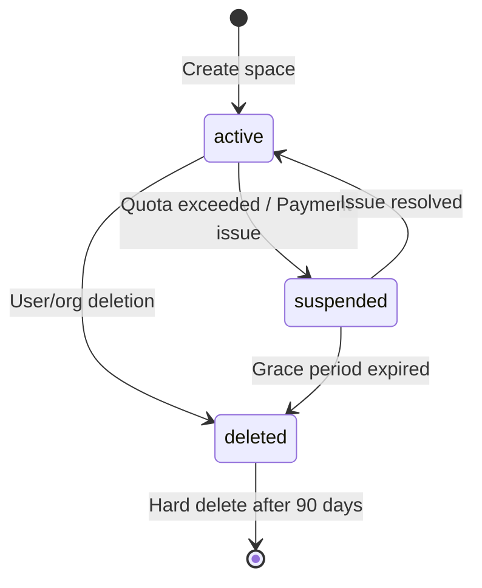

# Space Node

---

**Metadata**

```yaml
service: aether-be
model: Space
database: Neo4j
node_label: Space (future implementation)
version: 1.0
last_updated: 2026-01-05
status: planned (currently embedded in User/Notebook/Document nodes)
```

---

## 1. Overview

### Purpose
The Space node represents the top-level isolation boundary in the TAS platform architecture. A Space is a logical container that provides **complete data isolation** and maps 1:1 to a tenant across all services (AudiModal, DeepLake, Agent Builder, LLM Router).

### Key Characteristics
- **Two types**: Personal spaces (one per user) and Organization spaces (one per organization)
- **1:1 tenant mapping**: Each space maps to exactly one tenant_id across all services
- **Complete isolation**: No data leakage between spaces
- **Resource quotas**: Storage, compute, and API limits per space
- **Permission boundaries**: Users have different roles within each space

### Business Context
Spaces solve the multi-tenancy challenge by providing:
- **Personal Spaces**: Private workspace for individual users (equivalent to Fly.io's personal account)
- **Organization Spaces**: Shared workspace for teams/organizations (equivalent to Fly.io's organizations)
- **Simple architecture**: Eliminates complex hierarchies in favor of flat, clear boundaries
- **Consistent tenant IDs**: Same tenant_id used across all platform services

---

## 2. Schema Definition

### Current Implementation Note
**As of v1.0**: Space data is currently embedded in User, Notebook, and Document nodes through `space_type`, `space_id`, and `tenant_id` fields. Future implementation will create dedicated Space nodes in Neo4j for better organization and query performance.

### Future Space Node Schema

#### Core Identity Fields

| Property | Type | Required | Default | Description |
|----------|------|----------|---------|-------------|
| `id` | UUID string | Yes | from user/org | Space identifier (`space_<timestamp>`) |
| `name` | string | Yes | from request | Display name (e.g., "John's Personal Space") |
| `description` | string | No | `""` | Optional description (max 500 chars) |
| `space_type` | enum | Yes | from creation | `"personal"` or `"organization"` |
| `status` | string | Yes | `"active"` | `active`, `suspended`, `deleted` |

**ID Format Patterns**:
```
Personal Space:    space_1767395606  (derived from tenant_<timestamp>)
Organization Space: space_1767395607  (derived from org tenant_<timestamp>)
```

#### Tenant Mapping Fields

| Property | Type | Required | Default | Description |
|----------|------|----------|---------|-------------|
| `tenant_id` | string | Yes | auto-generated | Tenant ID for cross-service isolation (`tenant_<timestamp>`) |
| `audimodal_tenant_id` | string | Yes | same as tenant_id | AudiModal service tenant ID |
| `deeplake_namespace` | string | Yes | from space_id | DeepLake vector database namespace |
| `tenant_api_key` | string | Yes | encrypted | API key for service authentication (not serialized) |

**Tenant ID Pattern**: `tenant_<unix_timestamp>`

**Critical Rule**: tenant_id MUST be identical across:
- Aether Backend (Neo4j)
- AudiModal (PostgreSQL)
- DeepLake (vector storage)
- Agent Builder (PostgreSQL)
- LLM Router (logging)

#### Ownership Fields

| Property | Type | Required | Default | Description |
|----------|------|----------|---------|-------------|
| `owner_id` | UUID string | Yes (personal) | from user | User ID for personal spaces |
| `organization_id` | UUID string | Yes (org) | from org | Organization ID for org spaces |
| `owner_type` | enum | Yes | from creation | `"user"` or `"organization"` |

#### Resource Quota Fields

| Property | Type | Required | Default | Description |
|----------|------|----------|---------|-------------|
| `storage_quota_bytes` | int64 | Yes | tier default | Maximum storage in bytes |
| `storage_used_bytes` | int64 | Yes | 0 | Current storage usage |
| `document_quota` | int | Yes | tier default | Maximum number of documents |
| `document_count` | int | Yes | 0 | Current document count |
| `notebook_quota` | int | Yes | tier default | Maximum number of notebooks |
| `notebook_count` | int | Yes | 0 | Current notebook count |
| `monthly_processing_quota` | int | Yes | tier default | Max processing minutes per month |
| `monthly_processing_used` | int | Yes | 0 | Processing minutes used this month |

**Default Quotas by Tier**:
```
Free Tier:
  storage_quota_bytes: 1 GB (1,073,741,824)
  document_quota: 100
  notebook_quota: 10
  monthly_processing_quota: 60 minutes

Pro Tier:
  storage_quota_bytes: 100 GB
  document_quota: 10,000
  notebook_quota: 1,000
  monthly_processing_quota: 1,000 minutes

Enterprise Tier:
  storage_quota_bytes: unlimited
  document_quota: unlimited
  notebook_quota: unlimited
  monthly_processing_quota: unlimited
```

#### Visibility and Access Fields

| Property | Type | Required | Default | Description |
|----------|------|----------|---------|-------------|
| `visibility` | enum | Yes | `"private"` | `private`, `team`, `organization`, `public` |
| `member_count` | int | Yes | 1 | Number of users with access |
| `allowed_file_types` | []string | No | all allowed | Restricted MIME types (if set) |

#### Metadata Fields

| Property | Type | Required | Default | Description |
|----------|------|----------|---------|-------------|
| `settings` | map[string]interface{} | No | `{}` | Space-specific settings (Neo4j compatible) |
| `tags` | []string | No | `[]` | Organizational tags |

#### Timestamp Fields

| Property | Type | Required | Default | Description |
|----------|------|----------|---------|-------------|
| `created_at` | time.Time | Yes | `time.Now()` | Space creation timestamp |
| `updated_at` | time.Time | Yes | `time.Now()` | Last modification timestamp |
| `suspended_at` | *time.Time | No | nil | When space was suspended (if applicable) |
| `deleted_at` | *time.Time | No | nil | Soft delete timestamp |

---

## 3. Relationships

### Outgoing Relationships (Future Implementation)

#### 1. OWNED_BY → User (for personal spaces)
**Purpose**: Links personal space to its owner

**Properties**: None

**Cardinality**: One-to-One (required for personal spaces)

**Query Pattern**:
```cypher
MATCH (s:Space {space_type: "personal"})-[:OWNED_BY]->(u:User)
WHERE s.id = $spaceId
RETURN u
```

#### 2. OWNED_BY → Organization (for organization spaces)
**Purpose**: Links organization space to its owning organization

**Properties**: None

**Cardinality**: One-to-One (required for organization spaces)

**Query Pattern**:
```cypher
MATCH (s:Space {space_type: "organization"})-[:OWNED_BY]->(o:Organization)
WHERE s.id = $spaceId
RETURN o
```

### Incoming Relationships (Future Implementation)

#### 1. User -[:MEMBER_OF {role, joined_at, permissions}]-> Space
**Purpose**: User membership in a space

**Properties**:
```
role: string            // "owner", "admin", "member", "viewer"
joined_at: datetime     // When user joined space
permissions: []string   // ["read", "write", "admin"]
invited_by: string      // User ID who invited (if applicable)
```

**Cardinality**: Many-to-Many

**Query Pattern**:
```cypher
MATCH (u:User {id: $userId})-[r:MEMBER_OF]->(s:Space)
WHERE s.status = "active"
RETURN s, r.role, r.permissions
ORDER BY r.joined_at DESC
```

#### 2. Notebook -[:BELONGS_TO]-> Space
**Purpose**: Notebook containment in space (future - currently embedded field)

**Properties**: None

**Cardinality**: Many-to-One (required)

**Query Pattern**:
```cypher
MATCH (n:Notebook)-[:BELONGS_TO]->(s:Space {id: $spaceId})
WHERE n.status != "deleted"
RETURN n
ORDER BY n.updated_at DESC
```

#### 3. Document -[:STORED_IN]-> Space
**Purpose**: Document association with space (future - currently embedded field)

**Properties**: None

**Cardinality**: Many-to-One (required)

**Query Pattern**:
```cypher
MATCH (d:Document)-[:STORED_IN]->(s:Space {id: $spaceId})
WHERE d.status = "processed"
RETURN count(d) as document_count, sum(d.size_bytes) as total_storage
```

### Current Implementation (Embedded Fields)

Until Space nodes are created, space association is managed through fields:

```cypher
// Current pattern - space_id and tenant_id on each node
MATCH (u:User {keycloak_id: $keycloak_id})
MATCH (n:Notebook)
WHERE n.space_id = u.personal_space_id
  AND n.tenant_id = u.personal_tenant_id
  AND n.status != "deleted"
RETURN n
```

---

## 4. Validation Rules

### Field Validation

#### Name Validation
```go
validate:"required,min=1,max=100"
```
- Required for all spaces
- 1-100 characters
- Cannot be empty or whitespace-only

#### Description Validation
```go
validate:"omitempty,max=500"
```
- Optional field
- Max 500 characters

#### Space Type Validation
```go
validate:"required,oneof=personal organization"
```
- Must be exactly `"personal"` or `"organization"`
- Cannot be changed after creation

#### Visibility Validation
```go
validate:"oneof=private team organization public"
```
- `private`: Only owner can access
- `team`: Specific team members
- `organization`: All organization members
- `public`: Anyone with link

#### Quota Validation
```go
storage_quota_bytes: validate:"min=0"
document_quota: validate:"min=0"
monthly_processing_quota: validate:"min=0"
```
- All quotas must be non-negative
- Zero means unlimited (for enterprise tier)

### Business Logic Validation

#### 1. Personal Space Uniqueness
Each user can have exactly ONE personal space:
```cypher
MATCH (u:User {id: $userId})-[:HAS_PERSONAL_SPACE]->(s:Space)
RETURN count(s) AS space_count
```
- `space_count` must be <= 1

#### 2. Tenant ID Uniqueness
```cypher
MATCH (s:Space {tenant_id: $tenantId})
RETURN count(s) AS duplicate_count
```
- `duplicate_count` must be 0 (before creation)
- Tenant IDs must be globally unique across all spaces

#### 3. Quota Enforcement
Before creating resources in a space:
```go
// Check storage quota
if space.StorageUsedBytes + newDocument.SizeBytes > space.StorageQuotaBytes {
    return ErrStorageQuotaExceeded
}

// Check document quota
if space.DocumentCount >= space.DocumentQuota {
    return ErrDocumentQuotaExceeded
}
```

#### 4. Organization Space Authorization
Only organization admins can create organization spaces:
```cypher
MATCH (u:User {id: $userId})-[r:MEMBER_OF]->(o:Organization {id: $orgId})
WHERE r.role IN ["owner", "admin"]
RETURN count(u) > 0 AS authorized
```

---

## 5. Lifecycle and State Transitions

### State Machine



### State Descriptions

#### 1. `active` (Normal State)
- **Entry**: Space created successfully
- **State**:
  - All features accessible
  - Resources can be created
  - API calls processed normally
  - Quotas enforced
- **Exit Conditions**:
  - Quota exceeded → `suspended`
  - Payment failed (paid tier) → `suspended`
  - User/organization deleted → `deleted`

#### 2. `suspended`
- **Entry**: Quota exceeded or payment issue
- **State**:
  - Read-only access
  - Cannot create new resources
  - Existing resources remain accessible
  - Grace period: 30 days for personal, 14 days for organization
- **Exit Conditions**:
  - Issue resolved (quota increased, payment successful) → `active`
  - Grace period expires → `deleted`

#### 3. `deleted` (Soft Delete)
- **Entry**: User/organization deleted or suspension grace period expired
- **State**:
  - Space marked for deletion
  - Resources marked for cleanup
  - Data retained for 90 days (compliance)
  - Not visible in UI
- **Exit Conditions**:
  - After 90 days → Hard delete (remove from all services)

### Automatic State Transitions

#### Quota Monitoring (Hourly Job)
```go
// Check storage quota
if space.StorageUsedBytes > space.StorageQuotaBytes {
    space.Status = "suspended"
    space.SuspendedAt = time.Now()
    notifyUser("Storage quota exceeded")
}

// Check processing quota (monthly reset)
if space.MonthlyProcessingUsed > space.MonthlyProcessingQuota {
    space.Status = "suspended"
    notifyUser("Processing quota exceeded")
}
```

---

## 6. Examples

### Create Personal Space (During User Registration)

#### Cypher (Future Implementation)
```cypher
// 1. Generate tenant ID
WITH apoc.text.format("tenant_%d", [timestamp()]) AS tenantId,
     apoc.text.format("space_%d", [timestamp()]) AS spaceId

// 2. Create Space node
CREATE (s:Space {
  id: spaceId,
  name: $userName + "'s Personal Space",
  description: "Personal workspace for " + $userName,
  space_type: "personal",
  status: "active",
  tenant_id: tenantId,
  audimodal_tenant_id: tenantId,
  deeplake_namespace: spaceId,
  tenant_api_key: $apiKey,
  owner_id: $userId,
  owner_type: "user",
  storage_quota_bytes: 1073741824,  // 1 GB
  storage_used_bytes: 0,
  document_quota: 100,
  document_count: 0,
  notebook_quota: 10,
  notebook_count: 0,
  monthly_processing_quota: 60,
  monthly_processing_used: 0,
  visibility: "private",
  member_count: 1,
  settings: {},
  tags: [],
  created_at: datetime(),
  updated_at: datetime()
})

// 3. Link to user
WITH s
MATCH (u:User {id: $userId})
CREATE (s)-[:OWNED_BY]->(u)
CREATE (u)-[:MEMBER_OF {
  role: "owner",
  joined_at: datetime(),
  permissions: ["read", "write", "admin"]
}]->(s)
CREATE (u)-[:HAS_PERSONAL_SPACE]->(s)

// 4. Update user with space IDs
SET u.personal_space_id = s.id,
    u.personal_tenant_id = s.tenant_id,
    u.updated_at = datetime()

RETURN s, u
```

#### Go Code (Current Implementation)
```go
func CreatePersonalSpaceForUser(ctx context.Context, user *User) error {
    // Generate tenant and space IDs
    timestamp := time.Now().Unix()
    tenantID := fmt.Sprintf("tenant_%d", timestamp)
    spaceID := fmt.Sprintf("space_%d", timestamp)

    // Create tenant in AudiModal
    apiKey, err := audimodalClient.CreateTenant(ctx, tenantID, user.ID)
    if err != nil {
        return fmt.Errorf("failed to create AudiModal tenant: %w", err)
    }

    // Create namespace in DeepLake
    err = deeplakeClient.CreateNamespace(ctx, spaceID, tenantID)
    if err != nil {
        return fmt.Errorf("failed to create DeepLake namespace: %w", err)
    }

    // Update user with space info
    user.PersonalSpaceID = spaceID
    user.PersonalTenantID = tenantID
    user.AudimodalTenantID = tenantID  // Same as tenant_id
    // API key stored securely (not in User model)

    return userRepo.Update(ctx, user)
}
```

### Create Organization Space

#### Cypher (Future Implementation)
```cypher
WITH apoc.text.format("tenant_%d", [timestamp()]) AS tenantId,
     apoc.text.format("space_%d", [timestamp()]) AS spaceId

CREATE (s:Space {
  id: spaceId,
  name: $orgName + " Organization Space",
  description: $description,
  space_type: "organization",
  status: "active",
  tenant_id: tenantId,
  audimodal_tenant_id: tenantID,
  deeplake_namespace: spaceId,
  tenant_api_key: $apiKey,
  organization_id: $orgId,
  owner_type: "organization",
  storage_quota_bytes: 107374182400,  // 100 GB (Pro tier)
  storage_used_bytes: 0,
  document_quota: 10000,
  document_count: 0,
  notebook_quota: 1000,
  notebook_count: 0,
  monthly_processing_quota: 1000,
  monthly_processing_used: 0,
  visibility: "organization",
  member_count: 0,
  settings: $settings,
  tags: $tags,
  created_at: datetime(),
  updated_at: datetime()
})

WITH s
MATCH (o:Organization {id: $orgId})
CREATE (s)-[:OWNED_BY]->(o)

// Add creator as admin
WITH s
MATCH (u:User {id: $creatorId})
CREATE (u)-[:MEMBER_OF {
  role: "admin",
  joined_at: datetime(),
  permissions: ["read", "write", "admin"],
  invited_by: nil
}]->(s)
SET s.member_count = 1

RETURN s
```

### List User's Spaces

#### Cypher (Future Implementation)
```cypher
MATCH (u:User {keycloak_id: $keycloakId})

// Get personal space
OPTIONAL MATCH (u)-[:HAS_PERSONAL_SPACE]->(ps:Space {space_type: "personal"})
WHERE ps.status != "deleted"

// Get organization spaces
OPTIONAL MATCH (u)-[r:MEMBER_OF]->(os:Space {space_type: "organization"})
WHERE os.status != "deleted"

RETURN
  ps AS personal_space,
  collect({
    space: os,
    role: r.role,
    permissions: r.permissions,
    joined_at: r.joined_at
  }) AS organization_spaces
```

#### Go Code (Current Implementation)
```go
func GetUserSpaces(ctx context.Context, keycloakID string) (*SpaceListResponse, error) {
    user, err := userRepo.GetByKeycloakID(ctx, keycloakID)
    if err != nil {
        return nil, err
    }

    response := &SpaceListResponse{}

    // Personal space (embedded in user)
    if user.PersonalSpaceID != "" {
        response.PersonalSpace = &SpaceInfo{
            SpaceType:   SpaceTypePersonal,
            SpaceID:     user.PersonalSpaceID,
            SpaceName:   user.Username + "'s Personal Space",
            TenantID:    user.PersonalTenantID,
            UserRole:    "owner",
            Permissions: []string{"read", "write", "admin"},
        }
    }

    // Organization spaces (query from organization memberships)
    orgs, err := orgRepo.GetUserOrganizations(ctx, user.ID)
    if err != nil {
        return nil, err
    }

    for _, org := range orgs {
        response.OrganizationSpaces = append(response.OrganizationSpaces, &SpaceInfo{
            SpaceType:   SpaceTypeOrganization,
            SpaceID:     org.SpaceID,
            SpaceName:   org.Name + " Organization",
            TenantID:    org.TenantID,
            UserRole:    org.UserRole,  // from membership
            Permissions: org.Permissions,
        })
    }

    return response, nil
}
```

### Update Space Quotas

#### Cypher (Future Implementation)
```cypher
MATCH (s:Space {id: $spaceId})
WHERE s.status != "deleted"

SET s.storage_quota_bytes = $newStorageQuota,
    s.document_quota = $newDocumentQuota,
    s.monthly_processing_quota = $newProcessingQuota,
    s.updated_at = datetime()

// If quotas increased and space was suspended, reactivate
WITH s
WHERE s.status = "suspended"
  AND s.storage_used_bytes <= s.storage_quota_bytes
  AND s.monthly_processing_used <= s.monthly_processing_quota
SET s.status = "active",
    s.suspended_at = null

RETURN s
```

### Check Space Resource Usage

#### Cypher (Current Implementation via Aggregation)
```cypher
// Calculate current usage for a space
MATCH (n:Notebook)
WHERE n.space_id = $spaceId
  AND n.tenant_id = $tenantId
  AND n.status != "deleted"
WITH count(n) AS notebook_count

MATCH (d:Document)
WHERE d.space_id = $spaceId
  AND d.tenant_id = $tenantId
  AND d.status != "deleted"
WITH notebook_count,
     count(d) AS document_count,
     sum(d.size_bytes) AS storage_used

RETURN {
  notebook_count: notebook_count,
  document_count: document_count,
  storage_used_bytes: storage_used
} AS usage
```

---

## 7. Cross-Service References

### AudiModal Tenant Integration

#### Tenant Creation Flow
```
1. Aether Backend decides to create space
2. Generate tenant_id: tenant_<timestamp>
3. Call AudiModal API:
   POST /api/v1/tenants
   {
     "tenant_id": "tenant_1767395606",
     "owner_id": "{user_id or org_id}",
     "owner_type": "user" | "organization",
     "name": "Space display name"
   }
4. AudiModal returns API key
5. Store tenant_id and encrypted API key in Space/User/Org
6. Use tenant_id for all future AudiModal operations
```

#### AudiModal API Reference
- **Endpoint**: `POST /api/v1/tenants`
- **Authentication**: Platform API key
- **Request**:
  ```json
  {
    "tenant_id": "tenant_1767395606",
    "owner_id": "user-uuid",
    "owner_type": "user",
    "name": "John's Personal Space"
  }
  ```
- **Response**:
  ```json
  {
    "tenant_id": "tenant_1767395606",
    "api_key": "aud_key_abc123...",
    "created_at": "2026-01-05T12:00:00Z"
  }
  ```

### DeepLake Namespace Integration

#### Namespace Creation
```python
# Python DeepLake API
import deeplake

# Create namespace for space
ds = deeplake.empty(f"hub://tenant_1767395606/embeddings", overwrite=False)
ds.create_tensor("text", htype="text")
ds.create_tensor("embedding", htype="embedding")
ds.create_tensor("metadata", htype="json")
```

**Namespace Pattern**: `hub://{tenant_id}/embeddings`

#### Isolation Guarantee
All vector operations scoped to namespace:
```python
# Query vectors only within space
ds = deeplake.load(f"hub://{tenant_id}/embeddings")
results = ds.search(embedding=query_vector, k=10)
```

### Agent Builder Space Tracking

#### Agent Creation with Space Context
```sql
-- PostgreSQL agents table should include space_id
CREATE TABLE agents (
  id UUID PRIMARY KEY,
  name VARCHAR(255),
  space_id VARCHAR(255) NOT NULL,
  tenant_id VARCHAR(255) NOT NULL,
  owner_id UUID NOT NULL,
  created_at TIMESTAMP DEFAULT NOW()
);

CREATE INDEX idx_agents_space ON agents(space_id, tenant_id);
```

#### Query Pattern
```sql
SELECT * FROM agents
WHERE space_id = 'space_1767395606'
  AND tenant_id = 'tenant_1767395606'
  AND deleted_at IS NULL;
```

### LLM Router Space Tracking

#### Request Logging with Space
```go
// LLM Router logs should include space context
type LLMRequest struct {
    RequestID   string
    SpaceID     string
    TenantID    string
    UserID      string
    Model       string
    InputTokens int
    OutputTokens int
    Timestamp   time.Time
}
```

#### Usage Analytics by Space
```sql
SELECT space_id, tenant_id,
       COUNT(*) as request_count,
       SUM(input_tokens + output_tokens) as total_tokens
FROM llm_requests
WHERE created_at >= NOW() - INTERVAL '30 days'
GROUP BY space_id, tenant_id;
```

---

## 8. Tenant and Space Isolation

### Isolation Guarantee

**Every query MUST enforce space isolation**:
```cypher
WHERE resource.tenant_id = $tenantId
  AND resource.space_id = $spaceId
```

### ID Derivation Pattern

#### Tenant ID → Space ID
```go
func DeriveSpaceID(tenantID string) string {
    return strings.Replace(tenantID, "tenant_", "space_", 1)
}

// Example:
// tenant_1767395606 → space_1767395606
```

#### Space ID → Tenant ID
```go
func DeriveTenantID(spaceID string) string {
    return strings.Replace(spaceID, "space_", "tenant_", 1)
}
```

### Cross-Space Data Leakage Prevention

#### ❌ WRONG - No space filtering
```cypher
MATCH (d:Document {id: $documentId})
RETURN d
```

#### ✅ CORRECT - Space isolation enforced
```cypher
MATCH (d:Document {id: $documentId})
WHERE d.tenant_id = $tenantId
  AND d.space_id = $spaceId
RETURN d
```

### Space Context Middleware

```go
func SpaceContextMiddleware() gin.HandlerFunc {
    return func(c *gin.Context) {
        // Extract from JWT
        keycloakID := c.GetString("keycloak_id")

        // Get requested space (from header or query)
        spaceType := c.GetHeader("X-Space-Type")  // "personal" | "organization"
        spaceID := c.GetHeader("X-Space-ID")

        // Resolve space context
        spaceCtx, err := spaceService.ResolveSpaceContext(c.Request.Context(), keycloakID, spaceType, spaceID)
        if err != nil {
            c.AbortWithError(403, errors.New("invalid space context"))
            return
        }

        // Verify user has access to space
        if !spaceCtx.CanRead() {
            c.AbortWithError(403, errors.New("no access to space"))
            return
        }

        // Add to context
        c.Set("space_context", spaceCtx)
        c.Next()
    }
}
```

---

## 9. Performance Considerations

### Indexes (Future Implementation)

```cypher
// Primary key
CREATE CONSTRAINT space_id_unique IF NOT EXISTS
FOR (s:Space) REQUIRE s.id IS UNIQUE;

// Tenant ID lookup
CREATE INDEX space_tenant_id IF NOT EXISTS
FOR (s:Space) ON (s.tenant_id);

// Owner lookups
CREATE INDEX space_owner_id IF NOT EXISTS
FOR (s:Space) ON (s.owner_id);

CREATE INDEX space_organization_id IF NOT EXISTS
FOR (s:Space) ON (s.organization_id);

// Type filtering
CREATE INDEX space_type IF NOT EXISTS
FOR (s:Space) ON (s.space_type);

// Status filtering
CREATE INDEX space_status IF NOT EXISTS
FOR (s:Space) ON (s.status);
```

### Caching Strategy

#### Redis Caching for Space Context
```go
// Cache space context for 5 minutes
func (s *SpaceService) GetSpaceContext(ctx context.Context, spaceID, tenantID string) (*SpaceContext, error) {
    cacheKey := fmt.Sprintf("space_ctx:%s:%s", tenantID, spaceID)

    // Try cache
    if cached, err := s.redis.Get(ctx, cacheKey).Result(); err == nil {
        var spaceCtx SpaceContext
        json.Unmarshal([]byte(cached), &spaceCtx)
        return &spaceCtx, nil
    }

    // Cache miss - query database
    spaceCtx, err := s.loadSpaceContext(ctx, spaceID, tenantID)
    if err != nil {
        return nil, err
    }

    // Cache for 5 minutes
    spaceJSON, _ := json.Marshal(spaceCtx)
    s.redis.Set(ctx, cacheKey, spaceJSON, 5*time.Minute)

    return spaceCtx, nil
}
```

#### Invalidation on Updates
```go
// Invalidate cache when space is modified
func (s *SpaceService) UpdateSpaceQuotas(ctx context.Context, spaceID string, quotas *QuotaUpdate) error {
    err := s.repo.UpdateQuotas(ctx, spaceID, quotas)
    if err != nil {
        return err
    }

    // Invalidate cache
    cacheKey := fmt.Sprintf("space_ctx:*:%s", spaceID)
    s.redis.Del(ctx, cacheKey)

    return nil
}
```

### Query Optimization

#### Avoid Counting All Resources
```cypher
// ❌ Slow - Counts all documents
MATCH (d:Document {space_id: $spaceId})
RETURN count(d)

// ✅ Fast - Use cached count on Space node (future)
MATCH (s:Space {id: $spaceId})
RETURN s.document_count
```

#### Batch Resource Updates
```cypher
// Update space counts in batch (e.g., hourly job)
MATCH (s:Space)
WHERE s.status = "active"

OPTIONAL MATCH (s)<-[:STORED_IN]-(d:Document)
WHERE d.status != "deleted"
WITH s, count(d) AS doc_count, sum(d.size_bytes) AS storage_used

OPTIONAL MATCH (s)<-[:BELONGS_TO]-(n:Notebook)
WHERE n.status != "deleted"
WITH s, doc_count, storage_used, count(n) AS notebook_count

SET s.document_count = doc_count,
    s.storage_used_bytes = storage_used,
    s.notebook_count = notebook_count,
    s.updated_at = datetime()
```

---

## 10. Security and Compliance

### Access Control

#### Space Membership Verification
```cypher
// Verify user has access to space
MATCH (u:User {id: $userId})-[r:MEMBER_OF]->(s:Space {id: $spaceId})
WHERE s.status != "deleted"
RETURN s, r.role, r.permissions
```

#### Permission Hierarchy
```
Roles (decreasing permissions):
1. owner    - Full control, can delete space
2. admin    - Manage members, settings, quotas
3. member   - Create/edit resources
4. viewer   - Read-only access
```

### Data Residency

Spaces can specify data residency requirements:
```go
type Space struct {
    ...
    DataRegion string  // "us-east-1", "eu-west-1", etc.
    ComplianceMode string  // "GDPR", "HIPAA", "SOC2"
}
```

### Audit Logging

#### Space Operations Audit
```cypher
CREATE (a:AuditLog {
  id: $auditId,
  action: "space_created",  // or "space_suspended", "quota_exceeded", etc.
  space_id: $spaceId,
  tenant_id: $tenantId,
  user_id: $userId,
  metadata: {
    space_type: "personal",
    tier: "free"
  },
  timestamp: datetime()
})
```

### GDPR Compliance

#### Right to Access (Export Space Data)
```cypher
MATCH (s:Space {id: $spaceId, owner_id: $userId})
OPTIONAL MATCH (s)<-[:BELONGS_TO]-(n:Notebook)
OPTIONAL MATCH (s)<-[:STORED_IN]-(d:Document)
RETURN s, collect(DISTINCT n), collect(DISTINCT d)
```

#### Right to Deletion (Hard Delete Space)
```cypher
// Mark space and all resources for deletion
MATCH (s:Space {id: $spaceId, owner_id: $userId})
SET s.status = "deleted",
    s.deleted_at = datetime()

// Mark all resources in space
MATCH (n:Notebook {space_id: $spaceId})
SET n.status = "deleted", n.deleted_at = datetime()

MATCH (d:Document {space_id: $spaceId})
SET d.status = "deleted", d.deleted_at = datetime()

// Schedule cleanup jobs:
// - Delete from AudiModal tenant
// - Delete from DeepLake namespace
// - Delete from MinIO storage
// - Delete from Agent Builder
// - Delete LLM Router logs
```

---

## 11. Migration History

### Version 1.0 (2026-01-05) - Space Model Introduction

#### Changes
- Defined Space architecture
- Implemented space_type, space_id, tenant_id on User/Notebook/Document
- Created SpaceContext for request handling
- Integrated with AudiModal tenants
- Set up DeepLake namespace mapping
- Migration script for existing data

#### Migration Script
See `/home/jscharber/eng/TAS/aether-be/migrations/001_migrate_to_space_model.go`

Key operations:
- Added `personal_space_id` and `personal_tenant_id` to User nodes
- Added `space_id`, `space_type`, `tenant_id` to Notebook nodes
- Added `space_id`, `space_type`, `tenant_id` to Document nodes
- Derived space_id from tenant_id using pattern replacement

---

## 12. Known Issues

### Issue #1: Agent Builder Space Isolation
**Status**: ⚠️ Needs Investigation

**Description**: Unknown if Agent Builder PostgreSQL schema includes `space_id` column in `agents` table.

**Impact**: Agents may not be properly isolated by space.

**Workaround**: Filter by `tenant_id` only until confirmed.

**Fix Plan**: Add `space_id` column to agents table, add index, update all queries.

---

### Issue #2: LLM Router Space Tracking
**Status**: ⚠️ Enhancement Needed

**Description**: LLM Router doesn't currently track `space_id` in request logs.

**Impact**: Cannot generate per-space usage reports or enforce space-level rate limits.

**Workaround**: Use `tenant_id` from request context (if available).

**Fix Plan**: Add `X-Space-ID` header to LLM Router requests, log in database.

---

### Issue #3: DeepLake Namespace Documentation
**Status**: 🟡 Documentation Gap

**Description**: DeepLake namespacing pattern documented but implementation details unclear.

**Impact**: Developers may implement inconsistent namespace patterns.

**Workaround**: Follow pattern `hub://{tenant_id}/embeddings`

**Fix Plan**: Create comprehensive DeepLake integration documentation.

---

## 13. Related Documentation

### Internal Documentation
- [User Node](./user.md) - Personal space ownership
- [Notebook Node](./notebook.md) - Space-based isolation
- [Document Node](./document.md) - Space storage and quotas
- [Organization Node](./organization.md) - Organization space management (TODO)

### Cross-Service Documentation
- [AudiModal Tenant API](../../audimodal/api/tenants.md) - Tenant creation and management (TODO)
- [DeepLake Namespacing](../../deeplake-api/namespacing.md) - Vector database isolation (TODO)
- [Agent Builder Space Schema](../../tas-agent-builder/schema/spaces.md) - Agent isolation (TODO)

### Platform Documentation
- [Space-Based Implementation Plan](../../../SPACE_BASED_IMPLEMENTATION_PLAN.md) - Overall architecture
- [ID Mapping Chain](../../cross-service/mappings/id-mapping-chain.md) - Tenant ID flows
- [Multi-Tenancy Guide](../../../SPACE_TENANT_MODEL_SUMMARY.md) - Isolation patterns

### API Documentation
- [Space API Endpoints](../../aether-be/api/spaces.md) - REST API reference (TODO)
- [Space Context Middleware](../../aether-be/middleware/space-context.md) - Request handling (TODO)

### Development Resources
- [Developer Guide](../DEVELOPER-GUIDE.md) - Space query patterns
- [Quick Start](../overview/QUICK-START.md) - Common space operations
- [Inconsistencies Report](../overview/INCONSISTENCIES-FOUND.md) - Known space-related issues

---

**Document Status**: ✅ Complete (Phase 2)
**Last Reviewed**: 2026-01-05
**Next Review**: 2026-02-05
**Maintainer**: TAS Platform Team

**Implementation Status**: 🟡 Partial
- ✅ SpaceContext implemented
- ✅ Embedded fields (space_id, tenant_id) on resources
- ✅ AudiModal tenant integration
- ⏳ Dedicated Space nodes (planned)
- ⏳ DeepLake namespace implementation
- ⏳ Agent Builder space column
- ⏳ LLM Router space tracking
