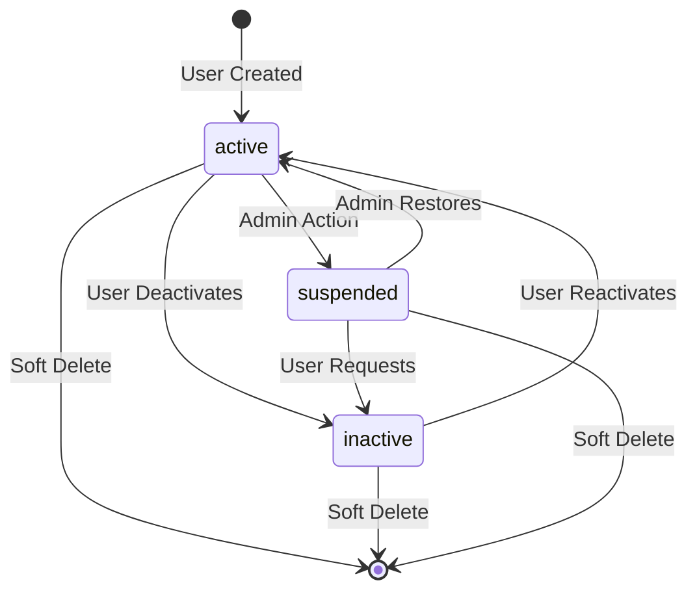
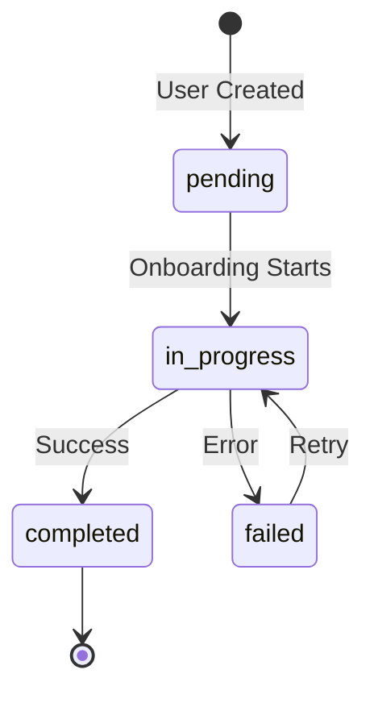
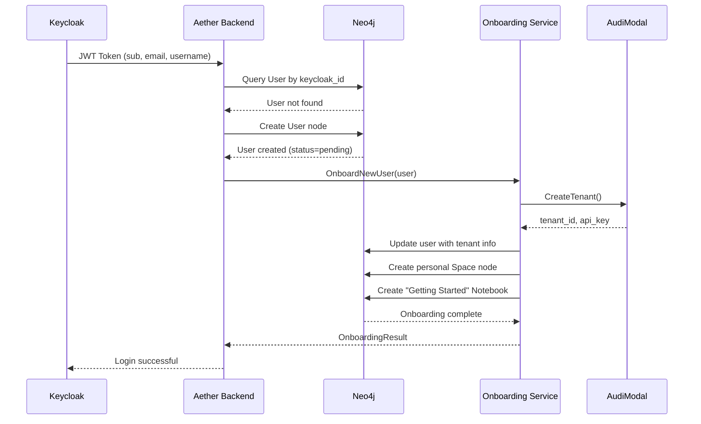

# User Node - Aether Backend

---
**service**: aether-be
**model**: User
**database**: Neo4j
**version**: 1.0
**last_updated**: 2026-01-05
**author**: TAS Platform Team
---

## 1. Overview

**Purpose**: The User node represents a user account in the TAS platform, synchronized with Keycloak for authentication while maintaining local application-specific data in Neo4j.

**Lifecycle**:
- Created on first login after Keycloak authentication
- Synchronized with Keycloak on subsequent logins
- Soft-deleted via status change (never hard deleted)
- Auto-onboarded with personal tenant/space on creation

**Ownership**: Aether Backend service owns and manages this model

**Key Characteristics**:
- Primary key is internal UUID, separate from Keycloak UUID
- Maintains 1:1 relationship with Keycloak user via `keycloak_id`
- Stores personal tenant/space IDs for multi-tenancy isolation
- Tracks onboarding status and tutorial completion
- Contains both synchronized Keycloak data and local preferences

---

## 2. Schema Definition

### Neo4j Node Properties

#### Core Identity Fields

| Property | Type | Required | Default | Description |
|----------|------|----------|---------|-------------|
| `id` | UUID string | Yes | `uuid.New()` | Internal unique identifier (primary key) |
| `keycloak_id` | UUID string | Yes | from JWT | Keycloak user ID (sub claim from JWT token) |
| `email` | string | Yes | from Keycloak | User email address |
| `username` | string | Yes | from Keycloak | Unique username |
| `full_name` | string | Yes | from Keycloak | User's full display name |
| `avatar_url` | string | No | empty | URL to user's avatar image |

#### Keycloak Sync Data

| Property | Type | Required | Default | Description |
|----------|------|----------|---------|-------------|
| `keycloak_roles` | string array | No | `[]` | Roles assigned in Keycloak |
| `keycloak_groups` | string array | No | `[]` | Groups user belongs to in Keycloak |
| `keycloak_attributes` | map | No | `{}` | Custom attributes from Keycloak |

#### Local Application Data

| Property | Type | Required | Default | Description |
|----------|------|----------|---------|-------------|
| `preferences` | map | No | `{}` | User preferences (theme, language, etc.) |
| `status` | string | Yes | `"active"` | User status: active, inactive, suspended |

#### Multi-Tenancy Fields

| Property | Type | Required | Default | Description |
|----------|------|----------|---------|-------------|
| `personal_tenant_id` | string | No | `tenant_<timestamp>` | Personal tenant ID (set during onboarding) |
| `personal_space_id` | string | No | `space_<timestamp>` | Personal space ID (derived from tenant_id) |
| `personal_api_key` | string | No | generated | API key for personal tenant (not in JSON responses) |

#### Onboarding/Tutorial Tracking

| Property | Type | Required | Default | Description |
|----------|------|----------|---------|-------------|
| `tutorial_completed` | boolean | Yes | `false` | Whether user completed tutorial |
| `tutorial_completed_at` | timestamp | No | null | When tutorial was completed |
| `onboarding_status` | string | Yes | `"pending"` | pending, in_progress, completed, failed |
| `onboarding_error` | string | No | empty | Error message if onboarding failed |
| `onboarding_failed_at` | timestamp | No | null | When onboarding failed |

#### Audit Timestamps

| Property | Type | Required | Default | Description |
|----------|------|----------|---------|-------------|
| `created_at` | timestamp | Yes | `time.Now()` | When user was created |
| `updated_at` | timestamp | Yes | `time.Now()` | Last update timestamp |
| `last_login_at` | timestamp | No | null | Last successful login |
| `last_sync_at` | timestamp | No | null | Last Keycloak data sync |

#### Constraints

- **Primary Key**: `id` (UUID)
- **Unique Constraint**: `keycloak_id` (1:1 mapping with Keycloak)
- **Unique Constraint**: `email`
- **Unique Constraint**: `username`
- **Status Values**: Must be one of: `active`, `inactive`, `suspended`
- **Onboarding Status Values**: Must be one of: `pending`, `in_progress`, `completed`, `failed`

#### Indexes

| Index Name | Property | Type | Purpose |
|------------|----------|------|---------|
| Primary | `id` | Unique | Fast lookup by internal ID |
| Keycloak | `keycloak_id` | Unique | Fast lookup from JWT tokens |
| Email | `email` | Unique | User search by email |
| Username | `username` | Unique | User search by username |
| Status | `status` | Index | Filter active/inactive users |
| Tenant | `personal_tenant_id` | Index | Tenant-based queries |

---

## 3. Relationships

### Neo4j Relationships

```cypher
// User owns notebooks
(User)-[:OWNS]->(Notebook)

// User belongs to spaces
(User)-[:MEMBER_OF {role, joined_at}]->(Space)

// User creates documents
(User)-[:CREATED]->(Document)

// User has personal space
(User)-[:HAS_PERSONAL_SPACE]->(Space)
```

| Relationship | Direction | Target Node | Cardinality | Description |
|--------------|-----------|-------------|-------------|-------------|
| `OWNS` | Outgoing | `Notebook` | 1:N | Notebooks owned by user |
| `MEMBER_OF` | Outgoing | `Space` | N:M | Spaces user belongs to (with role property) |
| `CREATED` | Outgoing | `Document` | 1:N | Documents created by user |
| `HAS_PERSONAL_SPACE` | Outgoing | `Space` | 1:1 | User's personal workspace |
| `UPDATED` | Outgoing | `Document` | 1:N | Documents last updated by user |
| `SHARED_WITH` | Incoming | `Notebook` | N:M | Notebooks shared with user |

### Relationship Properties

**MEMBER_OF** relationship:
- `role`: string - User's role in the space (owner, admin, member, viewer)
- `joined_at`: timestamp - When user joined the space
- `invited_by`: string - User ID who invited them

---

## 4. Validation Rules

### Business Logic Constraints

- **Rule 1**: Email must be valid and unique
  - Implementation: Go validator tag `email` + unique constraint
  - Error: `400 Bad Request - "email already exists"`

- **Rule 2**: Username must be 3-50 characters, alphanumeric with underscores
  - Implementation: Go validator tag `username,min=3,max=50`
  - Error: `400 Bad Request - "invalid username format"`

- **Rule 3**: Personal tenant ID must follow `tenant_<timestamp>` format
  - Implementation: Validation in `SetPersonalTenantInfo()` method
  - Error: `500 Internal Server Error - "invalid tenant ID format"`

- **Rule 4**: Personal space ID must be derived from tenant ID
  - Implementation: `space_<timestamp>` where timestamp matches tenant
  - Error: Automatically set, no manual override allowed

- **Rule 5**: Keycloak ID must be valid UUID matching JWT `sub` claim
  - Implementation: Go validator tag `uuid`
  - Error: `401 Unauthorized - "invalid keycloak ID"`

### Data Integrity

- Keycloak ID cannot be changed after user creation
- Email/username changes must sync back to Keycloak
- Status transitions: active ↔ inactive, active → suspended, suspended → active
- Tutorial can only be completed once (unless manually reset)

---

## 5. Lifecycle & State Transitions

### State Machine - User Status



### State Machine - Onboarding Status



### Transition Rules

| From State | To State | Trigger | Conditions | Side Effects |
|------------|----------|---------|------------|--------------|
| - | pending | User creation | Keycloak auth success | Create user node |
| pending | in_progress | Auto-trigger | First login | Start onboarding |
| in_progress | completed | Onboarding success | Tenant, space, notebook created | Set tutorial_completed |
| in_progress | failed | Onboarding error | Any failure | Log error, set onboarding_error |
| failed | in_progress | Manual retry | Admin/user action | Clear error fields |
| active | suspended | Admin action | Violation detected | Revoke access tokens |
| suspended | active | Admin restoration | Appeal approved | Restore full access |

---

## 6. Examples

### Creating a New User

**Go Code**:
```go
// From JWT token claims
user := &User{
    ID:         uuid.New().String(),
    KeycloakID: jwtClaims.Sub, // "570d9941-f4be-46d6-9662-15a2ed0a3cb1"
    Email:      jwtClaims.Email,
    Username:   jwtClaims.PreferredUsername,
    FullName:   jwtClaims.Name,
    Status:     "active",
    OnboardingStatus: "pending",
    CreatedAt:  time.Now(),
    UpdatedAt:  time.Now(),
}
```

**Neo4j Cypher**:
```cypher
CREATE (u:User {
  id: $id,
  keycloak_id: $keycloak_id,
  email: $email,
  username: $username,
  full_name: $full_name,
  status: "active",
  onboarding_status: "pending",
  tutorial_completed: false,
  keycloak_roles: [],
  keycloak_groups: [],
  preferences: {},
  created_at: datetime(),
  updated_at: datetime()
})
RETURN u
```

### Querying Users

**Find by Keycloak ID** (most common - from JWT):
```cypher
MATCH (u:User {keycloak_id: $keycloak_id})
WHERE u.status <> "deleted"
RETURN u
```

**List Active Users**:
```cypher
MATCH (u:User)
WHERE u.status = "active"
  AND u.onboarding_status = "completed"
RETURN u
ORDER BY u.created_at DESC
LIMIT 20
```

**Search by Email/Username**:
```cypher
MATCH (u:User)
WHERE (u.email CONTAINS $query OR u.username CONTAINS $query)
  AND u.status = "active"
RETURN u
LIMIT 10
```

**Get User with Personal Space**:
```cypher
MATCH (u:User {keycloak_id: $keycloak_id})-[:HAS_PERSONAL_SPACE]->(s:Space)
RETURN u, s
```

### Updating User

**Update Profile**:
```cypher
MATCH (u:User {id: $id})
SET u.full_name = $full_name,
    u.avatar_url = $avatar_url,
    u.updated_at = datetime()
RETURN u
```

**Sync Keycloak Data**:
```cypher
MATCH (u:User {keycloak_id: $keycloak_id})
SET u.keycloak_roles = $roles,
    u.keycloak_groups = $groups,
    u.keycloak_attributes = $attributes,
    u.last_sync_at = datetime(),
    u.updated_at = datetime()
RETURN u
```

**Update Last Login**:
```cypher
MATCH (u:User {keycloak_id: $keycloak_id})
SET u.last_login_at = datetime(),
    u.updated_at = datetime()
RETURN u
```

**Set Personal Tenant Info** (during onboarding):
```cypher
MATCH (u:User {id: $user_id})
SET u.personal_tenant_id = $tenant_id,
    u.personal_space_id = $space_id,
    u.personal_api_key = $api_key,
    u.onboarding_status = "completed",
    u.updated_at = datetime()
RETURN u
```

### Soft Delete

```cypher
MATCH (u:User {id: $id})
SET u.status = "inactive",
    u.updated_at = datetime()
RETURN u
```

---

## 7. Cross-Service References

### Services That Use This Model

| Service | Purpose | Access Pattern | Notes |
|---------|---------|----------------|-------|
| `aether-be` | Primary owner | Read/Write | Manages all user operations |
| `aether` (frontend) | User profile display | Read-only via API | Receives UserResponse DTO |
| `audimodal` | Document processing | Read-only | Uses `personal_tenant_id` for file isolation |
| `tas-agent-builder` | Agent ownership | Read-only | Links agents to users |
| `tas-llm-router` | Usage tracking | Read-only | Logs requests by `keycloak_id` |
| `deeplake-api` | Vector storage | Read-only | Creates datasets per `personal_tenant_id` |
| `keycloak` | Authentication source | External sync | Source of truth for auth data |

### ID Mapping

| This Service | Other Service | Mapping | Notes |
|--------------|---------------|---------|-------|
| `user.id` | Internal only | N/A | Not exposed to other services |
| `user.keycloak_id` | `keycloak.user.sub` | Direct (UUID) | 1:1 mapping, primary foreign key |
| `user.personal_tenant_id` | `audimodal.tenant.id` | Direct | Format: `tenant_1767395606` |
| `user.personal_space_id` | `aether-be.space.id` | Direct | Format: `space_1767395606` |
| `user.email` | `keycloak.user.email` | Synced | Updated on login |

### Data Flow



---

## 8. Tenant & Space Isolation

### Multi-Tenancy Fields

| Field | Purpose | Pattern | Example |
|-------|---------|---------|---------|
| `personal_tenant_id` | User's isolated tenant | `tenant_<unix_timestamp>` | `tenant_1767395606` |
| `personal_space_id` | User's personal workspace | `space_<unix_timestamp>` | `space_1767395606` |
| `personal_api_key` | Tenant API authentication | Generated UUID | `a1b2c3d4-...` |

### Space ID Derivation

**CRITICAL**: Space ID must always be derived from tenant ID:

```go
// Correct derivation
if strings.HasPrefix(tenantID, "tenant_") {
    spaceID = "space_" + tenantID[len("tenant_"):]  // "space_1767395606"
}
```

**Rules**:
- ✅ Tenant ID format: `tenant_<timestamp>`
- ✅ Space ID format: `space_<same_timestamp>`
- ❌ Never use UUIDs for tenant/space IDs
- ❌ Never manually set space_id (always derived)

### Isolation Queries

**ALWAYS filter by user context**:

```cypher
// Get user's notebooks (proper isolation)
MATCH (u:User {keycloak_id: $keycloak_id})-[:OWNS]->(n:Notebook)
WHERE n.tenant_id = u.personal_tenant_id
  AND n.space_id = u.personal_space_id
  AND n.deleted_at IS NULL
RETURN n
```

**Validation Checklist**:
- ✅ All user queries must authenticate via JWT `sub` → `keycloak_id`
- ✅ All owned resources must match `personal_tenant_id` and `personal_space_id`
- ✅ Never expose data across tenant boundaries
- ✅ API key must not be included in JSON responses (use `json:"-"` tag)

---

## 9. Performance Considerations

### Indexes for Performance

- **keycloak_id index** - Primary lookup from JWT tokens (most common query)
- **email/username indexes** - User search and uniqueness checks
- **status index** - Filter active users efficiently
- **personal_tenant_id index** - Cross-service tenant queries

### Query Optimization Tips

1. **Always use keycloak_id** for user lookup from authenticated requests (indexed)
2. **Avoid full table scans** - use WHERE clauses with indexed fields
3. **Limit result sets** - use LIMIT for list queries
4. **Projection** - only return needed fields with `RETURN u.id, u.email` vs `RETURN u`
5. **Connection pooling** - Neo4j driver maintains connection pool (50 connections)

### Caching Strategy

- **Cache Key**: `user:keycloak_id:<uuid>`
- **TTL**: 5 minutes (matches JWT expiry)
- **Invalidation**:
  - On user update
  - On status change
  - On Keycloak sync
- **Redis Storage**: UserResponse DTO (excludes sensitive fields)

**Example**:
```go
cacheKey := fmt.Sprintf("user:keycloak_id:%s", keycloakID)
ttl := 5 * time.Minute
```

---

## 10. Security & Compliance

### Sensitive Data

| Field | Sensitivity | Encryption | PII | Retention |
|-------|-------------|------------|-----|-----------|
| `email` | Medium | In transit (TLS) | Yes | Indefinite |
| `full_name` | Medium | In transit (TLS) | Yes | Indefinite |
| `keycloak_id` | High | In transit (TLS) | Yes | Permanent |
| `personal_api_key` | Critical | At rest + transit | No | Rotatable |
| `avatar_url` | Low | None | No | Indefinite |
| `preferences` | Low | None | No | Indefinite |

### Access Control

- **Create**: Automatic on first JWT authentication (system only)
- **Read Own**: Any authenticated user (self)
- **Read Others**: Admin role only (limited fields)
- **Update Own**: Authenticated user (profile fields only)
- **Update Others**: Admin role (all fields)
- **Delete**: Admin role only (soft delete)
- **Suspend**: Admin role only

### Audit Logging

**Events Logged**:
- User created
- User updated (with changed fields)
- Status changed
- Login events (via `last_login_at`)
- Keycloak sync events (via `last_sync_at`)
- Onboarding status changes
- Tutorial completion

**Audit Fields**:
- `created_at` - Creation timestamp
- `updated_at` - Last modification timestamp
- `last_login_at` - Authentication events
- `last_sync_at` - Keycloak synchronization

**Audit Trail**: All changes logged to separate AuditLog nodes in Neo4j:
```cypher
CREATE (a:AuditLog {
  user_id: $user_id,
  action: "user_updated",
  changes: $changes,
  timestamp: datetime()
})
```

---

## 11. Migration History

### Version 1.0 (2026-01-05)
- Initial model definition
- Added multi-tenancy fields (personal_tenant_id, personal_space_id)
- Added onboarding status tracking
- Added tutorial completion tracking
- Separated internal ID from Keycloak ID
- Added Keycloak sync fields (roles, groups, attributes)

---

## 12. Known Issues & Limitations

**Issue #1**: No mechanism to handle Keycloak user deletion
- **Description**: If user is deleted in Keycloak, Neo4j user remains active
- **Workaround**: Manual status update to "inactive"
- **Future**: Implement Keycloak webhook listener for user deletion events

**Issue #2**: Username/email changes in Keycloak may not sync
- **Description**: Changes to email/username in Keycloak don't trigger immediate sync
- **Impact**: User may see stale data until next login
- **Future**: Implement periodic sync job or Keycloak webhooks

**Limitation #1**: No bulk user import capability
- **Description**: Users must authenticate individually to be created
- **Impact**: Cannot pre-populate users from external systems
- **Future**: Add admin API for bulk user creation with Keycloak integration

---

## 13. Related Documentation

- [Aether Backend Service Overview](../../../aether-be/README.md)
- [Keycloak User Model](../../keycloak/users/user-model.md)
- [Space Node Documentation](./space.md)
- [Notebook Node Documentation](./notebook.md)
- [Cross-Service ID Mapping](../../cross-service/mappings/id-mapping-chain.md)
- [Validation Scripts](../../validation/scripts/validate-cross-references.sh)
- [User API Endpoints](../../aether-be/api/user-endpoints.md)

---

## 14. Changelog

| Date | Version | Author | Changes |
|------|---------|--------|---------|
| 2026-01-05 | 1.0 | TAS Platform Team | Initial comprehensive documentation |

---

**Maintained by**: TAS Platform Team
**Last Reviewed**: 2026-01-05
**Next Review**: 2026-02-05
