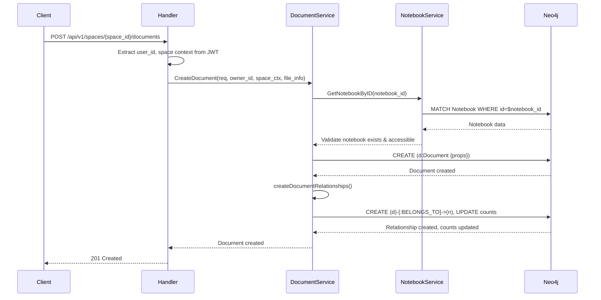
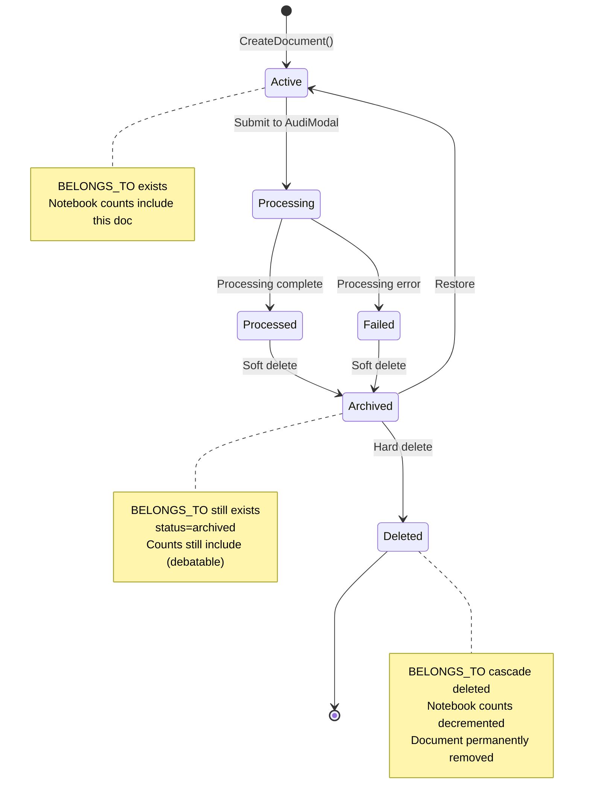
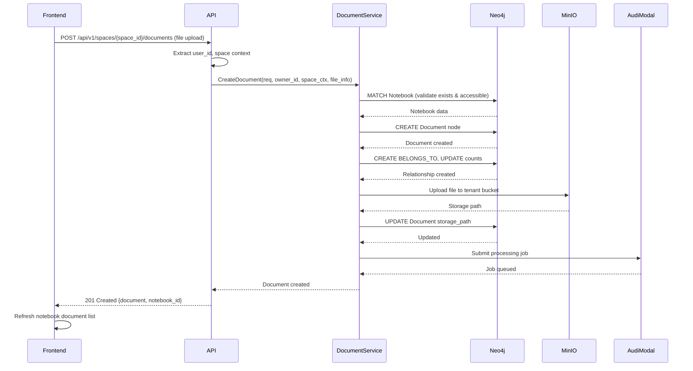

# BELONGS_TO Relationship - Aether Backend

---
service: aether-be
model: BELONGS_TO (Relationship)
database: Neo4j
version: 1.0
last_updated: 2026-01-05
author: TAS Platform Team
---

## 1. Overview

**Purpose**: The BELONGS_TO relationship establishes containment between Documents and Notebooks in the Neo4j graph database. This relationship defines which notebook contains each document, forming the organizational hierarchy for document management.

**Lifecycle**:
- **Created**: When a document is uploaded or created (automatically during `CreateDocument`)
- **Updated**: Never modified (documents cannot be moved between notebooks)
- **Deleted**: When the document is permanently deleted (cascade delete)

**Ownership**: Aether Backend service

**Key Characteristics**:
- Immutable relationship (document cannot be moved to different notebook)
- Many-to-one cardinality (Notebook can contain many Documents, Document belongs to one Notebook)
- Triggers automatic notebook count/size updates
- Enables efficient "list documents in notebook" queries
- Supports multi-tenancy isolation via tenant_id validation
- No explicit relationship properties (state stored on nodes)
- Critical for permission inheritance (documents inherit notebook permissions)

---

## 2. Schema Definition

### Neo4j Relationship Pattern

```cypher
(document:Document)-[:BELONGS_TO]->(notebook:Notebook)
```

### Direction and Cardinality

| From Node | Relationship | To Node | Cardinality | Description |
|-----------|--------------|---------|-------------|-------------|
| `Document` | `BELONGS_TO` | `Notebook` | N:1 | Many documents belong to one notebook |
| `Notebook` | (inverse) | `Document` | 1:N | One notebook contains many documents |

### Relationship Properties

**None** - This is a simple directional relationship with no properties.

All relevant metadata (creation time, size, etc.) is stored on the Document node. The relationship is created atomically during document creation and includes automatic updates to Notebook aggregates.

### Constraints

- **Uniqueness**: Each Document must have exactly ONE BELONGS_TO relationship
- **Existence**: Both source (Document) and target (Notebook) nodes must exist
- **Immutability**: Once created, the relationship cannot be modified (document cannot be moved)
- **Tenant Isolation**: Related nodes must belong to the same tenant_id
- **Space Isolation**: Related nodes must belong to the same space_id

---

## 3. Relationships

### Pattern Visualization

```cypher
// Basic containment pattern
(d:Document {id: "doc-123"})-[:BELONGS_TO]->(n:Notebook {id: "notebook-456"})

// Complete hierarchical structure
(u:User {id: "user-1"})
  <-[:OWNED_BY]-(n:Notebook {name: "Research Papers"})
    <-[:BELONGS_TO]-(d1:Document {name: "Paper 1.pdf"})
    <-[:BELONGS_TO]-(d2:Document {name: "Paper 2.pdf"})
    <-[:BELONGS_TO]-(d3:Document {name: "Paper 3.pdf"})

// Documents also owned by user
(d1)-[:OWNED_BY]->(u)
(d2)-[:OWNED_BY]->(u)
(d3)-[:OWNED_BY]->(u)

// Chunk relationships
(d1)-[:HAS_CHUNK]->(c1:Chunk)
(d1)-[:HAS_CHUNK]->(c2:Chunk)
```

### Related Relationships

| Relationship | Pattern | Purpose | Notes |
|--------------|---------|---------|-------|
| `OWNED_BY` (Document) | `(doc:Document)-[:OWNED_BY]->(user:User)` | Document ownership | Always matches notebook owner |
| `OWNED_BY` (Notebook) | `(notebook:Notebook)-[:OWNED_BY]->(user:User)` | Notebook ownership | Parent relationship |
| `HAS_CHUNK` | `(doc:Document)-[:HAS_CHUNK]->(chunk:Chunk)` | Document chunks | For vector embedding |
| `PARENT_OF` | `(parent:Notebook)-[:PARENT_OF]->(child:Notebook)` | Notebook hierarchy | Nested notebooks |

---

## 4. Validation Rules

### Business Logic Constraints

- **Rule 1**: Notebook must exist before creating document relationship
  - Implementation: `CreateDocument()` verifies notebook via `GetNotebookByID()`
  - Error: `NOTEBOOK_NOT_FOUND` if notebook doesn't exist
  - Validation: Happens before document node creation

- **Rule 2**: Document and Notebook must belong to same tenant
  - Implementation: Query filters by `tenant_id` on both nodes
  - Error: Silent failure if tenant_id mismatch prevents relationship creation
  - Security: Prevents cross-tenant document access

- **Rule 3**: Document and Notebook must belong to same space
  - Implementation: Verified in `CreateDocument()` before relationship creation
  - Error: `FORBIDDEN` if space_id mismatch
  - Enforcement: Application-level check

- **Rule 4**: User must have create permission in notebook's space
  - Implementation: `spaceCtx.CanCreate()` check in DocumentService
  - Error: `FORBIDDEN` if insufficient permissions
  - Context: SpaceContext provides permission info

- **Rule 5**: Notebook counts automatically updated on relationship creation
  - Implementation: `createDocumentRelationships()` uses Cypher SET with COALESCE
  - Side Effects: `document_count += 1`, `total_size_bytes += doc.size_bytes`
  - Atomicity: Single transaction ensures consistency

### Data Integrity

- Both Document and Notebook nodes must exist before relationship creation
- Tenant and space isolation enforced at query and application level
- No circular references possible (Document cannot belong to Document)
- Relationship automatically deleted when Document is hard-deleted
- Notebook counts decremented automatically on document deletion

---

## 5. Lifecycle & State Transitions

### Creation Flow



### Deletion Flow with Count Updates



---

## 6. Examples

### Creating BELONGS_TO Relationship

**During Document Creation (Go Code)**:
```go
// From internal/services/document.go:953
func (s *DocumentService) createDocumentRelationships(
    ctx context.Context,
    documentID,
    notebookID,
    ownerID string,
    tenantID string,
    sizeBytes int64,
) error {
    query := `
        MATCH (d:Document {id: $document_id, tenant_id: $tenant_id}),
              (n:Notebook {id: $notebook_id, tenant_id: $tenant_id}),
              (u:User {id: $owner_id})
        CREATE (d)-[:BELONGS_TO]->(n), (d)-[:OWNED_BY]->(u)
        WITH n, d
        SET n.document_count = COALESCE(n.document_count, 0) + 1,
            n.total_size_bytes = COALESCE(n.total_size_bytes, 0) + d.size_bytes,
            n.updated_at = datetime()
    `

    params := map[string]interface{}{
        "document_id": documentID,
        "notebook_id": notebookID,
        "owner_id":    ownerID,
        "tenant_id":   tenantID,
    }

    _, err := s.neo4j.ExecuteQueryWithLogging(ctx, query, params)
    return err
}
```

**Direct Cypher**:
```cypher
-- Create document containment relationship and update counts
MATCH (d:Document {id: 'doc-123', tenant_id: 'tenant_1767395606'}),
      (n:Notebook {id: 'notebook-456', tenant_id: 'tenant_1767395606'}),
      (u:User {id: 'user-789'})
CREATE (d)-[:BELONGS_TO]->(n), (d)-[:OWNED_BY]->(u)
WITH n, d
SET n.document_count = COALESCE(n.document_count, 0) + 1,
    n.total_size_bytes = COALESCE(n.total_size_bytes, 0) + d.size_bytes,
    n.updated_at = datetime()
RETURN n.document_count, n.total_size_bytes
```

### Querying with BELONGS_TO

**List All Documents in Notebook**:
```cypher
-- Find documents in specific notebook
MATCH (n:Notebook {id: $notebook_id, tenant_id: $tenant_id})
       <-[:BELONGS_TO]-(d:Document)
WHERE d.status <> 'deleted'
  AND d.space_id = $space_id
RETURN d
ORDER BY d.created_at DESC
LIMIT 50
```

**Get Document with Notebook Context**:
```cypher
-- Retrieve document and its containing notebook
MATCH (d:Document {id: $document_id, tenant_id: $tenant_id})
       -[:BELONGS_TO]->(n:Notebook)
OPTIONAL MATCH (d)-[:OWNED_BY]->(owner:User)
RETURN d.id, d.name, d.status, d.size_bytes, d.created_at,
       n.id AS notebook_id, n.name AS notebook_name,
       owner.username AS owner_name
```

**Count Documents in Notebook (Verification)**:
```cypher
-- Verify notebook count matches actual documents
MATCH (n:Notebook {id: $notebook_id, tenant_id: $tenant_id})
OPTIONAL MATCH (n)<-[:BELONGS_TO]-(d:Document)
WHERE d.status <> 'deleted'
RETURN n.document_count AS stored_count,
       count(d) AS actual_count,
       n.document_count = count(d) AS counts_match
```

**Find Notebooks Containing Specific File Type**:
```cypher
-- Find all notebooks with PDF documents
MATCH (n:Notebook {tenant_id: $tenant_id, space_id: $space_id})
       <-[:BELONGS_TO]-(d:Document)
WHERE d.mime_type = 'application/pdf'
  AND d.status = 'processed'
RETURN DISTINCT n.id, n.name, count(d) AS pdf_count
ORDER BY pdf_count DESC
```

**Search Documents Across Notebooks**:
```cypher
-- Full-text search across all user's notebooks
MATCH (u:User {id: $user_id})
       <-[:OWNED_BY]-(n:Notebook {tenant_id: $tenant_id, space_id: $space_id})
       <-[:BELONGS_TO]-(d:Document)
WHERE d.search_text CONTAINS toLower($query)
  AND d.status = 'processed'
RETURN d.id, d.name, d.type,
       n.id AS notebook_id, n.name AS notebook_name,
       d.created_at
ORDER BY d.created_at DESC
LIMIT 20
```

### Deleting BELONGS_TO Relationship with Count Update

**Soft Delete (Archive) - Relationship Preserved**:
```cypher
-- Archive document (BELONGS_TO remains, debatable if counts should update)
MATCH (d:Document {id: $document_id, tenant_id: $tenant_id})
SET d.status = 'archived', d.updated_at = datetime()
RETURN d
```

**Hard Delete - Cascade Delete with Count Decrement**:
```cypher
-- Permanently delete document and update notebook counts
MATCH (d:Document {id: $document_id, tenant_id: $tenant_id})
       -[r:BELONGS_TO]->(n:Notebook)
WITH d, r, n, d.size_bytes AS doc_size
DETACH DELETE d
WITH n, doc_size
SET n.document_count = GREATEST(0, COALESCE(n.document_count, 0) - 1),
    n.total_size_bytes = GREATEST(0, COALESCE(n.total_size_bytes, 0) - doc_size),
    n.updated_at = datetime()
RETURN n.document_count, n.total_size_bytes
```

---

## 7. Cross-Service References

### Services That Use This Relationship

| Service | Purpose | Access Pattern | Notes |
|---------|---------|----------------|-------|
| **Aether Backend** | Primary owner | Read/Write | Creates, queries, and manages containment |
| **Aether Frontend** | Display documents in notebooks | Read (via API) | Lists documents grouped by notebook |
| **AudiModal** | Process documents | Read | Retrieves document info for processing |
| **DeepLake API** | Vector embedding | Read | Accesses documents via notebook context |
| **TAS Agent Builder** | Context retrieval | Read (future) | Query documents in notebook for agent context |

### ID Mapping

| This Service | Other Service | Mapping | Notes |
|--------------|---------------|---------|-------|
| `document.notebook_id` | `notebook.id` | Direct UUID | Stored as property on Document node |
| `document.id` | `audimodal.files.id` | Direct UUID | Same ID across services |
| `document.id` | `deeplake.vectors.document_id` | Foreign key | Vector embeddings reference |

### Data Flow



---

## 8. Tenant & Space Isolation

### Multi-Tenancy Enforcement

**Tenant Isolation**:
```cypher
-- CORRECT: Always include tenant_id filter on both nodes
MATCH (n:Notebook {id: $notebook_id, tenant_id: $tenant_id})
      <-[:BELONGS_TO]-(d:Document {tenant_id: $tenant_id})
WHERE d.status <> 'deleted'
RETURN d

-- INCORRECT: Missing tenant_id (security risk!)
MATCH (n:Notebook {id: $notebook_id})<-[:BELONGS_TO]-(d:Document)
RETURN d  -- Could expose documents from other tenants!
```

**Space Isolation**:
```cypher
-- Documents filtered by both tenant AND space
MATCH (n:Notebook {tenant_id: $tenant_id, space_id: $space_id})
      <-[:BELONGS_TO]-(d:Document)
WHERE d.tenant_id = $tenant_id
  AND d.space_id = $space_id
  AND d.status <> 'deleted'
RETURN d
```

### Validation Checklist

- ✅ All BELONGS_TO queries MUST filter by `tenant_id` on both Document and Notebook
- ✅ Relationship creation MUST validate Document and Notebook in same tenant
- ✅ Relationship creation MUST validate Document and Notebook in same space
- ✅ Space-scoped queries MUST include both `tenant_id` AND `space_id`
- ✅ Never expose containment across tenant boundaries
- ✅ Permission checks MUST validate space membership before document access

---

## 9. Performance Considerations

### Indexes for Performance

**Node Indexes**:
```cypher
-- Indexes on nodes for efficient containment lookups
CREATE INDEX IF NOT EXISTS FOR (d:Document) ON (d.notebook_id);
CREATE INDEX IF NOT EXISTS FOR (d:Document) ON (d.tenant_id, d.notebook_id);
CREATE INDEX IF NOT EXISTS FOR (d:Document) ON (d.space_id, d.notebook_id);
CREATE INDEX IF NOT EXISTS FOR (d:Document) ON (d.notebook_id, d.status);
```

**Relationship Index** (if needed in future):
```cypher
-- From BACKEND-DESIGN.md:523 (not currently implemented)
CREATE INDEX FOR ()-[r:BELONGS_TO]-() ON (r.added_at);
-- Would require adding 'added_at' property to relationship
```

### Query Optimization Tips

- **Index on notebook_id**: Enables fast "list documents in notebook" queries
- **Composite indexes**: `(tenant_id, notebook_id, status)` for common patterns
- **Limit result sets**: Always use `LIMIT` and `SKIP` for pagination
- **Count from property**: Use `n.document_count` instead of counting relationships
- **Filter early**: Apply `tenant_id` and `status` filters before traversal

### Caching Strategy

**Redis Cache for Notebook Document Lists**:
- **Cache Key**: `notebook:{notebook_id}:documents`
- **TTL**: 5 minutes
- **Invalidation**: On document create, delete, or status change
- **Value**: Array of document IDs (not full objects)

**Example Caching Pattern**:
```go
// Try cache first for document list
cacheKey := fmt.Sprintf("notebook:%s:documents", notebookID)
cached, err := redis.Get(ctx, cacheKey).Result()
if err == nil {
    // Cache hit - skip BELONGS_TO traversal for list
    var docIDs []string
    json.Unmarshal([]byte(cached), &docIDs)
    // Fetch full documents by ID if needed
    return docIDs, nil
}

// Cache miss - query with BELONGS_TO relationship
result := neo4j.Query("MATCH (n)<-[:BELONGS_TO]-(d) WHERE n.id = $id RETURN d.id")

// Cache document IDs
redis.Set(ctx, cacheKey, docIDsJSON, 5*time.Minute)
```

### Notebook Count Accuracy

**Automatic Count Maintenance**:
- Document creation: `document_count += 1`
- Document deletion: `document_count -= 1`
- Uses `COALESCE` to handle null values gracefully
- Atomicity ensures counts never become inconsistent

**Count Verification Query** (for debugging):
```cypher
// Find notebooks with incorrect document counts
MATCH (n:Notebook)
OPTIONAL MATCH (n)<-[:BELONGS_TO]-(d:Document)
WHERE d.status <> 'deleted'
WITH n, count(d) AS actual_count
WHERE n.document_count <> actual_count
RETURN n.id, n.name, n.document_count AS stored_count, actual_count,
       (n.document_count - actual_count) AS difference
ORDER BY abs(difference) DESC
```

---

## 10. Security & Compliance

### Access Control

**Create Containment**:
- User must be authenticated (valid JWT)
- User must have `CanCreate()` permission in target space
- Notebook must exist and be accessible in user's space
- Tenant and space must match between document and notebook

**Query Containment**:
- Authenticated users can query documents in their accessible notebooks
- Space membership validated before notebook access
- Cross-tenant queries are blocked

**Modify Containment**:
- **NOT SUPPORTED** - Documents cannot be moved between notebooks
- Would require complex permission and count recalculation
- Future feature: Document move with transactional count updates

**Delete Containment**:
- Only document owner or notebook owner can delete document
- Soft delete preserves relationship (status change only)
- Hard delete removes BELONGS_TO and decrements counts
- Cascade rules ensure orphaned documents don't exist

### Audit Logging

**Events Logged**:
- `DOCUMENT_CREATED` - Containment established, counts updated
- `DOCUMENT_UPLOADED` - File stored, containment verified
- `DOCUMENT_PROCESSED` - Processing complete
- `DOCUMENT_DELETED` - Containment terminated, counts updated
- `NOTEBOOK_COUNT_MISMATCH` - Detected inconsistency (automated check)
- `PERMISSION_DENIED` - Failed containment validation

**Audit Fields** (in application logs):
- `user_id` - User performing action
- `document_id` - Document affected
- `notebook_id` - Containing notebook
- `tenant_id` - Tenant context
- `space_id` - Space context
- `size_bytes` - Document size (for count tracking)
- `action` - Operation attempted
- `result` - Success/failure

### Privacy Considerations

- Document contents may contain sensitive data (PII, HIPAA, GDPR)
- Containment relationship reveals document organization
- Notebook names may leak information about document purposes
- Compliance with GDPR: Document deletion must cascade properly
- Retention policy: Deleted documents removed from counts immediately

---

## 11. Migration History

### Version 1.0 (2026-01-02)
- Initial BELONGS_TO relationship implementation
- Simple directional relationship with no properties
- Automatic notebook count/size updates on create
- Implemented in `createDocumentRelationships()` function

### Future Enhancements (Planned)
- Add `added_at` timestamp property on relationship for audit trail
- Support document move between notebooks (requires transactional count updates)
- Implement soft-delete count handling (whether to include archived docs in counts)
- Create index on relationship properties for historical queries
- Add `order` property for manual document ordering within notebooks

---

## 12. Known Issues & Limitations

**Issue 1**: Soft delete doesn't update notebook counts
- **Description**: When document.status = 'archived', counts not decremented
- **Workaround**: Only hard deletes update counts currently
- **Impact**: Notebook counts may include archived documents
- **Future**: Add logic to exclude archived documents from counts

**Issue 2**: No transactional guarantee between document create and relationship create
- **Description**: Document node created before BELONGS_TO relationship
- **Workaround**: Relationship creation logged but doesn't fail overall operation
- **Impact**: Could create orphaned documents without notebooks
- **Future**: Use Neo4j multi-statement transactions for atomicity

**Limitation 1**: Documents cannot be moved between notebooks
- **Description**: No mechanism to change document's notebook after creation
- **Impact**: Users cannot reorganize documents across notebooks
- **Future**: Implement document move with transactional count updates

**Limitation 2**: Notebook counts can drift if relationships manually deleted
- **Description**: Direct Cypher DETACH DELETE doesn't trigger count updates
- **Impact**: Manual database operations can cause count inconsistencies
- **Future**: Implement database triggers or periodic reconciliation jobs

**Limitation 3**: Large notebooks may have performance issues
- **Description**: Notebooks with 10,000+ documents may be slow to query
- **Impact**: UI pagination required for large notebooks
- **Future**: Implement efficient pagination with cursor-based queries

---

## 13. Related Documentation

- [Document Node](../nodes/document.md)
- [Notebook Node](../nodes/notebook.md)
- [OWNED_BY Relationship (Notebook)](./owned-by.md) - Notebook ownership
- [OWNED_BY Relationship (Document)](./owned-by.md) - Document ownership (same doc, different context)
- [HAS_CHUNK Relationship](./has-chunk.md) - Document chunking
- [PARENT_OF Relationship](./parent-of.md) - Notebook hierarchy
- [Space Node](../nodes/space.md) - Space-based multi-tenancy
- [Cross-Service Data Flows](../../cross-service/flows/document-upload.md)

---

## 14. Changelog

| Date | Version | Author | Changes |
|------|---------|--------|---------|
| 2026-01-02 | 1.0 | TAS Team | Initial BELONGS_TO relationship implementation |
| 2026-01-05 | - | TAS Team | Created comprehensive documentation |

---

**Maintained by**: TAS Platform Team
**Last Reviewed**: 2026-01-05
**Next Review**: 2026-01-19
