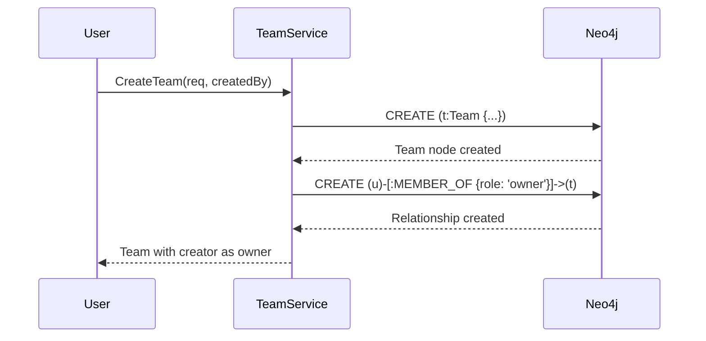
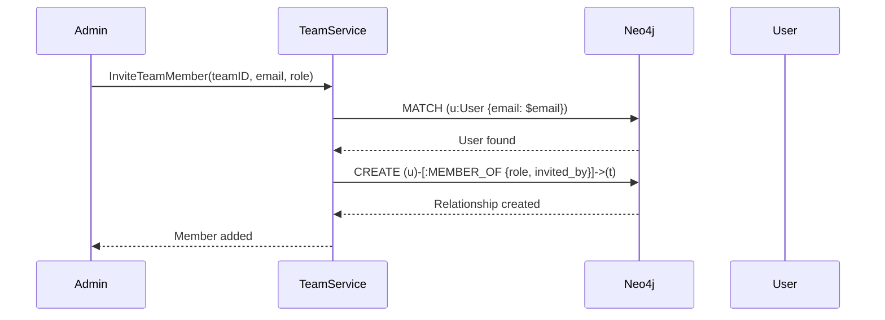

# MEMBER_OF Relationship

---

**Metadata**:
```yaml
service: aether-be
relationship: MEMBER_OF
database: Neo4j
version: 1.0
last_updated: 2026-01-05
author: TAS Data Architecture Team
```

---

## 1. Overview

**Purpose**: The MEMBER_OF relationship represents team and organization membership for users in the Aether platform. It establishes the connections between User nodes and either Team or Organization nodes, carrying role-based access control information and membership metadata.

**Lifecycle**:
- **Created**: When a user creates a team/organization (becomes owner) or is invited to join
- **Updated**: When a member's role or organizational metadata (title, department) changes
- **Deleted**: When a member is removed from the team/organization or when the team/organization is deleted

**Ownership**: Aether Backend (aether-be) manages this relationship

**Key Characteristics**:
- **Bidirectional Membership**: Supports both Team and Organization membership with the same relationship type
- **Role-Based Access**: Carries role property (owner/admin/member) for permission management
- **Rich Metadata**: Stores organizational context like title, department, join date, and inviter
- **Hierarchical Permissions**: Organization owners/admins can manage teams within their organization
- **Automatic Cascade**: Removing organization membership automatically removes all team memberships within that organization

---

## 2. Relationship Definition

### Neo4j Relationship Pattern

```cypher
// Team membership
(user:User)-[:MEMBER_OF {
  role: 'owner',
  joined_at: datetime(),
  invited_by: 'user-id'
}]->(team:Team)

// Organization membership
(user:User)-[:MEMBER_OF {
  role: 'admin',
  joined_at: datetime(),
  invited_by: 'user-id',
  title: 'Engineering Manager',
  department: 'Engineering'
}]->(organization:Organization)
```

### Relationship Properties

| Property Name | Type | Required | Default | Description |
|---------------|------|----------|---------|-------------|
| `role` | string | Yes | - | User's role: 'owner', 'admin', or 'member' |
| `joined_at` | datetime | Yes | now() | Timestamp when user joined the team/org |
| `invited_by` | string | Yes | - | User ID of the person who invited this member |
| `title` | string | No (Org only) | "" | Job title (organization membership only) |
| `department` | string | No (Org only) | "" | Department name (organization membership only) |

### Direction & Cardinality

- **Direction**: User → Team/Organization (outgoing from User)
- **Cardinality**:
  - User to Team: N:M (user can be member of multiple teams)
  - User to Organization: N:M (user can be member of multiple organizations)
  - User to specific Team/Org: N:1 (each user has one role per team/org)

---

## 3. Relationship Variants

### Team Membership

**Pattern**: `(User)-[:MEMBER_OF]->(Team)`

**Properties Used**:
- `role`: owner/admin/member
- `joined_at`: membership start time
- `invited_by`: inviter user ID

**Example**:
```cypher
// Create team membership
MATCH (t:Team {id: $team_id}), (u:User {id: $user_id})
CREATE (u)-[r:MEMBER_OF {
  role: $role,
  joined_at: datetime($joined_at),
  invited_by: $invited_by
}]->(t)
RETURN r
```

**Reference**: `aether-be/internal/services/team.go:438-477`

### Organization Membership

**Pattern**: `(User)-[:MEMBER_OF]->(Organization)`

**Properties Used**:
- `role`: owner/admin/member
- `joined_at`: membership start time
- `invited_by`: inviter user ID
- `title`: organizational job title
- `department`: organizational department

**Example**:
```cypher
// Create organization membership with org-specific metadata
MATCH (o:Organization {id: $org_id}), (u:User {id: $user_id})
CREATE (u)-[r:MEMBER_OF {
  role: $role,
  joined_at: datetime($joined_at),
  invited_by: $invited_by,
  title: $title,
  department: $department
}]->(o)
RETURN r
```

**Reference**: `aether-be/internal/services/organization.go:570-613`

---

## 4. Role Hierarchy

### Role Types

| Role | Permissions | Can Invite | Can Edit | Can Delete | Can Remove Members |
|------|-------------|------------|----------|------------|-------------------|
| `owner` | Full control | Yes | Yes | Yes (team/org) | Yes (all members) |
| `admin` | Administrative | Yes | Yes | No | Yes (except owners) |
| `member` | Read/participate | No | No | No | No |

### Permission Enforcement

**Team Permissions** (`aether-be/internal/services/team.go:228-240`):
```go
// Check if user has permission to update team
userRole, err := s.getUserRoleInTeam(ctx, teamID, userID)
if err != nil {
    return nil, err
}

if userRole != "owner" && userRole != "admin" {
    return nil, errors.ForbiddenWithDetails("Insufficient permissions to update team", ...)
}
```

**Organization Permissions** (`aether-be/internal/services/organization.go:271-283`):
```go
// Check if user has permission to update organization
userRole, err := s.getUserRoleInOrganization(ctx, orgID, userID)
if err != nil {
    return nil, err
}

if userRole != "owner" && userRole != "admin" {
    return nil, errors.ForbiddenWithDetails("Insufficient permissions to update organization", ...)
}
```

### Role Change Constraints

**Owner Role Protection** (`aether-be/internal/services/team.go:675-682`):
```cypher
// Only owners can change owner roles
MATCH (t:Team {id: $team_id})<-[r:MEMBER_OF]-(u:User {id: $user_id})
WHERE r.role = 'owner' // Can only be changed by another owner
SET r.role = $role
RETURN r
```

**Rules**:
1. Only owners can promote/demote other owners
2. Only owners can delete teams/organizations
3. Admins can manage members but not owners
4. Members cannot manage other members

---

## 5. Lifecycle & State Transitions

### Creation Flow

#### Team Creator (Owner)



**Code**: `aether-be/internal/services/team.go:94-100`
```go
// Add creator as owner
err = s.addTeamMember(ctx, team.ID, createdBy, "owner", createdBy)
if err != nil {
    s.logger.Error("Failed to add creator as team owner", ...)
    // Try to clean up the team if member addition fails
    _ = s.deleteTeamInternal(ctx, team.ID)
    return nil, err
}
```

#### Invited Member



**Code**: `aether-be/internal/services/team.go:622-626`

### Update Flow

#### Role Change

```cypher
// Update member role
MATCH (t:Team {id: $team_id})<-[r:MEMBER_OF]-(u:User {id: $user_id})
SET r.role = $new_role
RETURN r
```

**Code**: `aether-be/internal/services/team.go:684-733`

#### Organizational Metadata Update (Organizations Only)

```cypher
// Update title and department
MATCH (o:Organization {id: $org_id})<-[r:MEMBER_OF]-(u:User {id: $user_id})
SET r.role = $role,
    r.title = $title,
    r.department = $department
RETURN r
```

**Code**: `aether-be/internal/services/organization.go:922-925`

### Deletion Flow

#### Individual Member Removal

```cypher
// Remove team member
MATCH (t:Team {id: $team_id})<-[r:MEMBER_OF]-(u:User {id: $user_id})
DELETE r
RETURN count(*) as deleted
```

**Code**: `aether-be/internal/services/team.go:764-767`

#### Organization Member Removal (Cascade to Teams)

```cypher
// Remove organization member AND all team memberships
MATCH (o:Organization {id: $org_id})<-[r:MEMBER_OF]-(u:User {id: $user_id})
OPTIONAL MATCH (t:Team {organization_id: $org_id})<-[tr:MEMBER_OF]-(u)
DELETE r, tr
RETURN count(*) as deleted
```

**Code**: `aether-be/internal/services/organization.go:1003-1007`

**Note**: Removing a user from an organization automatically removes them from all teams within that organization.

#### Team/Organization Deletion (Cascade All)

```cypher
// Delete team and all member relationships
MATCH (t:Team {id: $team_id})
OPTIONAL MATCH (t)<-[r:MEMBER_OF]-()
OPTIONAL MATCH (n:Notebook)-[:OWNED_BY]->(t)
DETACH DELETE t, r, n
```

**Code**: `aether-be/internal/services/team.go:362-366`

---

## 6. Examples

### Creating Team Membership

**Scenario**: User creates a team and becomes the owner

```cypher
// Step 1: Create team node
CREATE (t:Team {
  id: 'team-uuid-123',
  name: 'Engineering Team',
  organization_id: 'org-uuid-456',
  visibility: 'organization',
  created_by: 'user-uuid-789',
  created_at: datetime(),
  updated_at: datetime()
})

// Step 2: Add creator as owner
MATCH (t:Team {id: 'team-uuid-123'}), (u:User {id: 'user-uuid-789'})
CREATE (u)-[r:MEMBER_OF {
  role: 'owner',
  joined_at: datetime(),
  invited_by: 'user-uuid-789'
}]->(t)
RETURN r
```

### Creating Organization Membership

**Scenario**: User is invited to an organization with specific role and metadata

```cypher
// Find user by email and add to organization
MATCH (o:Organization {id: 'org-uuid-456'}), (u:User {email: 'alice@example.com'})
CREATE (u)-[r:MEMBER_OF {
  role: 'admin',
  joined_at: datetime(),
  invited_by: 'user-uuid-789',
  title: 'Senior Engineer',
  department: 'Engineering'
}]->(o)
RETURN r
```

### Querying Team Members

**Scenario**: Get all members of a team with their roles

```cypher
MATCH (t:Team {id: $team_id})<-[r:MEMBER_OF]-(u:User)
RETURN u.id as user_id,
       u.full_name as name,
       u.email as email,
       r.role as role,
       r.joined_at as joined_at,
       r.invited_by as invited_by
ORDER BY r.joined_at ASC
```

**Code**: `aether-be/internal/services/team.go:495-499`

### Querying Organization Members with Team Info

**Scenario**: Get all organization members with their team memberships

```cypher
MATCH (o:Organization {id: $org_id})<-[r:MEMBER_OF]-(u:User)
OPTIONAL MATCH (t:Team {organization_id: $org_id})<-[:MEMBER_OF]-(u)
WITH u, r, collect(t.id) as team_ids
RETURN u.id as user_id,
       u.full_name as name,
       u.email as email,
       r.role as role,
       r.title as title,
       r.department as department,
       r.joined_at as joined_at,
       r.invited_by as invited_by,
       team_ids
ORDER BY r.joined_at ASC
```

**Code**: `aether-be/internal/services/organization.go:709-716`

### Checking User's Team Role

**Scenario**: Verify if user is an admin or owner of a team

```cypher
MATCH (u:User {id: $user_id})-[r:MEMBER_OF]->(t:Team {id: $team_id})
RETURN r.role as role
```

**Go Implementation** (`aether-be/internal/services/team.go:845-885`):
```go
func (s *TeamService) IsUserTeamAdmin(ctx context.Context, userID, teamID string) (bool, error) {
    query := `
        MATCH (u:User {id: $user_id})-[r:MEMBER_OF]->(t:Team {id: $team_id})
        RETURN r.role as role
    `

    records, err := s.neo4j.ExecuteQueryWithLogging(ctx, query, params)
    if err != nil {
        return false, errors.Database("Failed to check team admin status", err)
    }

    if len(records.Records) == 0 {
        return false, nil // User is not a member
    }

    role := records.Records[0].Get("role")
    roleStr := role.(string)

    // Check if role is admin or owner
    return roleStr == "admin" || roleStr == "owner", nil
}
```

### Getting User's Team IDs for Access Control

**Scenario**: Retrieve all team IDs a user is a member of

```cypher
MATCH (u:User {id: $user_id})-[:MEMBER_OF]->(t:Team)
RETURN t.id as team_id
ORDER BY t.name
```

**Code**: `aether-be/internal/services/team.go:813-841`

### Updating Member Role

**Scenario**: Promote a member to admin role

```cypher
MATCH (t:Team {id: $team_id})<-[r:MEMBER_OF]-(u:User {id: $user_id})
SET r.role = 'admin'
RETURN r
```

**Code**: `aether-be/internal/services/team.go:685-688`

### Removing a Member

**Scenario**: Remove a user from a team

```cypher
MATCH (t:Team {id: $team_id})<-[r:MEMBER_OF]-(u:User {id: $user_id})
DELETE r
RETURN count(*) as deleted
```

**Code**: `aether-be/internal/services/team.go:764-767`

---

## 7. Cross-Service References

### Services That Use This Relationship

| Service | Purpose | Access Pattern | Notes |
|---------|---------|----------------|-------|
| `aether-be` | Team/org management | Read/Write | Primary owner of relationship |
| `aether-frontend` | Display team/org membership | Read via API | Shows member lists and roles |
| `audimodal` | Tenant-based processing | Read via space mapping | Teams/orgs map to processing tenants |
| `deeplake-api` | Vector space isolation | Read via space mapping | Separate vector namespaces per team/org |

### Team/Organization Context

Unlike User → Space relationships (which are embedded as `space_id` properties on nodes), team and organization memberships use explicit MEMBER_OF relationships with role-based metadata.

**Comparison**:

| Membership Type | Implementation | Queryable | Role Support | Metadata |
|-----------------|----------------|-----------|--------------|----------|
| User → Space | Property (`space_id`) | Filter-based | No | None |
| User → Team | Relationship (`MEMBER_OF`) | Graph traversal | Yes (owner/admin/member) | joined_at, invited_by |
| User → Organization | Relationship (`MEMBER_OF`) | Graph traversal | Yes (owner/admin/member) | joined_at, invited_by, title, department |

---

## 8. Access Control & Permissions

### Permission Checks

**Team Access**:
```go
// Get user's role in team
func (s *TeamService) getUserRoleInTeam(ctx context.Context, teamID string, userID string) (string, error) {
    query := `
        MATCH (t:Team {id: $team_id})<-[r:MEMBER_OF]-(u:User {id: $user_id})
        RETURN r.role as role`

    // Returns empty string if not a member
    // Returns "owner", "admin", or "member" if member
}
```

**Organization Access**:
```go
// Get user's role in organization
func (s *OrganizationService) getUserRoleInOrganization(ctx context.Context, orgID string, userID string) (string, error) {
    query := `
        MATCH (o:Organization {id: $org_id})<-[r:MEMBER_OF]-(u:User {id: $user_id})
        RETURN r.role as role`

    // Returns error if not a member
}
```

### Role-Based Actions

| Action | Owner | Admin | Member |
|--------|-------|-------|--------|
| View team/org details | ✅ | ✅ | ✅ |
| View members | ✅ | ✅ | ✅ |
| Create notebooks | ✅ | ✅ | ✅ (if allowed by settings) |
| Invite members | ✅ | ✅ | ❌ |
| Update team/org settings | ✅ | ✅ | ❌ |
| Change member roles | ✅ | ✅ (except owners) | ❌ |
| Remove members | ✅ | ✅ (except owners) | ❌ |
| Delete team/org | ✅ | ❌ | ❌ |

**Code References**:
- Team permissions: `aether-be/internal/services/team.go:228-240, 342-356, 565-576`
- Organization permissions: `aether-be/internal/services/organization.go:271-283, 404-416, 799-810`

---

## 9. Performance Considerations

### Indexes for Performance

The following indexes optimize MEMBER_OF relationship queries:

**Recommended Neo4j Indexes**:
```cypher
// Index on relationship type (automatic in Neo4j)
// Composite indexes for common query patterns
CREATE INDEX member_of_team_role IF NOT EXISTS
FOR ()-[r:MEMBER_OF]->()
ON (r.role);

CREATE INDEX member_of_joined_at IF NOT EXISTS
FOR ()-[r:MEMBER_OF]->()
ON (r.joined_at);
```

### Query Optimization Tips

1. **Avoid full scans**: Always match specific User or Team/Organization nodes first
   ```cypher
   // Good - starts with specific node
   MATCH (u:User {id: $user_id})-[:MEMBER_OF]->(t:Team)

   // Bad - scans all MEMBER_OF relationships
   MATCH ()-[r:MEMBER_OF]->(t:Team)
   ```

2. **Use OPTIONAL MATCH for computed fields**: Team/org counts should use OPTIONAL MATCH
   ```cypher
   MATCH (t:Team {id: $team_id})
   OPTIONAL MATCH (t)<-[:MEMBER_OF]-()
   WITH t, count(*) as member_count
   RETURN t, member_count
   ```

3. **Batch member operations**: When adding multiple members, use batch Cypher queries
   ```cypher
   UNWIND $members AS member
   MATCH (t:Team {id: $team_id}), (u:User {id: member.user_id})
   CREATE (u)-[:MEMBER_OF {
     role: member.role,
     joined_at: datetime(),
     invited_by: $inviter_id
   }]->(t)
   ```

### Caching Strategy

**Team/Organization Member Lists**:
- **Cache Key**: `members:{team|org}:{id}`
- **TTL**: 5 minutes
- **Invalidation**:
  - When member added/removed
  - When role changed
  - When team/org deleted

**User's Team/Organization IDs**:
- **Cache Key**: `user_teams:{user_id}` or `user_orgs:{user_id}`
- **TTL**: 10 minutes
- **Invalidation**:
  - When user joins/leaves any team/org
  - When team/org is deleted

---

## 10. Security & Compliance

### Sensitive Data

| Property | Sensitivity | Encryption | PII | Retention |
|----------|-------------|------------|-----|-----------|
| `role` | Low | No | No | Indefinite |
| `joined_at` | Low | No | No | Indefinite |
| `invited_by` | Low | No | No | Indefinite |
| `title` | Medium | No | Partial (job title) | 90 days after membership ends |
| `department` | Low | No | No | 90 days after membership ends |

### Access Control

- **Create**: Only team/org owners and admins can invite members
- **Read**: All members can view other members (within same team/org)
- **Update**: Only owners and admins can change roles (owners can change all, admins cannot change owners)
- **Delete**: Only owners and admins can remove members (owners can remove all, admins cannot remove owners)

### Audit Logging

**Events Logged**:
- Member added (invited_by recorded in relationship)
- Member role changed (logged by service layer)
- Member removed (logged by service layer)
- Team/organization deleted (cascades logged)

**Audit Pattern**:
```go
s.logger.Info("Team member invited successfully",
    zap.String("team_id", teamID),
    zap.String("user_id", targetUserID.(string)),
    zap.String("invited_by", invitedBy))
```

**Reference**: `aether-be/internal/services/team.go:646-650`

---

## 11. Migration History

### Version 1.0 (2026-01-05)
- Initial MEMBER_OF relationship documentation
- Supports both Team and Organization memberships
- Role-based access control (owner/admin/member)
- Organizational metadata (title, department) for organizations
- Automatic cascade deletion when removing organization members

---

## 12. Known Issues & Limitations

### Issue 1: Shared Relationship Type for Teams and Organizations
- **Description**: Both Team and Organization memberships use the same `MEMBER_OF` relationship type, which can make some queries ambiguous
- **Workaround**: Always include node type in queries: `MATCH (u:User)-[:MEMBER_OF]->(t:Team)` or `MATCH (u:User)-[:MEMBER_OF]->(o:Organization)`
- **Impact**: Low - explicit node type matching resolves ambiguity
- **Future**: Consider separate relationship types (`MEMBER_OF_TEAM` and `MEMBER_OF_ORGANIZATION`) if disambiguation becomes problematic

### Issue 2: No Audit Trail for Role Changes
- **Description**: When a member's role is updated, the previous role value is lost (no history)
- **Workaround**: Application logs role changes via logger, but Neo4j doesn't maintain history
- **Impact**: Medium - cannot query historical roles from database
- **Future**: Implement audit log nodes connected to relationship changes for full history tracking

### Issue 3: Organization Deletion Cascades May Be Expensive
- **Description**: Deleting an organization removes all teams, notebooks, and member relationships in a single transaction
- **Workaround**: For large organizations, consider soft delete pattern with background cleanup
- **Impact**: Low to Medium - large organizations (1000+ members, 100+ teams) may have slow deletion
- **Tracking**: Monitor deletion performance metrics
- **Future**: Implement async deletion with progress tracking for large organizations

### Limitation 1: Title and Department Only for Organizations
- **Description**: The `title` and `department` properties are only meaningful for organization memberships, not team memberships
- **Impact**: Low - teams typically don't require this metadata
- **Future**: If team-specific metadata is needed, consider using separate properties or relationship subtypes

---

## 13. Related Documentation

- [Team Node](../nodes/team.md) *(future)*
- [Organization Node](../nodes/organization.md) *(future)*
- [User Node](../nodes/user.md)
- [Space Node](../nodes/space.md)
- [Cross-Service Mappings](../../cross-service/mappings/id-mapping-chain.md)
- [Aether Backend CLAUDE.md](/home/jscharber/eng/TAS/aether-be/CLAUDE.md)

---

## 14. Changelog

| Date | Version | Author | Changes |
|------|---------|--------|---------|
| 2026-01-05 | 1.0 | TAS Data Architecture Team | Initial documentation based on team.go and organization.go implementations |

---

**Maintained by**: TAS Platform Team - Data Architecture
**Last Reviewed**: 2026-01-05
**Next Review**: 2026-02-05
