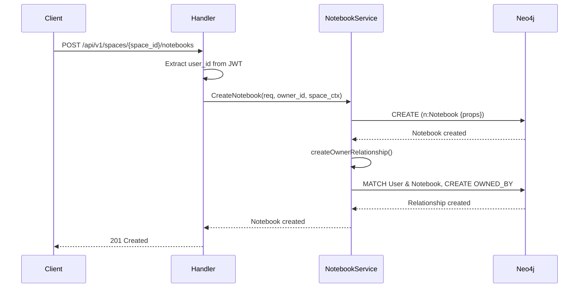
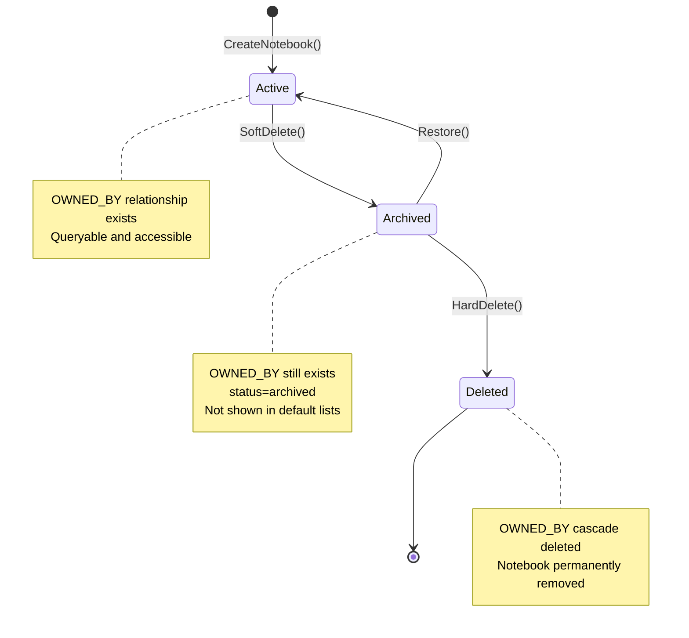
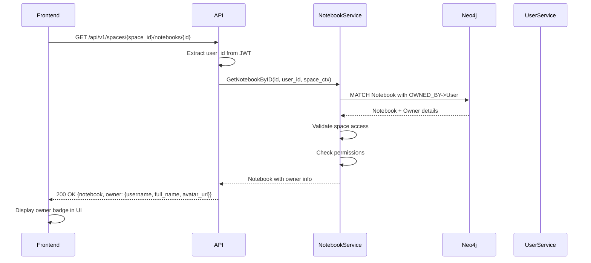

# OWNED_BY Relationship - Aether Backend

---
service: aether-be
model: OWNED_BY (Relationship)
database: Neo4j
version: 1.0
last_updated: 2026-01-05
author: TAS Platform Team
---

## 1. Overview

**Purpose**: The OWNED_BY relationship establishes ownership between Notebooks and Users in the Neo4j graph database. This relationship defines who created and controls a notebook, forming the foundation for permission inheritance and access control.

**Lifecycle**:
- **Created**: When a notebook is created (automatically during `CreateNotebook`)
- **Updated**: Never modified once created (immutable ownership)
- **Deleted**: When the notebook is permanently deleted (cascade delete)

**Ownership**: Aether Backend service

**Key Characteristics**:
- Immutable relationship (owner cannot be changed after creation)
- One-to-many cardinality (User can own many Notebooks, Notebook has one owner)
- Critical for permission resolution and access control
- Enables efficient "list my notebooks" queries
- Supports multi-tenancy isolation via tenant_id validation
- No relationship properties (simple directional edge)

---

## 2. Schema Definition

### Neo4j Relationship Pattern

```cypher
(notebook:Notebook)-[:OWNED_BY]->(user:User)
```

### Direction and Cardinality

| From Node | Relationship | To Node | Cardinality | Description |
|-----------|--------------|---------|-------------|-------------|
| `Notebook` | `OWNED_BY` | `User` | N:1 | Many notebooks owned by one user |
| `User` | (inverse) | `Notebook` | 1:N | One user owns many notebooks |

### Relationship Properties

**None** - This is a simple directional relationship with no properties.

The relationship type itself (`OWNED_BY`) conveys all necessary information. Additional ownership metadata (like creation timestamp) is stored on the Notebook node itself.

### Constraints

- **Uniqueness**: Each Notebook must have exactly ONE OWNED_BY relationship
- **Existence**: Both source (Notebook) and target (User) nodes must exist
- **Immutability**: Once created, the relationship cannot be modified (owner cannot be changed)
- **Tenant Isolation**: Related nodes must belong to the same tenant_id

---

## 3. Relationships

### Pattern Visualization

```cypher
// Basic ownership pattern
(n:Notebook {id: "abc-123"})-[:OWNED_BY]->(u:User {id: "user-456"})

// Complete ownership hierarchy
(u:User {id: "user-1"})
  <-[:OWNED_BY]-(n1:Notebook {name: "Personal Projects"})
    <-[:PARENT_OF]-(n2:Notebook {name: "2024 Projects"})
      <-[:PARENT_OF]-(n3:Notebook {name: "Q1 Projects"})

// All child notebooks share the same owner via OWNED_BY relationships
(n1)-[:OWNED_BY]->(u)
(n2)-[:OWNED_BY]->(u)
(n3)-[:OWNED_BY]->(u)
```

### Related Relationships

| Relationship | Pattern | Purpose | Notes |
|--------------|---------|---------|-------|
| `PARENT_OF` | `(parent:Notebook)-[:PARENT_OF]->(child:Notebook)` | Hierarchical nesting | Child inherits parent's owner |
| `CONTAINS` | `(notebook:Notebook)-[:CONTAINS]->(doc:Document)` | Document containment | Documents inherit notebook's permissions |
| `MEMBER_OF` | `(user:User)-[:MEMBER_OF]->(space:Space)` | Space membership | Validates user can create notebooks in space |
| `COLLABORATES_ON` | `(user:User)-[:COLLABORATES_ON]->(notebook:Notebook)` | Shared access | Future: non-owner access (not yet implemented) |

---

## 4. Validation Rules

### Business Logic Constraints

- **Rule 1**: User must exist before creating ownership relationship
  - Implementation: `createOwnerRelationship()` in `internal/services/notebook.go:622`
  - Error: Cypher query fails silently if user doesn't exist
  - Validation: User existence verified during authentication

- **Rule 2**: Notebook must exist before creating ownership relationship
  - Implementation: Notebook created before `createOwnerRelationship()` is called
  - Error: Relationship creation fails if notebook not found
  - Side Effect: Logged but doesn't fail overall notebook creation

- **Rule 3**: User and Notebook must belong to same tenant
  - Implementation: Query includes `tenant_id` filter on Notebook node
  - Error: Silent failure if tenant_id mismatch
  - Security: Prevents cross-tenant ownership

- **Rule 4**: Ownership is immutable after creation
  - Implementation: No update method exists for OWNED_BY relationship
  - Enforcement: Application-level constraint
  - Rationale: Ownership transfer not supported in current design

### Data Integrity

- Both User and Notebook nodes must exist before relationship creation
- Tenant isolation enforced at query level
- No circular ownership possible (User cannot own User)
- Relationship automatically deleted when Notebook is hard-deleted

---

## 5. Lifecycle & State Transitions

### Creation Flow



### Deletion Flow



---

## 6. Examples

### Creating OWNED_BY Relationship

**During Notebook Creation (Go Code)**:
```go
// From internal/services/notebook.go:137
func (s *NotebookService) createOwnerRelationship(
    ctx context.Context,
    userID,
    notebookID string,
    tenantID string,
) error {
    query := `
        MATCH (user:User {id: $user_id}),
              (notebook:Notebook {id: $notebook_id, tenant_id: $tenant_id})
        CREATE (notebook)-[:OWNED_BY]->(user)
    `

    params := map[string]interface{}{
        "user_id":     userID,
        "notebook_id": notebookID,
        "tenant_id":   tenantID,
    }

    _, err := s.neo4j.ExecuteQueryWithLogging(ctx, query, params)
    return err
}
```

**Direct Cypher**:
```cypher
-- Create ownership relationship
MATCH (user:User {id: 'user-123'}),
      (notebook:Notebook {id: 'notebook-456', tenant_id: 'tenant_1767395606'})
CREATE (notebook)-[:OWNED_BY]->(user)
```

### Querying with OWNED_BY

**Get Notebook with Owner Information**:
```cypher
-- From internal/services/notebook.go:155
MATCH (n:Notebook {id: $notebook_id, tenant_id: $tenant_id})
OPTIONAL MATCH (n)-[:OWNED_BY]->(owner:User)
RETURN n.id, n.name, n.description, n.visibility, n.status, n.owner_id,
       n.space_type, n.space_id, n.tenant_id, n.parent_id, n.team_id,
       n.compliance_settings, n.document_count, n.total_size_bytes,
       n.tags, n.search_text, n.created_at, n.updated_at,
       owner.username, owner.full_name, owner.avatar_url
```

**List All Notebooks Owned by User**:
```cypher
-- Find all active notebooks owned by a user
MATCH (user:User {id: $user_id})
       <-[:OWNED_BY]-(notebook:Notebook)
WHERE notebook.status = 'active'
  AND notebook.tenant_id = $tenant_id
  AND notebook.space_id = $space_id
RETURN notebook
ORDER BY notebook.updated_at DESC
```

**List Notebooks in Space with Owner Details**:
```cypher
-- From internal/services/notebook.go:338
MATCH (n:Notebook)
WHERE n.status = 'active'
    AND n.tenant_id = $tenant_id
    AND n.space_id = $space_id
OPTIONAL MATCH (n)-[:OWNED_BY]->(owner:User)
RETURN n.id, n.name, n.description, n.visibility, n.status, n.owner_id,
       n.space_type, n.space_id, n.tenant_id, n.parent_id, n.team_id,
       n.compliance_settings, n.document_count, n.total_size_bytes,
       n.tags, n.created_at, n.updated_at,
       owner.username, owner.full_name, owner.avatar_url
ORDER BY n.updated_at DESC
SKIP $offset
LIMIT $limit
```

**Verify Ownership (Permission Check)**:
```cypher
-- Check if user owns a notebook
MATCH (user:User {id: $user_id})<-[:OWNED_BY]-(notebook:Notebook {id: $notebook_id})
WHERE notebook.tenant_id = $tenant_id
RETURN count(notebook) > 0 AS is_owner
```

**Count User's Notebooks**:
```cypher
-- Count notebooks owned by user in specific space
MATCH (user:User {id: $user_id})<-[:OWNED_BY]-(notebook:Notebook)
WHERE notebook.status = 'active'
  AND notebook.tenant_id = $tenant_id
  AND notebook.space_id = $space_id
RETURN count(notebook) AS notebook_count
```

### Deleting OWNED_BY Relationship

**Soft Delete (Archive) - Relationship Preserved**:
```cypher
-- Archive notebook (OWNED_BY remains)
MATCH (n:Notebook {id: $notebook_id, tenant_id: $tenant_id})
SET n.status = 'archived', n.updated_at = datetime()
RETURN n
```

**Hard Delete - Cascade Delete Relationship**:
```cypher
-- Permanently delete notebook and all relationships
MATCH (n:Notebook {id: $notebook_id, tenant_id: $tenant_id})
OPTIONAL MATCH (n)-[r:OWNED_BY]->()
DETACH DELETE n, r
```

---

## 7. Cross-Service References

### Services That Use This Relationship

| Service | Purpose | Access Pattern | Notes |
|---------|---------|----------------|-------|
| **Aether Backend** | Primary owner | Read/Write | Creates, queries, and manages ownership |
| **Aether Frontend** | Display owner info | Read (via API) | Shows notebook owner name/avatar in UI |
| **TAS Agent Builder** | Permission validation | Read (future) | Validate user can create agents from notebook |

### ID Mapping

| This Service | Other Service | Mapping | Notes |
|--------------|---------------|---------|-------|
| `notebook.owner_id` | `user.id` | Direct UUID | Stored as property on Notebook node |
| `OWNED_BY target` | `user.keycloak_id` | Indirect | User node linked to Keycloak via keycloak_id |

### Data Flow



---

## 8. Tenant & Space Isolation

### Multi-Tenancy Enforcement

**Tenant Isolation**:
```cypher
-- CORRECT: Always include tenant_id filter
MATCH (user:User {id: $user_id})
      <-[:OWNED_BY]-(notebook:Notebook {tenant_id: $tenant_id})
WHERE notebook.status = 'active'
RETURN notebook

-- INCORRECT: Missing tenant_id (security risk!)
MATCH (user:User {id: $user_id})<-[:OWNED_BY]-(notebook:Notebook)
RETURN notebook  -- Could expose notebooks from other tenants!
```

**Space Isolation**:
```cypher
-- Notebooks filtered by both tenant AND space
MATCH (user:User {id: $user_id})
      <-[:OWNED_BY]-(notebook:Notebook)
WHERE notebook.tenant_id = $tenant_id
  AND notebook.space_id = $space_id
  AND notebook.status = 'active'
RETURN notebook
```

### Validation Checklist

- ✅ All OWNED_BY queries MUST filter by `tenant_id` on Notebook node
- ✅ Ownership creation MUST validate User and Notebook in same tenant
- ✅ Space-scoped queries MUST include both `tenant_id` AND `space_id`
- ✅ Never expose ownership across tenant boundaries
- ✅ Permission checks MUST validate space membership before ownership check

---

## 9. Performance Considerations

### Indexes for Performance

**Relationship Traversal**:
```cypher
-- Index on relationship property (if we had any)
-- Currently no properties, so no index needed on relationship itself

-- Indexes on nodes for efficient ownership lookups
CREATE INDEX IF NOT EXISTS FOR (n:Notebook) ON (n.owner_id);
CREATE INDEX IF NOT EXISTS FOR (n:Notebook) ON (n.tenant_id, n.owner_id);
CREATE INDEX IF NOT EXISTS FOR (n:Notebook) ON (n.space_id, n.owner_id);
```

**Performance Recommendations**:
```cypher
-- From BACKEND-DESIGN.md:521
CREATE INDEX FOR ()-[r:OWNED_BY]-() ON (r.created_at);
-- Note: Not implemented yet since relationship has no properties
```

### Query Optimization Tips

- **Use OPTIONAL MATCH for owner details**: Prevents query failure if relationship missing
- **Index on owner_id**: Enables fast "list my notebooks" queries
- **Composite indexes**: `(tenant_id, owner_id, status)` for common query patterns
- **Limit result sets**: Always use `LIMIT` and `SKIP` for pagination
- **Avoid redundant joins**: owner_id already stored on Notebook node

### Caching Strategy

**Redis Cache for Ownership Lookups**:
- **Cache Key**: `notebook:{notebook_id}:owner`
- **TTL**: 15 minutes
- **Invalidation**: On notebook deletion or user profile update
- **Value**: Owner user details (username, full_name, avatar_url)

**Example Caching Pattern**:
```go
// Try cache first for owner details
cacheKey := fmt.Sprintf("notebook:%s:owner", notebookID)
cached, err := redis.Get(ctx, cacheKey).Result()
if err == nil {
    // Cache hit - skip OWNED_BY traversal
    json.Unmarshal([]byte(cached), &ownerDetails)
    return ownerDetails, nil
}

// Cache miss - query with OWNED_BY relationship
result := neo4j.Query("MATCH (n)-[:OWNED_BY]->(u) WHERE n.id = $id RETURN u")

// Cache result
redis.Set(ctx, cacheKey, ownerJSON, 15*time.Minute)
```

---

## 10. Security & Compliance

### Access Control

**Create Ownership**:
- User must be authenticated (valid JWT)
- User must have `CanCreate()` permission in target space
- User must be member of space (validated via SpaceContext)
- Tenant must be active

**Query Ownership**:
- Authenticated users can query their own notebooks
- Users can see ownership of notebooks shared/public in their spaces
- Cross-tenant ownership queries are blocked

**Modify Ownership**:
- **NOT SUPPORTED** - Ownership is immutable
- Transfer ownership would require deleting old OWNED_BY and creating new one
- Future feature: Ownership transfer with audit logging

**Delete Ownership**:
- Only notebook owner can soft-delete (archive) notebook
- Hard delete requires admin privileges or automated cleanup job
- Cascade delete removes OWNED_BY relationship

### Audit Logging

**Events Logged**:
- `NOTEBOOK_CREATED` - Ownership established
- `NOTEBOOK_OWNERSHIP_QUERIED` - Who queried ownership info
- `NOTEBOOK_DELETED` - Ownership terminated
- `PERMISSION_DENIED` - Failed ownership validation

**Audit Fields** (in application logs):
- `user_id` - User performing action
- `notebook_id` - Notebook affected
- `owner_id` - Notebook owner
- `tenant_id` - Tenant context
- `space_id` - Space context
- `action` - Operation attempted
- `result` - Success/failure

### Privacy Considerations

- Owner information (username, full_name) exposed in API responses
- Avatar URLs may reveal user identity
- Compliance with GDPR: User deletion must cascade to ownership records
- Retention policy: Deleted notebooks retain ownership in audit logs

---

## 11. Migration History

### Version 1.0 (2026-01-02)
- Initial OWNED_BY relationship implementation
- Simple directional relationship with no properties
- Implemented in `createOwnerRelationship()` function

### Future Enhancements (Planned)
- Add `created_at` property on relationship for audit trail
- Add `transferred_from` property if ownership transfer is implemented
- Create index on relationship properties for historical queries
- Implement `COLLABORATES_ON` for shared access (non-owner permissions)

---

## 12. Known Issues & Limitations

**Issue 1**: Silent failure if user or notebook doesn't exist
- **Description**: `createOwnerRelationship()` logs error but doesn't fail notebook creation
- **Workaround**: Application validates user existence before calling
- **Impact**: Could create "orphaned" notebooks without ownership
- **Future**: Make ownership creation transactional with notebook creation

**Issue 2**: No relationship properties for audit trail
- **Description**: No `created_at` or `created_by` on relationship itself
- **Workaround**: Timestamp stored on Notebook node (`created_at`)
- **Impact**: Cannot audit ownership history directly from relationship
- **Future**: Add minimal metadata to relationship (created_at minimum)

**Limitation 1**: Ownership cannot be transferred
- **Description**: No mechanism to change notebook owner after creation
- **Impact**: Users cannot gift/transfer notebooks to other users
- **Future**: Implement ownership transfer with audit logging

**Limitation 2**: No composite owner (multiple owners)
- **Description**: Exactly one OWNED_BY relationship per notebook
- **Impact**: Cannot have co-owners or shared ownership
- **Future**: Use COLLABORATES_ON with `role=co-owner` for this use case

**Limitation 3**: Relationship not indexed
- **Description**: No index on OWNED_BY relationship itself (only on nodes)
- **Impact**: Reverse traversal (User->Notebooks) may be slower for users with many notebooks
- **Future**: Add relationship index if performance issues arise

---

## 13. Related Documentation

- [User Node](../nodes/user.md)
- [Notebook Node](../nodes/notebook.md)
- [PARENT_OF Relationship](./parent-of.md) - Notebook hierarchy
- [CONTAINS Relationship](./contains.md) - Document containment
- [MEMBER_OF Relationship](./member-of.md) - Space membership
- [Space Node](../nodes/space.md) - Space-based multi-tenancy
- [Permission Model](../permissions/permission-model.md) - Access control
- [Cross-Service Data Flows](../../cross-service/flows/notebook-lifecycle.md)

---

## 14. Changelog

| Date | Version | Author | Changes |
|------|---------|--------|---------|
| 2026-01-02 | 1.0 | TAS Team | Initial OWNED_BY relationship implementation |
| 2026-01-05 | - | TAS Team | Created comprehensive documentation |

---

**Maintained by**: TAS Platform Team
**Last Reviewed**: 2026-01-05
**Next Review**: 2026-01-19
