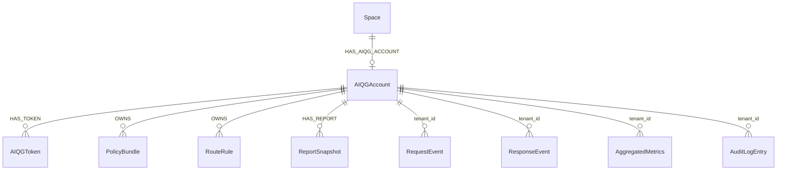
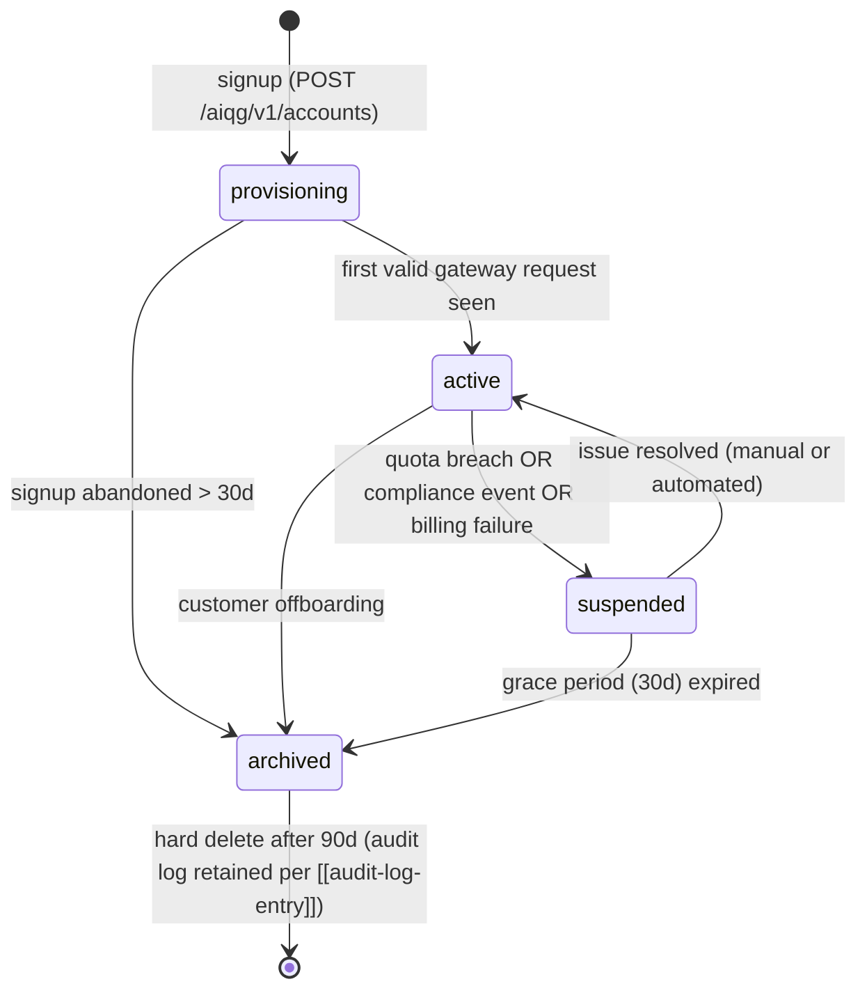

# AIQG Account Node

---

**Metadata**

```yaml
service: aiqg-dashboard-be
model: AIQGAccount
database: Neo4j
node_label: AIQGAccount
version: 1.0.0
last_updated: 2026-05-31
status: planned (new node label; non-breaking addition)
spec_refs: source-spec-v0.2.md §3.1, §3.2, §3.11, §4.1, §4.2, §5
plan_ref: build-vs-reuse.md §4.2, §7.5
```

---

## 1. Overview

### Purpose
The `AIQGAccount` node is the **AI Quality Gateway tenant root**. It owns gateway configuration that is orthogonal to (but bound 1:1 with) an existing TAS `Space`: customer-facing identity, data-handling preferences, scoring configuration, and quota envelopes. All AIQG events, policy bundles, route rules, reports, and audit log entries hang off the account by `tenant_id`.

### Ownership
- **Owning service**: `aiqg-dashboard-be` (CRUD)
- **Read-only consumers**: `tas-llm-router` (validates `tas_qg_live_*` tokens; resolves account-default policy and retention settings); `tas-spark-jobs/aiqg_aggregator` (partitions aggregates by `tenant_id`); `aiqg-ui` (settings, reports)

### Lifecycle Summary
Created at sign-up (spec §4.1), enters `provisioning` while Kafka topics / TimescaleDB partitions / quickstart token are wired up, transitions to `active` on first valid gateway request, may be `suspended` (quota or compliance event), and finally `archived` on customer offboarding. Soft-delete only — raw data retention obligations are honored from the `[[audit-log-entry]]` stream.

### Key Characteristics
- **1:1 with `Space`** via shared `tenant_id` (no new properties on `Space`)
- **Path-A friendly** — no vendor API keys stored on the account; auth tokens live in `[[token]]` nodes (referenced, not embedded)
- **Region-pinned** at sign-up (spec §3.11); regional residency is enforced at the data plane
- **PII tokenization on by default** via Databunker (spec §3.11)
- **Equal-weight CLEAR composite** by default (build-vs-reuse §7.5); `scoring_weights` reserved for Phase-2 customizable weighting
- **Non-breaking**: new label + new relationship `(:Space)-[:HAS_AIQG_ACCOUNT]->(:AIQGAccount)`; the `Space` node schema is unchanged

---

## 2. Schema Definition

### Storage
- **Database**: Neo4j (same instance as `aether-be` — `neo4j.aether-be.svc.cluster.local:7687`)
- **Label**: `AIQGAccount`
- **Migration impact**: additive only — no existing label, property, or relationship is modified

### Properties

#### Core Identity

| Property | Type | Required | Default | Description |
|---|---|---|---|---|
| `id` | UUID string | Yes | generated | Primary key (`acc_<ulid>` format recommended) |
| `tenant_id` | UUID string | Yes | from `Space.tenant_id` | The Space tenant_id this account is bound to (1:1, unique) |
| `display_name` | string | No | `null` | Customer-facing label shown in the dashboard header |
| `status` | enum | Yes | `provisioning` | One of `provisioning`, `active`, `suspended`, `archived` |

#### Data Plane / Compliance

| Property | Type | Required | Default | Description |
|---|---|---|---|---|
| `processing_region` | enum | Yes | from sign-up | One of `us-east`, `us-west`, `eu` (spec §3.11). Immutable after `active`. |
| `payload_retention_mode` | enum | Yes | `off` | One of `off`, `sampled`, `full` (spec §3.11) |
| `payload_retention_days` | int | Yes | `7` | Retention window for retained payloads. Range 1-90. |
| `pii_tokenization_enabled` | bool | Yes | `true` | When true, Databunker tokenizes PII before any payload persistence |

#### Scoring

| Property | Type | Required | Default | Description |
|---|---|---|---|---|
| `scoring_weights` | JSON (map<string,float>) | No | `null` (equal-weight 0.2 each) | Per-dimension CLEAR weights `{cost, latency, efficacy, assurance, reliability}`. Must sum to 1.0 when set. Customer-tunable per build-vs-reuse §7.5 (Phase 2). |
| `scoring_version` | string | Yes | current pinned version | The CLEAR formula version active for this account (e.g., `clear-v1.0.0`). Pinned at account level so historical reports remain reproducible. |

#### Quotas

| Property | Type | Required | Default | Description |
|---|---|---|---|---|
| `quota_requests_per_minute` | int | No | `null` (unlimited) | Per-minute soft rate limit. `null` means no limit. |
| `quota_monthly_request_count` | int | No | `null` (unlimited) | Monthly request budget. `null` means no limit. |

#### Attribution

| Property | Type | Required | Default | Description |
|---|---|---|---|---|
| `signup_source` | string | No | `null` | GTM attribution channel (`landing_page`, `partner_referral`, `direct`, etc.) |

#### Timestamps (ISO-8601 UTC)

| Property | Type | Required | Default | Description |
|---|---|---|---|---|
| `created_at` | datetime | Yes | now | Account record creation time |
| `updated_at` | datetime | Yes | now | Last mutation timestamp |
| `activated_at` | datetime | No | `null` | Set when status first transitions to `active` |
| `archived_at` | datetime | No | `null` | Set when status transitions to `archived` |

### Constraints & Indexes

```cypher
// Uniqueness
CREATE CONSTRAINT aiqg_account_id_unique IF NOT EXISTS
  FOR (a:AIQGAccount) REQUIRE a.id IS UNIQUE;

CREATE CONSTRAINT aiqg_account_tenant_id_unique IF NOT EXISTS
  FOR (a:AIQGAccount) REQUIRE a.tenant_id IS UNIQUE;

// Lookups
CREATE INDEX aiqg_account_status IF NOT EXISTS
  FOR (a:AIQGAccount) ON (a.status);

CREATE INDEX aiqg_account_region IF NOT EXISTS
  FOR (a:AIQGAccount) ON (a.processing_region);
```

---

## 3. Relationships

### Outgoing

#### `(:Space)-[:HAS_AIQG_ACCOUNT]->(:AIQGAccount)`
**Purpose**: 1:1 binding of an existing TAS Space to its AIQG configuration.

**Properties**: none.

**Cardinality**: 1:1 (a Space has at most one AIQGAccount; an AIQGAccount belongs to exactly one Space).

**Important**: The relationship is the **only** new edge — no properties are added to `Space`. Existing Space callers are unaffected.

#### `(:AIQGAccount)-[:HAS_TOKEN]->(:AIQGToken)`
**Purpose**: Associates customer-facing gateway tokens (`tas_qg_live_*`) with the account. Token storage details are out of scope for this doc — see `[[token]]`.

**Cardinality**: 1:N (an account may rotate tokens; old tokens are retained for audit).

### Incoming (logical via `tenant_id`)

The following are stored in TimescaleDB / Kafka / Neo4j and join by shared `tenant_id`, not by Neo4j relationship:

| Entity | Store | Joined By |
|---|---|---|
| `[[request-event]]` | Kafka topic `tas.aiqg.request.v1` → TimescaleDB | `tenant_id` |
| `[[response-event]]` | Kafka topic `tas.aiqg.response.v1` → TimescaleDB | `tenant_id` |
| `[[policy-bundle]]` | Neo4j node `PolicyBundle` | `(:AIQGAccount)-[:OWNS]->(:PolicyBundle)` |
| `[[route-rule]]` | Neo4j node `RouteRule` | `(:AIQGAccount)-[:OWNS]->(:RouteRule)` |
| `[[aggregated-metrics]]` | TimescaleDB hypertable | `tenant_id` |
| `[[report-snapshot]]` | Neo4j node `ReportSnapshot` | `(:AIQGAccount)-[:HAS_REPORT]->(:ReportSnapshot)` |
| `[[audit-log-entry]]` | Kafka topic `tas.aiqg.audit.v1` → TimescaleDB | `tenant_id` |

### ERD



---

## 4. Validation Rules

### Field Validation

| Field | Rule |
|---|---|
| `id` | Required, UUID/ULID format, immutable |
| `tenant_id` | Required, UUID format, must reference a `Space.tenant_id`, **unique across AIQGAccount nodes** |
| `display_name` | Optional, 1-100 chars when set |
| `status` | Required, one of `provisioning`, `active`, `suspended`, `archived` |
| `processing_region` | Required, one of `us-east`, `us-west`, `eu`; **immutable after `activated_at` is set** |
| `payload_retention_mode` | Required, one of `off`, `sampled`, `full` |
| `payload_retention_days` | Required when `payload_retention_mode != "off"`, integer in [1, 90] |
| `pii_tokenization_enabled` | Required, boolean |
| `scoring_weights` | Optional; when set, keys must be exactly `{cost, latency, efficacy, assurance, reliability}`, each in [0.0, 1.0], sum must equal 1.0 ± 0.001 |
| `scoring_version` | Required, semver string matching a known CLEAR version |
| `quota_requests_per_minute` | Optional, integer ≥ 1 when set |
| `quota_monthly_request_count` | Optional, integer ≥ 1 when set |
| `signup_source` | Optional, 1-100 chars when set |

### Business Rules

1. **One account per Space**: creation MUST be rejected if `(:Space {tenant_id: $tenant_id})-[:HAS_AIQG_ACCOUNT]->()` already exists.
2. **Region immutability**: once `activated_at` is set, `processing_region` writes are rejected (data residency commitment per spec §3.11).
3. **Scoring weights default**: if `scoring_weights` is null, the scorer in `tas-llm-router/pkg/clear` MUST apply equal weights of 0.2 (build-vs-reuse §7.5).
4. **Retention coherence**: `payload_retention_days` must be ignored (or set to 0) when `payload_retention_mode = off`; the dashboard MUST hide the field unless mode is `sampled` or `full`.
5. **PII tokenization for retained payloads**: if `payload_retention_mode != off`, `pii_tokenization_enabled` MUST be `true`. Setting it to `false` while retention is on is rejected.
6. **Quota semantics**: `null` means unlimited; `0` is invalid (use `null` instead).
7. **Status → timestamp coherence**: transitioning to `active` MUST stamp `activated_at`; transitioning to `archived` MUST stamp `archived_at`. Both stamps are write-once.

---

## 5. Lifecycle & State Transitions

### State Machine



### State Descriptions

| State | Description | Allowed Operations |
|---|---|---|
| `provisioning` | Kafka topics + TimescaleDB partitions being created; quickstart token issued but not yet observed in traffic. | Update region/display_name; rotate tokens; cannot enforce policy yet |
| `active` | Normal operation. `tas-llm-router` accepts requests; events emit to Kafka; reports generate. | All operations |
| `suspended` | Read-only. Inbound gateway requests return `429` (quota) or `402` (billing) per spec §3.5. Existing reports remain queryable. | Read; resolve to `active` via support flow; cannot mutate policy |
| `archived` | Soft-deleted. No new requests accepted (gateway returns `404` to avoid leaking account existence). Aggregated metrics frozen. | Read-only access by tenant admin for 90 days; then purge |

### Transition Triggers

- `provisioning → active`: emitted by `tas-llm-router` on first successful `tas_qg_live_*` validation for this `tenant_id`; consumed by `aiqg-dashboard-be` which stamps `activated_at`
- `active → suspended`: emitted by quota-monitor job (`aiqg-dashboard-be`) on threshold breach, or by compliance reviewer via dashboard
- `* → archived`: emitted by offboarding flow in `aiqg-dashboard-be`

All transitions write an `[[audit-log-entry]]` with the previous state, new state, actor (user or system), and reason.

---

## 6. Examples

### 6.1 Create Account (sign-up)

```cypher
// Caller: aiqg-dashboard-be POST /aiqg/v1/accounts
// Assumes Space already exists for the user (created during Keycloak onboarding)

MATCH (s:Space {tenant_id: $tenant_id})
WHERE NOT (s)-[:HAS_AIQG_ACCOUNT]->()
CREATE (a:AIQGAccount {
  id:                          $id,
  tenant_id:                   $tenant_id,
  display_name:                $display_name,
  status:                      'provisioning',
  processing_region:           $processing_region,
  payload_retention_mode:      'off',
  payload_retention_days:      7,
  pii_tokenization_enabled:    true,
  scoring_weights:             null,
  scoring_version:             $scoring_version,
  quota_requests_per_minute:   null,
  quota_monthly_request_count: null,
  signup_source:               $signup_source,
  created_at:                  datetime(),
  updated_at:                  datetime(),
  activated_at:                null,
  archived_at:                 null
})
CREATE (s)-[:HAS_AIQG_ACCOUNT]->(a)
RETURN a;
```

### 6.2 Activate on First Traffic

```cypher
MATCH (a:AIQGAccount {tenant_id: $tenant_id})
WHERE a.status = 'provisioning'
SET   a.status       = 'active',
      a.activated_at = datetime(),
      a.updated_at   = datetime()
RETURN a;
```

### 6.3 Update Retention Settings

```cypher
MATCH (a:AIQGAccount {tenant_id: $tenant_id})
WHERE a.status IN ['provisioning', 'active']
SET   a.payload_retention_mode    = $mode,         // 'off' | 'sampled' | 'full'
      a.payload_retention_days    = $days,
      a.pii_tokenization_enabled  = $pii_on,
      a.updated_at                = datetime()
RETURN a;
```

### 6.4 Read Account by Token (called from tas-llm-router auth middleware)

```cypher
MATCH (a:AIQGAccount)-[:HAS_TOKEN]->(t:AIQGToken {token_hash: $token_hash})
WHERE t.revoked_at IS NULL
  AND a.status IN ['active', 'provisioning']
RETURN a.tenant_id          AS tenant_id,
       a.processing_region  AS region,
       a.scoring_version    AS scoring_version,
       a.scoring_weights    AS weights,
       a.payload_retention_mode AS retention_mode,
       a.pii_tokenization_enabled AS tokenize_pii;
```

### 6.5 REST — Create Account

```http
POST /aiqg/v1/accounts
Authorization: Bearer <keycloak-jwt>
Content-Type: application/json

{
  "tenant_id":           "tenant_1748736000",
  "display_name":        "Acme Corp - Production",
  "processing_region":   "us-east",
  "signup_source":       "landing_page"
}
```

```http
HTTP/1.1 201 Created
Content-Type: application/json

{
  "id":                          "acc_01HZP3K6Y9Z8M7B6C4F2D1A0E5",
  "tenant_id":                   "tenant_1748736000",
  "display_name":                "Acme Corp - Production",
  "status":                      "provisioning",
  "processing_region":           "us-east",
  "payload_retention_mode":      "off",
  "payload_retention_days":      7,
  "pii_tokenization_enabled":    true,
  "scoring_weights":             null,
  "scoring_version":             "clear-v1.0.0",
  "quota_requests_per_minute":   null,
  "quota_monthly_request_count": null,
  "signup_source":               "landing_page",
  "created_at":                  "2026-05-31T14:00:00Z",
  "updated_at":                  "2026-05-31T14:00:00Z",
  "activated_at":                null,
  "archived_at":                 null
}
```

### 6.6 REST — Patch Scoring Weights (Phase 2)

```http
PATCH /aiqg/v1/accounts/acc_01HZP3K6Y9Z8M7B6C4F2D1A0E5
Authorization: Bearer <keycloak-jwt>
Content-Type: application/json

{
  "scoring_weights": {
    "cost":        0.30,
    "latency":     0.20,
    "efficacy":    0.20,
    "assurance":   0.20,
    "reliability": 0.10
  }
}
```

---

## 7. Cross-Service References

### Service Reads / Writes

| Service | Read | Write | Why |
|---|---|---|---|
| `aiqg-dashboard-be` | yes | yes | CRUD owner; report assembly |
| `tas-llm-router` | yes | no | Token validation + per-request policy / retention / scoring config lookup (cached in Redis 60s) |
| `tas-spark-jobs/aiqg_aggregator` | yes (tenant list, region) | no | Partitions aggregates by `tenant_id`; reads region for residency-aware writes |
| `aiqg-ui` | yes (via dashboard-be) | yes (via dashboard-be) | Settings screen, report viewer |
| `aether-be` | no | no | No coupling; AIQG is orthogonal to Aether workflows |

### ID Mapping Chain

```
Keycloak user_id
    └─> Space.id  (aether-be)
            └─> Space.tenant_id  (existing field, no change)
                    └─> AIQGAccount.tenant_id  (NEW, 1:1)
                            └─> AIQGToken.account_id  (NEW)
                            └─> RequestEvent.tenant_id  (Kafka/Timescale)
                            └─> ResponseEvent.tenant_id (Kafka/Timescale)
                            └─> AggregatedMetrics.tenant_id (Timescale)
                            └─> ReportSnapshot.account_id (Neo4j)
                            └─> AuditLogEntry.tenant_id   (Kafka/Timescale)
```

This appends to `cross-service/mappings/id-mapping-chain.md` (see build-vs-reuse §4.6) without modifying any existing chain.

---

## 8. Tenant & Space Isolation

### Isolation Model

The `AIQGAccount` is the **AIQG tenancy root**. Every AIQG read/write — whether to Neo4j, TimescaleDB, or Kafka — MUST filter by `tenant_id`. Cross-account leakage is the single highest-severity correctness defect for the gateway.

### Isolation Queries

#### Neo4j: list policy bundles for an account
```cypher
MATCH (a:AIQGAccount {tenant_id: $tenant_id})-[:OWNS]->(b:PolicyBundle)
WHERE b.status = 'active'
RETURN b
ORDER BY b.name;
```

#### TimescaleDB: 24h request rollup for an account
```sql
SELECT bucket, request_count, total_cost_usd
FROM   aiqg_metrics_1h
WHERE  tenant_id = $1
  AND  bucket >= NOW() - INTERVAL '24 hours'
ORDER  BY bucket;
```

#### Token-resolved request handling (in tas-llm-router middleware)
```go
// pseudo-code; reads result from §6.4 cypher
account := accountCache.GetByTokenHash(req.Header.Get("TAS-Auth"))
if account == nil || account.Status == "suspended" {
    return 401
}
ctx = withTenant(ctx, account.TenantID)
ctx = withRegion(ctx, account.Region)
ctx = withScoringConfig(ctx, account.ScoringVersion, account.Weights)
```

### Cross-Region Enforcement

When `processing_region` is `eu`, the gateway request handler MUST reject requests routed to a non-EU pod (returns `451 Unavailable For Legal Reasons` with body explaining residency). Region pinning is enforced at the data-plane ingress, not at the application layer — but the account's `processing_region` is the source of truth.

---

## 9. Performance Considerations

### Read Profile
- **Hot read**: token-hash → account lookup, on every gateway request. Target: <2 ms p99.
- **Warm read**: dashboard "my account" page, ~1 req/page-view.
- **Cold read**: account list for ops; bulk Spark partitioning (daily).

### Caching Strategy

`tas-llm-router` caches resolved account context (the §6.4 projection) in Redis with key `aiqg:account:<token_hash>` and TTL 60s. Cache invalidation events fire from `aiqg-dashboard-be` on:
- Status transitions
- Token revocation
- Retention setting changes
- Scoring weight changes

Invalidation is by `DEL aiqg:account:<token_hash>` for every active token of the mutated account.

### Index Plan

The constraints in §2 cover the two hot paths:
- `id` lookup (admin operations)
- `tenant_id` lookup (every event correlation)

Plus secondary indexes on `status` and `processing_region` for ops queries ("how many active EU accounts?").

### Anti-patterns

- **Do not** scan all `AIQGAccount` nodes per request — always lookup via token hash → token node → account
- **Do not** store vendor API keys on this node — Path A is the default per build-vs-reuse §7.3
- **Do not** put per-request mutable state (counters, last_seen, etc.) on this node — those belong in TimescaleDB

---

## 10. Security & Compliance

### Sensitive Fields

| Field | Sensitivity | Handling |
|---|---|---|
| `tenant_id` | Internal identifier | Not user-facing in URLs; surface `id` instead |
| `display_name` | Customer PII (potentially) | Returned only to authenticated members of the account's Space |
| `scoring_weights` | Business configuration | Returned only to account admins |
| Token hashes | Secret (one-way) | Stored on `[[token]]` nodes, **never** on `AIQGAccount` |

### Access Control

- **Reads / Writes**: gated by Keycloak realm `aether` JWT, plus a Space-membership check via `(:User)-[:MEMBER_OF]->(:Space)-[:HAS_AIQG_ACCOUNT]->(:AIQGAccount)` resolved by `aiqg-dashboard-be` middleware.
- **Admin actions** (status changes, scoring weight changes): require the user to hold the `aiqg-admin` realm role.
- **`tas-llm-router` read**: uses a service account JWT with read-only scope; no write paths.

### Audit

Every mutation MUST emit an `[[audit-log-entry]]` (CloudEvent type `com.tas.aiqg.audit.account.v1`) on topic `tas.aiqg.audit.v1`. The entry records actor, action, before/after diff, timestamp, and source IP.

### Compliance Touchpoints

- **GDPR (data residency)**: enforced via `processing_region` (spec §3.11). EU accounts MUST NOT have events written to a non-EU TimescaleDB partition.
- **GDPR (right to deletion)**: archive flow purges TimescaleDB events at 90d; Kafka topics rely on retention TTL; the account node itself is hard-deleted at 90d.
- **GDPR (data minimization)**: default `payload_retention_mode = off` means no raw request/response payloads are persisted. Only metrics and tags survive past the streaming window.
- **CCPA**: same controls as GDPR; honored via `archive` action.
- **HIPAA / SOC2 / PCI-DSS**: handled at the rule-pack layer (`[[policy-bundle]]`), not at the account layer. The account selects whether tokenization is on; the rule packs determine what gets tagged.

---

## 11. Migration History

### v1.0.0 — 2026-05-31

- Initial schema. New Neo4j label `AIQGAccount`; new relationship `(:Space)-[:HAS_AIQG_ACCOUNT]->(:AIQGAccount)`.
- No changes to any existing label, property, or relationship.
- Migration is forward-only: existing Spaces have no AIQGAccount until the customer signs up for the gateway.
- Index/constraint DDL in §2 is the migration. Idempotent (`IF NOT EXISTS`).

---

## 12. Known Issues & Limitations

1. **Scoring weights are account-global**, not per-workflow or per-route. Per-route weighting is a Phase-3 enhancement; for now operators tune weights at the account level and use route policy to segment traffic.
2. **Region change is immutable post-activation**. Customers who need to move regions today must offboard and re-onboard. A controlled migration tool is deferred to Phase 2.
3. **No multi-account-per-Space yet**. Some customers may want a dev / staging / prod split bound to the same Space; v1 forces one account per Space. Workaround: separate Spaces.
4. **Quota fields are advisory**, not enforced. v1 captures the values but enforcement is left to the gateway's existing rate-limit middleware, which currently treats all accounts equally. Phase 2 wires the account-level limits into the limiter.
5. **`scoring_weights` validation** (sum-to-1.0) is enforced at the dashboard-be layer, not in Neo4j. A direct Cypher write that violates the rule would succeed; this is acceptable because Neo4j writes are restricted to the dashboard service.

---

## 13. Related Documentation

### AIQG Siblings (this directory)

- [[token]] — `tas_qg_live_*` customer-facing tokens issued for this account
- [[request-event]] — per-request capture (joined by `tenant_id`)
- [[response-event]] — per-response capture (joined by `tenant_id`)
- [[policy-bundle]] — named, versioned policy collections owned by this account
- [[route-rule]] — URL/header/source matchers binding traffic to bundles
- [[aggregated-metrics]] — rolled-up CLEAR scores per workflow/route/account
- [[report-snapshot]] — frozen Day-1 and periodic reports
- [[audit-log-entry]] — immutable trail of account / policy / route mutations

### Cross-Service

- [`aether-be/nodes/space.md`](../aether-be/nodes/space.md) — the Space node this account binds to (unchanged)
- [`keycloak/users/user-model.md`](../keycloak/users/user-model.md) — the user identity that owns the Space (optional `aiqg_account_id` attribute documented additively per build-vs-reuse §4.6)
- [`cross-service/mappings/id-mapping-chain.md`](../cross-service/mappings/id-mapping-chain.md) — the platform-wide ID chain, appended (not modified) with the AIQG segment

### Plan & Spec

- [`build-vs-reuse.md`](./build-vs-reuse.md) — master plan; especially §4.2, §7.3, §7.5, §8
- [`source-spec-v0.2.md`](./source-spec-v0.2.md) — AIQG product spec; especially §3.1 (onboarding), §3.2 (Path A auth), §3.11 (privacy), §4 (UI flow), §5 (phasing)

---

## 14. Changelog

| Version | Date | Author | Changes |
|---|---|---|---|
| v1.0.0 | 2026-05-31 | TAS Platform | Initial spec draft. Defines `AIQGAccount` Neo4j label and its 1:1 `HAS_AIQG_ACCOUNT` binding to `Space`. Non-breaking, additive only. |
