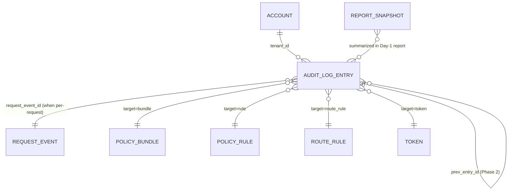

# AIQG Audit Log Entry

---

**Metadata**

```yaml
service: aiqg-dashboard-be (writer of config events) + tas-llm-router (writer of per-request events)
model: AuditLogEntry
database: TimescaleDB (hot) + MinIO/Parquet (cold archive ≥ 90d)
table: aiqg.audit_log
version: 1.0.0
last_updated: 2026-05-31
status: planned (new hypertable; non-breaking addition)
spec_refs: source-spec-v0.2.md §2.4 (Assurance — accountable & transparent), §3.5.2 (dry-run + header override audit), §3.11 (customer-owned exports)
plan_ref: build-vs-reuse.md §2.5 (dry-run), §2.10 (Gatekeeper attestation cache for HMAC signer), §4.5 (Loki sync via Alloy), §7.3 (strict Path A)
```

---

## 1. Overview

### Purpose
The `AuditLogEntry` is the **immutable, append-only record of every policy application, configuration change, and security-relevant event** in the AI Quality Gateway. It implements the "**accountable and transparent**" trustworthiness characteristic of NIST AI RMF (source-spec §2.4) — the gateway must be able to demonstrate, for any moment in the past, exactly which policy was in force, which rule fired on which request, who changed configuration, and which security-sensitive actions occurred. It is the system of record that compliance teams, customer security reviewers, and TAS SREs use to answer "what happened, when, on whose behalf, and under whose authority."

This entry stream also drives the **dashboard "recent activity" panels** (spec §4.4) and the **dry-run review UX** (spec §3.5.2) — before a route rule is flipped from `dry_run` to `enforce`, the operator inspects the count of `policy_dry_run_match` entries that would have applied.

### Ownership
- **Owning service**: `aiqg-dashboard-be` (CRUD on the table; writer for all config-change events; reader for dashboard/exports)
- **Writers**: `tas-llm-router` (writes per-request events `policy_applied`, `policy_dry_run_match`, `policy_blocked_request`, `header_override`, `aiqg_mode_engaged`, `path_a_auth_rejected`, `payload_detokenize_request`); `aiqg-dashboard-be` (writes all config events — bundle/rule/route/account/token lifecycle, exports); `tas-spark-jobs/aiqg_aggregator` (writes nothing — read-only consumer for compliance counters)
- **Read-only consumers**: `aiqg-ui` (dashboard panels, security review screens, dry-run review); `shared-monitoring/alloy` (tails the table for Loki shipping); customer exports (signed-URL Parquet/CSV download via dashboard)

### Lifecycle Summary
Append-only. Rows are **inserted exactly once** at the moment the event occurs and are **never updated, never deleted** (enforced by a database trigger — see §10). Rows live in TimescaleDB hot storage for **90 days**, after which a Spark job archives them to MinIO as Parquet for cheap long-term retention; the hot partition is dropped post-archive. Customer-owned export (spec §3.11) is supported at any time via the dashboard, which emits a signed URL for a zipped CSV/JSON over the requested time window.

### Key Characteristics
- **Append-only**: enforced by `BEFORE UPDATE OR DELETE` trigger that raises an exception; the only privileged path to remove rows is the archive job, which writes Parquet to MinIO first and then drops *whole expired partitions* via `drop_chunks()` (no row-level deletes)
- **Tenant-scoped**: every row carries a non-null `tenant_id`; the reserved id `00000000-0000-0000-0000-000000000000` is the **global tenant** for events that are not tenant-bound (e.g., system-wide config changes by TAS staff)
- **Self-referential**: TAS-staff reads of customer audit logs themselves produce audit entries (`actor_type=system, event_type=audit_read` — see §10)
- **Hash-chained in Phase 2**: `prev_entry_id` + `signature` reserved for the MVP (nullable); Phase 2 reuses Gatekeeper's `pkg/attest/signer.go` HMAC signer (build-vs-reuse §2.10)
- **Loki-mirrored**: Alloy tails the table and ships entries to Loki for SRE visibility (build-vs-reuse §4.5); Loki is convenience, not source of truth
- **Customer-owned**: customers may export their own audit log on demand (spec §3.11); zero lock-in

---

## 2. Schema Definition

### Storage
- **Database**: TimescaleDB (same shared Postgres cluster as the rest of `aiqg.*`; `postgres-shared.tas-shared.svc.cluster.local:5432`)
- **Hypertable**: `aiqg.audit_log`, partitioned on `at` (time dimension; default chunk interval 1 day)
- **Cold archive**: MinIO bucket `aiqg-audit-archive`, Parquet, partitioned by `tenant_id=<uuid>/year=<yyyy>/month=<mm>/` (Hive-compatible for Spark / Athena query)
- **Migration impact**: additive only — new schema (`aiqg`) and new hypertable; no existing table is modified

### Properties

#### Identity & Time
| Field | Type | Required | Notes |
|---|---|---|---|
| `entry_id` | `uuid` | yes | Generated by writer (`gen_random_uuid()`); component of the composite primary key |
| `at` | `timestamptz` | yes | Microsecond precision; partition column; component of the composite primary key (TimescaleDB requires the partition column to be part of any unique constraint on a hypertable) |

#### Tenant
| Field | Type | Required | Notes |
|---|---|---|---|
| `tenant_id` | `uuid` | yes (NOT NULL) | Shared `tenant_id` with `[[account]]`. **Reserved value** `00000000-0000-0000-0000-000000000000` denotes the global / system tenant; used for cross-cutting events with no specific customer scope (TAS-staff config changes, platform-wide policy migrations, etc.) |

#### Actor
| Field | Type | Required | Notes |
|---|---|---|---|
| `actor_type` | `enum` | yes | One of `user`, `system`, `customer_application` |
| `actor_id` | `text` | yes | Keycloak user uuid for `user`; component name (e.g., `tas-llm-router@v1.4.2`) for `system`; TAS-Auth token id (`tok_*` — see `[[token]]`) for `customer_application` |

#### Event
| Field | Type | Required | Notes |
|---|---|---|---|
| `event_type` | `enum` | yes | See enum table below |
| `request_event_id` | `uuid` | conditional | Required for per-request event types (`policy_applied`, `policy_dry_run_match`, `policy_blocked_request`, `header_override`, `aiqg_mode_engaged`, `path_a_auth_rejected`, `payload_detokenize_request`); null for config-change events |
| `target_resource_type` | `enum` | yes | One of `bundle`, `rule`, `route_rule`, `account`, `token`, `request`, `payload`, `export` |
| `target_resource_id` | `text` | yes | Stable id of the affected resource (e.g., `bun_a1b2c3`, `tok_x9y8`, `req_<uuid>`) |
| `details` | `jsonb` | yes | Event-type-specific payload (see §2.x below); schema validated at the writer by a Go struct per event_type |
| `severity` | `enum` | yes | `info`, `warn`, `critical`. `critical` reserved for security-relevant events: `payload_detokenize_request`, `path_a_auth_rejected`, `policy_blocked_request`, `token_revoked`, any `actor_type=system, event_type=audit_read` |

#### Tamper Evidence (Phase 2 — nullable in MVP)
| Field | Type | Required | Notes |
|---|---|---|---|
| `prev_entry_id` | `uuid` | no | Phase 2: pointer to previous entry in the **per-tenant** hash chain (null at MVP and for the chain head) |
| `signature` | `text` | no | Phase 2: HMAC-SHA256 over `entry_id ‖ tenant_id ‖ at ‖ actor_type ‖ actor_id ‖ event_type ‖ target_resource_type ‖ target_resource_id ‖ details ‖ prev_entry_id`; key managed by Gatekeeper's `pkg/attest/signer.go` (build-vs-reuse §2.10) |

#### `event_type` enum
| Value | Per-request | Severity (typ.) | Meaning |
|---|---|---|---|
| `policy_applied` | yes | info | A route rule matched and a bundle was applied to a request |
| `policy_dry_run_match` | yes | info | Would-have-applied in `dry_run` mode (drives §3.5.2 dry-run review) |
| `policy_blocked_request` | yes | critical | A `rule_type=block` rule fired; request was refused |
| `header_override` | yes | warn | Request used a `TAS-Policy*` header instead of route resolution (spec §3.5.2 — surfaced for platform-team review) |
| `aiqg_mode_engaged` | yes | info | Request entered AIQG mode (per build-vs-reuse §7.3); useful for reconciliation against `[[request-event]]` |
| `path_a_auth_rejected` | yes | critical | Request hit the AIQG ingress without `TAS-Auth` + `Authorization` headers (build-vs-reuse §7.3 strict Path A) |
| `payload_detokenize_request` | yes | critical | An authorized user retrieved an original PII value via Databunker |
| `bundle_created` | no | info | A new `[[policy-bundle]]` was created |
| `bundle_activated` | no | warn | A bundle version became the active version for one or more route rules |
| `bundle_deprecated` | no | info | A bundle version was deprecated (no longer activatable) |
| `rule_created` | no | info | A new `[[policy-rule]]` was created |
| `rule_updated_via_clone` | no | info | A rule was "updated" (rules are versioned, not edited in place — this records the clone-and-supersede operation) |
| `route_rule_created` | no | info | A new `[[route-rule]]` was created |
| `route_rule_mode_changed` | no | warn | A route rule's mode changed (e.g., `dry_run` → `enforce`) |
| `account_provisioned` | no | info | An `[[account]]` was created and provisioning completed |
| `account_settings_changed` | no | warn | An account-level setting (retention, region, scoring weights, quotas) was changed |
| `token_issued` | no | info | A new `[[token]]` was minted |
| `token_revoked` | no | critical | A token was revoked (compromise, rotation, offboarding) |
| `export_generated` | no | info | A customer-owned export was generated (spec §3.11) |
| `audit_read` | no | critical | A TAS-staff read of audit data occurred (self-referential — see §10) |

#### `details` payload schemas (per `event_type`)
Validated at the writer via a Go struct per event_type (marshalled to `jsonb`). Representative schemas:

```jsonc
// policy_applied / policy_dry_run_match / policy_blocked_request
{
  "bundle_id": "bun_a1b2c3",
  "bundle_version": "1.4.0",
  "matched_rule_ids": ["rul_pii_email", "rul_jail_v2"],
  "applied_actions": ["tag:pii.email", "redact", "tag:nist.privacy_enhanced"],
  "dry_run": false                       // mirrors the event_type; redundant but cheap to filter on
}

// header_override
{
  "header": "TAS-Policy",                // or TAS-Policy-Bundle, TAS-Workflow, TAS-Dry-Run
  "value": "pci_compliance@1.3.0",
  "resolved_bundle": "pci_compliance",
  "resolved_version": "1.3.0",
  "route_would_have_resolved": "production_strict@2.0.1"   // surfaces the override delta
}

// bundle_activated
{
  "old_version": "1.3.0",
  "new_version": "1.4.0",
  "changed_rules": ["rul_pii_email:added", "rul_jail_v1:removed", "rul_jail_v2:added"]
}

// payload_detokenize_request
{
  "pii_type": "email",
  "request_event_id": "req_5f...",       // also denormalized to the column for indexability
  "requestor_reason": "GDPR Article 15 access request — case #INC-44213"
}

// path_a_auth_rejected
{
  "missing_headers": ["TAS-Auth", "Authorization"],
  "remote_addr": "203.0.113.7",
  "user_agent": "curl/8.4.0",
  "endpoint": "/v1/chat/completions"
}

// audit_read (self-referential)
{
  "queried_window": {"from": "2026-05-01T00:00:00Z", "to": "2026-05-31T23:59:59Z"},
  "queried_tenant_id": "1f8e...",
  "query_purpose": "customer-support ticket #SUP-9921",
  "row_count_returned": 1842
}
```

### Constraints & Indexes
```sql
CREATE SCHEMA IF NOT EXISTS aiqg;

CREATE TABLE aiqg.audit_log (
    entry_id              uuid          NOT NULL DEFAULT gen_random_uuid(),
    at                    timestamptz   NOT NULL,                     -- µs precision
    tenant_id             uuid          NOT NULL,                     -- 00..00 reserved for global
    actor_type            text          NOT NULL CHECK (actor_type IN ('user','system','customer_application')),
    actor_id              text          NOT NULL,
    event_type            text          NOT NULL,                     -- enum constrained via CHECK / domain
    request_event_id      uuid          NULL,
    target_resource_type  text          NOT NULL CHECK (target_resource_type IN ('bundle','rule','route_rule','account','token','request','payload','export')),
    target_resource_id    text          NOT NULL,
    details               jsonb         NOT NULL,
    severity              text          NOT NULL CHECK (severity IN ('info','warn','critical')),
    prev_entry_id         uuid          NULL,                         -- Phase 2
    signature             text          NULL,                         -- Phase 2
    PRIMARY KEY (tenant_id, at, entry_id)                              -- partition column included for TimescaleDB
);

SELECT create_hypertable('aiqg.audit_log', 'at',
    chunk_time_interval => INTERVAL '1 day',
    if_not_exists       => TRUE);

-- Required by per-request event types
ALTER TABLE aiqg.audit_log
    ADD CONSTRAINT audit_log_request_id_required
    CHECK (
        (event_type IN ('policy_applied','policy_dry_run_match','policy_blocked_request',
                        'header_override','aiqg_mode_engaged','path_a_auth_rejected',
                        'payload_detokenize_request')
         AND request_event_id IS NOT NULL)
        OR
        (event_type NOT IN ('policy_applied','policy_dry_run_match','policy_blocked_request',
                            'header_override','aiqg_mode_engaged','path_a_auth_rejected',
                            'payload_detokenize_request'))
    );

-- Core access pattern: tenant timeline, newest first
CREATE INDEX audit_log_tenant_at_desc ON aiqg.audit_log (tenant_id, at DESC);

-- Security dashboards
CREATE INDEX audit_log_critical_partial
    ON aiqg.audit_log (tenant_id, at DESC)
    WHERE severity = 'critical';

-- Compliance reviews of header escape-hatch usage
CREATE INDEX audit_log_header_override_partial
    ON aiqg.audit_log (tenant_id, at DESC)
    WHERE event_type = 'header_override';

-- Dry-run review (drives the "flip to enforce" gate in §3.5.2)
CREATE INDEX audit_log_dry_run_partial
    ON aiqg.audit_log (tenant_id, at DESC, ((details->>'bundle_id')))
    WHERE event_type = 'policy_dry_run_match';

-- Lookup by request_event_id (forensics / audit reconciliation)
CREATE INDEX audit_log_req_id ON aiqg.audit_log (request_event_id) WHERE request_event_id IS NOT NULL;
```

---

## 3. Relationships

### Logical (cross-store, by id)
- `audit_log.tenant_id` → `[[account]].tenant_id` (1:N, every entry belongs to an account or the global tenant)
- `audit_log.request_event_id` → `[[request-event]].request_event_id` (1:1 per per-request entry; multiple entries may reference the same request — e.g., a `policy_applied` and a `payload_detokenize_request` later)
- `audit_log.target_resource_id` → polymorphic via `target_resource_type`:
  - `bundle` → `[[policy-bundle]].bundle_id`
  - `rule` → `[[policy-rule]].rule_id`
  - `route_rule` → `[[route-rule]].route_rule_id`
  - `account` → `[[account]].tenant_id`
  - `token` → `[[token]].token_id`
  - `request` → `[[request-event]].request_event_id`
  - `payload` → MinIO object key (when payloads are retained per `[[account]].payload_retention`)
  - `export` → export job id (issued by aiqg-dashboard-be)
- `audit_log.prev_entry_id` → `audit_log.entry_id` (Phase 2; per-tenant chain — see §10)
- `[[report-snapshot]]` consumes audit summaries for the Day-1 report's "config changes" and "security events" sections

### ERD (excerpt)


---

## 4. Validation Rules

### Field Validation (writer-side, before insert)
- `tenant_id` is non-null; for cross-tenant TAS-staff events, use the reserved global tenant id (`00000000-0000-0000-0000-000000000000`)
- `at` is set by the writer with microsecond precision (`time.Now().UTC()`); reject writes where `|at - now()| > 5min` (clock skew protection)
- `actor_type` and `actor_id` are jointly consistent:
  - `actor_type=user` → `actor_id` is a Keycloak user uuid (matches `^[0-9a-f-]{36}$`)
  - `actor_type=system` → `actor_id` matches `^[a-z0-9-]+(@[a-z0-9.\-]+)?$` (component name optionally with version)
  - `actor_type=customer_application` → `actor_id` matches `^tok_[A-Za-z0-9]+$`
- `request_event_id` is **required** for the seven per-request event types and **forbidden** for all others (DB CHECK constraint)
- `details` is required and must parse against the Go struct registered for the event_type; reject inserts with extra fields when running in `strict_audit_schema=true` (default in prod)
- `severity` defaults per event_type per the table in §2; writers may override only upward (`info` → `warn`, never `warn` → `info`)

### Business Rules
- **No update, no delete, no exception.** A `BEFORE UPDATE OR DELETE ON aiqg.audit_log` trigger raises `EXCEPTION 'audit_log is append-only'`. Only the dedicated archive role (`aiqg_audit_archiver`) may invoke `drop_chunks()`, and only on chunks where `range_end < now() - interval '90 days'`.
- **No bulk anonymization.** GDPR erasure requests for audit data are honored at the *retention* level (drop the whole chunk after archive) — never by row-level redaction inside hot storage. Customers retain the archived Parquet copy.
- **Self-referential audit.** Any read of `aiqg.audit_log` by a TAS-staff actor (Keycloak role `aiqg:audit:read`) MUST itself produce an audit entry (`event_type=audit_read`). This is enforced by the dashboard backend — direct SQL access is restricted to break-glass roles which write the entry manually before the query.

---

## 5. Lifecycle & State Transitions

### State Machine
```
   (insert)            (90d elapses)              (chunk archived)
[ none ] ─────► [ hot in TimescaleDB ] ─────► [ archived in MinIO Parquet ]
                       │
                       └── (read by dashboard / SRE / customer export) — non-destructive
```

There is no "draft" or "edit" state — entries are born in their final form. There is no "deleted" state — only "archived" (cold, still queryable but at higher latency).

### State Descriptions
- **hot in TimescaleDB** — recently inserted, indexed for sub-second dashboard queries. Hot retention is configurable per-account (default 90 days; spec §3.11 customer-configurable retention).
- **archived in MinIO Parquet** — chunk has been copied to MinIO bucket `aiqg-audit-archive` and the source chunk dropped. Queryable via the dashboard "historical audit" tab (Spark job materializes on-demand) and via customer export.

### Transition Triggers
- **Insert**: synchronous from writer (`tas-llm-router` or `aiqg-dashboard-be`). Fire-and-forget is **not** acceptable for `severity=critical` — those writes are awaited.
- **Archive**: nightly Spark job `aiqg_audit_archiver` (`tas-spark-jobs`); for each tenant, archives chunks whose `range_end < now() - retention_window`; writes Parquet to MinIO; calls `drop_chunks()` only after MinIO upload + checksum verification succeeds.

---

## 6. Examples

### 6.1 `policy_applied` — typical per-request entry
```json
{
  "entry_id": "9a2c1f80-7b1d-4a44-bc4d-2c3b8e2a4710",
  "at": "2026-05-31T14:22:08.412934Z",
  "tenant_id": "1f8e2a4c-9b71-4d5e-8a02-7c1d3b4e5f60",
  "actor_type": "customer_application",
  "actor_id": "tok_9f3a2b1c4d5e",
  "event_type": "policy_applied",
  "request_event_id": "req_5f3a8b21-4c9d-4e7a-bb12-8b4e2a1c3d5f",
  "target_resource_type": "bundle",
  "target_resource_id": "bun_a1b2c3",
  "details": {
    "bundle_id": "bun_a1b2c3",
    "bundle_version": "1.4.0",
    "matched_rule_ids": ["rul_pii_email", "rul_nist_privacy"],
    "applied_actions": ["redact", "tag:pii.email", "tag:nist.privacy_enhanced"],
    "dry_run": false
  },
  "severity": "info",
  "prev_entry_id": null,
  "signature": null
}
```

### 6.2 `header_override` — developer used `TAS-Policy` to bypass route config
Surfaces in the dashboard "header overrides this week" panel for platform-team review (spec §3.5.2).
```json
{
  "entry_id": "f1d3a2c0-...",
  "at": "2026-05-31T14:25:11.001Z",
  "tenant_id": "1f8e2a4c-9b71-4d5e-8a02-7c1d3b4e5f60",
  "actor_type": "customer_application",
  "actor_id": "tok_9f3a2b1c4d5e",
  "event_type": "header_override",
  "request_event_id": "req_82a1...",
  "target_resource_type": "request",
  "target_resource_id": "req_82a1...",
  "details": {
    "header": "TAS-Policy",
    "value": "cost_aggressive@2.1.0",
    "resolved_bundle": "cost_aggressive",
    "resolved_version": "2.1.0",
    "route_would_have_resolved": "production_strict@2.0.1"
  },
  "severity": "warn"
}
```

### 6.3 `bundle_activated` — version transition
```json
{
  "entry_id": "...",
  "at": "2026-05-31T09:00:00Z",
  "tenant_id": "1f8e2a4c-...",
  "actor_type": "user",
  "actor_id": "b3e1a2c4-9d7f-4b50-a1c2-0d8e3f4a5b60",
  "event_type": "bundle_activated",
  "request_event_id": null,
  "target_resource_type": "bundle",
  "target_resource_id": "bun_prod_strict",
  "details": {
    "old_version": "1.3.0",
    "new_version": "1.4.0",
    "changed_rules": ["rul_pii_email:added", "rul_jail_v1:removed", "rul_jail_v2:added"]
  },
  "severity": "warn"
}
```

### 6.4 `path_a_auth_rejected` — onboarding diagnostic
Used to diagnose customers whose first curl/SDK request fails because they forgot either header (build-vs-reuse §7.3 strict Path A).
```json
{
  "entry_id": "...",
  "at": "2026-05-31T18:04:22.910Z",
  "tenant_id": "00000000-0000-0000-0000-000000000000",
  "actor_type": "system",
  "actor_id": "tas-llm-router@v1.4.2",
  "event_type": "path_a_auth_rejected",
  "request_event_id": "req_pre_auth_44b1...",
  "target_resource_type": "request",
  "target_resource_id": "req_pre_auth_44b1...",
  "details": {
    "missing_headers": ["TAS-Auth"],
    "remote_addr": "203.0.113.7",
    "user_agent": "OpenAI/Python 1.18.0",
    "endpoint": "/v1/chat/completions"
  },
  "severity": "critical"
}
```

### 6.5 `payload_detokenize_request` — security-critical retrieval (alertable)
```json
{
  "entry_id": "...",
  "at": "2026-05-31T20:13:00Z",
  "tenant_id": "1f8e2a4c-...",
  "actor_type": "user",
  "actor_id": "b3e1a2c4-...",
  "event_type": "payload_detokenize_request",
  "request_event_id": "req_5f3a8b21-...",
  "target_resource_type": "payload",
  "target_resource_id": "minio://aiqg-payloads/1f8e2a4c.../req_5f3a8b21-.../body.json",
  "details": {
    "pii_type": "email",
    "requestor_reason": "GDPR Article 15 access request — case #INC-44213"
  },
  "severity": "critical"
}
```

### 6.6 SQL — list critical entries for a tenant in the last 7 days
Drives the dashboard "recent activity / security events" panel.
```sql
SELECT at, event_type, actor_type, actor_id, target_resource_type, target_resource_id, details
FROM aiqg.audit_log
WHERE tenant_id = $1
  AND severity = 'critical'
  AND at >= now() - interval '7 days'
ORDER BY at DESC
LIMIT 200;
```

### 6.7 SQL — dry-run review: count would-have-applied per bundle for a route rule
Drives the "flip from dry_run to enforce" UX in spec §3.5.2 before an operator promotes a route rule.
```sql
SELECT details->>'bundle_id'        AS bundle_id,
       details->>'bundle_version'   AS bundle_version,
       count(*)                     AS would_have_applied,
       count(*) FILTER (WHERE jsonb_array_length(details->'applied_actions') > 0)
                                    AS would_have_acted
FROM aiqg.audit_log
WHERE tenant_id = $1
  AND event_type = 'policy_dry_run_match'
  AND target_resource_id = $2          -- route_rule_id
  AND at >= now() - interval '7 days'
GROUP BY 1, 2
ORDER BY would_have_applied DESC;
```

### 6.8 REST — customer export (spec §3.11)
```http
POST /api/v1/audit/export
Authorization: Bearer <keycloak-jwt with aiqg:audit:read>
Content-Type: application/json

{
  "from": "2026-05-01T00:00:00Z",
  "to":   "2026-05-31T23:59:59Z",
  "format": "parquet"          // or "csv" / "jsonl"
}

→ 202 Accepted
{
  "export_id": "exp_71c2...",
  "status": "queued",
  "download_url_when_ready": "https://aiqg.tas.io/api/v1/audit/export/exp_71c2.../download",
  "expires_at": "2026-06-07T00:00:00Z"
}
```
The `export_generated` event is written when the bundle becomes available; the download itself is signed-URL fetched from MinIO.

---

## 7. Cross-Service References

### Service Reads / Writes
| Service | Writes | Reads | Purpose |
|---|---|---|---|
| `tas-llm-router` | `policy_applied`, `policy_dry_run_match`, `policy_blocked_request`, `header_override`, `aiqg_mode_engaged`, `path_a_auth_rejected`, `payload_detokenize_request` | — | Per-request audit emission (gateway data plane) |
| `aiqg-dashboard-be` | All config events: `bundle_*`, `rule_*`, `route_rule_*`, `account_*`, `token_*`, `export_generated`, `audit_read` | dashboard queries, customer exports | Control plane |
| `aiqg-ui` | — (calls dashboard-be) | dashboard "recent activity", security panels, dry-run review | UI |
| `tas-spark-jobs/aiqg_audit_archiver` | — | full table | Nightly archive to MinIO |
| `shared-monitoring/alloy` | — | recent rows | Mirror to Loki for SRE log search |
| Customer self-service | — | own tenant's entries via signed URL | Customer-owned export per spec §3.11 |

### ID Mapping Chain
- Keycloak `sub` (uuid) → `audit_log.actor_id` when `actor_type=user`
- `[[token]].token_id` → `audit_log.actor_id` when `actor_type=customer_application`
- `[[request-event]].request_event_id` → `audit_log.request_event_id`
- `[[account]].tenant_id` → `audit_log.tenant_id`

---

## 8. Tenant & Space Isolation

### Isolation Model
Every row carries a non-null `tenant_id`. All dashboard queries are forced through a parameterized predicate `WHERE tenant_id = $1` (no dynamic SQL in the dashboard handlers). The global tenant id `00000000-0000-0000-0000-000000000000` is **only writable by `actor_type=system`** and is readable only by Keycloak role `aiqg:audit:global` (TAS staff). Customer-scoped audit views never expose global-tenant rows.

### Isolation Queries
```sql
-- Customer dashboard read (parameterized; row-level isolation enforced in app layer)
SELECT * FROM aiqg.audit_log
WHERE tenant_id = $1
  AND at BETWEEN $2 AND $3
ORDER BY at DESC
LIMIT $4;

-- TAS-staff global view (writes a self-referential audit_read entry first)
INSERT INTO aiqg.audit_log (at, tenant_id, actor_type, actor_id, event_type,
                            target_resource_type, target_resource_id, details, severity)
VALUES (now(), '00000000-0000-0000-0000-000000000000', 'system',
        $tas_staff_uuid, 'audit_read', 'request', $queried_tenant_id::text,
        jsonb_build_object('queried_window', jsonb_build_object('from',$1,'to',$2),
                           'queried_tenant_id', $queried_tenant_id,
                           'query_purpose', $purpose),
        'critical');
```

### Cross-Region Enforcement
Audit data inherits the account's `region` setting (`[[account]]`). Cross-region replication of `aiqg.audit_log` is **disabled**; archived Parquet is written to the MinIO bucket pinned to the same region. Region-pinning is checked at write time by the dashboard backend; mis-region writes are rejected.

---

## 9. Performance Considerations

### Write Profile
- **`policy_applied` is the dominant write**: one per AIQG-mode request. At spec target traffic (5–10% sampling for active mode), most requests still write at least one `policy_applied` (passive scoring always tags), giving an upper bound of ~1× request rate per tenant
- Writes are batched at the writer (`tas-llm-router`) via the existing CloudEvents publisher (build-vs-reuse §2.7); aggregator-side inserts run as multi-row `INSERT ... VALUES (...), (...), ...` (default batch 500)
- `severity=critical` writes bypass batching and are awaited synchronously to keep alertable events real-time

### Read Profile
- Dashboard panels query the last 7–30 days, filtered by tenant + severity or event_type → served by the partial indexes (`audit_log_critical_partial`, `audit_log_header_override_partial`, `audit_log_dry_run_partial`)
- Forensic lookup by `request_event_id` is served by `audit_log_req_id`
- Customer exports stream from TimescaleDB (hot window) and MinIO Parquet (cold window) and concatenate in the export job

### Continuous Aggregate
A continuous aggregate accelerates the dashboard counters:
```sql
CREATE MATERIALIZED VIEW aiqg.audit_event_counts_1h
WITH (timescaledb.continuous) AS
SELECT time_bucket('1 hour', at)  AS hour,
       tenant_id,
       event_type,
       severity,
       count(*)                   AS count
FROM aiqg.audit_log
GROUP BY 1, 2, 3, 4;

SELECT add_continuous_aggregate_policy('aiqg.audit_event_counts_1h',
    start_offset => INTERVAL '7 days',
    end_offset   => INTERVAL '1 hour',
    schedule_interval => INTERVAL '15 minutes');
```

### Anti-patterns
- **Don't sample audit writes.** Sampling is acceptable for the `[[request-event]]` payload stream but **never** for audit — compliance requires the per-request entry to exist
- **Don't index `details` broadly.** GIN indexes on `jsonb` are expensive on a high-volume hypertable. Add narrowly-scoped expression indexes on specific keys when a real query pattern emerges (see `audit_log_dry_run_partial` on `details->>'bundle_id'`)
- **Don't read across all tenants in the dashboard.** Use the TAS-staff break-glass path (which writes `audit_read`); the customer dashboard backend should refuse multi-tenant reads at compile time

---

## 10. Security & Compliance

### Sensitive Fields
- `details` may contain compliance-sensitive substrings (e.g., `requestor_reason` for `payload_detokenize_request`); the column is **never** exposed in error messages, log lines, or stack traces emitted from the dashboard backend
- `actor_id` for `actor_type=customer_application` is a token id, **not** a token secret; secrets never appear in audit (see `[[token]]`)

### Access Control
- Customer self-service: Keycloak role `aiqg:audit:read` scoped to the customer's `tenant_id` (Keycloak claim `tas_tenant_id`)
- TAS-staff: Keycloak role `aiqg:audit:global` for cross-tenant reads; every read triggers an `audit_read` entry in the global tenant
- Direct SQL: restricted to break-glass role `aiqg_audit_dba` (requires PagerDuty break-glass workflow); writes a manual `audit_read` entry before any `SELECT`
- Trigger denies all `UPDATE` / `DELETE` from any role except `aiqg_audit_archiver` (which only invokes `drop_chunks()`)

### Tamper Evidence (Phase 2)
- Per-tenant hash chain: each new entry's `signature = HMAC-SHA256(key, entry_id ‖ tenant_id ‖ at ‖ actor_type ‖ actor_id ‖ event_type ‖ target_resource_type ‖ target_resource_id ‖ details ‖ prev_entry_id)`
- Key managed by Gatekeeper's existing attestation signer (build-vs-reuse §2.10) — reused, not rebuilt
- Verification job runs nightly: walks each tenant's chain, verifies signatures, raises a `critical` alert on any mismatch
- Partition-by-tenant keeps chain contention bounded — different tenants chain in parallel

### Alerting
- `path_a_auth_rejected` rate > N/min per tenant → onboarding-help alert (likely customer using bad curl)
- Any `payload_detokenize_request` → real-time Slack notification to the customer's configured security channel (opt-in setting on `[[account]]`)
- `policy_blocked_request` rate spike vs trailing 7-day baseline → "policy regression?" alert to platform team
- Chain verification mismatch (Phase 2) → page on-call immediately

### Compliance Touchpoints
- **NIST AI RMF "accountable and transparent"** (spec §2.4) — this table *is* the implementation of that characteristic
- **Customer-owned exports** (spec §3.11) — supported via the export workflow in §6.8
- **GDPR Article 30** (records of processing activities) — satisfied by the per-request `policy_applied` stream + retention/region settings recorded as `account_settings_changed`
- **SOX / SOC 2** change-management — `bundle_activated`, `route_rule_mode_changed`, `account_settings_changed` form the change-record stream

---

## 11. Migration History

### v1.0.0 — 2026-05-31
- Initial spec draft (this document)
- New schema `aiqg`, new hypertable `aiqg.audit_log`, no impact on existing tables
- MVP scope: append-only insert/read; `prev_entry_id` and `signature` columns reserved but unused
- Loki sync via Alloy added in `shared-monitoring` (build-vs-reuse §4.5)

### Planned: v1.1.0 (Phase 2)
- Enable per-tenant hash chain (`prev_entry_id`, `signature` populated)
- Add nightly chain-verification job to `tas-spark-jobs`
- Reuse `pkg/attest/signer.go` HMAC key management from Gatekeeper

---

## 12. Known Issues & Limitations

- **High write volume on `policy_applied`** — one per AIQG-mode request. Mitigated by writer-side batching and partition-by-day chunks; sampling is **explicitly disallowed** (see §9 anti-patterns).
- **Phase 2 chain integrity imposes serial writes per tenant.** Partition-by-`tenant_id` keeps contention bounded — different tenants chain in parallel — but a single high-volume tenant must serialize. If this becomes a bottleneck, consider a per-tenant sharded chain (`shard_id` keyed on `request_event_id % N`).
- **No row-level redaction.** Customers asking "delete this single audit entry" cannot be satisfied; the only deletion path is whole-chunk archive-and-drop. This is intentional and documented in the customer security review pack.
- **`audit_read` self-referential events for high-volume operational reads can dilute the signal.** Mitigation: in v1.1, downgrade routine break-glass reads (e.g., paging-driven dashboard refreshes) to `severity=info` while keeping investigative reads at `critical`.
- **Cold-archive query latency is high (Spark materialize-on-demand).** The dashboard "historical audit" tab is documented as best-effort; customer exports are the canonical cold-storage access path.

---

## 13. Related Documentation

### AIQG Siblings (this directory)
- [[request-event]] — linked via `request_event_id`; per-request capture envelope
- [[response-event]] — paired with request-event; not directly referenced by audit
- [[policy-bundle]] — `target_resource_type=bundle`
- [[policy-rule]] — `target_resource_type=rule`
- [[route-rule]] — `target_resource_type=route_rule`; mode changes audited as `route_rule_mode_changed`
- [[account]] — `tenant_id` source; `account_*` events
- [[token]] — `target_resource_type=token`; `token_issued`, `token_revoked`
- [[report-snapshot]] — Day-1 report includes audit summary panels (config changes, critical events)
- [[tag-set]], [[inferred-labels]], [[token-accounting]], [[event-timestamps]] — sibling models that feed `[[request-event]]`

### Cross-Service
- `aether-shared/data-models/cross-service/mappings/id-mapping-chain.md` — Keycloak → tenant_id → token_id chain reflected in `actor_id`
- `shared-monitoring/alloy` configuration — Loki tail pipeline (build-vs-reuse §4.5)

### Plan & Spec
- `source-spec-v0.2.md` §2.4 (Assurance — accountable & transparent), §3.5.2 (dry-run + header override audit), §3.11 (customer-owned exports)
- `build-vs-reuse.md` §2.5 (dry-run), §2.10 (Gatekeeper attestation cache for HMAC signer), §4.5 (Loki sync via Alloy), §7.3 (strict Path A)

---

## 14. Changelog

| Version | Date       | Author        | Change                  |
|---------|------------|---------------|-------------------------|
| 1.0.0   | 2026-05-31 | TAS Platform  | Initial spec draft      |
