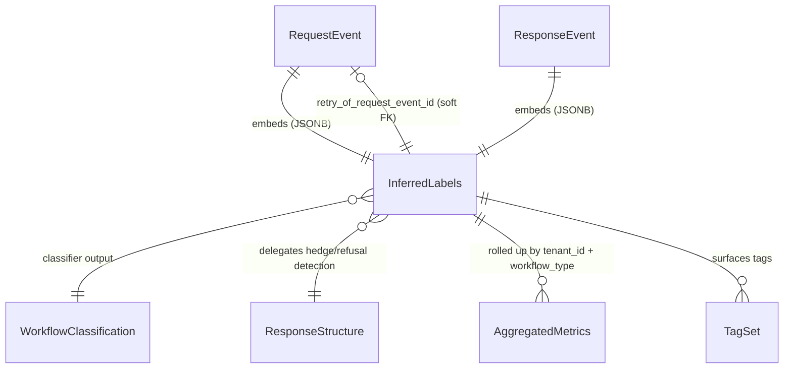
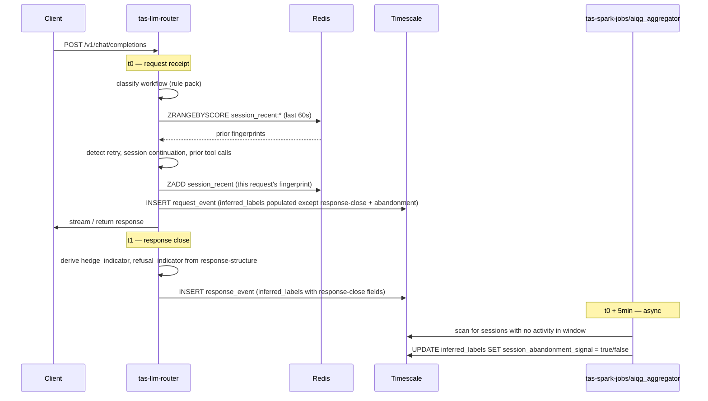
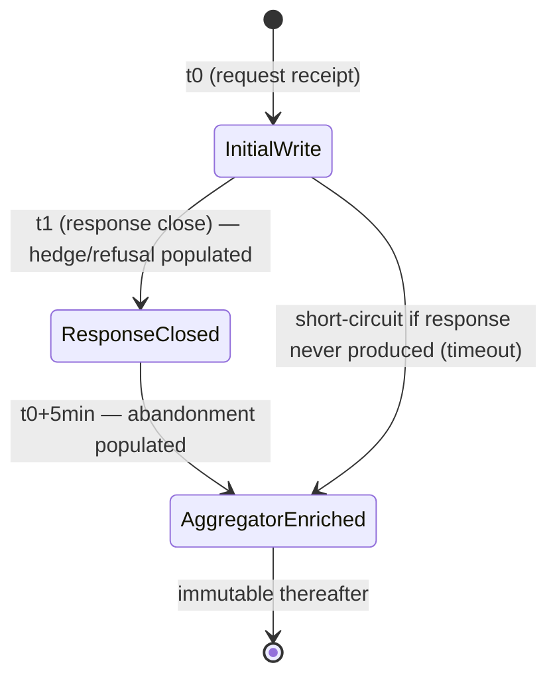

# AIQG Inferred Labels

---

**Metadata**

```yaml
service: aiqg-gateway (tas-llm-router) + tas-spark-jobs/aiqg_aggregator
model: InferredLabels
database: TimescaleDB (JSONB sub-structure embedded in request-event/response-event); Redis (hot retry lookup); Kafka CloudEvent payload
schema_location: JSONB column `inferred_labels` on `aiqg_request_events` and `aiqg_response_events`
version: 1.0.0
last_updated: 2026-05-31
status: planned (MVP coarse classification; Phase-2 fine-grained)
spec_refs: source-spec-v0.2.md §2.3 (implicit acceptance), §3.7 (inferred labels), §3.9 (workflow classification)
plan_ref: build-vs-reuse.md §2.9 (workflow classification rule pack)
```

---

## 1. Overview

### Purpose
Inferred labels are **heuristic, auto-detected per-request tags** that the AIQG gateway attaches to every request/response pair without any customer involvement. They are the gateway's interpretation of *what kind of work this request represents* and *how it relates to other recent requests from the same session* — the raw material for dashboards like "/api/customer-query retry rate: 61%" that the Day-1 report surfaces.

These labels are **NOT** customer-supplied. They are produced by:
1. The Gatekeeper rule pack `aiqg_workflows.yaml` (build-vs-reuse §2.9) at request receipt
2. A short Redis-backed lookup against the session's recent traffic
3. Asynchronous post-hoc enrichment from the [[aggregated-metrics]] aggregator

A customer MAY override the gateway's heuristic classification by sending the `TAS-Workflow` request header, in which case `workflow_classification_source` records the override.

### Ownership
- **Owning service**: `tas-llm-router` writes `workflow_type`, `workflow_classification_*`, retry detection fields, `session_id_inferred`, `conversation_continuation`, and `prior_tool_call_observed` synchronously at request receipt.
- **Async writer**: `tas-spark-jobs/aiqg_aggregator` writes `session_abandonment_signal` after the 5-minute observation window elapses.
- **Response-close writer**: `tas-llm-router` populates `hedge_indicator` and `refusal_indicator` at response close, delegating the actual detection to [[response-structure]].
- **Read-only consumers**: `aiqg-dashboard-be` (report assembly), `aiqg-ui` (retry-rate tiles, workflow distribution), `tas-spark-jobs/aiqg_aggregator` (rolls up retry rates into [[aggregated-metrics]]).

### Lifecycle Summary
Inferred labels are written progressively over the lifetime of one request:
1. **t0 (request receipt)** — workflow classification + retry detection + session inference + conversation/agentic signals
2. **t1 (response close)** — hedge/refusal indicators
3. **t0 + 5 min (async)** — session abandonment signal
They never mutate after their respective writer completes; corrections happen by appending a corrected aggregate, not by editing the original event.

### Key Characteristics
- **Heuristic, not authoritative** — confidence scores expose uncertainty; downstream consumers MUST respect `workflow_classification_confidence < 0.6` as "uncertain"
- **JSONB-embedded** in `aiqg_request_events.inferred_labels` and (for response-close fields) `aiqg_response_events.inferred_labels`; also emitted as part of the CloudEvent payload so downstream Kafka consumers don't need to re-join
- **Hot-path safe** — retry detection runs on every request and must complete in <1 ms via Redis lookup; TimescaleDB is for historical analysis only
- **Override-aware** — `workflow_classification_source` distinguishes gateway heuristic from customer override
- **Eventually consistent for abandonment** — the 5-minute window means `session_abandonment_signal` is null until the aggregator catches up

---

## 2. Schema Definition

### Storage
- **Primary storage**: JSONB column `inferred_labels` on TimescaleDB hypertables `aiqg_request_events` and `aiqg_response_events`
- **Hot cache**: Redis key `session_recent:{tenant_id}:{session_id}` holding the last 5 minutes of request fingerprints for sub-ms retry lookup
- **Transport**: Embedded in the request/response CloudEvent JSON payload under `data.inferred_labels`
- **Migration impact**: additive — adds one JSONB column per hypertable; no existing column is touched

### Schema Fields

| Field | Type | Required | Default | Lifecycle | Description |
|---|---|---|---|---|---|
| `workflow_type` | enum | Yes | `unknown` | request receipt | One of `single_turn_qa`, `rag`, `agentic`, `summarization`, `code_generation`, `classification_extraction`, `unknown`. Coarse in MVP; six-type fine-grained in Phase 2 per build-vs-reuse §9. See [[workflow-classification]] for detection signals. |
| `workflow_classification_confidence` | numeric(3,2) | Yes | `0.00` | request receipt | 0-1 confidence assigned by the classifier rule pack. Values below 0.6 MUST be surfaced as "uncertain" in the dashboard. |
| `workflow_classification_source` | enum | Yes | `gateway_heuristic` | request receipt | One of `gateway_heuristic`, `customer_override_header`, `customer_default`. Set to `customer_override_header` when the `TAS-Workflow` header is present and valid. |
| `is_retry_of_previous` | bool | Yes | `false` | request receipt | True if this request's `(user_message_hash, system_prompt_hash)` pair matches a recent prior request from the same `session_id_inferred` within the configurable window (default 60s). |
| `retry_of_request_event_id` | UUID | No | `null` | request receipt | The prior `request_event.id` being retried. Null when `is_retry_of_previous=false`, or when the original event aged out of the lookup window. |
| `retry_count_in_window` | int | Yes | `0` | request receipt | Count of prior matching retries from the same session in the last 60s (including this one — i.e., the third retry has `retry_count_in_window=3`). |
| `session_id_inferred` | string | No | `null` | request receipt | Gateway-derived session key. Default formula: `sha256(source_ip + tas_auth_token_id + floor(unix_ts/300))` (5-minute bucket). Overridden by `X-Session-ID` header when present. |
| `session_abandonment_signal` | bool | No | `null` | t0 + 5 min (async) | True if no further request from this `session_id_inferred` is observed within 5 min after this one. Null until the aggregator window closes. |
| `hedge_indicator` | bool | Yes | `false` | response close | True when the output's hedge phrase density exceeds the threshold. Delegates to [[response-structure]]`.hedge_phrase_density > threshold`. |
| `refusal_indicator` | bool | Yes | `false` | response close | Delegates to [[response-structure]]`.refused`. |
| `conversation_continuation` | bool | Yes | `false` | request receipt | True when the request carries a non-empty `conversation_history` AND the prior turn was an `assistant` turn (indicates multi-turn dialogue rather than a fresh request). |
| `prior_tool_call_observed` | bool | Yes | `false` | request receipt | Agentic-loop signal: true when the previous turn included `tool_calls` AND this turn includes their `tool_results`. |

### JSON Schema (canonical form embedded in CloudEvent)

```json
{
  "$schema": "https://json-schema.org/draft/2020-12/schema",
  "title": "AIQGInferredLabels",
  "type": "object",
  "required": [
    "workflow_type",
    "workflow_classification_confidence",
    "workflow_classification_source",
    "is_retry_of_previous",
    "retry_count_in_window",
    "hedge_indicator",
    "refusal_indicator",
    "conversation_continuation",
    "prior_tool_call_observed"
  ],
  "properties": {
    "workflow_type": {
      "type": "string",
      "enum": [
        "single_turn_qa",
        "rag",
        "agentic",
        "summarization",
        "code_generation",
        "classification_extraction",
        "unknown"
      ]
    },
    "workflow_classification_confidence": {
      "type": "number",
      "minimum": 0.0,
      "maximum": 1.0
    },
    "workflow_classification_source": {
      "type": "string",
      "enum": ["gateway_heuristic", "customer_override_header", "customer_default"]
    },
    "is_retry_of_previous":        { "type": "boolean" },
    "retry_of_request_event_id":   { "type": ["string", "null"], "format": "uuid" },
    "retry_count_in_window":       { "type": "integer", "minimum": 0 },
    "session_id_inferred":         { "type": ["string", "null"], "maxLength": 128 },
    "session_abandonment_signal":  { "type": ["boolean", "null"] },
    "hedge_indicator":             { "type": "boolean" },
    "refusal_indicator":           { "type": "boolean" },
    "conversation_continuation":   { "type": "boolean" },
    "prior_tool_call_observed":    { "type": "boolean" }
  }
}
```

### TimescaleDB DDL

```sql
-- Additive column on existing hypertables
ALTER TABLE aiqg_request_events
  ADD COLUMN IF NOT EXISTS inferred_labels JSONB NOT NULL DEFAULT '{}'::jsonb;

ALTER TABLE aiqg_response_events
  ADD COLUMN IF NOT EXISTS inferred_labels JSONB NOT NULL DEFAULT '{}'::jsonb;

-- Hot-path index for retry-window lookup (per-request on the hot path)
CREATE INDEX IF NOT EXISTS idx_request_events_session_retry
  ON aiqg_request_events (tenant_id, (inferred_labels->>'session_id_inferred'), received_at DESC);

-- GIN index for ad-hoc JSONB queries (workflow_type, retry rate, etc.)
CREATE INDEX IF NOT EXISTS idx_request_events_inferred_labels_gin
  ON aiqg_request_events USING GIN (inferred_labels jsonb_path_ops);
```

### Redis Schema (hot retry-detection cache)

```
KEY:    session_recent:{tenant_id}:{session_id_inferred}
TYPE:   ZSET  (score = unix_ts_ms, member = "<request_event_id>:<user_message_hash>:<system_prompt_hash>")
TTL:    300s
USAGE:  ZRANGEBYSCORE for last 60s lookup; ZADD on every request; ZREMRANGEBYSCORE on read to GC expired entries
```

---

## 3. Relationships

### Outgoing (logical)

| Target | Relationship | Cardinality | Notes |
|---|---|---|---|
| [[request-event]] | embedded as `inferred_labels` JSONB column | 1:1 | The labels are owned by the request event row; lifecycle is co-terminus |
| [[response-event]] | embedded as `inferred_labels` JSONB column | 1:1 | Response-close fields (`hedge_indicator`, `refusal_indicator`) live here; the duplicate JSONB is intentional so downstream consumers don't need to join |
| [[request-event]] (prior) | `retry_of_request_event_id` foreign reference | 0..1 | Soft FK — may be null when the original aged out of the lookup window |
| [[workflow-classification]] | classifier produces `workflow_type` + `workflow_classification_confidence` | 1:1 per request | The classification logic, signals, and thresholds are documented separately |
| [[response-structure]] | provides `hedge_phrase_density`, `refused` | 1:1 per response | This doc delegates detection; the indicator booleans here are derived from those primary signals |
| [[aggregated-metrics]] | rolls up retry rate, workflow mix, abandonment rate | N:1 | Aggregator reads JSONB fields and writes hourly/daily roll-ups |
| [[tag-set]] | retry/workflow/session tags surface as report tags | N:N | Tag generation in `aiqg-dashboard-be` reads these labels |

### Incoming

None — inferred labels are leaves in the relationship graph. They are *produced from* request/response/conversation context, not referenced by other entities except via the rollup path through [[aggregated-metrics]].

### ERD



---

## 4. Validation Rules

### Field Validation

| Field | Rule |
|---|---|
| `workflow_type` | Required; must be one of the seven enum values; defaults to `unknown` when classifier confidence < 0.3 |
| `workflow_classification_confidence` | Required; numeric in `[0.0, 1.0]`; values `< 0.6` MUST be surfaced as "uncertain" in dashboards |
| `workflow_classification_source` | Required; one of `gateway_heuristic`, `customer_override_header`, `customer_default`; set to `customer_override_header` if and only if a valid `TAS-Workflow` header was supplied; set to `customer_default` if the account has a default `workflow_type` configured and no override was sent |
| `is_retry_of_previous` | Required boolean |
| `retry_of_request_event_id` | When `is_retry_of_previous=true`, SHOULD be populated; null only if the original event aged out of the 60s lookup window. When `is_retry_of_previous=false`, MUST be null. |
| `retry_count_in_window` | Required integer ≥ 0; 0 only when `is_retry_of_previous=false`; otherwise ≥ 1 |
| `session_id_inferred` | Optional string ≤ 128 chars; null when neither the IP+token+bucket formula nor an `X-Session-ID` header could produce a key |
| `session_abandonment_signal` | Null until the aggregator's 5-min window closes; thereafter boolean. MUST NOT be written synchronously by the request handler. |
| `hedge_indicator` | Required boolean; written at response close; defaults to `false` if response was never produced (timeout, abort) |
| `refusal_indicator` | Required boolean; written at response close; defaults to `false` if response was never produced |
| `conversation_continuation` | Required boolean |
| `prior_tool_call_observed` | Required boolean |

### Business Rules

1. **Customer override precedence**: when `TAS-Workflow` header is present and its value matches a known enum, `workflow_classification_source = customer_override_header` and `workflow_classification_confidence = 1.0`. The classifier is still invoked (for telemetry comparison) but its output is discarded for the persisted `workflow_type`.
2. **Retry exclusivity with conversation continuation**: `is_retry_of_previous=true` and `conversation_continuation=true` SHOULD NOT both be true for the same request — a multi-turn continuation is a new turn, not a retry. If both detect true, prefer `conversation_continuation` and clear the retry flag (with a debug log).
3. **Retry hash material**: the fingerprint used for retry detection is `sha256(canonicalize(user_message) || system_prompt_hash)`. Vendor/model swap does NOT change the fingerprint (retry across providers is still a retry).
4. **Abandonment is opt-out**, not opt-in: the aggregator MUST write `session_abandonment_signal=false` if any further request from the same session is observed within the window. It writes `true` only if the window closes with no further activity.
5. **Confidence floor for `unknown`**: when the classifier returns confidence `< 0.3`, `workflow_type` is forced to `unknown` regardless of the raw classifier label.
6. **No PII in `session_id_inferred`**: the gateway-derived key is a hash; if a customer-supplied `X-Session-ID` header is present, it is stored verbatim — see §10 for the PII warning.
7. **Idempotent writes**: re-emitting the same request event (after a retry from upstream infrastructure) MUST produce identical `inferred_labels` JSONB; the writer is deterministic given the same input.

---

## 5. Lifecycle & State Transitions

### Per-Request Lifecycle



### Field-Level State Diagram



### Writer Responsibility Matrix

| Field | Writer | Phase | Source of Truth |
|---|---|---|---|
| `workflow_type` | `tas-llm-router` | t0 | Gatekeeper rule pack `aiqg_workflows.yaml` |
| `workflow_classification_confidence` | `tas-llm-router` | t0 | Classifier output |
| `workflow_classification_source` | `tas-llm-router` | t0 | Header inspection |
| `is_retry_of_previous` | `tas-llm-router` | t0 | Redis session window |
| `retry_of_request_event_id` | `tas-llm-router` | t0 | Redis session window |
| `retry_count_in_window` | `tas-llm-router` | t0 | Redis session window |
| `session_id_inferred` | `tas-llm-router` | t0 | Header or hash formula |
| `session_abandonment_signal` | `tas-spark-jobs/aiqg_aggregator` | t0 + 5 min | Aggregator scan |
| `hedge_indicator` | `tas-llm-router` | t1 | [[response-structure]]`.hedge_phrase_density` |
| `refusal_indicator` | `tas-llm-router` | t1 | [[response-structure]]`.refused` |
| `conversation_continuation` | `tas-llm-router` | t0 | Request body inspection |
| `prior_tool_call_observed` | `tas-llm-router` | t0 | Request body inspection |

---

## 6. Examples

### 6.1 Single-Turn QA — fresh request, no session context

```json
{
  "workflow_type": "single_turn_qa",
  "workflow_classification_confidence": 0.92,
  "workflow_classification_source": "gateway_heuristic",
  "is_retry_of_previous": false,
  "retry_of_request_event_id": null,
  "retry_count_in_window": 0,
  "session_id_inferred": "s3:f7a2c1e8b9d4a0f1...",
  "session_abandonment_signal": null,
  "hedge_indicator": false,
  "refusal_indicator": false,
  "conversation_continuation": false,
  "prior_tool_call_observed": false
}
```

### 6.2 RAG Retry — the 3rd retry of a struggling query

```json
{
  "workflow_type": "rag",
  "workflow_classification_confidence": 0.88,
  "workflow_classification_source": "gateway_heuristic",
  "is_retry_of_previous": true,
  "retry_of_request_event_id": "req_01HZP3K6Y9Z8M7B6C4F2D1A0E5",
  "retry_count_in_window": 3,
  "session_id_inferred": "s3:9d4a0f17a2c1e8bf...",
  "session_abandonment_signal": null,
  "hedge_indicator": true,
  "refusal_indicator": false,
  "conversation_continuation": false,
  "prior_tool_call_observed": false
}
```

Strong signal of bad output. Combined with `hedge_indicator=true` and `retry_count_in_window=3`, this is the canonical pattern that produces the "/api/customer-query retry rate: 61%" finding on the Day-1 report.

### 6.3 Agentic Loop Mid-Step — turn 4 of a tool-calling agent

```json
{
  "workflow_type": "agentic",
  "workflow_classification_confidence": 0.95,
  "workflow_classification_source": "gateway_heuristic",
  "is_retry_of_previous": false,
  "retry_of_request_event_id": null,
  "retry_count_in_window": 0,
  "session_id_inferred": "x-session:agent-run-7c1a",
  "session_abandonment_signal": null,
  "hedge_indicator": false,
  "refusal_indicator": false,
  "conversation_continuation": true,
  "prior_tool_call_observed": true
}
```

### 6.4 Customer Override — known workflow type, full confidence

```json
{
  "workflow_type": "code_generation",
  "workflow_classification_confidence": 1.00,
  "workflow_classification_source": "customer_override_header",
  "is_retry_of_previous": false,
  "retry_of_request_event_id": null,
  "retry_count_in_window": 0,
  "session_id_inferred": "x-session:ide-run-aa12",
  "session_abandonment_signal": null,
  "hedge_indicator": false,
  "refusal_indicator": false,
  "conversation_continuation": false,
  "prior_tool_call_observed": false
}
```

Request sent with header: `TAS-Workflow: code_generation`.

### 6.5 Session Abandoned — refused output, no follow-up

```json
{
  "workflow_type": "single_turn_qa",
  "workflow_classification_confidence": 0.79,
  "workflow_classification_source": "gateway_heuristic",
  "is_retry_of_previous": false,
  "retry_of_request_event_id": null,
  "retry_count_in_window": 0,
  "session_id_inferred": "s3:c1e8bf9d4a0f17a2...",
  "session_abandonment_signal": true,
  "hedge_indicator": false,
  "refusal_indicator": true,
  "conversation_continuation": false,
  "prior_tool_call_observed": false
}
```

The aggregator filled in `session_abandonment_signal=true` 5 minutes after the request when no follow-up was observed — a strong signal that the refusal frustrated the user.

### 6.6 SQL — Aggregate Retry Rate per Endpoint per Day

```sql
-- Drives the "/api/customer-query retry rate: 61%" finding on the Day-1 report.
SELECT
  date_trunc('day', received_at)                              AS day,
  route_label,
  COUNT(*)                                                   AS total_requests,
  COUNT(*) FILTER (
    WHERE (inferred_labels->>'is_retry_of_previous')::bool
  )                                                          AS retry_requests,
  ROUND(
    100.0 * COUNT(*) FILTER (
      WHERE (inferred_labels->>'is_retry_of_previous')::bool
    ) / NULLIF(COUNT(*), 0),
    1
  )                                                          AS retry_rate_pct
FROM   aiqg_request_events
WHERE  tenant_id = $1
  AND  received_at >= NOW() - INTERVAL '1 day'
GROUP  BY day, route_label
ORDER  BY retry_rate_pct DESC;
```

### 6.7 SQL — Workflow Distribution with Uncertainty Flag

```sql
SELECT
  inferred_labels->>'workflow_type'                            AS workflow_type,
  COUNT(*)                                                     AS request_count,
  COUNT(*) FILTER (
    WHERE (inferred_labels->>'workflow_classification_confidence')::numeric < 0.6
  )                                                            AS uncertain_count
FROM   aiqg_request_events
WHERE  tenant_id = $1
  AND  received_at >= NOW() - INTERVAL '24 hours'
GROUP  BY 1
ORDER  BY request_count DESC;
```

### 6.8 SQL — Abandonment Rate after Refusal

```sql
SELECT
  COUNT(*)                                                     AS refusals,
  COUNT(*) FILTER (
    WHERE (inferred_labels->>'session_abandonment_signal')::bool
  )                                                            AS refusals_abandoned,
  ROUND(
    100.0 * COUNT(*) FILTER (
      WHERE (inferred_labels->>'session_abandonment_signal')::bool
    ) / NULLIF(COUNT(*), 0),
    1
  )                                                            AS abandon_after_refuse_pct
FROM   aiqg_response_events
WHERE  tenant_id = $1
  AND  received_at >= NOW() - INTERVAL '7 days'
  AND  (inferred_labels->>'refusal_indicator')::bool;
```

---

## 7. Cross-Service References

### Service Reads / Writes

| Service | Read | Write | Why |
|---|---|---|---|
| `tas-llm-router` | yes | yes | Classifier execution; retry/session/conversation detection; response-close hedge/refusal indicators |
| `tas-spark-jobs/aiqg_aggregator` | yes | yes (one field) | Reads all fields for rollup; writes `session_abandonment_signal` after the 5-min window |
| `aiqg-dashboard-be` | yes | no | Report assembly; surfaces retry rates, workflow mix, abandonment to UI |
| `aiqg-ui` | yes (via dashboard-be) | no | Dashboard tiles, "uncertain" highlighting on low-confidence rows |
| `aether-be` | no | no | No coupling |

### Gatekeeper Rule Pack

The classifier lives at `tas-llm-router/rulepacks/aiqg_workflows.yaml` per build-vs-reuse §2.9. The rule pack consumes the request body (model, messages, tools, structured-output schema) and emits `(workflow_type, confidence)`. The pack is hot-reloadable; rule pack version is implicitly recorded via [[aggregated-metrics]] (which carries `rule_pack_version`).

### ID Mapping Chain Extension

Inferred labels themselves do not introduce new IDs, but they reference:

```
session_id_inferred  ──(soft, no FK)── prior request events from same session
retry_of_request_event_id ──(soft FK)── aiqg_request_events.id
```

Neither is added to `cross-service/mappings/id-mapping-chain.md` — these are intra-AIQG references.

---

## 8. Tenant & Space Isolation

### Isolation Model

Inferred labels inherit isolation from their host row: every `aiqg_request_events` row carries `tenant_id`, and every read MUST filter on that column. The Redis hot cache is namespaced by tenant in the key (`session_recent:{tenant_id}:...`) so cross-tenant retry detection is impossible.

### Cross-Tenant Risk

`session_id_inferred` is derived from `tas_auth_token_id`, which is itself scoped to the account; the same source_ip from two different tenants produces two different keys. There is **no shared key space** across tenants.

### Isolation Query Patterns

```sql
-- Correct: tenant_id is the leading column on every read
SELECT inferred_labels
FROM   aiqg_request_events
WHERE  tenant_id = $1
  AND  received_at >= $2;
```

```sql
-- Forbidden: a query without tenant_id is a Sev-1 isolation defect
SELECT inferred_labels
FROM   aiqg_request_events
WHERE  received_at >= $2;
```

CI lints in `aiqg-dashboard-be` and the aggregator job reject any SQL that omits `tenant_id` from its `WHERE` clause on AIQG tables.

---

## 9. Performance Considerations

### Read Profile

- **Hot read (every request)**: Redis ZRANGEBYSCORE for retry-window lookup. Target: <1 ms p99.
- **Warm read (per-page-view)**: dashboard tiles reading aggregated JSONB roll-ups from [[aggregated-metrics]] (NOT from per-event JSONB).
- **Cold read (Spark)**: aggregator daily scan of `aiqg_request_events` filtered by `tenant_id` + `received_at` window; reads JSONB via projected columns.

### Index Plan

1. **`idx_request_events_session_retry`** — BTree on `(tenant_id, session_id_inferred, received_at)` — supports retry-window lookup if Redis is unavailable (fallback path) and supports the aggregator's session-grouping scan.
2. **`idx_request_events_inferred_labels_gin`** — GIN on JSONB — supports ad-hoc dashboard queries like "filter to workflow_type=rag".

### Caching Strategy

- **Redis ZSET** holds the last 5 min of session fingerprints. Key format: `session_recent:{tenant_id}:{session_id}`. Score: unix ms. Member: `<event_id>:<user_msg_hash>:<sys_prompt_hash>`. TTL: 300s. GC: ZREMRANGEBYSCORE on every read.
- **Why 5 min and not 60s**: the lookup window is 60s, but we keep 5 min in Redis so the aggregator can read the same source-of-truth when computing session windows without an extra TimescaleDB scan.
- **Cache miss**: if Redis is unavailable, the writer falls back to the TimescaleDB index `idx_request_events_session_retry`. Latency rises from <1 ms to ~5–10 ms — acceptable as a degraded mode but not as a steady state.

### Hot-Path Budget

Total inferred-labels work on the request path MUST fit inside 3 ms p99:
- 1 ms: classifier rule pack execution
- 1 ms: Redis retry lookup
- 1 ms: JSONB serialization + Kafka publish (asynchronous; non-blocking)

If the classifier exceeds 1 ms, it falls back to `workflow_type=unknown` with `confidence=0` rather than blocking the request.

### Anti-patterns

- **Do not** scan `aiqg_request_events` from the hot path for retry detection — use Redis.
- **Do not** invoke an LLM judge for classification on the hot path — the rule pack is keyword/regex/length-based by design. LLM-judge sampling for paraphrased retries is a Phase-2 enhancement and runs offline.
- **Do not** put per-tenant cardinality in `session_id_inferred` (e.g., raw IP without hashing) — it leaks PII into logs.

---

## 10. Security & Compliance

### Sensitive Fields

| Field | Sensitivity | Handling |
|---|---|---|
| `session_id_inferred` (derived) | Internal | Salted SHA-256 of `source_ip + token_id + bucket`; safe to log |
| `session_id_inferred` (customer-supplied via `X-Session-ID`) | Potentially PII | Stored verbatim; documented as customer responsibility |
| `retry_of_request_event_id` | Internal | UUID; safe to log |
| All other fields | Non-sensitive | Booleans, enums, numerics |

### PII Warning for `X-Session-ID`

When a customer supplies `X-Session-ID`, the value is stored unhashed in `session_id_inferred`. Documentation in the customer-facing AIQG docs MUST state:

> Do not put PII, user identifiers, or any personally identifiable data in the `X-Session-ID` header. The gateway stores this value verbatim for session correlation. Use an opaque, pseudonymous token instead.

### Access Control

- **Reads / Writes**: gated by Keycloak realm `aether` JWT plus a Space-membership check against the parent [[account]] node.
- **Aggregator service account**: `tas-spark-jobs/aiqg_aggregator` uses a read-mostly service JWT with a single allowed `UPDATE` path (`session_abandonment_signal` field only). CI enforces that the aggregator's SQL contains only one UPDATE statement and that it touches only that JSONB key.

### Audit

Inferred labels are themselves a derived projection of the request/response, so they do not emit a separate audit-log entry — the parent [[request-event]] and [[response-event]] entries already cover provenance. The aggregator's `session_abandonment_signal` write does emit an aggregator-run audit entry (one per batch, not per row).

### Compliance Touchpoints

- **GDPR data minimization**: inferred labels contain no raw payload; they are statistical projections. The `session_id_inferred` derived hash is not a "personal identifier" under GDPR Art. 4(1).
- **GDPR right to deletion**: erasure of a tenant's data erases the JSONB columns alongside the parent event rows; no separate erasure path is needed.
- **Customer-supplied `X-Session-ID`**: if a customer mistakenly puts PII there, the standard tenant-data-erasure flow covers it. The PII warning in customer docs is the preventative measure.

---

## 11. Migration History

### v1.0.0 — 2026-05-31

- Initial schema. New JSONB column `inferred_labels` on `aiqg_request_events` and `aiqg_response_events`.
- New Redis key namespace `session_recent:{tenant_id}:{session_id_inferred}` with TTL 300s.
- New Gatekeeper rule pack `aiqg_workflows.yaml` in `tas-llm-router/rulepacks/`.
- Migration is forward-only: the JSONB column defaults to `'{}'::jsonb`, so existing rows remain queryable; new rows populate the labels as documented.
- Index/constraint DDL in §2 is idempotent (`CREATE INDEX IF NOT EXISTS`, `ADD COLUMN IF NOT EXISTS`).
- No existing column, label, or relationship is modified.

---

## 12. Known Issues & Limitations

1. **Session inference from `source_ip` is unreliable for NAT'd customers** — multiple customer users behind a corporate NAT may share a `session_id_inferred`, inflating false-positive retry detection. Documented mitigation: customers SHOULD send `X-Session-ID` as the recommended override.
2. **Retry detection by exact-hash misses paraphrased retries** — "what's the weather?" and "tell me the weather" produce different hashes and won't be flagged as retries in MVP. LLM-judge sampling (Phase 2) is the planned mitigation; in the meantime, the retry rate is a lower bound on true retry behavior.
3. **`session_abandonment_signal` is eventually consistent** with a 5-minute lag. The MVP dashboard treats `null` as "pending" rather than as "no abandonment" — UI MUST distinguish the two states. Customers reading the JSONB via direct SQL should likewise check for `null` before drawing conclusions.
4. **Workflow classifier is coarse in MVP**. The seven-value enum is intentionally narrow; fine-grained sub-types (e.g., "RAG with reranker" vs "RAG without reranker") are Phase-2 per build-vs-reuse §9.
5. **Customer override is single-valued, not stacked**. A customer cannot send "this is an agentic RAG" — they pick one. Composite workflow types are not modeled.
6. **Confidence is the classifier's self-report**, not a calibrated probability. Two requests at confidence 0.7 may not be equally likely to be correctly classified. Calibration via offline sampling is a Phase-2 enhancement.
7. **No backfill for historical events** — rows written before v1.0.0 carry `inferred_labels='{}'::jsonb`. Dashboards MUST coalesce missing fields to their defaults or exclude such rows from inferred-label aggregates.

---

## 13. Related Documentation

### AIQG Siblings (this directory)

- [[account]] — the AIQG account that owns the events these labels annotate (joined by `tenant_id`)
- [[request-event]] — the host row for the t0 inferred labels
- [[response-event]] — the host row for the t1 hedge/refusal indicators
- [[workflow-classification]] — the classifier rule pack producing `workflow_type` + `workflow_classification_confidence`, including signals and thresholds
- [[response-structure]] — the source of truth for `hedge_phrase_density` and `refused`, which `hedge_indicator` and `refusal_indicator` delegate to
- [[aggregated-metrics]] — where retry rates, workflow mix, and abandonment rates roll up for dashboard consumption
- [[tag-set]] — surfaces inferred-label fields as report tags

### Plan & Spec

- [`build-vs-reuse.md`](./build-vs-reuse.md) §2.9 — workflow classification rule pack location, naming, and lifecycle
- [`source-spec-v0.2.md`](./source-spec-v0.2.md) §2.3 — implicit acceptance: the gateway accepts traffic without explicit per-request classification
- [`source-spec-v0.2.md`](./source-spec-v0.2.md) §3.7 — inferred labels: the catalog of heuristic tags
- [`source-spec-v0.2.md`](./source-spec-v0.2.md) §3.9 — workflow classification: the six-type fine-grained taxonomy targeted for Phase 2

---

## 14. Changelog

| Version | Date | Author | Changes |
|---|---|---|---|
| v1.0.0 | 2026-05-31 | TAS Platform | Initial spec draft. Defines the JSONB sub-structure for `inferred_labels` embedded on `aiqg_request_events` and `aiqg_response_events`, the Redis hot-cache for retry detection, the writer responsibility matrix across `tas-llm-router` and `tas-spark-jobs/aiqg_aggregator`, and the index plan. Non-breaking, additive only. |
