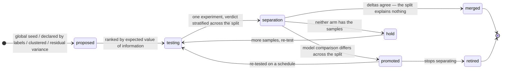
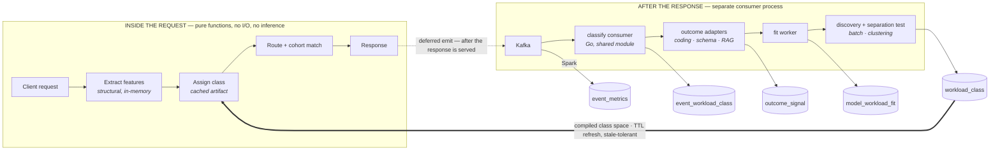

# Workload Model Fit — backend design

**Date:** 2026-08-27 · **Revised:** 2026-09-01 (class space made open and discovered; coding demoted from scope to first domain; shared layer, evented topology, signal placement decided; architecture diagrams added) · **Status:** design, nothing built · **Scope:** backend systems only (dashboard-be, tas-llm-router, aiqg-import, one new shared module). UI deliberately deferred.

> **The claim this exists to support.** *"Every workload runs on the cheapest model that holds, we can prove it on your own traffic, and we re-prove it when the models change."*
>
> Not *"our router predicts the best model per request."* That is what Not Diamond, Martian and RouteLLM sell, from a router trained on an eval set the customer supplies. This is a different product: a **per-workload configuration decision, empirically established on the customer's own traffic, continuously maintained.**

---

## 0. What changed in this revision, and why

The first draft fixed the workload dimension to **seven hand-authored coding classes**. Two objections killed that, both correct:

**Where did seven come from?** From `AIQG_WORKFLOW_TAXONOMY.md` §5 — Axis-1 Intent, filtered to the SWE archetype. That is a **document, not a measurement**. Nobody counted traffic to derive it and nothing validated that models actually behave differently across those seven boundaries. Freezing it into the schema would have committed exactly the error §8 warns about: a stratification error corrupts every number computed downstream and leaves no trace of having done so. I wrote the warning and then walked into it.

**Classes should be discovered, not assumed.** A class is a *hypothesis about routing* — "models rank differently on this subset of traffic." A hypothesis is settled by experiment, and we already own the experiment machinery. So the taxonomy's seven become a **seed prior** for bootstrapping, and the system's job is to test, split, merge and retire them against evidence.

**And coding is a starting ground, not the scope.** The class machinery must work on any traffic from day one. Coding is where the objective quality signals are richest, which makes it the right place to prove the loop — not the right place to draw the system boundary.

The design below is therefore three layers: a **universal feature extractor**, an **open class space** that is discovered and experimentally validated, and **pluggable domain adapters** that supply outcome signals — of which coding is the first.

---

## 1. Summary

Today the routing stack measures cost and quality per `(model, workflow)`, where `workflow` is one of six coarse enum values and **every tool-using request collapses to `agentic`** (`aiqg-import/workflow/classifier.go:66`). Coding, agentic RAG, orchestration and tool-driven extraction all land in that one bucket with one cost profile and one quality score.

This design adds:

1. **A universal feature vector** — structural, content-free, computed for every request regardless of modality or domain.
2. **An open workload-class space** — per tenant, versioned, seeded from priors and refined by discovery, where **a class only earns permanence by passing a separation test** (§4.2).
3. **Domain adapters for outcome signals** — objective quality derived from what happened after a turn. Coding first (did the edit apply, did the test pass); structured output and RAG next.
4. **A fit store** — measured cost and quality per `(model, workload_class, evidence_tier)`.
5. **Candidate generation** — the body of `CheaperModelAvailable`, presently an empty function by deliberate decision (`aiqg-dashboard-be/internal/suggestions/conditions.go:290`).
6. **An evidence ladder to a verdict** — offline corpus → shadow → small live split → the existing non-inferiority test, each rung honest about what it cannot show.
7. **A promotion draft** — a rendered route-rule change with a dry-run diff. A human applies it. Nothing auto-promotes in v1.

---

## 2. What already exists

Verified against the repositories, not against prior session notes.

| Capability | Where | State |
|---|---|---|
| Per-request event history (model, tokens, cost, finish reason, CLEAR sub-scores, synthetic marking) | `aiqg.event_metrics` (Timescale) | live |
| Measured verbosity per `(model, workflow)` — synthetic excluded, truncation excluded, staleness marked, replace-not-upsert | `aiqg-dashboard-be/internal/store/verbosity.go` | live |
| Measured CLEAR per `(model, workflow)` — efficacy mean + coverage, worst-case assurance via `MIN` not `AVG` | `internal/store/quality.go` | live |
| Expected-cost routing, CLEAR-gated selection, hysteresis, chains, constraints | `tas-llm-router/internal/routing/` | merged; abstains on current traffic |
| Experiment lifecycle `draft → dry_run → running → paused → completed → archived`, JSONB cohort/variants/guardrails, audited transitions | `internal/store/experiments.go` | live |
| Gateway variant assignment + stamping | `tas-llm-router/internal/middleware/aiqg_routing.go:493` | live |
| Auto-stop guardrail worker | `internal/experiments/autostop.go` | live |
| **Verdict engine** — non-inferiority test, ε = 0.05, objective win ≥ 5%, n ≥ 30 per arm, two-sample z-test at p < 0.05 | `internal/handlers/verdict.go:13-23` | live |
| **Shadow-eval** — mirrors a % of cohort control-arm traffic to each variant, judges head-to-head | `tas-llm-router/internal/server/judge.go:139` | built, **off by default** (`ShadowEvalPct: 0`) |
| Arbitrary quality signals per response, attributed to experiment + variant | `aiqg.response_feedback`, `internal/store/feedback.go` | live |
| Suggestion engine with fired / clear / **insufficient-evidence** outcomes | `internal/suggestions/engine.go` | live |
| Canonical Capture Envelope + coverage descriptors; Claude Code / web / compliance adapters | `aiqg-import/`, `internal/handlers/imports.go` | built |
| Classification-drift worker + alert kind | `internal/classdrift/`, migration `017` | live |

Two corrections to earlier notes: **shadow evaluation is not missing** (it is built and switched off), and **the trace importers are not backlog** (`aiqg-import` is a real module with a server-side ingest path).

---

## 3. What is missing

**G1 — Traffic has no internal structure beyond six coarse buckets, and nothing can discover more.** `Classify()` returns `agentic` for anything with tools. There is no mechanism to propose a finer partition, and no test for whether a proposed partition is real.

**G2 — There is currently no quality signal that can discriminate between models at all.** Proven, not suspected: CLEAR Efficacy scores only the normalised vendor `finish_reason` (`pkg/clear/efficacy.go`), so `stop` and `tool_calls` both score 100. During the 2026-08-24 routing-fire work all six measured cells landed at **efficacy 100 with zero truncation**, and the exclusion path could not be demonstrated. An input with no variance cannot drive a gate; a non-inferiority verdict on Efficacy measures **completion, not correctness**.

Tracked as **Plan #17** (`tas-gtm/analysis/TICKET-clear-efficacy-depth.md`), whose Tier 3 is an outcome-feedback API where the customer posts their own success signal. The domain adapters in §4.3 are the **derived cousin of that tier**: rather than asking the customer to instrument, they read outcomes already present in the trace. Complementary, neither blocked on the other.

**G3 — No candidate generation.** `CheaperModelAvailable.Evaluate` abstains on thin data and returns `nil, nil`, with a comment stating the comparison's shape should be decided against data that exists.

**G4 — Prices and tokens live in different services on purpose, and nothing joins them.** `model_economics.go` serves tokens and refuses to hold prices; prices live in gateway config.

**G5 — No promotion path.** A verdict of `promote` is a string in a JSON response.

---

## 4. Design

Read §4.9 first if the question on your mind is *"what does this cost the request?"* — the answer is a few microseconds of pure function, and everything else runs in another process.

### 4.1 Layer 1 — the universal feature vector

Computed for every request, in every domain, from **structure only**. No content is read, which is what makes it safe on proprietary source, regulated documents and customer PII alike — and is also why it generalises: the same extractor works on a coding agent, a RAG endpoint and a classification batch job.

| Group | Features |
|---|---|
| **Shape** | message count, conversation depth (turn index), system-prompt size bucket, input tokens, output tokens, in/out ratio |
| **Capability** | tools present, tool count, tool-name signature (hashed set), `response_format` is a JSON schema, streaming, multimodal blocks present |
| **Context** | retrieval markers (the existing `document:` / `context:` separator cue), cache read/creation tokens, attachment count |
| **Behaviour** | finish reason, latency bucket, retry or repair observed |

These features already separate the workload types we know about — coding by tool signature, RAG by retrieval markers and input/output ratio, extraction by JSON-schema plus short output, summarisation by a high in/out ratio, conversation by low input and depth > 1 — without anyone hand-writing those rules. That is the point: the rules become *findings*.

An optional **semantic tier** (prompt embedding centroid) is defined but **off by default**. It buys separation the structural tier cannot see, at the cost of reading content. Opt-in per tenant, never a default, and never required for a class to exist.

### 4.2 Layer 2 — the class space, discovered and tested

A workload class is a **routing hypothesis**: *models rank differently on this subset of traffic than on its parent.* The class space is per tenant, versioned, and never final.

**Where candidates come from** — four sources, all cheap:

1. **Seed priors.** The workflow enum, and for coding the taxonomy's Axis-1 intents (discovery, modification, generation, diagnosis, validation, execution, orchestration). Bootstrap only — they exist so the system is not useless on day one, and they carry no more authority than any other candidate.
2. **Operator-declared.** The customer names their own workloads via header or metadata. Often the best partition available, and free.
3. **Unsupervised structure.** Clustering over the standardised feature vector per tenant per window, deterministic seed, versioned.
4. **Residual variance.** Within an existing class, if cost or quality variance is high and a single feature explains a chunk of it, propose a split along that feature. This is the source that keeps working after the obvious partitions are found.

**The separation test — how a candidate becomes a class.** A proposed split of class *X* into *X₁* and *X₂* is promoted only if the model comparison **differs across the split** by more than noise. Formally an interaction test: does the objective delta between incumbent and candidate measured on *X₁* differ from the same delta measured on *X₂*?

```
promote the split  if  |Δ(X₁) − Δ(X₂)|  is significant at the class's variance
merge it back      if  the deltas agree — the split explains nothing about routing
hold               if  neither arm has the samples to tell
```

Two ways to run it, and they differ in strength exactly as §4.6's ladder does:

- **Observational** (free, confounded): compute the deltas from history. Models were not randomly assigned to requests, so a difference may be selection rather than effect. Good enough to *rank* candidate splits, never to settle one.
- **Randomised** (the real answer): run one experiment whose cohort is the parent class, stratify the verdict by candidate sub-class, and compare. This is a single experiment answering *both* "is the candidate model cheaper here" and "is this split real" — which is what makes it affordable.




**Figure 2 — a class is a hypothesis, and the experiment settles it.** No source confers status: a proposed class stays visible and unpromoted until the comparison measured on one side of the split differs from the other by more than noise. The same experiment that asks *"is the cheaper model good enough here"* answers *"is this split real"* — which is what makes discovery affordable. Merge pressure runs both ways.

**Cost control, because you cannot test every candidate.** Rank candidate splits by expected value of information — traffic volume × observed cost spread × uncertainty — and test the top few. Everything else stays a proposal, visible and unpromoted.

**Guards against class proliferation**, which is the failure mode this layer introduces:

- **Minimum viable class size** derived from the powered sample size for ε = 0.05 at that class's variance. A class too small to ever reach a verdict is not a class; it is a slice of a residual bucket.
- **Every split doubles time-to-verdict** for the traffic it divides. The suggestion must show that cost, because a system that silently fragments traffic into unverifiable slivers looks identical to one that is learning.
- **A residual class always exists** and is a legitimate destination, alongside `unclassified` for abstention.
- **Merge pressure is symmetric.** A class that stops separating gets merged back and its version retired. Growth-only taxonomies rot.

**Human-readable or it does not ship.** A discovered cluster with no name an operator recognises cannot appear in a suggestion. Naming is a drafting step — dominant features, optionally an LLM-drafted label — and drafts are reviewed, never auto-published. A route rule nobody can read is a route rule nobody can approve.

**Two vantages, because routing decides before the answer exists.**

| Vantage | Computed | From | Used for |
|---|---|---|---|
| `inline` | gateway, pre-route | request features + declared header | cohort matching, routing |
| `settled` | post-hoc, batch | the completed turn, including behaviour features | all measurement |

They will disagree — this is what `internal/classdrift/` already monitors for `workflow_declared` vs `workflow_inferred`, reusing the alert kind from migration `017`. Sustained divergence means cohorts are populated by one definition and judged by another, which contaminates every verdict silently.

**One implementation, three callers.** A new shared module `aether-shared/go-aiqg-workload` holds the feature extractor, the class-space resolver and versioning, imported by the gateway, dashboard-be and aiqg-import. This resolves a debt the code already names: *"the canonical classifier should move to a shared module both repos import."*

### 4.2a The shared layer — what generalises across tenants

Per-tenant discovery is correct and slow. A new tenant starts with no clusters, no separation results and no labels, which means weeks before the system says anything specific about their traffic. A shared layer fixes the start without giving up the isolation, and it works because of one observation:

> **What generalises across tenants is not the traffic. It is the separation results.**
>
> *"Splitting a tool-driven class by input/output ratio changes which model wins"* is a fact about **models**, not about a customer. *"Acme's nightly contract job runs at 40k input tokens"* is a fact about a customer and must never leave. The first is exactly the knowledge worth pooling, and pooling it requires none of the second.

That is where the network effect lives: every tenant that runs a separation test teaches the product **which kinds of boundary tend to matter**, and the next tenant gets those tested first. No data moves.

**The class space becomes two layers, resolved together.** The compiled artifact the gateway evaluates is `global ∪ tenant`, and **the tenant layer always wins where the two overlap**. Three tiers of shared knowledge, in increasing order of sensitivity, each with a different consent posture:

| Tier | What is shared | Source | Consent |
|---|---|---|---|
| **A — vocabulary** | class archetypes and their definitions: "tool-driven code modification", "retrieval-augmented QA", "schema extraction" | our own traffic, public corpora, synthetic flows | none needed — no customer data exists in it. Ships with the product, like the policy packs |
| **B — base classifier** | the compiled global rules and centroids a new tenant starts from | Tier A plus consented Tier C aggregates | none needed to *consume* |
| **C — aggregate contribution** | cluster centroids in standardised feature space, class-level statistics, and **separation-test outcomes** | participating tenants | **opt-in, per tenant, revocable** |

**What Tier C may never contain**, stated as a constraint rather than a practice: no raw events, no feature vectors for individual requests, no label free-text, no segment definitions (they carry the customer's own filter values — source-app names, paths), and no tool names in the clear. Tool identifiers are hashed against an allowlisted vocabulary; an unrecognised tool contributes its *shape* ("MCP tool, three parameters, returns text"), never its name.

Two mechanics keep an aggregate from becoming a leak:

- **k-tenant confirmation.** A candidate boundary enters the global layer only after it separates on **at least k independent tenants** with enough events each. A pattern seen at one customer is that customer's pattern, and shipping it globally would both leak and overfit.
- **Aggregate-only revocation is honest about its limits.** Opting out stops future contribution; it cannot un-bake a global artifact. Because nothing enters that artifact without k-tenant confirmation, removing one contributor does not materially change it — which is the reason the threshold exists, and the honest thing to say rather than promising a retraction we cannot perform.

**A global class applied to a tenant is an untested hypothesis for that tenant**, and must be marked as one. It may seed, propose and prioritise; it may **not** gate a routing decision until it has separated on that tenant's own traffic. This is the same evidence contract the rest of the design runs on — `origin: global` with no local `separation_evidence` is exactly as unproven as any other untested split, and the UI must be able to say *"this class came from the global prior and has never been tested on your traffic"* next to one that says *"confirmed on your traffic, 12 Aug, n = 4,200."*

**The global layer also ranks what to test first.** Expected value of information (§4.2) is a local calculation today; seeded globally it becomes *"on other tenants, splitting this class by output-length variance paid off four times out of five"* — so a new tenant's scarce experiment budget goes to the boundaries most likely to matter, rather than to whatever the local clusterer happened to surface first.

**How a tenant experiences it:**

| When | What they have | Origin |
|---|---|---|
| Day 0 | a working partition of their traffic, immediately | `global` — seeded, untested locally |
| Week 1 | their own named workloads override where they disagree | `declared` — from retro-labels (§4.10) |
| Week 2+ | local clustering proposes splits; separation tests confirm or merge | `clustered` / `residual_variance` — locally evidenced |
| Ongoing | global priors are replaced wherever local evidence exists | tenant layer wins |

### 4.3 Layer 3 — domain adapters for outcome signals

The core knows nothing about code. A **domain adapter** is a pluggable extractor that reads a completed turn (and what followed it) and emits named outcome signals. Adapters declare which classes they apply to and what coverage they achieved.

**Coding adapter — first, because its signals are the strongest:**

| Signal | Derivation | Value |
|---|---|---|
| `code.edit_applied` | the `tool_result` for an Edit/Write — success vs error (`String to replace not found`) | 1 / 0 |
| `code.command_exit` | exit status of a Bash call classified as test / lint / build | 1 / 0 |
| `code.repair_loop` | consecutive corrective retries against the same target | `1/(1+n)` |
| `code.user_correction` | the next user turn is a rejection or correction | 1 / 0 |
| `code.session_completed` | the session ended in a commit or PR rather than abandonment | 1 / 0 |

**Adapters that follow**, each objective in the same way:

- **Structured output** — schema validity of the response against the requested JSON schema. Objective, judgement-free, and named in Plan #17 Tier 2 as the first response-body sub-metric worth having.
- **RAG / retrieval** — citation presence and whether cited spans appear in the supplied context. Cheap groundedness without a judge.
- **Any domain** — the customer's own success signal via the Plan #17 Tier 3 feedback API. The adapter interface and that API should be the same shape.

#### Where signals land — the line is *asserted* vs *derived*

**DECIDED 2026-08-29.** Derived outcome signals go in their own Timescale table (`aiqg.outcome_signal`, §4.5). Asserted outcomes — a human's thumb, a rating, and the customer's own success signal via the Plan #17 Tier 3 API — stay in `aiqg.response_feedback` where they already live.

The line is not *human vs machine*. It is **who asserts the fact**:

| | Asserted | Derived |
|---|---|---|
| Examples | thumb, rating, `task_success`, customer-posted outcome | `edit_applied`, `command_exit`, schema validity, citation grounding |
| Who says so | a person or the customer's own system | us, by reading the trace |
| If lost | **irreplaceable** | recomputable from the trace |
| Volume | sparse | one to five per turn, on every request |
| Truth status | ground truth | a proxy, needing calibration **against the asserted column** |
| Home | `aiqg.response_feedback` (config Postgres) | `aiqg.outcome_signal` (Timescale) |

Two arguments decided it, and both are about correctness rather than taste:

- **`response_feedback.signal_type` is a CHECK enum, and the adapter set is open by design.** Every new adapter would need a migration on a constraint whose own comment (migration `012`) warns that the runner re-executes every file and a wrong list *"aborts migrations and unmounts every PG route."* A customer-defined signal would be impossible without shipping them a migration. A closed enum for an open set is not friction, it is a contradiction.
- **There is no version column, and `SignalAggByVariant` aggregates with `avg(value), count(*)`.** This design requires re-derivation under a new adapter or class-space version to append rather than mutate. Doing that in `response_feedback` makes every verdict **silently double-count** — precisely the class of quiet corruption the rest of this document is built to prevent.

Three supporting reasons: the fit worker aggregates by `(model, class, window)` and must join `event_metrics`, which is in Timescale — keeping signals in Postgres makes that a cross-database join over millions of rows; measured volume is real (one developer's local Claude Code history is **23,570 assistant turns, 11,512 of them tool-using** — 30–60k signal rows from a single person's backlog, against a table with no partitioning and no retention); and derived data wants its own lifecycle, since it can expire and be recomputed while human feedback never should.

Keeping the two apart also makes **calibration meaningful rather than circular**: a proxy is validated by comparing it against an assertion, which requires the two to be distinguishable. `JudgeCalibrationPairs` already does this within one store for judge-vs-human; the derived-vs-asserted equivalent becomes a cross-store join in the calibration worker. That is the real cost of this decision, accepted knowingly — it is a periodic batch query over a window, not a hot path.

`verdict.go`'s quality ladder gains a top rung: **objective outcomes → pairwise → judge → CLEAR composite** (`verdict.go:152-167`), same normalisation. It reads through an interface with two implementations — the existing `response_feedback` aggregation and a sibling over `outcome_signal` — so the verdict does not care which store a signal came from, only what kind of evidence it is.

> **Design note — when to revisit this.**
>
> Reverse or revise if any of these turn out true; none of them are knowable today:
> - **Calibration proves painful in practice.** If the cross-store join in the calibration worker becomes slow, fragile or a source of double-maintenance, a materialised bridge (asserted signals mirrored into Timescale, read-only, for joining) is the smaller fix — try that before merging the stores.
> - **Derived volume turns out to be small.** If adapters only fire on a narrow slice of traffic — say under ~10k rows per tenant per month — the volume argument evaporates and only the enum and versioning arguments remain, both of which are fixable in `response_feedback` with one migration (a version column, a unique key, and dropping the CHECK for a lookup table). At that point one store may be simpler.
> - **The union read surface becomes the primary access pattern.** If nearly every consumer wants "all signals for this response" rather than one kind, the split is being papered over on every read and the paper is the design.
> - **Timescale placement changes.** If the events store moves or the fit aggregation stops needing an event join, the strongest placement argument goes with it.
>
> Not reasons to revisit: two aggregation implementations existing, or the mild annoyance of two places to look. Those were priced in.
>
> **Reversal is cheap in one direction and not the other.** Moving derived signals *into* `response_feedback` later is a backfill plus a constraint change. Moving asserted signals *out* is not — they are irreplaceable, referenced by the calibration path, and carry caller metadata under a different PII posture. So if the decision is wrong, it is wrong in the recoverable direction, which is why it is safe to take now.

**Shared discipline with Plan #17**, implemented once rather than twice: outcomes arrive **late**, so a score is appended as a revision and never mutates; **abstain is the default**, with per-signal coverage so an instrumented workload is never silently compared against an uninstrumented one; any verdict influenced by an outcome signal must **name it**; and derived scores stay in `model_workload_fit` — they must **never reach `aiqg.model_quality` or `aiqg.model_verbosity`**, which gate live routing on a different evidence contract.

**Three honest limits**, which shape the ladder in §4.6:

- **Signals that depend on what happened next are only observable for the arm that actually ran.** A shadow variant's patch is never applied, its command never runs.
- **They are proxies and reward inaction.** A model that proposes no edits scores a perfect edit-applied rate. No rate is rendered without its coverage and volume.
- **`code.user_correction` is weak**, included only because it is the one signal that catches "applied cleanly, actually wrong", and never gates alone.

### 4.4 Evidence tiers — three corpora, declared confidence

Each source is tagged with what it can support, mirroring the coverage-descriptor pattern the importers established.

| Tier | Source | Has | Lacks | May support |
|---|---|---|---|---|
| `proxy_live` | gateway traffic | cost, latency, CLEAR, enforcement; routable | volume is thin today, much of it synthetic probes the stores exclude | live routing decisions, suggestions, verdicts |
| `imported_trace` | Claude Code JSONL via `aiqg-import` | exact usage, served model, full tool structure | latency, sampling params; **Anthropic-only** | class distributions, outcome signals, cost profiles; supporting evidence |
| `offline_corpus` | SWE-chat + an execution harness | labelled intents, and patches that can be *run* | says nothing about this tenant's traffic | classifier validation, cross-vendor comparison, execution-grade quality |

**Only `proxy_live` may gate a live routing decision.** Imported and offline evidence may motivate a suggestion; never be its sole basis; and the suggestion must say which tier it stands on. Note that imported traces are single-vendor by construction — they cannot speak to GPT or Gemini on our tasks at any volume.

### 4.5 The fit store

```sql
-- events DB (Timescale), hypertable on time
CREATE TABLE aiqg.event_workload_class (
  time                TIMESTAMPTZ NOT NULL,
  tenant_id           TEXT        NOT NULL,
  response_event_id   TEXT        NOT NULL,
  vantage             TEXT        NOT NULL,  -- inline | settled
  workload_class      TEXT        NOT NULL,  -- class id | residual | unclassified
  confidence          REAL        NOT NULL,
  class_space_version TEXT        NOT NULL,  -- which taxonomy produced this
  extractor_version   TEXT        NOT NULL,  -- which feature extractor
  features            JSONB,                 -- the vector, for re-clustering without re-reading events
  evidence            JSONB,                 -- which rule or cluster assigned it
  PRIMARY KEY (tenant_id, response_event_id, vantage, class_space_version)
);
```

Storing the **feature vector** is what makes discovery affordable: re-clustering under a new class space reads this table rather than re-deriving features from raw events. Keying on `class_space_version` means a re-classification writes **new rows and never mutates old ones** — a fit table computed last month under a worse taxonomy stays reproducible.

```sql
-- config DB — the class space itself is data, not code
CREATE TABLE aiqg.workload_class (
  tenant_id           TEXT NOT NULL,
  class_space_version TEXT NOT NULL,
  class_id            TEXT NOT NULL,
  parent_class_id     TEXT,                  -- the class this was split from
  label               TEXT NOT NULL,         -- human-readable, required
  description         TEXT,
  origin              TEXT NOT NULL,         -- global | seed | declared | clustered | residual_variance
  global_class_id     TEXT,                  -- the global class this specialises, if any
  status              TEXT NOT NULL,         -- proposed | testing | promoted | merged | retired
  definition          JSONB NOT NULL,        -- rule or centroid
  separation_evidence JSONB,                 -- the test that promoted or merged it
  min_viable_samples  INT,
  created_at          TIMESTAMPTZ NOT NULL,
  PRIMARY KEY (tenant_id, class_space_version, class_id)
);

CREATE TABLE aiqg.model_workload_fit (
  tenant_id            TEXT   NOT NULL,
  model                TEXT   NOT NULL,
  workload_class       TEXT   NOT NULL,
  evidence_tier        TEXT   NOT NULL,     -- proxy_live | imported_trace | offline_corpus
  samples              BIGINT NOT NULL,
  mean_input_tokens    DOUBLE PRECISION,
  mean_output_tokens   DOUBLE PRECISION,
  stddev_output_tokens DOUBLE PRECISION,
  efficacy             DOUBLE PRECISION,    -- carried, NOT gating: saturates at 100 (G2)
  efficacy_coverage    DOUBLE PRECISION,
  worst_assurance      TEXT,
  outcome_signals      JSONB,               -- {signal: {rate, coverage}} — adapter-supplied, open set
  class_space_version  TEXT   NOT NULL,
  price_version        TEXT,                -- the price table a cost figure was computed against
  window_days          INT    NOT NULL,
  updated_at           TIMESTAMPTZ NOT NULL,
  PRIMARY KEY (tenant_id, model, workload_class, evidence_tier)
);
```

`outcome_signals` is JSONB rather than fixed columns precisely because the adapter set is open — adding a RAG groundedness signal must not require a migration. `NULL` and `0` stay different facts: a model with no observed edits is not a model whose edits all failed. The `verbosity.go` exclusions apply unchanged (synthetic, truncated, failed).

```sql
-- events DB (Timescale), hypertable on time — DERIVED signals only.
-- Asserted outcomes (human, customer-posted) stay in aiqg.response_feedback.
CREATE TABLE aiqg.outcome_signal (
  time                TIMESTAMPTZ NOT NULL,
  tenant_id           TEXT        NOT NULL,
  response_event_id   TEXT        NOT NULL,
  signal              TEXT        NOT NULL,  -- open namespace: no CHECK enum
  value               DOUBLE PRECISION NOT NULL,
  adapter             TEXT        NOT NULL,  -- which domain adapter produced it
  adapter_version     TEXT        NOT NULL,
  class_space_version TEXT,                  -- the taxonomy in force when derived
  experiment_id       TEXT,                  -- denormalised, as response_feedback does
  variant             TEXT,
  evidence            JSONB,                 -- digest, never raw content
  PRIMARY KEY (tenant_id, response_event_id, signal, adapter_version)
);
```

The primary key is what makes re-derivation safe: a new `adapter_version` writes a **new row beside** the old one rather than a duplicate that inflates a `count(*)`, and aggregation selects the current version explicitly. `signal` is a plain column with **no CHECK constraint**, because the adapter set is open — a new adapter, including a customer's own, must never require a migration.

Retention is its own policy and belongs on this table alone: derived rows can expire and be recomputed from the trace, which is exactly what `response_feedback` must never do.

Migrations continue from `031`: `032_workload_class`, `033_event_workload_class`, `034_model_workload_fit`, `035_outcome_signal_kinds`, `036_promotion_draft`.

### 4.6 Candidate generation — the body of `CheaperModelAvailable`

For each promoted class whose `proxy_live` samples clear its own floor:

```
incumbent   := the model serving the most requests in this class
E_in, E_out := measured token profile for (incumbent, class)

for each candidate model in the gateway catalogue:
    fit := model_workload_fit(candidate, class)
    if fit is absent:
        candidate is UNMEASURED — eligible for shadow, never for a claim
        E_out(candidate) := E_out(incumbent)   # an assumption, labelled as one
    expected_cost(m) := E_in·p_in(m) + E_out(m, class)·p_out(m)
    if expected_cost(candidate) < expected_cost(incumbent)·(1 − 0.05):
        projected_saving := Δ · observed volume
        required_n       := powered sample size from measured σ and ε = 0.05
        eta              := required_n ÷ requests/day in this class
        emit a suggestion carrying a DRAFTED dry-run experiment,
        stratified by any candidate sub-classes pending a separation test
```

That last line is what makes discovery affordable: **one experiment answers two questions.** It tests whether the candidate model is cheaper here, and — stratified by pending sub-classes — whether those sub-classes are real.

Four properties, each preventing a specific failure: it **suggests a test, never a switch** (historical incumbent-vs-candidate comparisons are confounded; Scout's S2 already de-confounds this way); it **reports a powered sample size**, not the flat `minVerdictSamples = 30` which gates judging rather than sizing; an **unmeasured candidate is labelled** as such; and it **abstains loudly**.

**The price join (G4) — DECIDED: a separate `/v1/pricing` endpoint on the gateway.** Not an extension of `/v1/models`, which stock OpenAI and Anthropic SDKs consume and whose response shape must stay exactly what those clients expect. `/v1/pricing` serves per-model input, output, cache-read and cache-write rates, a currency, and an **effective date plus a price version**.

That version is not bookkeeping. A cost delta computed last month must be recomputable, and prices move — so `model_workload_fit` records the `price_version` a figure was priced against, and a verdict citing a saving can say which price table produced it. Without that, a re-run months later silently disagrees with the number the customer approved.

dashboard-be consumes it through the existing catalogue fetcher (`provider_catalogue.go`), inheriting its degradation posture: a cached table is used past its refresh interval if a refresh fails, and if there is no cached table at all the candidate comparison **abstains rather than guessing**. Prices stay owned by the gateway; the backend reads and never stores them as truth.

### 4.7 Proving — the evidence ladder

| Rung | Where | Produces | Costs | Cannot |
|---|---|---|---|---|
| **R0 — offline corpus** | batch harness, no customer traffic | pairwise preference **plus executed tests** on labelled data; cross-vendor | replay tokens; a sandbox | say anything about this tenant's traffic |
| **R1 — shadow** | live gateway, `shadow_eval_pct` of the cohort's control-arm requests | pairwise preference on **real production prompts**, answered live by the candidate | ~2× on the sampled fraction; zero user impact | record cost today (#183); apply a patch or run a test; reproduce a trajectory |
| **R2 — live split** | running experiment at a small weight | everything in R1 **plus outcome signals on the variant arm**; the randomised separation test | real exposure of a small traffic share, under auto-stop | be risk-free |
| **R3 — verdict** | `handlers/verdict.go`, unchanged mechanics | promote / hold / reject / insufficient, with significance | — | — |

**What shadow is, precisely.** It mirrors a configured percentage of live requests — real prompts, replayed against the real provider, answered by the candidate now. Paired with an experiment in `dry_run`, where the resolver assigns and stamps but the router ignores the override, every request is still served by control while the whole cohort is eligible for mirroring. The percentage is of the cohort's control-arm traffic, so the experiment's cohort does the scoping — which is where `workload_class` enters.

Two structural limits beyond the recordable defect in #183:

- **The variant's answer is discarded**, so nothing downstream of it exists. Outcome signals that depend on what happened next are unobtainable here by construction.
- **It measures a turn, not a trajectory.** The candidate answers turn *N* against the history control produced, and never has to live with its own mistakes. Where the real cost difference shows up as "the cheaper model needed three attempts", per-turn preference understates it. Session-level effects appear only at R2.

**Shadow is the free half and it stops short of proof.** Selling R1 as proof is the same unfalsifiable move every competitor makes; selling the ladder — free evidence, then bounded risk, then a human decision — is the differentiated one.

### 4.8 Where the work runs — everything measurable is evented

**The answer is yes, and the pattern already exists here.** The gateway emits the paired request/response envelope from a **deferred closure that runs after `next.ServeHTTP` has returned** (`internal/middleware/aiqg.go:326-372`), through an `Emitter` to Kafka, where Spark aggregates into `aiqg.event_metrics`. The prompt-cache probe sits in that same deferred path with a comment stating the principle outright: *"deliberately here in the deferred path — it runs after the response is served, so it cannot add latency to, or fail, the request it measures."* Classification, outcome extraction, fitting and discovery go exactly there.

| Work | Where it runs | Hot path cost |
|---|---|---|
| Feature extraction (inline vantage) | gateway, pre-route | pure function over data already in memory — token counts, tool names, message shape. No I/O, no model call, no allocation beyond the vector |
| Class assignment (inline vantage) | gateway, pre-route | evaluate a **cached compiled class space** (§4.9), TTL-refreshed like the experiments resolver already does. No DB read on the request path |
| Stamping features + class onto the event | gateway, **deferred** | none — after the response is served |
| Settled classification, outcome adapters, fit aggregation, discovery, clustering | **separate consumer process** | none |

**What cannot be evented away, and why.** The `inline` class must exist *before* routing, because it is what a cohort matches on — an experiment cannot assign a request to a class that will not be computed until tomorrow's batch. That is the whole reason the two vantages exist (§4.2). The mitigation is not to move the work but to make it trivially cheap: structural features only, evaluated against a cached artifact.




**Figure 1 — the hot-path boundary.** Only two steps run inside the request, both pure functions over data already in memory. Emission happens in a deferred closure after the response is served — exactly where the prompt-cache probe already sits — and every other stage runs in a separate process. The one thing flowing back into serving is a compiled artifact the gateway evaluates as a lookup: learned offline, free at request time.

Three hard rules fall out, and they should be enforced by test rather than by intention:

- **No network call, no database read, and no model inference on the request path.** The compiled class space is loaded on a TTL like `experiments.Resolver`, and a stale artifact is used rather than blocking — the same degradation posture `provider_catalogue.go` already takes.
- **The semantic feature tier is consumer-side only.** An embedding call inline would add a network round trip to every request, which is precisely the latency this section exists to prevent.
- **A hot-path budget with a test that fails when exceeded.** Feature extraction plus class assignment gets a stated microsecond budget and a benchmark that guards it, so the cost cannot creep in later under a well-meaning improvement.

**The consumer runs in its own process space** — a new deployment, independently scalable, restartable and failable. A classification consumer falling over must degrade measurement, never serving.

**Go consumer, not a Spark job.** Spark already owns the heavy aggregation and should keep it. But the settled classifier has to be *the same code* as the gateway's inline one — that is the entire point of the shared module — and reimplementing the feature extractor in PySpark would recreate the two-divergent-copies problem this design already exists to close (`aiqg-import/workflow/classifier.go`: *"keep the cue regexes in sync until then"*). So: a Go consumer in `aiqg-dashboard-be` as a separate binary sharing the stores and the module, subscribing to the existing event stream.

Only one new topic is proposed — `tas.aiqg.outcome.signal.v1` — because the verdict path, alerting and the UI all want adapter output and coupling them through the database would make each a reader of another's write ordering. Classification results go straight to their stores; they have one consumer.

### 4.9 What the ML actually does, and where

Your assumption is half right, and the half that is wrong matters for latency.

**Learn offline. Execute cheaply inline.** The ML job discovers structure — it clusters the feature vectors, proposes splits, fits the boundary that separates a labelled set — and its output is not a model the gateway calls. Its output is a **compiled class space**: a versioned artifact of rules and centroids that the gateway evaluates in microseconds with no inference. The learning is heavy, batch and consumer-side; the execution is a lookup.

That split is what lets classification be both *learned* and *free at request time*, and it is why §4.5 stores the feature vector on the event — the ML job re-reads that table rather than re-deriving features from raw traffic.

**Prefer the simplest model that separates**, and escalate only when it fails. In order: a decision list over structural features, then centroid distance, then a gradient-boosted tree. This is not conservatism for its own sake — a class must be **human-readable to be approvable** (§4.2), and "this request has tools, a small system prompt and an in/out ratio above 40" can be shown to an operator in a way a 200-tree ensemble cannot. An unreadable classifier produces route rules nobody will sign off.

**An LLM belongs in exactly two places, both off the request path**: drafting a human-readable *label* for a discovered cluster, and bootstrapping labels on a sample when no human ones exist. Both are drafts, reviewed before use, consistent with the standing principle that suggestions are drafts and never actions. An LLM per request would be slower and more expensive than the model whose cost we are trying to reduce, and non-deterministic besides — the same input classified differently on two days silently corrupts a longitudinal comparison.

### 4.10 Labels — how the customer teaches it

Yes, and this turns out to close a hole in the plan rather than merely add a feature.

**The hole.** P0 validated the classifier against SWE-chat's labels — *our* corpus, not the tenant's. There is no way to measure classification accuracy on a customer's own traffic without some ground truth from the customer, and without that measurement the confusion matrix is a claim about a public dataset dressed up as a claim about their workloads.

Three labelling paths, in increasing order of how much they ask of the customer:

1. **Retro-labelling a segment.** In the Traffic Explorer the operator filters traffic — by source app, path, model, time, anything already filterable — and names the selection: *"this is our nightly contract-extraction job."* The system then **learns a rule that reproduces the selection** and reports how well it did (precision and recall against the labelled set). If the rule cannot reproduce the selection, that is itself the finding: the segment is not structurally distinguishable, and the operator sees why. **This requires no change to their application** — no header, no SDK upgrade, no redeploy — which makes it far lower friction than declared workflow headers and is, on its own, a reason a customer would prefer this to instrumenting.
2. **Correcting a classification.** *"This was labelled discovery; it is diagnosis."* One labelled example, highest value when it disagrees with the model.
3. **Active learning — the system asks.** Rather than waiting, it surfaces a bounded request where a label would move the most: the largest low-confidence cluster, or the boundary region between two classes pending a separation test. *"Label these 20 requests and we can tell these two workloads apart."* Bounded, specific, and it explains what the answer buys.

```sql
CREATE TABLE aiqg.workload_label (
  label_id            TEXT NOT NULL PRIMARY KEY,
  tenant_id           TEXT NOT NULL,
  scope               TEXT NOT NULL,        -- event | segment
  response_event_id   TEXT,                 -- scope=event
  segment_definition  JSONB,                -- scope=segment: the filter that selected it
  class_id            TEXT NOT NULL,
  provenance          TEXT NOT NULL,        -- human | rule | model_draft
  labelled_by         TEXT,
  class_space_version TEXT NOT NULL,        -- what the labeller was looking at
  note                TEXT,
  created_at          TIMESTAMPTZ NOT NULL
);
```

Four constraints, each preventing a specific failure:

- **Append-only, and a label never silently rewrites history.** Applying labels produces a *new* `class_space_version`; prior aggregates stay reproducible under the version they were computed with. This is the same discipline as Plan #17's "append a scored revision, never mutate" and the same reason `event_workload_class` is keyed by version.
- **Provenance is recorded and never flattened.** A human label, a rule-derived label and an LLM-drafted label are different evidence, and a confusion matrix that mixes them measures nothing.
- **Disagreement is surfaced, not averaged.** Two operators labelling the same traffic differently is a finding about the class boundary — often the most valuable signal available — and averaging it away destroys exactly the information that would have fixed the taxonomy.
- **Labels are tenant-scoped and never leave the tenant.** They are the customer's description of their own business. Consistent with per-tenant class spaces (§8), this costs cross-tenant learning and buys the privacy position.

**Labels are also the cold-start answer.** A customer with no history can define their workloads on day one by selecting and naming, before there is enough traffic to cluster anything — which means the system has something useful to say in week one instead of week six.

### 4.11 Promote

A verdict becomes a **promotion draft**: a rendered route-rule patch (cohort = the class, target = the winning model), a dry-run diff from the existing `enforcement_dryrun.go` path, the verdict and evidence frozen alongside, an audit row. A human with the admin role applies it.

*The conditions are arithmetic and should stay arithmetic; suggestions are drafts, never actions.* A recommendation the customer cannot check is worth nothing in a category where every rival's numbers are unfalsifiable, and the AI/ML team keeping the veto is what gets a change approved rather than blocked. Auto-promotion stays out of v1; if added, per-tenant opt-in, one class at a time, with the auto-rollback pattern `reduction/autorollback.go` already implements.

---

## 5. Components

| Component | Repo | New / changed |
|---|---|---|
| `go-aiqg-workload` — feature extractor, class-space resolver, versioning | `aether-shared` | **new module** |
| Inline features + class, stamped on the routing snapshot and event | `tas-llm-router/internal/middleware/` | changed |
| Cohort matcher understands `workload_class` | `tas-llm-router` | changed |
| Shadow replay fixes (#182–#184) + per-class shadow sampling | `tas-llm-router/internal/server/judge.go` | changed |
| **`classify` consumer — separate binary**, subscribes to the event stream; settled features + class | `aiqg-dashboard-be` | **new deployment** |
| `discovery` worker — clustering, candidate splits, compiled class-space artifact | `aiqg-dashboard-be` | **new** |
| Labelling API + segment-rule learner | `aiqg-dashboard-be` | **new** |
| `outcomes` worker — runs domain adapters into `aiqg.outcome_signal` | `aiqg-dashboard-be` | **new** |
| Verdict quality source behind an interface — `response_feedback` + `outcome_signal` implementations | `internal/handlers/verdict.go` | changed |
| Calibration worker — derived vs asserted, cross-store | `aiqg-dashboard-be` | changed |
| `fit` worker — recomputes `model_workload_fit` per tier | `aiqg-dashboard-be` | **new** |
| Domain adapter interface + coding adapter | `aiqg-dashboard-be` | **new** |
| `CheaperModelAvailable` body + price join | `internal/suggestions/conditions.go` | changed |
| Quality ladder gains the objective rung | `internal/handlers/verdict.go` | changed |
| Promotion draft + audited apply | `aiqg-dashboard-be` | **new** |
| Offline execution harness (R0) | **`aiqg-bench`** — new repo, sandboxed, no cluster credentials | **new** |
| `/v1/pricing` endpoint | `tas-llm-router` | **new** |
| Global class-space artifact + k-tenant confirmation job | `aiqg-bench` (batch, offline) | **new** |

**API surface** — tenant-scoped, read-only except the last two:

```
GET  /api/v1/workload-classes                the class space: status, origin, label, separation evidence
GET  /api/v1/workload-classes/candidates     proposed splits, ranked by expected value of information
GET  /api/v1/model-fit?workload_class=       the fit table: tier, coverage, staleness, NULLs preserved
GET  /api/v1/model-fit/candidates            drafted comparisons: projected saving, required n, eta
POST /api/v1/workload-labels                 label an event or a named segment
GET  /api/v1/workload-labels/requests        active learning: where a label would help most
POST /api/v1/experiments/from-suggestion/:id creates the dry-run experiment
POST /api/v1/experiments/:id/promotion-draft renders the rule patch + dry-run diff; applies nothing
```

---

## 6. Phasing

Each phase ends in a fact, not a merge.

| Phase | Builds | Ends when |
|---|---|---|
| **P0** | shared module: universal feature extractor + seed class space (Tier-A global vocabulary) + settled classification **as a separate consumer**, with a hot-path benchmark guarding the inline budget | features land for **all** traffic, and the coding seed classes are validated against SWE-chat's labelled intents with a **published confusion matrix**, abstentions included |
| **P1** | domain adapter interface + coding adapter + fit worker, over imported Claude Code traces | `model_workload_fit` is populated and we can answer, for the first time, which workloads our own spend goes to and where they fail |
| **P2** | candidate generation, price join, suggestions | a suggestion carries a projected saving, a powered sample size and a time-to-verdict — or an abstention naming what is missing |
| **P3** | shadow at class granularity (after #182 → #183 → #184) | pairwise evidence for one candidate on one class, and a reachable verdict |
| **P3.5** | labelling API + segment-rule learner + active-learning prompts | the first **confusion matrix measured on a customer's own traffic**, not on a public corpus |
| **P4** | discovery worker + separation test + Tier-C aggregate contribution (opt-in) | at least one seed class is **split or merged on evidence** — the moment the taxonomy stops being our assumption and starts being their traffic |
| **P5** | promotion draft, dry-run diff, audited apply | one workload switched on evidence, with a rollback path |

Discovery is P4 rather than P0 because the separation test *is* an experiment, and experiments need R1/R2 working first. The seed classes carry the system until then — which is exactly what a prior is for.

P0 and P1 need no customer and no gateway adoption; they run on traffic we already have.

---

## 7. Defects found while grounding this design

All three sit in the shadow path. **Filed 2026-08-28 as `tas-llm-router` [#182](https://github.com/Tributary-ai-services/tas-llm-router/issues/182), [#183](https://github.com/Tributary-ai-services/tas-llm-router/issues/183), [#184](https://github.com/Tributary-ai-services/tas-llm-router/issues/184).** Sequence 182 → 183 → 184; independent of everything else here and can land first.

**#182 — the replay truncates variants.** `judge.go:165` hardcodes `MaxTokens: 256` while control ran under the caller's real limit, so the pairwise result partly measures our replay cap. Same error `verbosity.go` documents and excludes, through a different door.

**#183 — the replay records no cost.** `replay()` returns a `string`; `resp.Usage` is dropped. Shadow can say which answer is better and not whether it was cheaper, despite having just measured it. **Blocked by #182** — usage off a capped replay records the cap, not the model.

**#184 — shadow and judge calls bypass the AIQG middleware.** Deliberate for recursion-avoidance; the consequences were not chosen: spend unaccounted, key is the gateway's rather than the tenant's (BYOK), and no policy runs on content reaching the judge model. If shadow events are emitted to fix #183, they **must be marked and excluded from `model_verbosity` / `model_quality`** — a capped replay would poison verbosity exactly as synthetic probes did.

---

## 8. Risks

**Classification is load-bearing, and now so is the class space itself.** A systematic misclassification produces a confident wrong answer with no visible symptom. Mitigations: labelled-corpus validation, published confusion matrix, drift monitoring between vantages, abstention below a confidence floor, and — new in this revision — every class carrying the evidence that promoted it.

**Class proliferation dilutes samples.** Every split halves the traffic per class and roughly doubles time-to-verdict. Minimum viable class size, a residual bucket, symmetric merge pressure, and showing the time cost in the suggestion.

**Discovered classes may not be human-meaningful.** A cluster nobody can name cannot be approved as a route rule. Naming is required before a class reaches a suggestion.

**A global class applied to a tenant is an untested hypothesis for that tenant.** The shared layer (§4.2a) fixes cold start, and its risk is that a seeded class *looks* like a measured one. Mitigation is structural: `origin` and `separation_evidence` travel with every class, a global class may seed and propose but never gate a routing decision before separating locally, and the surface must be able to say "never tested on your traffic" beside "confirmed on your traffic, n = 4,200".

**Pooled knowledge is an exfiltration surface if the tiers blur.** Tier A and B carry no customer data; Tier C carries aggregates only, under opt-in, behind k-tenant confirmation, with tool names hashed and segment definitions excluded. The failure mode is not a dramatic leak but a slow one — a well-meaning addition to "just include the tool name, it helps accuracy". The exclusion list belongs in code as a schema constraint, not in a document as an intention.

**Outcome signals are proxies and reward inaction.** Never render a rate without coverage and volume; never gate on `user_correction` alone.

**The quality rung below the outcome signals is vacuous today.** Efficacy saturates (G2) and the judge is unwired to live scoring. Until the adapters land, **no verdict is a quality claim** — P3 depends on either them or Plan #17 Tier 1.

**Shadow costs roughly double on the sampled fraction.** Per-class sampling budgets are required; the per-tenant judge budget is the precedent.

**Content stays unread by default.** Structural features only; the semantic tier is opt-in. This is a design constraint, not a deployment detail.

**The tables may stay empty.** Every measurement-based condition abstains today because the floors are not met. If gateway volume stays thin, P2 and P3 abstain too — correct behaviour, and a real product risk, which is why P0 and P1 stand on imported traces.

---

## 9. Open decisions

1. ~~Where the R0 execution harness runs.~~ **DECIDED 2026-08-29: a new `aiqg-bench` repo**, sandboxed, no cluster credentials. It executes model-generated patches, which is reason enough to keep it out of any repo holding deploy access.
2. ~~Prices on `/v1/models` or a separate endpoint.~~ **DECIDED 2026-08-29: a separate `/v1/pricing`**, versioned and effective-dated (§4.6). `/v1/models` keeps the shape stock SDKs expect.
3. ~~Outcome signals in `response_feedback` or their own table.~~ **DECIDED 2026-08-29: their own Timescale table**, split on *asserted vs derived* rather than human vs machine (§4.3). Decisive reasons: a CHECK enum cannot hold an open adapter set, and the absence of a version column would make re-derivation double-count every verdict. Revisit triggers are recorded in the design note in §4.3.
4. **Clustering method and cadence.** Deferred to P4 deliberately; choose it against the feature distributions P0 produces rather than picking an algorithm now.
5. **Confidence floor for entering the fit table.** Set against the P0 confusion matrix.
6. **Whether the semantic feature tier is ever enabled**, and if so under what consent. Structural-only may prove sufficient — decide from P4's separation results, not in advance.
7. **Whether Tier-C contribution is opt-in or opt-out, and what `k` is.** Recommend **opt-in with `k ≥ 3` tenants**: opt-out sharing of anything derived from customer traffic is not a position worth defending in a security review, and the network effect does not need it — Tier A alone fixes cold start.
8. **Whether `aiqg-bench` also hosts global-prior training.** Both are batch, offline and corpus-driven, so one home is tempting — but the harness runs untrusted model output while the training job reads consented aggregates, and those are different blast radii. Decide when the harness exists.
