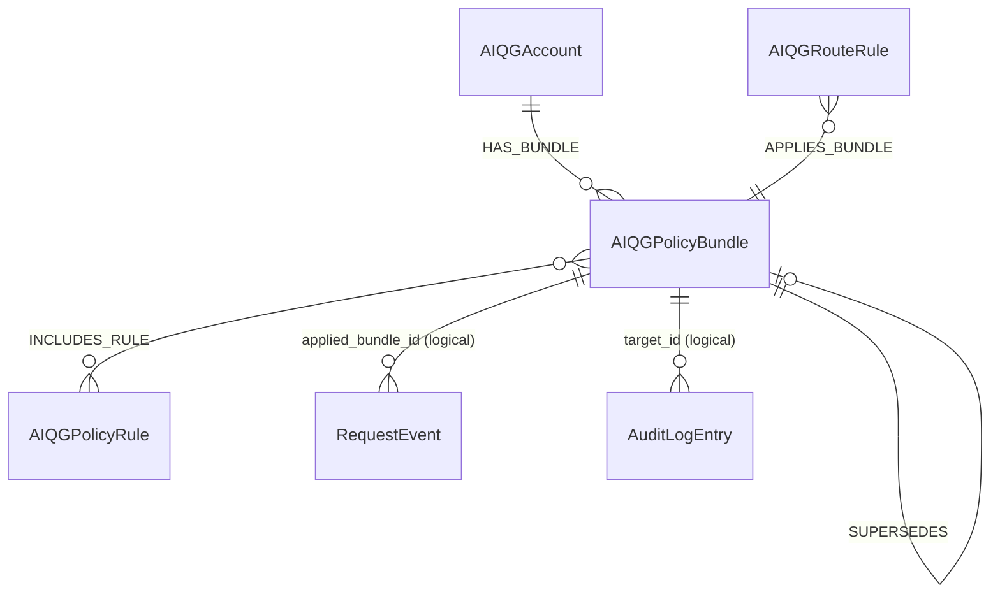

# AIQG Policy Bundle — Data Model

**File:** `aether-shared/data-models/aiqg/policy-bundle.md`
**Status:** Draft v1.0.0
**Date:** 2026-05-31
**Owner:** TAS Platform
**Spec refs:** [source-spec-v0.2.md §3.5](source-spec-v0.2.md), [build-vs-reuse.md §2.5, §7.5](build-vs-reuse.md)

---

## 1. Overview

### Purpose

A **Policy Bundle** is a named, versioned collection of [[policy-rule]] references that the AIQG gateway applies to a request. Bundles are the deployable unit of policy: dashboards edit and version them; route rules ([[route-rule]]) attach them to traffic patterns; per-request `TAS-Policy-Bundle` headers select them inline; the gateway resolves a single active bundle per request and executes its rules.

Bundles exist because **rules are too granular to manage at scale** and **per-request policy strings are too noisy to govern**. A bundle is the human-meaningful contract — "production_strict" — that platform teams reason about, while individual rules (sampling rate, PII detector, judge cadence) are implementation atoms inside it.

### Ownership

- **Service of record:** `aiqg-dashboard-be` (CRUD, versioning, activation)
- **Consumer:** `tas-llm-router` (resolves at request time via [[route-rule]] or `TAS-Policy-Bundle` header)
- **Storage:** Neo4j (graph store — bundles are relationship-heavy and low-write)
- **Cache:** Redis (`bundle:{id}:{version}` key, invalidated on bundle update event)

### Lifecycle Summary

`draft` → `active` → `deprecated` → `archived`. Exactly one version per `(tenant_id, name)` may be `active` at a time. Activation atomically deprecates the prior active version (Cypher transaction). Bundles are never hard-deleted (audit lineage).

### Key Characteristics

- Tenant-scoped — no global bundles in MVP; vertical-compliance shared bundles (PCI/HIPAA/SOC2) are Phase 3
- Versioned via semver string; version history retained via `:SUPERSEDES` edges
- Referenced by name + version from route rules and headers; resolution is cache-first
- Includes ordered rule references (`:INCLUDES_RULE {order}`) — order matters for early-exit and short-circuit behavior
- Four starter bundles seeded at account provisioning (`production_strict`, `development_lenient`, `pii_strip`, `audit_full`)

---

## 2. Schema Definition

### Storage

- **Primary store:** Neo4j node label `:AIQGPolicyBundle`
- **Why Neo4j:** Bundles are low write rate, relationship-heavy (bundle → rules, bundle → bundle for version chains, route → bundle), and multi-tenant scoped — this is Neo4j's sweet spot rather than a relational table
- **Cache:** Redis (gateway hot path)
- **Source of truth for starter bundles:** `Gatekeeper/configs/rules/aiqg_starter_bundles.yaml` (additive new file)

### Properties

#### Core Identity

| Property | Type | Required | Notes |
|---|---|---|---|
| `id` | UUID v7 | Yes | Primary key |
| `tenant_id` | UUID | Yes | Indexed; bundle is tenant-scoped |
| `name` | string | Yes | Lowercase snake_case; unique per tenant per name (versions share a name) |
| `display_name` | string | Yes | Customer-friendly label shown in the dashboard |
| `description` | text | No | Free-form description |
| `version` | semver string | Yes | e.g., `1.0.0`; immutable once activated |

#### State

| Property | Type | Required | Notes |
|---|---|---|---|
| `state` | enum | Yes | `draft` / `active` / `deprecated` / `archived` |
| `is_starter` | bool | Yes | `true` for the 4 starter bundles; cannot be deleted (only deprecated) |

#### Timestamps (ISO-8601 UTC)

| Property | Type | Required | Notes |
|---|---|---|---|
| `created_at` | timestamp | Yes | |
| `updated_at` | timestamp | Yes | |
| `activated_at` | timestamp | No | Set when state moves to `active` |
| `deprecated_at` | timestamp | No | Set when superseded or manually deprecated |

#### Attribution

| Property | Type | Required | Notes |
|---|---|---|---|
| `created_by_user_id` | UUID | Yes | FK to Keycloak user (`sub` claim) |

### Constraints & Indexes

```cypher
// Identity
CREATE CONSTRAINT aiqg_policy_bundle_id_unique IF NOT EXISTS
  FOR (b:AIQGPolicyBundle) REQUIRE b.id IS UNIQUE;

// Tenancy
CREATE INDEX aiqg_policy_bundle_tenant_idx IF NOT EXISTS
  FOR (b:AIQGPolicyBundle) ON (b.tenant_id);

// Name lookup (versions share name; (tenant_id, name, version) is unique)
CREATE CONSTRAINT aiqg_policy_bundle_name_version_unique IF NOT EXISTS
  FOR (b:AIQGPolicyBundle) REQUIRE (b.tenant_id, b.name, b.version) IS UNIQUE;

// Active-state guarded by application-layer transaction
CREATE INDEX aiqg_policy_bundle_state_idx IF NOT EXISTS
  FOR (b:AIQGPolicyBundle) ON (b.state);

// Starter flag (low cardinality, but useful for "clone starter" flow)
CREATE INDEX aiqg_policy_bundle_starter_idx IF NOT EXISTS
  FOR (b:AIQGPolicyBundle) ON (b.is_starter);
```

---

## 3. Relationships

### Outgoing

#### `(:AIQGAccount)-[:HAS_BUNDLE]->(:AIQGPolicyBundle)`

- **Direction:** Account → Bundle
- **Cardinality:** 1 account → many bundles (across versions and names)
- **Purpose:** Ownership; tenant_id on the bundle must equal the account's tenant_id

#### `(:AIQGPolicyBundle)-[:INCLUDES_RULE {order, mode}]->(:AIQGPolicyRule)`

- **Direction:** Bundle → Rule
- **Cardinality:** Many-to-many
- **Edge properties:**
  - `order` (int) — execution order within the bundle (low → high)
  - `mode` (enum: `enforce` / `dry_run` / `tag_only`) — per-rule override of the rule's default mode
- **Purpose:** The actual content of a bundle. Bundles target ≤50 rules each (shallow graph; resolver does a single hop).

#### `(:AIQGPolicyBundle)-[:SUPERSEDES]->(:AIQGPolicyBundle)`

- **Direction:** New version → previous version
- **Cardinality:** 0..1 (each new active version supersedes at most one prior)
- **Purpose:** Linear version history within a named bundle; enables rollback queries

### Incoming

#### `(:AIQGRouteRule)-[:APPLIES_BUNDLE]->(:AIQGPolicyBundle)`

- **Direction:** Route → Bundle
- **Cardinality:** Many routes → one bundle
- **Purpose:** Route rules attach bundles to matching traffic. The reverse traversal (`(b)<-[:APPLIES_BUNDLE]-(r)`) answers "which routes are still using this bundle?" — used in deprecation safety checks.

### Logical (via id reference, not edge)

- [[request-event]].`applied_bundle_id` — stamped on every request the bundle is applied to
- [[audit-log-entry]].`target_id` — bundle modifications produce audit entries
- [[tag-set]] — application of a bundle emits `policy:bundle:<name>` and `policy:rule:<name>` tags

### ERD



---

## 4. Validation Rules

### Field Validation

| Field | Rule |
|---|---|
| `name` | Matches `^[a-z][a-z0-9_]*$`; length 3–64 |
| `display_name` | Length 1–128; trimmed |
| `description` | Length ≤ 2048 |
| `version` | Matches semver `MAJOR.MINOR.PATCH`; reject pre-release/build metadata in MVP |
| `state` | One of `draft` / `active` / `deprecated` / `archived` |
| `is_starter` | Set at creation by provisioning code; not user-editable |
| `created_by_user_id` | Must resolve to a Keycloak user with `aiqg:policy:write` on this tenant |

### Business Rules

1. **Unique active per name:** At most one bundle with `state=active` per `(tenant_id, name)`. Enforced by activation transaction (Cypher MATCH+SET with `WHERE state='active'` + retry on conflict).
2. **Immutable after activation:** Once `state=active`, only `state` and `deprecated_at` may be mutated. Any change to rule composition requires a new `version`.
3. **Starter protection:** `is_starter=true` bundles may be `deprecated` by the tenant but never `archived` until at least one replacement bundle with the same `name` and `state=active` exists for the tenant.
4. **No orphan activation:** Cannot activate a bundle whose `:INCLUDES_RULE` set is empty.
5. **No cross-tenant rule reference:** Every `:INCLUDES_RULE` target rule must have the same `tenant_id` as the bundle (or be a tenant-shared rule with `tenant_id IS NULL`, reserved for Phase 3).
6. **Version monotonicity:** A new `version` of an existing `name` must semver-compare greater than every prior version of that name within the tenant.

---

## 5. Lifecycle & State Transitions

### State Machine

```mermaid
stateDiagram-v2
    [*] --> draft : Create
    draft --> active : Activate (atomic supersede)
    draft --> archived : Discard (never used)
    active --> deprecated : New version activated OR manual deprecate
    deprecated --> archived : No route references remain
    deprecated --> active : Rollback (rare; manual)
    archived --> [*]
```



### State Descriptions

| State | Editable? | Applied to traffic? | Notes |
|---|---|---|---|
| `draft` | Yes (rule composition, description, display_name) | No | Default state for new bundles; never seen by gateway |
| `active` | No (only `state` field) | Yes | One per `(tenant_id, name)`; immutable |
| `deprecated` | No | Only if no replacement exists for routes still pointing at it (grace period) | Cannot be referenced by *new* route rules |
| `archived` | No | No | Retained for audit lineage; route rules pointing here are rejected at validation time |

### Transition Triggers

| Transition | Trigger | Side effect |
|---|---|---|
| `draft → active` | User clicks **Activate** in dashboard (`POST /api/v1/policy-bundles/:id/activate`) | Prior active version (if any) → `deprecated`; Kafka event `com.tas.aiqg.bundle.updated.v1`; Redis cache invalidated |
| `draft → archived` | User clicks **Discard** | Bundle removed from working set; never billed |
| `active → deprecated` | Either (a) new version activated, (b) admin deprecates manually | Routes already pointing at it continue to resolve until they switch; new route refs rejected |
| `deprecated → archived` | Last route reference removed | Bundle no longer applied; remains queryable for audit |
| `deprecated → active` | Manual rollback (`POST /api/v1/policy-bundles/:id/rollback`) | Current active → `deprecated`; this version → `active`; audit entry written |

---

## 6. Examples

### 6.1 The 4 Starter Bundles

Seeded at account provisioning per [build-vs-reuse §7.5](build-vs-reuse.md):

| Name | Purpose | Included rules ([[policy-rule]] refs) |
|---|---|---|
| `production_strict` | High-rigor measurement, no transformation | `sample_llm_judge_5pct`, `strict_validity_check`, `pii_detect_input`, `pii_detect_output`, `audit_full` |
| `development_lenient` | Lower sampling, faster feedback | `sample_llm_judge_1pct`, `structural_validity_only`, `audit_summary` |
| `pii_strip` | Pre-forward PII tokenization | `pii_detect_input`, `pii_tokenize_input`, `audit_full` |
| `audit_full` | Maximum logging for compliance review | `audit_full`, `sample_llm_judge_10pct`, `payload_retain_sampled` |

Each starter is loaded from `Gatekeeper/configs/rules/aiqg_starter_bundles.yaml` (a new file; existing rule packs are not modified — additive only).

### 6.2 Cypher — Create a custom bundle for a tenant

```cypher
MATCH (a:AIQGAccount {tenant_id: $tenant_id})
CREATE (b:AIQGPolicyBundle {
  id: randomUUID(),
  tenant_id: $tenant_id,
  name: 'staging_balanced',
  display_name: 'Staging — balanced sampling',
  description: 'Lower judge cadence than production_strict; full PII detection.',
  version: '1.0.0',
  state: 'draft',
  is_starter: false,
  created_at: datetime(),
  updated_at: datetime(),
  created_by_user_id: $user_id
})
CREATE (a)-[:HAS_BUNDLE]->(b)
WITH b
MATCH (r:AIQGPolicyRule {tenant_id: $tenant_id, name: 'sample_llm_judge_2pct'})
CREATE (b)-[:INCLUDES_RULE {order: 10, mode: 'enforce'}]->(r)
WITH b
MATCH (r:AIQGPolicyRule {tenant_id: $tenant_id, name: 'pii_detect_input'})
CREATE (b)-[:INCLUDES_RULE {order: 20, mode: 'enforce'}]->(r)
RETURN b;
```

### 6.3 Cypher — List active bundles for a tenant ordered by usage

```cypher
MATCH (a:AIQGAccount {tenant_id: $tenant_id})-[:HAS_BUNDLE]->(b:AIQGPolicyBundle {state: 'active'})
OPTIONAL MATCH (b)<-[ref:APPLIES_BUNDLE]-(:AIQGRouteRule)
WITH b, count(ref) AS route_ref_count
RETURN b.name AS name,
       b.version AS version,
       b.display_name AS display_name,
       route_ref_count,
       b.activated_at AS activated_at
ORDER BY route_ref_count DESC, b.name;
```

### 6.4 Cypher — Clone a starter bundle for customization

```cypher
MATCH (a:AIQGAccount {tenant_id: $tenant_id})-[:HAS_BUNDLE]->(src:AIQGPolicyBundle {
  name: 'production_strict',
  state: 'active',
  is_starter: true
})
CREATE (dst:AIQGPolicyBundle {
  id: randomUUID(),
  tenant_id: $tenant_id,
  name: 'production_strict_custom',
  display_name: 'Production — custom',
  description: 'Forked from production_strict for app-specific tuning.',
  version: '1.0.0',
  state: 'draft',
  is_starter: false,
  created_at: datetime(),
  updated_at: datetime(),
  created_by_user_id: $user_id
})
CREATE (a)-[:HAS_BUNDLE]->(dst)
WITH src, dst
MATCH (src)-[inc:INCLUDES_RULE]->(rule:AIQGPolicyRule)
CREATE (dst)-[:INCLUDES_RULE {order: inc.order, mode: inc.mode}]->(rule)
RETURN dst;
```

### 6.5 Cypher — Activation transaction (atomic supersede)

```cypher
// Run in a single transaction; retry on serialization conflict at app layer.
MATCH (target:AIQGPolicyBundle {id: $bundle_id, state: 'draft'})
WITH target
OPTIONAL MATCH (target)<-[:HAS_BUNDLE]-(a:AIQGAccount)
                       -[:HAS_BUNDLE]->(prev:AIQGPolicyBundle {
  name: target.name,
  state: 'active'
})
WHERE prev.id <> target.id
// Deprecate prior version, if any.
FOREACH (p IN CASE WHEN prev IS NULL THEN [] ELSE [prev] END |
  SET p.state = 'deprecated',
      p.deprecated_at = datetime(),
      p.updated_at = datetime()
)
// Activate target and link supersede edge.
SET target.state = 'active',
    target.activated_at = datetime(),
    target.updated_at = datetime()
FOREACH (p IN CASE WHEN prev IS NULL THEN [] ELSE [prev] END |
  CREATE (target)-[:SUPERSEDES]->(p)
)
RETURN target, prev;
```

### 6.6 Cypher — Roll back to a previous version

```cypher
MATCH (current:AIQGPolicyBundle {tenant_id: $tenant_id, name: $name, state: 'active'})
MATCH (prev:AIQGPolicyBundle {id: $rollback_to_id, state: 'deprecated'})
WHERE prev.name = current.name AND prev.tenant_id = current.tenant_id
SET current.state = 'deprecated',
    current.deprecated_at = datetime(),
    current.updated_at = datetime()
SET prev.state = 'active',
    prev.activated_at = datetime(),
    prev.updated_at = datetime()
RETURN current, prev;
```

### 6.7 REST — GET `/api/v1/policy-bundles`

**Request:**

```http
GET /api/v1/policy-bundles?state=active HTTP/1.1
Authorization: Bearer <keycloak-jwt>
```

**Response:**

```json
{
  "bundles": [
    {
      "id": "01952e7a-7c1e-7c8e-9d2a-1f4a9b6c0a01",
      "name": "production_strict",
      "display_name": "Production — strict",
      "description": "High-rigor measurement, no transformation",
      "version": "1.0.0",
      "state": "active",
      "is_starter": true,
      "rule_count": 5,
      "route_references": 4,
      "created_at": "2026-05-31T18:14:02.341Z",
      "activated_at": "2026-05-31T18:14:02.341Z",
      "rules": [
        { "name": "sample_llm_judge_5pct", "order": 10, "mode": "enforce" },
        { "name": "strict_validity_check", "order": 20, "mode": "enforce" },
        { "name": "pii_detect_input", "order": 30, "mode": "enforce" },
        { "name": "pii_detect_output", "order": 40, "mode": "enforce" },
        { "name": "audit_full", "order": 50, "mode": "enforce" }
      ]
    }
  ],
  "page": { "next_cursor": null }
}
```

### 6.8 REST — Activate a bundle

```http
POST /api/v1/policy-bundles/01952e7a-7c1e-7c8e-9d2a-1f4a9b6c0a01/activate HTTP/1.1
Authorization: Bearer <keycloak-jwt>

201 Created
{
  "bundle": { "id": "...", "state": "active", "activated_at": "2026-05-31T18:14:02.341Z" },
  "superseded": { "id": "01952d99-...", "state": "deprecated", "deprecated_at": "2026-05-31T18:14:02.341Z" }
}
```

---

## 7. Cross-Service References

### Service Reads / Writes

| Service | Reads | Writes |
|---|---|---|
| `aiqg-dashboard-be` | All | All (CRUD + activation) |
| `tas-llm-router` | Active bundle by id+version (via Redis, miss → Neo4j) | Never writes; reads only |
| `tas-spark-jobs/aiqg_aggregator` | Bundle name + version for grouping aggregated metrics | Never |
| `aiqg-ui` | Via `aiqg-dashboard-be` REST | Via `aiqg-dashboard-be` REST |

### ID Mapping Chain

- Bundle `id` (UUID v7) → stamped on every [[request-event]].`applied_bundle_id`
- Bundle `(name, version)` → referenced by [[route-rule]].`bundle_name` + `bundle_version`
- Bundle `id` → referenced by [[audit-log-entry]].`target_id` (with `target_type='policy_bundle'`)

### Resolution Order at Request Time

Per [source-spec §3.5.2](source-spec-v0.2.md): (1) `TAS-Policy-Bundle` header if present, (2) most-specific matching route rule, (3) account default bundle, (4) pure pass-through (no bundle applied).

---

## 8. Tenant & Space Isolation

### Isolation Model

- Every bundle has `tenant_id`; every query MUST filter on it (no exceptions in MVP)
- Bundle ownership: `(:AIQGAccount {tenant_id})-[:HAS_BUNDLE]->(:AIQGPolicyBundle {tenant_id})` — the tenant_id is denormalized on the bundle for query-side filtering
- Rules referenced via `:INCLUDES_RULE` MUST share the same `tenant_id` as the bundle (Phase 3 will introduce shared-tenant rules with `tenant_id IS NULL` for vertical-compliance starter packs)
- Route rules referencing a bundle MUST share the same `tenant_id`

### Isolation Queries

#### List all bundles a route could legally reference

```cypher
MATCH (r:AIQGRouteRule {id: $route_id})
MATCH (a:AIQGAccount {tenant_id: r.tenant_id})-[:HAS_BUNDLE]->(b:AIQGPolicyBundle)
WHERE b.state IN ['active', 'deprecated']
RETURN b.name, b.version, b.state
ORDER BY b.state, b.name;
```

#### Reject cross-tenant rule attachment at write time

```cypher
MATCH (b:AIQGPolicyBundle {id: $bundle_id})
MATCH (r:AIQGPolicyRule {id: $rule_id})
WHERE r.tenant_id = b.tenant_id  // hard guard
CREATE (b)-[:INCLUDES_RULE {order: $order, mode: $mode}]->(r)
RETURN b, r;
// Caller checks rowcount; 0 rows = tenant mismatch; reject 403
```

### Cross-Region Enforcement

- Bundles replicate to all regions via Neo4j multi-DC; activation propagates eventually consistent (~seconds)
- A bundle is *applied* in a region only when both the bundle and its referenced rules are visible to that region's gateway cache
- The dashboard surfaces "propagation status" per region on the bundle detail page; until all regions report ready, the bundle is `active` but routes pinning it may fall back to the prior version
- Document the propagation delay in customer-facing docs (typical: <5 s within DC, <30 s cross-DC)

---

## 9. Performance Considerations

### Read Profile

- Read-heavy: every gateway request resolves at most one bundle
- Write-light: a tenant typically activates <10 bundle versions per month
- Bundle composition shallow: ≤50 rules per bundle, single hop from `:AIQGPolicyBundle` to `:AIQGPolicyRule`

### Caching Strategy

- **Redis key:** `bundle:{id}:{version}` (immutable once `active`, so cache is safe to keep until invalidated)
- **TTL:** 1 hour idle, 24 hours absolute (defense in depth — pubsub invalidation is primary)
- **Invalidation:** Kafka event `com.tas.aiqg.bundle.updated.v1` consumed by every gateway instance; consumer purges `bundle:{id}:*` keys on receipt
- **Cache miss path:** Neo4j read with pattern `MATCH (b:AIQGPolicyBundle {id: $id})-[inc:INCLUDES_RULE]->(r:AIQGPolicyRule) RETURN b, collect({rule: r, order: inc.order, mode: inc.mode}) AS rules` — one round trip, returns the full executable bundle

### Index Plan

- `:AIQGPolicyBundle(id)` unique — primary lookup
- `:AIQGPolicyBundle(tenant_id)` — tenant scoping
- `:AIQGPolicyBundle(tenant_id, name, version)` unique — version lookup
- `:AIQGPolicyBundle(state)` — admin queries
- `:AIQGPolicyBundle(is_starter)` — starter clone flow

### Anti-patterns

- Do not deep-traverse from bundle through rules to rule-internal config — rules are atomic from the bundle's perspective
- Do not load all versions of a bundle on a hot path — only the active version is needed at request time; version history is admin-only
- Do not write `applied_bundle_id` into request events by traversing the graph — the gateway already has the resolved bundle in memory; emit the id directly

---

## 10. Security & Compliance

### Sensitive Fields

- No PII in the bundle itself — bundle definitions are policy metadata, not user content
- `created_by_user_id` is a Keycloak `sub` (UUID), not a PII attribute, but treat as user-correlated data under GDPR

### Access Control

- Required Keycloak role for **read:** `aiqg:policy:read` (any user in the Space)
- Required Keycloak role for **write/draft:** `aiqg:policy:write`
- Required Keycloak role for **activate / deprecate / rollback:** `aiqg:policy:activate`
- MVP: `aiqg:policy:activate` is granted to anyone with the Space-level `admin` role; finer RBAC is Phase 3 per [build-vs-reuse §7.5](build-vs-reuse.md) deferral list
- Cross-tenant access is impossible by construction — all queries are scoped by `tenant_id` from the JWT

### Audit

Every state transition, rule attachment/detachment, and rollback writes an [[audit-log-entry]] with:
- `target_type='policy_bundle'`
- `target_id=<bundle_id>`
- `action` ∈ {`create`, `add_rule`, `remove_rule`, `activate`, `deprecate`, `archive`, `rollback`}
- `actor_user_id` from the JWT
- `before` / `after` JSON snapshots of the bundle's mutable fields

### Compliance Touchpoints

- **SOC 2:** Activation is a change-management event; audit log entries feed the CC8.1 (change management) control
- **GDPR Art. 30:** Bundle metadata contains no personal data; user attribution (`created_by_user_id`) is subject to right-to-erasure (replaced with `deleted_user` sentinel on user deletion)
- **NIST AI RMF (MEASURE 2.7):** Bundle versioning + activation history provides the documented governance trail required for AI system change control

---

## 11. Migration History

### v1.0.0 — 2026-05-31

Initial schema. Created `:AIQGPolicyBundle` label with constraints and indexes per §2.5. Seeded 4 starter bundles (`production_strict`, `development_lenient`, `pii_strip`, `audit_full`) from `Gatekeeper/configs/rules/aiqg_starter_bundles.yaml` at account provisioning time.

```cypher
// Migration 0001 — create constraints
CREATE CONSTRAINT aiqg_policy_bundle_id_unique IF NOT EXISTS
  FOR (b:AIQGPolicyBundle) REQUIRE b.id IS UNIQUE;
CREATE CONSTRAINT aiqg_policy_bundle_name_version_unique IF NOT EXISTS
  FOR (b:AIQGPolicyBundle) REQUIRE (b.tenant_id, b.name, b.version) IS UNIQUE;
CREATE INDEX aiqg_policy_bundle_tenant_idx IF NOT EXISTS
  FOR (b:AIQGPolicyBundle) ON (b.tenant_id);
CREATE INDEX aiqg_policy_bundle_state_idx IF NOT EXISTS
  FOR (b:AIQGPolicyBundle) ON (b.state);
CREATE INDEX aiqg_policy_bundle_starter_idx IF NOT EXISTS
  FOR (b:AIQGPolicyBundle) ON (b.is_starter);
```

---

## 12. Known Issues & Limitations

1. **Multi-region eventual consistency.** Bundle activation propagates eventually consistent across Neo4j DCs (~seconds). A request hitting a region whose cache has not yet seen the new bundle resolves to the prior version. Acceptable for MVP; document in customer-facing docs. Phase 3 may introduce a synchronous propagation gate.
2. **Concurrent activation race.** Two admins activating different draft versions of the same bundle name within milliseconds can race. Handled by the Cypher `MATCH ... WHERE state='active' ... SET state='deprecated'` transaction plus app-layer retry on serialization conflict. Test coverage in `aiqg-dashboard-be` integration tests.
3. **No vertical-compliance shared bundles in MVP.** PCI/HIPAA/SOC2/GDPR starter packs are deferred to Phase 3 per [build-vs-reuse §7.5](build-vs-reuse.md). Customers needing these in MVP must clone a starter and add their own rules.
4. **Rule mode override granularity.** The `mode` edge property on `:INCLUDES_RULE` lets a bundle override a rule's default mode (`enforce` → `dry_run`, etc.). This is intentional but creates a subtle reasoning load: "what mode is this rule running in?" requires looking at both the rule default and the bundle override. Dashboard surfaces the effective mode in the rule list.
5. **No bundle composition (bundles-of-bundles).** Phase 3 may introduce `(:AIQGPolicyBundle)-[:INCLUDES_BUNDLE]->(:AIQGPolicyBundle)` for compositional policy. MVP keeps bundles flat to avoid resolution-time graph traversal cost.
6. **Starter bundle updates ship via YAML.** Changes to `aiqg_starter_bundles.yaml` create *new* versioned bundles for new tenants but do not retroactively modify existing tenant bundles (additive-only per the non-breaking change constraint). Tenants opt in by activating the new version manually.

---

## 13. Related Documentation

### AIQG Siblings (this directory)

- [account.md](account.md) — AIQG Account (owner of bundles)
- [policy-rule.md](policy-rule.md) — Individual rule definitions referenced by bundles
- [route-rule.md](route-rule.md) — Routes that attach bundles to traffic patterns
- [audit-log-entry.md](audit-log-entry.md) — Audit trail for bundle changes
- [request-event.md](request-event.md) — Stamps `applied_bundle_id` per request
- [tag-set.md](tag-set.md) — `policy:bundle:<name>` and `policy:rule:<name>` tags emitted by bundle application

### Cross-Service

- [source-spec-v0.2.md §3.5](source-spec-v0.2.md) — Policy as Headers / Routes (spec source)
- [source-spec-v0.2.md §3.5.1](source-spec-v0.2.md) — `TAS-Policy-Bundle` header
- [source-spec-v0.2.md §3.5.2](source-spec-v0.2.md) — Route-attached policy
- [build-vs-reuse.md §2.5](build-vs-reuse.md) — Build plan for policy resolver
- [build-vs-reuse.md §7.5](build-vs-reuse.md) — Starter bundle taxonomy decision
- [aether-be/neo4j-schema.md](../aether-be/neo4j-schema.md) — Neo4j graph conventions
- [keycloak/jwt-token-structure.md](../keycloak/jwt-token-structure.md) — JWT roles used for RBAC

### Plan & Spec

- [build-vs-reuse.md §8](build-vs-reuse.md) — File-authoring checklist (this file is one of 16)
- [build-vs-reuse.md §9 — MVP](build-vs-reuse.md) — Phasing context for what ships day 1

---

## 14. Changelog

| Version | Date | Author | Notes |
|---|---|---|---|
| 1.0.0 | 2026-05-31 | TAS Platform | Initial spec draft |
