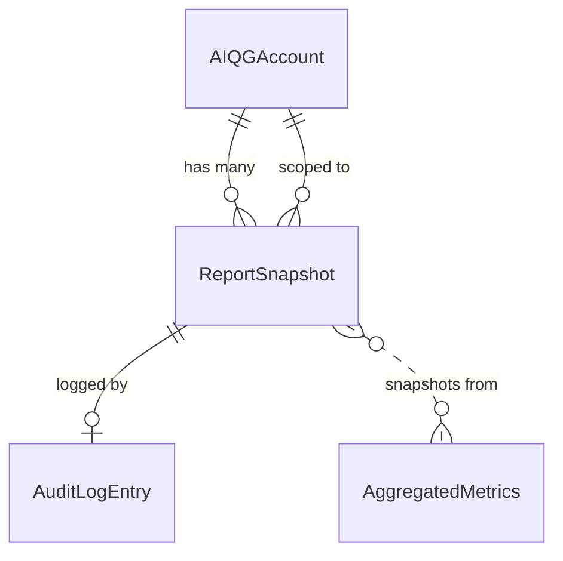

# Report Snapshot

The Day-1 diagnostic report and its periodic siblings are the conversion artifact for the AI Quality Gateway. Per the spec's §1, customers screenshot it and send it to their CFO; the entire product exists to deliver this document credibly. The Report Snapshot model is the schema for that frozen artifact.

Snapshots are **immutable**. Once generated, the row never changes. Regenerating a report for the same window produces a new snapshot with a new `report_id`; the old one is preserved. This is critical because the source data ([[aggregated-metrics]]) can change due to late-arriving events, schema migrations, or threshold recalibration — the report must remain reproducible regardless.

## 1. Overview

| Aspect | Value |
|---|---|
| **Purpose** | Frozen, shareable, point-in-time view of a tenant's AI stack health, rendered to HTML + PDF and stored in MinIO |
| **Primary consumer** | The AI program owner / platform team / CFO; secondary: dashboard UI, share-link recipients |
| **Lifecycle** | `pending` → `generating` → `ready` → `archived` |
| **Ownership** | Owned by [[account]]; only viewable by users with `aiqg:report:read` role in the owning Space |
| **Immutability** | Strict — append-only; no UPDATEs after status reaches `ready` |
| **Reproducibility** | All score-shaping inputs (`scoring_version`, `score_thresholds_used`, `score_weights_used`) are frozen into the snapshot itself |
| **Storage** | PostgreSQL row for metadata + MinIO objects for the rendered HTML + PDF artifacts |

The Day-1 report has the highest narrative weight. It is the artifact that, per the spec, "creates demand for Phase 2." Its data sources are the [[aggregated-metrics]] hypertables; its rendering is template-driven (Go `text/template`); its delivery is via dashboard download and (Phase 2) a public share URL.

## 2. Schema Definition

PostgreSQL table `aiqg.report_snapshot`. This is **not** a TimescaleDB hypertable — write rate is low (orders of magnitude below per-request events), queries are by id, not by time, and joins are minimal.

```sql
CREATE TABLE aiqg.report_snapshot (
    report_id                       UUID PRIMARY KEY,
    tenant_id                       UUID NOT NULL,
    aiqg_account_id                 UUID NOT NULL,

    -- Report identity
    report_type                     TEXT NOT NULL CHECK (report_type IN
                                        ('day_1','weekly','monthly','on_demand','custom')),
    report_kind                     TEXT NOT NULL CHECK (report_kind IN
                                        ('clear_diagnostic','compliance_audit','cost_only','trustworthiness')),
    period_start                    TIMESTAMPTZ NOT NULL,
    period_end                      TIMESTAMPTZ NOT NULL,
    generated_at                    TIMESTAMPTZ NOT NULL DEFAULT now(),
    generated_by_actor_type         TEXT NOT NULL CHECK (generated_by_actor_type IN
                                        ('system_auto','user','scheduled')),
    generated_by_actor_id           TEXT NOT NULL,

    -- State
    status                          TEXT NOT NULL DEFAULT 'pending' CHECK (status IN
                                        ('pending','generating','ready','failed','archived')),
    error_message                   TEXT,

    -- Window summary
    request_count_observed          BIGINT NOT NULL CHECK (request_count_observed >= 1),
    streaming_pct                   NUMERIC(4,1) NOT NULL,
    vendors_detected                TEXT[] NOT NULL,
    workflows_detected              TEXT[] NOT NULL,

    -- CLEAR composite (FROZEN at generation; never recomputed)
    clear_cost_score                SMALLINT NOT NULL CHECK (clear_cost_score BETWEEN 0 AND 100),
    clear_latency_score             SMALLINT NOT NULL CHECK (clear_latency_score BETWEEN 0 AND 100),
    clear_efficacy_score            SMALLINT NOT NULL CHECK (clear_efficacy_score BETWEEN 0 AND 100),
    clear_assurance_score           SMALLINT NOT NULL CHECK (clear_assurance_score BETWEEN 0 AND 100),
    clear_reliability_score         SMALLINT CHECK (clear_reliability_score BETWEEN 0 AND 100),  -- nullable: partial in MVP
    clear_composite_score           SMALLINT NOT NULL CHECK (clear_composite_score BETWEEN 0 AND 100),
    scoring_version                 TEXT NOT NULL,
    score_thresholds_used           JSONB NOT NULL,
    score_weights_used              JSONB NOT NULL,

    -- Cost destruction (FROZEN)
    total_spend_usd                 NUMERIC(12,2) NOT NULL,
    direct_payload_waste_usd        NUMERIC(12,2) NOT NULL,
    induced_output_waste_usd        NUMERIC(12,2) NOT NULL,
    genuine_post_model_waste_usd    NUMERIC(12,2) NOT NULL,
    gateway_addressable_pct         NUMERIC(4,1) NOT NULL,
    annualized_destruction_usd      NUMERIC(12,2) NOT NULL,

    -- Latency decomposition (FROZEN p95s)
    p95_end_to_end_ms               INTEGER NOT NULL,
    p95_network_round_trip_ms       INTEGER NOT NULL,
    p95_gateway_overhead_ms         INTEGER NOT NULL,
    p95_vendor_ttft_ms              INTEGER NOT NULL,
    p95_vendor_generation_ms        INTEGER NOT NULL,
    dominant_latency_component      TEXT NOT NULL CHECK (dominant_latency_component IN
                                        ('network','gateway','vendor_ttft','vendor_generation')),

    -- Input quality findings (FROZEN, MVP heuristics)
    rag_traffic_pct                 NUMERIC(4,1),
    context_utilization_avg         NUMERIC(3,2),
    groundedness_failure_pct        NUMERIC(4,1),
    chunk_integrity_failure_pct     NUMERIC(4,1),

    -- Trustworthiness (FROZEN)
    nist_violations                 JSONB NOT NULL,         -- {characteristic: count}
    pii_in_output_pct               NUMERIC(4,1) NOT NULL,
    structural_validity_pct         NUMERIC(4,1) NOT NULL,
    prompt_injection_signals_count  INTEGER NOT NULL DEFAULT 0,

    -- Drift section
    cost_per_request_30d_change_pct NUMERIC(5,1),
    conversation_length_30d_change_turns NUMERIC(4,1),

    -- Narrative + recommendations (template-rendered text bullets)
    findings_narrative              JSONB NOT NULL,         -- {section: [bullet, ...]}
    recommendations                 JSONB NOT NULL,         -- {cta: ..., supporting: [...]}

    -- Rendered artifacts
    storage_uri_html                TEXT,                   -- minio://aiqg-reports/{tenant_id}/{report_id}.html
    storage_uri_pdf                 TEXT,                   -- minio://aiqg-reports/{tenant_id}/{report_id}.pdf
    template_version                TEXT NOT NULL,          -- e.g., "clear-diagnostic-v1.0.0"

    -- Phase-2 sharing
    share_token                     TEXT UNIQUE,
    share_expires_at                TIMESTAMPTZ,

    -- Audit hook
    audit_log_entry_id              UUID,                   -- entry that recorded generation; nullable until ready

    CHECK (period_start < period_end),
    CHECK (direct_payload_waste_usd + induced_output_waste_usd + genuine_post_model_waste_usd <= total_spend_usd + 0.01)
);

CREATE INDEX idx_report_snapshot_tenant_period
    ON aiqg.report_snapshot (tenant_id, period_end DESC);

CREATE INDEX idx_report_snapshot_account_ready
    ON aiqg.report_snapshot (aiqg_account_id, generated_at DESC)
    WHERE status = 'ready';

CREATE INDEX idx_report_snapshot_share_token
    ON aiqg.report_snapshot (share_token)
    WHERE share_token IS NOT NULL;

-- Prevent UPDATE on rows in terminal states
CREATE OR REPLACE FUNCTION aiqg.report_snapshot_immutable()
    RETURNS TRIGGER LANGUAGE plpgsql AS $$
BEGIN
    IF OLD.status IN ('ready','archived','failed')
       AND (NEW.status, NEW.storage_uri_pdf, NEW.findings_narrative, NEW.clear_composite_score)
            IS DISTINCT FROM
           (OLD.status, OLD.storage_uri_pdf, OLD.findings_narrative, OLD.clear_composite_score)
       AND NOT (OLD.status = 'ready' AND NEW.status = 'archived')
       AND NOT (OLD.status = 'ready' AND NEW.share_token IS DISTINCT FROM OLD.share_token)
    THEN
        RAISE EXCEPTION 'report_snapshot rows are immutable in % state', OLD.status;
    END IF;
    RETURN NEW;
END $$;

CREATE TRIGGER report_snapshot_immutable_trg
    BEFORE UPDATE ON aiqg.report_snapshot
    FOR EACH ROW EXECUTE FUNCTION aiqg.report_snapshot_immutable();
```

The trigger permits two specific transitions on a `ready` row: a state flip to `archived`, and share-token mutations (issue, revoke, expiry update). Every other field is locked once `status='ready'`.

## 3. Relationships



- **[[account]]** — every snapshot belongs to exactly one account
- **[[audit-log-entry]]** — generation emits one `export_generated` entry; share-token issuance emits another; the entry's id is recorded on the snapshot
- **[[aggregated-metrics]]** — the snapshot is computed *from* but does not *reference* metric rows (because metrics roll up; pinning to individual buckets would be brittle). The snapshot freezes derived values into its own columns

There is **no foreign key** from `report_snapshot` to `aggregated_metrics`. The relationship is *semantic*, not relational, by design — metric rows are mutable (Spark backfills, recalibrations) and a snapshot would break if it depended on them.

## 4. Validation Rules

| Rule | Enforced where | Rationale |
|---|---|---|
| `period_start < period_end` | DB CHECK | sanity |
| `request_count_observed >= 1` | DB CHECK | refuse empty-window reports — spec implies ≥24h of typical traffic for Day-1 |
| Waste decomposition sum ≤ total spend (+1¢ rounding) | DB CHECK | invariant of [[token-accounting]] decomposition |
| `dominant_latency_component` ∈ enum | DB CHECK | drives narrative templating |
| All percentage fields in [0, 100] | DB CHECK (column type + range) | rendering safety |
| Immutability after `ready` | trigger | reproducibility guarantee |
| `report_kind = 'clear_diagnostic'` for MVP | app layer | other kinds are Phase 2+ |
| `template_version` references a known compiled template | app layer | render must succeed |
| `clear_reliability_score` may be null in MVP | column nullable | per spec §2.5 — reliability is heuristic in MVP |

## 5. Lifecycle & State Transitions

```mermaid
stateDiagram-v2
    [*] --> pending : dashboard request | scheduled
    pending --> generating : worker claims job
    generating --> ready : artifacts uploaded, narrative computed
    generating --> failed : query error / render error / timeout
    failed --> pending : manual retry (new attempt; row stays)
    ready --> archived : retention policy
    archived --> [*]
```



Time targets:
- `pending → generating`: < 30s under normal worker load
- `generating → ready`: < 30s typical; 90s timeout — failure beyond that
- `ready → archived`: at customer-configured retention end (default never archive Day-1; weekly/monthly archived after 1 year)

A row never goes backwards from `ready`. A failed report can be re-attempted only by inserting a new `pending` row for the same window — the failed row is kept for audit.

## 6. Examples

### 6.1 Insert a pending Day-1 report (triggers generation)

```sql
INSERT INTO aiqg.report_snapshot (
    report_id, tenant_id, aiqg_account_id,
    report_type, report_kind,
    period_start, period_end,
    generated_by_actor_type, generated_by_actor_id,
    status,
    -- placeholder values; worker will populate on completion
    request_count_observed, streaming_pct, vendors_detected, workflows_detected,
    clear_cost_score, clear_latency_score, clear_efficacy_score,
    clear_assurance_score, clear_composite_score,
    scoring_version, score_thresholds_used, score_weights_used,
    total_spend_usd, direct_payload_waste_usd, induced_output_waste_usd,
    genuine_post_model_waste_usd, gateway_addressable_pct,
    annualized_destruction_usd,
    p95_end_to_end_ms, p95_network_round_trip_ms, p95_gateway_overhead_ms,
    p95_vendor_ttft_ms, p95_vendor_generation_ms, dominant_latency_component,
    nist_violations, pii_in_output_pct, structural_validity_pct,
    findings_narrative, recommendations,
    template_version
) VALUES (
    gen_random_uuid(), $1, $2,
    'day_1', 'clear_diagnostic',
    $3, $4,
    'system_auto', 'aiqg-dashboard-be',
    'pending',
    1, 0.0, '{}', '{}',
    0, 0, 0, 0, 0,
    'clear-v1.0', '{}', '{}',
    0, 0, 0, 0, 0.0, 0,
    0, 0, 0, 0, 0, 'vendor_ttft',
    '{}', 0.0, 0.0,
    '{}', '{}',
    'clear-diagnostic-v1.0.0'
);
```

The worker then takes the row, runs queries against [[aggregated-metrics]], computes derived values, renders templates, uploads artifacts, and `UPDATE`s to `status='ready'` (the immutability trigger permits transitions out of `pending`/`generating`).

### 6.2 Reading the Day-1 report for dashboard rendering

```sql
SELECT *
FROM aiqg.report_snapshot
WHERE aiqg_account_id = $1
  AND report_type = 'day_1'
  AND status = 'ready'
ORDER BY generated_at DESC
LIMIT 1;
```

### 6.3 Listing report history for the "Past Reports" view

```sql
SELECT report_id, report_type, period_start, period_end,
       clear_composite_score, total_spend_usd, status, generated_at
FROM aiqg.report_snapshot
WHERE tenant_id = $1
  AND status = 'ready'
ORDER BY generated_at DESC
LIMIT 50;
```

### 6.4 Sample `findings_narrative` JSON (frozen Acme example from spec §4.3)

```json
{
  "cost_destruction": [
    "You spent $8,420 last week on 47,283 requests.",
    "Direct payload waste: $3,180/week",
    "Induced output waste: $1,710/week",
    "Genuine post-model waste: $410/week",
    "Total destruction: $5,300/week (annualized $275,600)",
    "What active mode would address: 92% ($253,300 annualized)"
  ],
  "largest_sources": [
    "RAG context bloat: 18K avg tokens injected, ~5K used by model",
    "/api/customer-query retry rate: 61% — confident wrong answers",
    "Top 4 users drive 31% of spend"
  ],
  "latency_decomposition": [
    "P95 latency 8.2s: 5.8s vendor TTFT (71%), 2.0s generation (24%), 0.4s network (5%), 0.04s gateway (<1%)",
    "Vendor time-to-first-token dominant — prompts driving extended model think time"
  ],
  "input_quality": [
    "RAG-style traffic on 64% of requests",
    "71% of provided context tokens go unused",
    "43% of responses contain claims unsupported by context",
    "28% of retrieved chunks appear fragmented"
  ],
  "trustworthiness": [
    "0 prompt-injection signals detected",
    "PII in outputs: 0.8% (within tolerance)",
    "Structural validity: 94%",
    "Policy violations: 0.4%"
  ],
  "drift": [
    "Cost-per-request rose 23% over the last 30 days",
    "Conversation length up from 2.1 turns to 3.4 turns"
  ]
}
```

### 6.5 Sample `recommendations` JSON

```json
{
  "cta": {
    "label": "Talk to us about active mode",
    "value_proposition_usd": 253300,
    "value_proposition_phrasing": "Active mode would capture the $253K of addressable destruction we identified"
  },
  "supporting": [
    "Most addressable waste is RAG context bloat — payload reduction would remove it in-flight",
    "Retry rate on /api/customer-query suggests upstream context quality issues",
    "No safety actions required — assurance score is marginal but improving"
  ]
}
```

### 6.6 API JSON: `GET /api/v1/reports/{report_id}` response

```json
{
  "report_id": "0d8c4a3d-d3a6-4b62-9f97-9bd2f4fa1d31",
  "tenant_id": "f3df0bbe-c44a-450c-8e51-0c70b6f1a1f4",
  "report_type": "day_1",
  "report_kind": "clear_diagnostic",
  "period": { "start": "2026-05-24T00:00:00Z", "end": "2026-05-31T00:00:00Z" },
  "generated_at": "2026-05-31T14:23:00Z",
  "status": "ready",
  "summary": {
    "request_count_observed": 47283,
    "vendors_detected": ["openai","anthropic"],
    "workflows_detected": ["rag","single_turn_qa","agentic"]
  },
  "clear": {
    "cost": 42, "latency": 61, "efficacy": 53, "assurance": 74, "reliability": null, "composite": 55,
    "scoring_version": "clear-v1.0",
    "thresholds": { "default": [50, 75], "assurance": [75, 90] }
  },
  "cost": {
    "total_spend_usd": 8420.00,
    "direct_payload_waste_usd": 3180.00,
    "induced_output_waste_usd": 1710.00,
    "genuine_post_model_waste_usd": 410.00,
    "gateway_addressable_pct": 92.3,
    "annualized_destruction_usd": 275600.00
  },
  "latency": {
    "p95_end_to_end_ms": 8200,
    "p95_network_round_trip_ms": 400,
    "p95_gateway_overhead_ms": 40,
    "p95_vendor_ttft_ms": 5800,
    "p95_vendor_generation_ms": 2000,
    "dominant_latency_component": "vendor_ttft"
  },
  "artifacts": {
    "html": "https://minio.tas.../aiqg-reports/.../report.html",
    "pdf":  "https://minio.tas.../aiqg-reports/.../report.pdf"
  }
}
```

## 7. Cross-Service References

| Service | How it interacts |
|---|---|
| **aiqg-dashboard-be** | inserts pending rows, runs the worker that drives `pending → generating → ready`, serves the GET endpoint, signs MinIO URLs |
| **aiqg-ui** | renders the Day-1 report screen (spec §4.3) from the JSON API, offers Share / Export buttons, polls for `status` transitions during generation |
| **MinIO** | stores `report.html` + `report.pdf` artifacts in bucket `aiqg-reports/{tenant_id}/` |
| **Kafka** | the generation worker subscribes to topic `tas.aiqg.report.generate.v1` (job queue); the dashboard publishes to it on report request |
| **TimescaleDB ([[aggregated-metrics]])** | source of all numeric data — but never referenced by FK to keep snapshots self-contained |
| **Keycloak** | gates access to `aiqg:report:read` and `aiqg:report:generate` roles |

ID-mapping chain (for cross-service tracing):

```
Space.tenant_id
  → AIQGAccount.tenant_id
    → ReportSnapshot.tenant_id (also stamped with aiqg_account_id)
      → AuditLogEntry.target_resource_id = report_id
        → MinIO object key prefixed with tenant_id
```

## 8. Tenant & Space Isolation

Every snapshot row carries both `tenant_id` and `aiqg_account_id`. The `tenant_id` is the canonical isolation key (matches existing TAS conventions); `aiqg_account_id` is the AIQG-product-internal identifier and is itself tenant-scoped.

Query rule: **every dashboard query MUST include a `tenant_id = $1` predicate.** Enforced via:
1. Application-layer middleware in `aiqg-dashboard-be` that injects the tenant filter from the Keycloak JWT
2. PostgreSQL Row-Level Security (RLS) policy (Phase 2)
3. The composite index `(tenant_id, period_end DESC)` makes the predicate cheap

MinIO object isolation: object keys are prefixed with `tenant_id`. The signed URL generator validates that the requesting JWT's tenant matches the prefix before signing. Cross-tenant reads are an explicit code path requiring `aiqg:admin:cross_tenant` role and are logged via [[audit-log-entry]] with `severity=critical`.

Sharing (Phase 2): the `share_token` route is **scoped to the snapshot**, not to the tenant — recipients see only that one report. Tokens are revocable, expirable, and emit audit entries on access.

## 9. Performance Considerations

- **Generation cost**: typically <30s end-to-end. Bounded by:
  - Aggregate query against [[aggregated-metrics]] 1h/1d tables: ~2-5s
  - Derived computation (waste decomposition, drift): ~1s
  - HTML render via Go `text/template`: <1s
  - PDF render via headless Chromium or wkhtmltopdf: 5-20s (the dominant cost)
- **Artifact sizes**: HTML ~200KB, PDF ~800KB. MinIO cost negligible.
- **Read patterns**:
  - "Latest Day-1 for account X": uses `idx_report_snapshot_account_ready`, sub-ms
  - "History list for tenant X, last 50": uses `idx_report_snapshot_tenant_period`, ~5ms
  - "Share-link lookup": uses `idx_report_snapshot_share_token`, sub-ms
- **Write patterns**: 1 insert per generation request; UPDATEs only during `pending → generating → ready` (≤3 updates per row, then immutable)
- **Concurrency**: at most one worker per `report_id`; row-level lock via `SELECT ... FOR UPDATE SKIP LOCKED` when the worker claims a pending row
- **Volume estimate**: even with daily reports for 10,000 tenants, only ~3.6M rows/year — trivial for PostgreSQL

## 10. Security & Compliance

| Concern | Handling |
|---|---|
| **Confidentiality** | Reports contain customer-confidential aggregate financial + compliance data; access gated by `aiqg:report:read` role + tenant isolation |
| **No raw payloads** | Reports never contain raw request/response bodies — only aggregates derived from tags + counts. Customers worried about prompt exposure can be told confidently "no prompts in the report" |
| **Share links** | Phase 2 only. Tokens opaque, scoped, revocable, expirable; access logged in [[audit-log-entry]] |
| **MinIO URLs** | Pre-signed, short-lived (1h default); never long-lived public URLs |
| **TAS staff access** | Self-referential: any TAS-staff read of a customer report creates an audit entry with `actor_type=system, event_type=audit_read` |
| **Export rights** | Per spec §3.11, customers own their reports and can download HTML/PDF on demand — no lock-in |
| **NIST mapping** | Snapshots embed the NIST AI RMF mapping (per [[tag-set]]) — this is the artifact the security architect forwards |
| **Retention** | Default: Day-1 reports retained forever (cheap); weekly archived to MinIO cold storage after 1 year; monthly retained 7 years for SOC 2 / compliance customers |

## 11. Migration History

| Version | Date | Change |
|---|---|---|
| v1.0.0 | 2026-05-31 | Initial schema. MVP supports `report_type ∈ {day_1, weekly, monthly, on_demand}` and `report_kind = clear_diagnostic` only |

**Forward-compatibility rules:**

- New `report_type` enum values are additive
- New schema columns are additive only — never remove columns or change types after MVP ship. Existing reports must remain renderable years later.
- `template_version` is per-report; older reports render with their original template — never retroactively change rendering
- `scoring_version` + `score_thresholds_used` + `score_weights_used` make reports reproducible even after CLEAR threshold recalibration per spec §6.2.16

**Breaking changes are forbidden** for this model. The whole point of the snapshot model is durability across system evolution.

## 12. Known Issues & Limitations

- **Template versioning is per-render, not per-storage.** If we ever need to re-render an old report after a template version change, the old template definition must still be available. Mitigation: template files committed to repo with version suffix; Go binary includes all historical versions (small).
- **PDF rendering dependency.** Headless Chromium / wkhtmltopdf are heavy. MVP could ship HTML-only and add PDF in a fast follow if the renderer choice slows down delivery.
- **Phase 2: `clear_reliability_score` becomes mandatory** once conversation threading lands. MVP keeps it nullable to ship sooner.
- **Customer disputes against a report finding** are resolved by re-running the same window's query against [[response-event]] (the source of truth). The report itself is canonical — not authoritative.
- **Share tokens don't expire on revocation** automatically — revocation marks the token invalid in the DB; the URL still resolves but the application enforces the revocation. Document this behavior in customer-facing docs.
- **No support for partial generation.** If the aggregate query for one section fails, the whole report fails. Could add per-section fallback in Phase 2 to ship a "best-effort" report when one section's data is unavailable.

## 13. Related Documentation

- [[account]] — owns the snapshot, holds default retention and scoring preferences
- [[aggregated-metrics]] — source of every numeric value frozen into the snapshot
- [[response-event]] — referenced semantically (not by FK) when customers want to drill from a report finding to source requests
- [[request-event]] — same
- [[token-accounting]] — definitions for the cost decomposition fields
- [[event-timestamps]] — definitions for the latency decomposition fields
- [[tag-set]] — NIST AI RMF mapping that appears in the report's trustworthiness section
- [[audit-log-entry]] — logged on every report generation and share-token operation
- [[policy-bundle]] — referenced in compliance-audit reports (Phase 2)
- [[workflow-classification]] — appears in the "Workflows detected" summary and per-workflow score breakdown
- Source: [`source-spec-v0.2.md`](./source-spec-v0.2.md) §4.3 (Day-1 report screen layout and design notes)

## 14. Changelog

| Version | Date | Author | Change |
|---|---|---|---|
| v1.0.0 | 2026-05-31 | TAS Platform | Initial spec draft. Defines schema, immutability trigger, generation lifecycle, and the Day-1 narrative structure per spec §4.3. MVP scope: `clear_diagnostic` kind only. |
