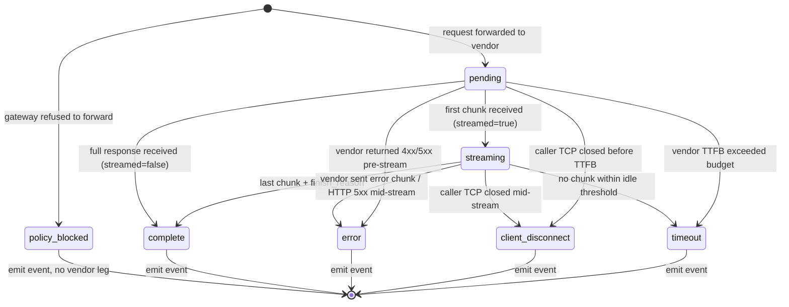

# AIQG Response Event

---

**Metadata**

```yaml
service: tas-llm-router (AIQG extension)
model: ResponseEvent
wire_form: CloudEvent
cloudevent_type: com.tas.aiqg.response.v1
kafka_topic: tas.aiqg.response.v1
storage: TimescaleDB hypertable aiqg.response_events
partition_key: complete_at
primary_key: (response_event_id, complete_at)
version: 1.0.0
last_updated: 2026-05-31
status: spec draft
```

---

## 1. Overview

### Purpose

The AIQG **Response Event** is the per-response capture envelope emitted by the AI Quality Gateway extension of `tas-llm-router` at the close of every inbound LLM request. It pairs 1:1 with an upstream [[request-event]] (`com.tas.aiqg.request.v1`) and carries the full set of measurable signals required to score the response on the five CLEAR dimensions (Cost, Latency, Efficacy, Assurance, Reliability) and to drive the Day-1 diagnostic report.

It is the **single source of truth** for "what happened on the response side of this LLM call" — vendor status, finish reason, token counts and cost, end-to-end timing decomposition (DNS / TLS / TTFB / TTFT / inter-token / last-chunk / complete), Gatekeeper tag set, structural validity, and the pre-computed CLEAR composite score. Spark aggregates these scalars; it does not re-derive them (per [build-vs-reuse §7.2](./build-vs-reuse.md#72-clear-scoring-location--decided-gateway-side-go)).

### Key Characteristics

- **Wire form**: CloudEvents 1.0 envelope, `type: com.tas.aiqg.response.v1`, published to Kafka topic `tas.aiqg.response.v1`
- **Storage form**: row in TimescaleDB hypertable `aiqg.response_events`, time-partitioned on `complete_at`
- **Pair semantics**: every response event references exactly one [[request-event]] via `request_event_id`; client disconnects and timeouts still emit a response event (with appropriate `status`)
- **Pre-computed CLEAR scores**: composite + per-dimension scalars are computed gateway-side at request close, stored as `smallint` for fast tenant-scoped aggregation
- **Scoring-version stamped**: every score carries `scoring_version` so the re-scoring escape hatch in [build-vs-reuse §7.2](./build-vs-reuse.md#72-clear-scoring-location--decided-gateway-side-go) remains possible
- **Payload separation**: full request/response bodies live in [[request-event]] / MinIO when retained; this event carries only **metrics and references**
- **Non-breaking**: net-new event type on a net-new topic. The existing `com.tas.activity.llm.response` is untouched per [build-vs-reuse §1.2](./build-vs-reuse.md#12-non-breaking-change-constraint)

### Business Context

The Response Event drives every downstream AIQG surface:

- **Day-1 diagnostic report** — aggregates millions of response events into the CLEAR grid, cost-destruction breakdown, latency waterfall, and NIST mapping that ship as the headline customer artifact
- **Ongoing dashboard** — `tas-spark-jobs/aiqg_aggregator` rolls these events into 1m / 1h / 1d windows in TimescaleDB; the dashboard queries the rollups, never the raw event table
- **Drift alerting** — Prometheus alert rules in `shared-monitoring` watch rolling-window deltas of `clear_composite_score` and `http_status` rates
- **Tenant invoicing / quotas** — `tenant_id` + token totals (via [[token-accounting]]) feed billing reconciliation
- **Vendor SLA enforcement** — `http_status` + per-stage latencies from [[event-timestamps]] support vendor-attributed outage reporting
- **LLM-as-judge feedback loop** — `sampled_for_llm_judge` + `groundedness_score` close the loop on the stratified sampler (see [build-vs-reuse §2.8](./build-vs-reuse.md#28-37--sampling-strategy))

---

## 2. Schema Definition

### 2.1 CloudEvent Envelope

```yaml
specversion: "1.0"
type: com.tas.aiqg.response.v1
source: tas-llm-router/aiqg
id: <response_event_id>             # UUID v4
time: <complete_at>                 # RFC 3339 timestamp
subject: <aiqg_account_id>          # for routing
datacontenttype: application/json
traceparent: <W3C trace context>    # optional
data: <ResponseEvent JSON, see §2.2>
```

### 2.2 Core Fields (TimescaleDB row + CloudEvent `data` payload)

#### Identity & Linkage

| Field | Type | Required | Default | Description |
|---|---|---|---|---|
| `response_event_id` | UUID | Yes | gen | Primary key. Stable across re-emits/replays. |
| `request_event_id` | UUID | Yes | from req | FK to [[request-event]]. Indexed. |
| `tenant_id` | UUID | Yes | from req | Denormalized from [[request-event]] for fast tenant-scoped queries. Matches `space.tenant_id`. |
| `aiqg_account_id` | UUID | Yes | from req | Denormalized from [[request-event]] / [[account]] for fast account-scoped queries. |

> **Denormalization rationale.** `tenant_id` and `aiqg_account_id` live on [[request-event]] too. Duplicating them here avoids a join on every dashboard query and lets TimescaleDB use the composite index (`tenant_id`, `complete_at`) directly. The trade-off (write-amplification + drift risk) is acceptable because both fields are immutable for the life of a request and they live in the same emit-time path.

#### Outcome & Status

| Field | Type | Required | Default | Description |
|---|---|---|---|---|
| `complete_at` | timestamptz | Yes | gen | Hypertable partition key. Wall-clock at request close. µs precision. |
| `status` | enum | Yes | gen | `success` \| `vendor_error` \| `gateway_error` \| `policy_blocked` \| `client_disconnect` \| `timeout` |
| `http_status` | int | Yes | from upstream | Vendor response status (200, 4xx, 5xx). `0` if the gateway blocked the request before forwarding. |
| `finish_reason` | string | No | from upstream | `stop` \| `length` \| `tool_calls` \| `content_filter` \| `null`. Null when the response never completed (e.g. client disconnect). |
| `vendor_request_id` | string | No | from upstream | Upstream vendor's response id (`x-request-id` for OpenAI, `request-id` for Anthropic). Null when absent (gateway-blocked, vendor outage before id assigned). |

#### Streaming Telemetry

| Field | Type | Required | Default | Description |
|---|---|---|---|---|
| `streamed` | bool | Yes | gen | Was the response actually streamed (SSE chunks observed)? Independent of whether the caller requested streaming. |
| `chunk_count` | int | Yes | `0` | Number of SSE chunks observed from the vendor. `0` for non-streamed responses; `0` is also valid for client-disconnect-before-first-chunk. |

#### Embedded References

Large or rich sub-structures live in their own model docs and are **referenced**, not inlined:

| Reference | Doc | Notes |
|---|---|---|
| Response body structure | [[response-structure]] | text, tool_calls, finish_reason, logprobs, structural validity |
| Token usage & cost | [[token-accounting]] | input / output / cached / tool tokens + vendor pricing |
| Timing decomposition | [[event-timestamps]] | TTFB / TTFT / inter-token / last_chunk / complete |
| Tag set | [[tag-set]] | quality + policy + NIST AI RMF tags |

In the CloudEvent payload these appear as either inline JSON blobs (for small structures like token-accounting scalars) or as opaque IDs that resolve via a join in TimescaleDB. The exact representation is fixed per-reference in the linked docs.

#### CLEAR Scores (Pre-Computed Gateway-Side)

Per [build-vs-reuse §7.2](./build-vs-reuse.md#72-clear-scoring-location--decided-gateway-side-go), CLEAR composite is computed inside `tas-llm-router` at request close and emitted as part of the response event. Spark aggregates the pre-computed scalars; it does not re-derive them.

| Field | Type | Required | Default | Description |
|---|---|---|---|---|
| `clear_cost_score` | smallint (0–100) | No | `null` | Cost dimension. Null when not scored (e.g. policy_blocked, where token usage is undefined). |
| `clear_latency_score` | smallint (0–100) | No | `null` | Latency dimension. Null on client_disconnect before first chunk. |
| `clear_efficacy_score` | smallint (0–100) | No | `null` | Efficacy dimension. **MVP: heuristic** (structural validity + hedge-phrase signals) per [source-spec §5.2](./source-spec-v0.2.md). Phase 2: LLM-as-judge augmented. |
| `clear_assurance_score` | smallint (0–100) | No | `null` | Assurance dimension. Derived from Gatekeeper compliance findings mapped via `aiqg_clear_assurance.yaml` rule pack. |
| `clear_reliability_score` | smallint (0–100) | No | `null` | Reliability dimension. **MVP: partial** (single-turn consistency proxy). Phase 2: full conversation-threading-based reliability per [build-vs-reuse §2.12](./build-vs-reuse.md#212-2125--clear-dimension-measurement). |
| `clear_composite_score` | smallint (0–100) | No | `null` | Composite. Equal-weight default (0.2 each) per [build-vs-reuse §7.5](./build-vs-reuse.md#75-spec-6-inherited-open-question-triage); future per-account weights from `account.scoring_weights`. |
| `scoring_version` | string | Yes | gen | e.g. `clear-v1.0`. **Required even when all scores null** so re-scoring jobs can identify candidate rows. See [build-vs-reuse §7.2](./build-vs-reuse.md#72-clear-scoring-location--decided-gateway-side-go) for the re-scoring escape hatch. |
| `score_weights_used` | jsonb | Yes | from [[account]] | Snapshot of `account.scoring_weights` at the moment of computation. Preserves auditability if account weights are changed later. |

> **Why `smallint` 0–100 not `numeric(3,2)`?** Storage compactness (2 bytes vs. 5) compounded across billions of rows. Resolution of 1 percentage point is below the noise floor of CLEAR heuristics. The published CLEAR thresholds (Healthy ≥75, Marginal 50–74, Failing <50) are all integer-aligned.

#### Quality Signals

| Field | Type | Required | Default | Description |
|---|---|---|---|---|
| `validity_passed` | bool | Yes | from scanner | `true` if structural validity check passed (JSON parse, tool-call schema match, code-fence balance, etc. — varies by workflow type). |
| `groundedness_score` | numeric(3,2) | No | `null` | LLM-judge groundedness (0.00–1.00). Only present when `sampled_for_llm_judge = true` and a small/large judge call completed. See [build-vs-reuse §2.8](./build-vs-reuse.md#28-37--sampling-strategy). |
| `sampled_for_llm_judge` | bool | Yes | `false` | Was this response selected by the stratified sampler? Sampling rate per [source-spec §3.8](./source-spec-v0.2.md): 100% deterministic, 5–10% small judge, 1% + triggered large judge. |

#### Payload Retention

| Field | Type | Required | Default | Description |
|---|---|---|---|---|
| `payload_retained` | bool | Yes | `false` | Was the full response body retained? Honors `account.payload_retention_mode` (`none` / `sampled` / `all`) — see [[account]]. |
| `payload_storage_uri` | string | No | `null` | MinIO URI (`s3://aiqg-payloads/<account_id>/<yyyy>/<mm>/<dd>/<response_event_id>.json.gz`) when retained. `null` otherwise. PII tokenization is applied via Databunker before write (per [source-spec §3.11](./source-spec-v0.2.md)). |

### 2.3 TimescaleDB Hypertable DDL

```sql
CREATE SCHEMA IF NOT EXISTS aiqg;

CREATE TABLE aiqg.response_events (
    -- identity & linkage
    response_event_id   uuid        NOT NULL,
    request_event_id    uuid        NOT NULL,
    tenant_id           uuid        NOT NULL,
    aiqg_account_id     uuid        NOT NULL,

    -- outcome
    complete_at         timestamptz NOT NULL,
    status              text        NOT NULL
        CHECK (status IN ('success','vendor_error','gateway_error',
                          'policy_blocked','client_disconnect','timeout')),
    http_status         int         NOT NULL,
    finish_reason       text,
    vendor_request_id   text,

    -- streaming
    streamed            bool        NOT NULL DEFAULT false,
    chunk_count         int         NOT NULL DEFAULT 0,

    -- references (embedded scalars; rich structures live in linked tables / MinIO)
    token_accounting    jsonb,       -- see [[token-accounting]]
    timings             jsonb,       -- see [[event-timestamps]]
    response_structure  jsonb,       -- see [[response-structure]]
    tags                text[],      -- see [[tag-set]]

    -- pre-computed CLEAR scores
    clear_cost_score        smallint CHECK (clear_cost_score BETWEEN 0 AND 100),
    clear_latency_score     smallint CHECK (clear_latency_score BETWEEN 0 AND 100),
    clear_efficacy_score    smallint CHECK (clear_efficacy_score BETWEEN 0 AND 100),
    clear_assurance_score   smallint CHECK (clear_assurance_score BETWEEN 0 AND 100),
    clear_reliability_score smallint CHECK (clear_reliability_score BETWEEN 0 AND 100),
    clear_composite_score   smallint CHECK (clear_composite_score BETWEEN 0 AND 100),
    scoring_version         text     NOT NULL,
    score_weights_used      jsonb    NOT NULL,

    -- quality signals
    validity_passed         bool     NOT NULL DEFAULT false,
    groundedness_score      numeric(3,2) CHECK (groundedness_score BETWEEN 0 AND 1),
    sampled_for_llm_judge   bool     NOT NULL DEFAULT false,

    -- payload retention
    payload_retained        bool     NOT NULL DEFAULT false,
    payload_storage_uri     text,

    PRIMARY KEY (response_event_id, complete_at)
);

-- Hypertable on complete_at, 1-day chunks
SELECT create_hypertable(
    'aiqg.response_events', 'complete_at',
    chunk_time_interval => INTERVAL '1 day',
    if_not_exists => TRUE
);

-- Compression after 7 days, retention 90 days raw (continuous aggregates persist longer)
ALTER TABLE aiqg.response_events SET (
    timescaledb.compress,
    timescaledb.compress_segmentby = 'tenant_id, aiqg_account_id',
    timescaledb.compress_orderby   = 'complete_at DESC'
);

SELECT add_compression_policy('aiqg.response_events', INTERVAL '7 days');
SELECT add_retention_policy  ('aiqg.response_events', INTERVAL '90 days');
```

---

## 3. Relationships

### Upstream

- **[[request-event]]** (1:1) — every response event references exactly one request event via `request_event_id`. The request event carries the request envelope, request body, source-app identifier, and the workflow classification result; the response event carries everything that happened *after* the gateway forwarded.

### Embedded

- **[[token-accounting]]** — input / output / cached / tool tokens + vendor pricing applied. Stored inline as `token_accounting jsonb`.
- **[[event-timestamps]]** — DNS / TLS / TTFB / TTFT / inter-token / last_chunk / complete. Stored inline as `timings jsonb`.
- **[[response-structure]]** — response text / tool_calls / finish_reason / logprobs / validity. Stored inline as `response_structure jsonb` when small; MinIO URI when above 64KB threshold.
- **[[tag-set]]** — Gatekeeper tag output (quality + policy + NIST AI RMF). Stored as `tags text[]` for index-friendly tag-presence queries (`tags @> ARRAY['nist:explainability']`).

### Downstream

- **[[aggregated-metrics]]** — `tas-spark-jobs/aiqg_aggregator` rolls response events into 1m / 5m / 1h / 1d windows. Reads pre-computed CLEAR scalars.
- **[[report-snapshot]]** — the Day-1 report and periodic snapshots freeze aggregated-metrics deltas + a small sample of representative response events for the narrative section.

### Tenancy

- **[[account]]** — `aiqg_account_id` maps to an AIQGAccount (Neo4j) which 1:1 maps to a `Space.tenant_id` (Neo4j) per [build-vs-reuse §4.6](./build-vs-reuse.md#46-update-existing-claudemd-files). Account-level fields used at emit time: `scoring_weights`, `payload_retention_mode`, `region`.

---

## 4. Validation Rules

| # | Rule | Rationale |
|---|---|---|
| V1 | `response_event_id` is unique per `(tenant_id, complete_at)` window | TimescaleDB primary key requires `(response_event_id, complete_at)` to be unique. Tenant scope makes UUID collisions astronomically unlikely. |
| V2 | `request_event_id` MUST resolve to an existing [[request-event]] row within ±5 minutes of `complete_at` | Pair semantics. Late responses (>5m) emit a `timeout` event regardless of upstream outcome. |
| V3 | If `status = 'policy_blocked'` then `http_status = 0` AND `vendor_request_id IS NULL` AND `streamed = false` | Gateway refused to forward. No vendor leg exists. |
| V4 | If `status = 'success'` then `http_status BETWEEN 200 AND 299` | Vendor success status range. 3xx responses are followed automatically by the HTTP client and reported as the final-leg status. |
| V5 | If `streamed = true` then `chunk_count >= 1` AND `timings.ttft IS NOT NULL` | A streamed response has at least one chunk and a measurable time-to-first-token. |
| V6 | If `sampled_for_llm_judge = false` then `groundedness_score IS NULL` | Groundedness is only computed for sampled responses. |
| V7 | If `payload_retained = true` then `payload_storage_uri IS NOT NULL` AND matches `s3://aiqg-payloads/...` | Retention without a URI is a leak. |
| V8 | If `payload_retained = true` then `account.payload_retention_mode IN ('sampled','all')` at emit time | A retained payload that violates account policy is a compliance incident. |
| V9 | `scoring_version` MUST be present even when all CLEAR scores are null | Re-scoring jobs need to know which rows are candidates for re-derivation. |
| V10 | `score_weights_used` MUST be a snapshot of `account.scoring_weights` at the moment of computation | Auditability if account weights are mutated later. |
| V11 | All CLEAR `*_score` fields are `BETWEEN 0 AND 100` or `NULL` | Domain constraint; enforced by `CHECK`. |
| V12 | `tags @> ARRAY['workflow:<type>']` matches the workflow classification on the paired request event | Cross-event consistency. Verified by a daily Spark sanity job, not at write time. |

---

## 5. Lifecycle

### State Diagram



### State → `status` Mapping

| Terminal State | `status` value | Typical `http_status` |
|---|---|---|
| `complete` (no error) | `success` | 200 |
| `error` (vendor) | `vendor_error` | 4xx / 5xx |
| `error` (gateway internal) | `gateway_error` | 0 or 502/504 |
| `policy_blocked` | `policy_blocked` | 0 |
| `client_disconnect` | `client_disconnect` | 0 (or last-known) |
| `timeout` | `timeout` | 0 (or 504) |

### Emit Guarantee

A response event is emitted for **every** terminal state. There is no path where a request event lives without a corresponding response event within the 5-minute pairing window (rule V2). The `aiqg_aggregator` Spark job uses outer joins on `request_event_id` to surface dropped pairs as `events_dropped_total{reason="missing_pair"}` Prometheus counters; the alert threshold is non-zero.

---

## 6. Examples

### 6.1 CloudEvent — `success` (streaming OpenAI chat completion)

```json
{
  "specversion": "1.0",
  "type": "com.tas.aiqg.response.v1",
  "source": "tas-llm-router/aiqg",
  "id": "e9c4d8a0-7d1e-4c33-bf8b-2c1f6b9a7d12",
  "time": "2026-05-31T14:22:18.412573Z",
  "subject": "acct_01J0Z8M2X9Y7C4N6V0P5R8T1QA",
  "datacontenttype": "application/json",
  "traceparent": "00-4bf92f3577b34da6a3ce929d0e0e4736-00f067aa0ba902b7-01",
  "data": {
    "response_event_id": "e9c4d8a0-7d1e-4c33-bf8b-2c1f6b9a7d12",
    "request_event_id":  "8f2a1d6c-3e9b-4a25-9c8a-1b5d3e7f0a44",
    "tenant_id":         "5b3d7e9f-1a2c-4d8e-9f0a-3c5e7b9d1f2a",
    "aiqg_account_id":   "acct_01J0Z8M2X9Y7C4N6V0P5R8T1QA",

    "complete_at":       "2026-05-31T14:22:18.412573Z",
    "status":            "success",
    "http_status":       200,
    "finish_reason":     "stop",
    "vendor_request_id": "req_7f3c1d9e2a4b5c6d8e0f",

    "streamed":          true,
    "chunk_count":       142,

    "token_accounting": {
      "input_tokens":  812,
      "output_tokens": 487,
      "cached_tokens":  640,
      "tool_tokens":     0,
      "cost_usd":       0.00342
    },
    "timings": {
      "dns_ms":         3.1,
      "tls_ms":        12.4,
      "tcp_ms":         5.8,
      "ttfb_ms":      184.0,
      "ttft_ms":      311.0,
      "inter_token_p50_ms": 24.0,
      "inter_token_p95_ms": 71.0,
      "last_chunk_ms": 3722.0,
      "complete_ms":   3741.0
    },
    "response_structure": {
      "text_len_chars": 2104,
      "tool_calls":     [],
      "logprobs":       null
    },
    "tags": [
      "workflow:rag",
      "validity:json_ok",
      "nist:explainability",
      "policy:pii_clean"
    ],

    "clear_cost_score":        82,
    "clear_latency_score":     77,
    "clear_efficacy_score":    71,
    "clear_assurance_score":   88,
    "clear_reliability_score": 65,
    "clear_composite_score":   77,
    "scoring_version":         "clear-v1.0",
    "score_weights_used":      { "cost":0.2,"latency":0.2,"efficacy":0.2,"assurance":0.2,"reliability":0.2 },

    "validity_passed":      true,
    "groundedness_score":   null,
    "sampled_for_llm_judge": false,

    "payload_retained":     false,
    "payload_storage_uri":  null
  }
}
```

### 6.2 CloudEvent — `policy_blocked` (gateway refused to forward)

The customer's request matched a `block` action in the resolved policy bundle (e.g. PII detected by Gatekeeper). No vendor leg exists; CLEAR scores are mostly null, the policy decision is recorded in [[tag-set]] and the audit-log entry is referenced.

```json
{
  "specversion": "1.0",
  "type": "com.tas.aiqg.response.v1",
  "source": "tas-llm-router/aiqg",
  "id": "f1a3b2c4-5e6d-7a8b-9c0d-e1f2a3b4c5d6",
  "time": "2026-05-31T14:25:02.000142Z",
  "subject": "acct_01J0Z8M2X9Y7C4N6V0P5R8T1QA",
  "datacontenttype": "application/json",
  "data": {
    "response_event_id": "f1a3b2c4-5e6d-7a8b-9c0d-e1f2a3b4c5d6",
    "request_event_id":  "9d4f8e2a-1b3c-4d5e-6f7a-8b9c0d1e2f3a",
    "tenant_id":         "5b3d7e9f-1a2c-4d8e-9f0a-3c5e7b9d1f2a",
    "aiqg_account_id":   "acct_01J0Z8M2X9Y7C4N6V0P5R8T1QA",

    "complete_at":       "2026-05-31T14:25:02.000142Z",
    "status":            "policy_blocked",
    "http_status":       0,
    "finish_reason":     null,
    "vendor_request_id": null,

    "streamed":          false,
    "chunk_count":       0,

    "token_accounting":  null,
    "timings": {
      "gateway_overhead_ms": 8.2
    },
    "response_structure": null,
    "tags": [
      "workflow:agentic",
      "policy:pii_block",
      "policy:bundle=production_strict",
      "action:block",
      "nist:privacy"
    ],

    "clear_cost_score":        null,
    "clear_latency_score":     null,
    "clear_efficacy_score":    null,
    "clear_assurance_score":   100,
    "clear_reliability_score": null,
    "clear_composite_score":   null,
    "scoring_version":         "clear-v1.0",
    "score_weights_used":      { "cost":0.2,"latency":0.2,"efficacy":0.2,"assurance":0.2,"reliability":0.2 },

    "validity_passed":         false,
    "groundedness_score":      null,
    "sampled_for_llm_judge":   false,

    "payload_retained":        true,
    "payload_storage_uri":     "s3://aiqg-payloads/acct_01J0Z8M2X9Y7C4N6V0P5R8T1QA/2026/05/31/f1a3b2c4-5e6d-7a8b-9c0d-e1f2a3b4c5d6.json.gz"
  }
}
```

Note: `policy_blocked` events are retained by default regardless of `account.payload_retention_mode` — the audit trail for refused requests is a compliance requirement (see [source-spec §3.11](./source-spec-v0.2.md) and [[audit-log-entry]]).

### 6.3 Hypertable DDL (chunk + compression policy)

See §2.3 above. The full DDL is the canonical source.

### 6.4 Diagnostic Query — Join Request + Response for Detail View

```sql
-- Detail view for a single request/response pair (Day-1 report drill-down)
SELECT
    rq.received_at                            AS request_at,
    rq.aiqg_account_id,
    rq.tenant_id,
    rq.request_structure -> 'workflow_type'   AS workflow_type,
    rq.source_app_identifier,

    rs.complete_at,
    rs.status,
    rs.http_status,
    rs.finish_reason,
    rs.streamed,
    rs.chunk_count,

    (rs.timings ->> 'ttft_ms')::numeric        AS ttft_ms,
    (rs.timings ->> 'complete_ms')::numeric    AS complete_ms,
    (rs.token_accounting ->> 'input_tokens')::int  AS input_tokens,
    (rs.token_accounting ->> 'output_tokens')::int AS output_tokens,
    (rs.token_accounting ->> 'cost_usd')::numeric  AS cost_usd,

    rs.clear_cost_score,
    rs.clear_latency_score,
    rs.clear_efficacy_score,
    rs.clear_assurance_score,
    rs.clear_reliability_score,
    rs.clear_composite_score,
    rs.scoring_version,

    rs.validity_passed,
    rs.sampled_for_llm_judge,
    rs.groundedness_score,
    rs.tags
FROM aiqg.response_events rs
JOIN aiqg.request_events  rq USING (request_event_id)
WHERE rs.tenant_id = $1
  AND rs.complete_at >= now() - INTERVAL '24 hours'
  AND rs.clear_composite_score < 50            -- Failing band, per spec §2 thresholds
ORDER BY rs.complete_at DESC
LIMIT 200;
```

---

## 7. Cross-Service References

| Reference | Purpose |
|---|---|
| [[request-event]] | Paired upstream event. `request_event_id` FK. |
| [[token-accounting]] | Inline `token_accounting` jsonb structure. |
| [[event-timestamps]] | Inline `timings` jsonb structure. |
| [[response-structure]] | Inline `response_structure` jsonb structure (or MinIO URI for large bodies). |
| [[tag-set]] | `tags text[]` column. Tag taxonomy. |
| [[aggregated-metrics]] | Downstream rollups from `aiqg_aggregator`. |
| [[report-snapshot]] | Frozen Day-1 / periodic reports. |
| [[account]] | `aiqg_account_id` FK. Provides `scoring_weights`, `payload_retention_mode`, `region`. |
| [build-vs-reuse.md §1.2](./build-vs-reuse.md#12-non-breaking-change-constraint) | Non-breaking change constraint. |
| [build-vs-reuse.md §2.3](./build-vs-reuse.md#23-33--streaming-native-architecture) | Per-chunk timing instrumentation source. |
| [build-vs-reuse.md §2.7](./build-vs-reuse.md#27-37--per-request-capture) | Per-request capture extension to CloudEvents publisher. |
| [build-vs-reuse.md §2.12](./build-vs-reuse.md#212-2125--clear-dimension-measurement) | CLEAR scoring formulas + dimension sources. |
| [build-vs-reuse.md §7.2](./build-vs-reuse.md#72-clear-scoring-location--decided-gateway-side-go) | Decision: scoring runs gateway-side, scoring_version escape hatch. |
| [source-spec-v0.2.md §3.7](./source-spec-v0.2.md) | Field-category source-of-truth for per-request capture. |

---

## 8. Tenant & Space Isolation

### Isolation Model

The Response Event participates in the platform-wide space-based isolation model (per [`SPACE_BASED_IMPLEMENTATION_PLAN.md`](../../../SPACE_BASED_IMPLEMENTATION_PLAN.md) and [`Space` node doc](../aether-be/nodes/space.md)).

- **Primary tenancy key**: `tenant_id` (denormalized from [[request-event]]). Every dashboard query, aggregation, and export is `tenant_id`-scoped first.
- **Secondary key**: `aiqg_account_id`. An account is 1:1 with a Space — a customer organization can have multiple AIQG accounts only if it has multiple Spaces.
- **Row-level enforcement**: the dashboard backend (`aiqg-dashboard-be`) injects `WHERE tenant_id = $caller_tenant` into every query. The Spark aggregator partitions writes by `tenant_id` so even continuous-aggregate scans are tenant-segmented.
- **Cross-tenant analytics**: a single privileged role (`tas-ops-readonly`) bypasses the row filter for platform-wide health. Use is audited via `aiqg-dashboard-be` access logs (Loki).

### Regional Residency

`account.region` (see [[account]]) determines:

1. Which Kafka cluster receives the event (`tas.aiqg.response.v1.<region>` topic — single topic in MVP, region prefix in Phase 2)
2. Which TimescaleDB cluster persists the row
3. Which MinIO bucket holds the retained payload (when retained)

Cross-region replication is **blocked by default**. Customers in EU regions never have their response events transit US infrastructure; this is enforced at the Kafka client level by deployment-specific `KAFKA_BROKERS` config.

### Payload PII Handling

When `payload_retained = true`, the response body is tokenized via Databunker (per [source-spec §3.11](./source-spec-v0.2.md)) before write to MinIO. The tokenization decision honors the rule packs in scope at request time — PII detected by `pii.yaml` is replaced with deterministic tokens; the inverse lookup is gated by per-customer Databunker keys that TAS does not hold.

---

## 9. Performance Considerations

### Index Strategy

```sql
-- composite index for the dominant query pattern: tenant-scoped time range
CREATE INDEX idx_response_events_tenant_time
    ON aiqg.response_events (tenant_id, complete_at DESC);

-- FK lookup index for pair joins
CREATE INDEX idx_response_events_request
    ON aiqg.response_events (request_event_id);

-- partial index for error-rate dashboards (small relative to full table)
CREATE INDEX idx_response_events_errors
    ON aiqg.response_events (tenant_id, complete_at DESC)
    WHERE status <> 'success';

-- account-scoped queries (Day-1 report)
CREATE INDEX idx_response_events_account_time
    ON aiqg.response_events (aiqg_account_id, complete_at DESC);

-- tag presence (GIN on text[])
CREATE INDEX idx_response_events_tags
    ON aiqg.response_events USING GIN (tags);
```

### Write Path

- **Producer**: `tas-llm-router` `internal/events/publisher.go` (extended per [build-vs-reuse §2.7](./build-vs-reuse.md#27-37--per-request-capture)). Snappy compression, `linger.ms=10`, `batch.size=64KB`, `acks=1`.
- **Target throughput**: 50K events/min/customer sustained (per [build-vs-reuse §7.3 mitigation](./build-vs-reuse.md#71-hot-analytics-store--decided-timescaledb)). At 5KB/event compressed → ~250 MB/min Kafka throughput per high-volume customer.
- **Backpressure**: Kafka producer is async with bounded in-flight queue. If queue saturates (degraded Kafka), the gateway logs a `WARN` and continues serving requests — the event is dropped, not the LLM call. A `aiqg_events_dropped_total{reason="backpressure"}` Prometheus counter alerts at any non-zero rate.

### Read Path

Dashboard queries should **never** hit the raw `aiqg.response_events` table directly. They read from continuous aggregates maintained by `aiqg_aggregator`:

```sql
CREATE MATERIALIZED VIEW aiqg.metrics_1m
WITH (timescaledb.continuous) AS
SELECT
    time_bucket('1 minute', complete_at) AS bucket,
    tenant_id,
    aiqg_account_id,
    count(*)                                                AS request_count,
    count(*) FILTER (WHERE status = 'success')              AS success_count,
    count(*) FILTER (WHERE status <> 'success')             AS error_count,
    avg((timings->>'complete_ms')::numeric)                 AS avg_complete_ms,
    percentile_cont(0.95) WITHIN GROUP (ORDER BY
        (timings->>'complete_ms')::numeric)                  AS p95_complete_ms,
    sum((token_accounting->>'cost_usd')::numeric)           AS total_cost_usd,
    avg(clear_composite_score)::int                          AS avg_composite_score
FROM aiqg.response_events
GROUP BY bucket, tenant_id, aiqg_account_id;

SELECT add_continuous_aggregate_policy('aiqg.metrics_1m',
    start_offset => INTERVAL '1 hour',
    end_offset   => INTERVAL '1 minute',
    schedule_interval => INTERVAL '1 minute');
```

### Storage Cost Estimate

- Raw row size: ~1.2KB uncompressed, ~250B after TimescaleDB compression (segmentby tenant_id helps significantly).
- At 1M events/day/customer → 1.2GB/day raw, ~250MB/day compressed.
- 90-day retention (per §2.3 policy) → ~22GB compressed per high-volume customer per quarter. Comfortable on `postgres-shared`.

### Re-Scoring Cost

Re-scoring all events for a single customer for the past 30 days requires reading raw rows from compressed chunks (TimescaleDB transparently decompresses). At 30M events × 250B → ~7.5GB scan. A `pkg/clear` re-scorer running as a one-off Spark job on `tas-spark-jobs` completes in <30 minutes for that customer. Per [build-vs-reuse §7.2](./build-vs-reuse.md#72-clear-scoring-location--decided-gateway-side-go) this is the documented escape hatch — `scoring_version` makes the candidate set unambiguous.

---

## 10. Security & Compliance

### Authentication & Authorization

- **Producer auth**: the `tas-llm-router` Kafka client uses mutual TLS against `kafka-shared` brokers. Producer identity is `tas-llm-router-aiqg`, scoped to write-only on `tas.aiqg.*` topics.
- **Consumer auth**: `aiqg_aggregator` (Spark) and `aiqg-dashboard-be` use distinct Kafka client identities with read-only ACLs on `tas.aiqg.response.v1`.
- **Dashboard auth**: `aiqg-dashboard-be` queries TimescaleDB with a per-tenant `SET LOCAL aiqg.tenant_id = $1` followed by RLS-enforced row filters. The DB role has no superuser, no `BYPASSRLS`.

### PII Handling

- Raw response bodies are **not** stored in TimescaleDB. They live in MinIO only when `payload_retained = true`, and only after Databunker tokenization.
- Token counts (in [[token-accounting]]) and structural metrics (in [[response-structure]]) do not contain PII — they are scalars and shape-descriptors.
- `tags` may contain `pii:<category>` markers (e.g. `pii:email_present`) but never the PII value itself.
- `vendor_request_id` is treated as low-sensitivity (it's a vendor-side opaque id); included in dashboards but redacted in customer-facing exports unless requested.

### Compliance Anchors

- **NIST AI RMF**: tags include `nist:<characteristic>` for explainability, privacy, fairness, security, reliability, accountability. The mapping rule pack (`aiqg_clear_assurance.yaml`) is the source of truth.
- **GDPR**: payload retention is opt-in per account (`account.payload_retention_mode`). Right-to-erasure is supported by deleting the MinIO objects keyed by `aiqg_account_id`; the metrics rows are anonymized (drop `tenant_id` / `aiqg_account_id` to a special "deleted" sentinel) but kept for aggregate accuracy. Documented in [[account]] erasure flow.
- **EU AI Act**: high-risk workflow tags (`risk:high_impact`) are emitted by Gatekeeper rule packs and surfaced on the dashboard as a separate filter.
- **SOC2 / ISO27001**: audit trail of policy-blocked events (§6.2) is immutable — append-only, retention overrides honor compliance hold flags on [[account]].

### Compliance Hold

If `account.compliance_hold = true`, the retention policy on `aiqg.response_events` and the MinIO retention rule are both bypassed for that account's rows. Re-runs of `add_retention_policy` skip these tenant_ids. Implemented via a custom retention hook in `aiqg-dashboard-be/internal/services/retention_service.go` (Phase 2).

---

## 11. Migration History

| Version | Date | Change | Rationale |
|---|---|---|---|
| 1.0.0 | 2026-05-31 | Initial spec draft. Hypertable `aiqg.response_events`, CloudEvent type `com.tas.aiqg.response.v1`, topic `tas.aiqg.response.v1`. CLEAR scores as `smallint`. | Day-1 AIQG MVP per [build-vs-reuse](./build-vs-reuse.md) §9 phasing. |

### Non-Breaking Change Posture

Per [build-vs-reuse §1.2](./build-vs-reuse.md#12-non-breaking-change-constraint):

- The existing `com.tas.activity.llm.response` CloudEvent type and `tas.activity.llm` topic are **untouched**.
- `com.tas.aiqg.response.v1` is a **net-new** type on a **net-new** topic.
- No existing TimescaleDB schema is altered; the `aiqg` schema is net-new.
- Existing Spark jobs (`events_aggregator`) do not subscribe to AIQG topics and are unaffected.
- Future versions (`com.tas.aiqg.response.v2`) will ship as additive types on a new topic — never as in-place schema mutations.

### Field Addition Policy

Additive fields land in the `data` payload of the CloudEvent as additional JSON properties. Consumers ignore unknown fields. TimescaleDB schema changes are deployed via TimescaleDB's online `ALTER TABLE ... ADD COLUMN ... DEFAULT NULL` (no rewrite); each addition is documented in this Migration History section with rationale.

---

## 12. Known Issues

### KI-1: Clock skew on `complete_at`

`complete_at` is wall-clock from the `tas-llm-router` pod. Pod clocks are NTP-synced but may drift up to ~50ms between nodes. For sub-second latency analysis, prefer the monotonic deltas inside [[event-timestamps]] (`ttft_ms`, `complete_ms`) which are derived from a single pod's monotonic clock and are skew-free.

### KI-2: Late paired events

If `request-event` emit fails (Kafka backpressure or network blip) but `response-event` succeeds, the pair join in §6.4 returns null for request-side fields. The `aiqg_aggregator` exposes `aiqg_unpaired_responses_total` for monitoring; alerts fire at >0.1% over a 1h window.

### KI-3: Heuristic Efficacy in MVP

`clear_efficacy_score` is computed in MVP from structural validity + hedge-phrase signals only (per [build-vs-reuse §2.12](./build-vs-reuse.md#212-2125--clear-dimension-measurement)). Customers with workflows that depend on semantic correctness (e.g. code generation correctness, factual QA) will see efficacy scores that under-represent true quality until Phase 2 ships LLM-as-judge augmentation. The `scoring_version` field allows re-scoring once the better signal lands.

### KI-4: Partial Reliability in MVP

`clear_reliability_score` is a single-turn consistency proxy in MVP. Conversation-threading-based reliability (the spec's intended measurement) is Phase 2. Reliability scores from `clear-v1.0` are not directly comparable to future `clear-v2.0` reliability scores; the version field disambiguates.

### KI-5: `chunk_count` for batched providers

Vendors that batch tokens into multi-token chunks (e.g. Anthropic in certain modes) yield `chunk_count` values that under-represent actual token-by-token streaming. The downstream `inter_token_p50_ms` in [[event-timestamps]] is similarly affected. Aggregate cross-vendor comparisons should normalize by `output_tokens / chunk_count` rather than raw chunk counts.

### KI-6: `vendor_request_id` absent during vendor outage

When the vendor returns a 5xx before assigning a request id, `vendor_request_id` is null. Vendor SLA-attribution dashboards must treat null as "unknown — likely vendor side" rather than "no vendor leg" (the latter is uniquely identified by `status = 'policy_blocked'`).

### KI-7: `score_weights_used` snapshot bloat

Snapshotting account scoring weights on every event duplicates a small JSON blob across billions of rows. Compression mitigates this (the value is highly repetitive), but in the long run consider hashing the weight set and storing the hash + a separate `aiqg.score_weight_versions` lookup table. Deferred; revisit if `score_weights_used` exceeds 5% of compressed row size.

---

## 13. Related Documentation

### AIQG Data Model Set

- [[request-event]] — paired upstream event
- [[token-accounting]] — inline token + cost block
- [[event-timestamps]] — inline timing block
- [[response-structure]] — inline response shape block
- [[tag-set]] — Gatekeeper tag taxonomy
- [[aggregated-metrics]] — downstream rollups
- [[report-snapshot]] — frozen Day-1 + periodic reports
- [[account]] — AIQG Account (tenancy + retention + region + weights)
- [[policy-bundle]] — bundle resolution that may yield `policy_blocked`
- [[audit-log-entry]] — immutable record of policy decisions
- [[workflow-classification]] — six-type workflow taxonomy

### AIQG Architecture

- [`build-vs-reuse.md`](./build-vs-reuse.md) — build-vs-reuse mapping (read §1.2, §2.3, §2.7, §2.12, §7.2 first)
- [`source-spec-v0.2.md`](./source-spec-v0.2.md) — AI Quality Gateway v0.2 stakeholder draft (read §3.7 first)

### Platform References

- [`aether-be/nodes/space.md`](../aether-be/nodes/space.md) — Space node (tenant_id source)
- [`cross-service/mappings/id-mapping-chain.md`](../cross-service/mappings/id-mapping-chain.md) — cross-service ID mapping
- [`SPACE_BASED_IMPLEMENTATION_PLAN.md`](../../../SPACE_BASED_IMPLEMENTATION_PLAN.md) — platform tenancy model
- [`CLAUDE.md`](../../../CLAUDE.md) — repository conventions

### Infrastructure

- [Kafka shared cluster](../../../README-SHARED-INFRASTRUCTURE.md) — `kafka-shared` broker
- [Spark jobs](../../../tas-spark-jobs/) — `aiqg_aggregator` consumer (new in MVP)
- [Grafana dashboards](../../../shared-monitoring/grafana/dashboards/) — 4 AIQG dashboards (new in MVP)

---

## 14. Changelog

| Version | Date | Author | Change |
|---|---|---|---|
| 1.0.0 | 2026-05-31 | TAS Platform | initial spec draft |
