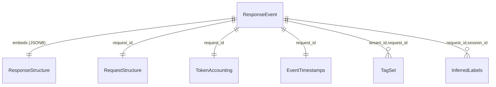
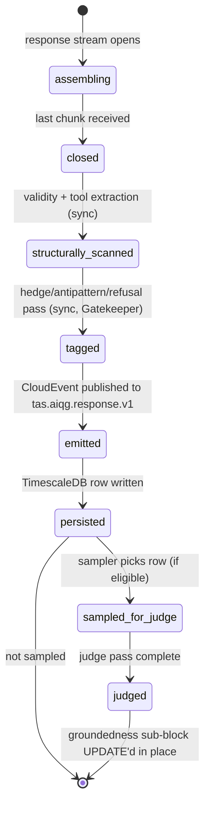

# AIQG Response Structure

---

**Metadata**

```yaml
service: tas-llm-router (write) + aiqg-dashboard-be (read) + tas-spark-jobs (read)
model: ResponseStructure
storage: JSONB column on response_event (TimescaleDB) + CloudEvent payload (Kafka)
version: 1.0.0
last_updated: 2026-05-31
status: planned (new sub-structure; non-breaking additive)
spec_refs: source-spec-v0.2.md §2.3 (Efficacy), §3.7 (response capture)
plan_ref: build-vs-reuse.md §1.2 (non-breaking constraint), §2.12 (CLEAR measurement)
```

---

## 1. Overview

### Purpose
The `response_structure` sub-model captures **observable properties of a vendor LLM response** without retaining the full response body. It is the Efficacy-dimension input feed for the CLEAR scorer (`pkg/clear` in `tas-llm-router`, per build-vs-reuse §2.12) and the structural signal feed for the Day-1 report's "what's drifting" panels.

It is materialized as a JSONB `response_structure` column on the `response_event` row in TimescaleDB and as a nested object on the `com.tas.aiqg.response.v1` CloudEvent payload on topic `tas.aiqg.response.v1`. Full response bodies are **never** persisted unless `[[account]].payload_retention_mode != off`; the sub-structure here is the durable, privacy-safe surrogate.

### Ownership
- **Writer**: `tas-llm-router` (populates structural fields at response close; populates antipattern/hedge tags via the in-pipeline Gatekeeper scanner pass in the same goroutine)
- **Async writer**: `tas-spark-jobs/aiqg_judge_sampler` (populates the groundedness sub-block when the parent `[[response-event]]` is sampled for LLM-as-judge)
- **Readers**: `tas-spark-jobs/aiqg_aggregator` (rolls up validity / hedge / refusal rates into `[[aggregated-metrics]]`); `aiqg-dashboard-be` (report assembly); `aiqg-ui` (drill-down)

### Lifecycle Summary
Populated at response close (synchronous, in `tas-llm-router`). The hedge / antipattern / refusal tag pass runs in the same response-handler goroutine before the CloudEvent is emitted, so all structural and observational fields ship together. The groundedness sub-block is populated **later** (minutes to hours) by the LLM-as-judge sampler, and writes back via an UPDATE to the existing row (TimescaleDB) — the CloudEvent payload remains immutable on Kafka, but the durable row reflects the latest judgement.

### Key Characteristics
- **Privacy-by-default**: output bodies are hashed (sha256 prefix), not stored; tool-call arguments are hashed unless retention allows
- **Non-breaking**: lives as a JSONB column / nested CloudEvent field — no existing surface changes (per build-vs-reuse §1.2)
- **Efficacy signal**: the structural validity + groundedness signals are the **observable proxies for task quality** described in spec §2.3 (no customer ground truth required)
- **Deterministic when possible**: validity checks, hashing, hedge-density math are deterministic; LLM-as-judge groundedness is the only stochastic field
- **Streaming caveat**: structural validity is post-hoc only in MVP (see §12.1)

---

## 2. Schema Definition

### Storage
- **Primary**: JSONB column `response_structure` on `response_event` hypertable in TimescaleDB (partitioned by `tenant_id` + `bucket`, per `[[response-event]]`)
- **Wire**: nested field `response_structure` on `com.tas.aiqg.response.v1` CloudEvent payload, topic `tas.aiqg.response.v1`
- **Migration impact**: additive only — `response_structure` is a new JSONB column on a new (Phase-1) hypertable; no existing column is modified

### Field Definitions

#### Observable Output Properties

| Field | Type | Required | Default | Description |
|---|---|---|---|---|
| `output_chars` | int | Yes | 0 | Character length of the assembled response body (post-streaming) |
| `output_tokens` | int | Yes | 0 | Vendor `usage.output_tokens` when present; else tiktoken-estimated |
| `output_tokens_source` | enum | Yes | `vendor` | One of `vendor`, `estimated` — provenance of `output_tokens` |
| `output_hash` | string | No | `null` | sha256 hex prefix (first 16 chars) of the response body. Only populated when `[[account]].payload_retention_mode != off` |

#### Tool Calls

| Field | Type | Required | Default | Description |
|---|---|---|---|---|
| `tool_call_count` | int | Yes | 0 | Number of tool calls in the response |
| `tool_call_names` | string[] | Yes | `[]` | Names of invoked tools — **always retained** for analytics |
| `tool_calls` | JSONB array | No | `null` | Per-call `[{name, arguments_hash, arguments_chars}]` — only populated when retention allows |

#### Finish Reason / Refusal

| Field | Type | Required | Default | Description |
|---|---|---|---|---|
| `finish_reason` | enum | Yes | `null` | One of `stop`, `length`, `tool_calls`, `content_filter`, `function_call`, `null` |
| `refused` | bool | Yes | `false` | Heuristic: output matches a refusal pattern from `aiqg_output_antipatterns.yaml` |
| `refusal_pattern` | enum | No | `null` | When `refused=true`, one of `safety`, `capability`, `policy`, `unknown` |
| `safety_filter_triggered` | bool | Yes | `false` | True when `finish_reason=content_filter` or vendor returned a safety marker |

#### Structural Validity (Efficacy proxy, spec §2.3)

| Field | Type | Required | Default | Description |
|---|---|---|---|---|
| `structural_validity_target` | enum | Yes | `none` | What was expected: `json`, `json_schema`, `code`, `tool_call`, `none` |
| `structural_validity_passed` | bool | Yes | `true` | Did the output parse correctly against the target. `true` when target=`none`. |
| `json_schema_conformance` | bool | No | `null` | Only when `target=json_schema`: did the parsed JSON conform to the schema |
| `code_language` | string | No | `null` | Detected language when `target=code` (heuristic; may be `null` for less-common languages) |
| `code_parse_passed` | bool | No | `null` | Only when `target=code`: did the parser accept the snippet |

#### Output Quality Signals (hedges, citations, logprobs)

| Field | Type | Required | Default | Description |
|---|---|---|---|---|
| `hedge_phrase_count` | int | Yes | 0 | Count of detected hedge phrases (per `aiqg_output_antipatterns.yaml`) |
| `hedge_phrase_density` | numeric(4,3) | Yes | 0.000 | Hedge phrases per 100 tokens. Derived: `100.0 * count / output_tokens` (0 when tokens=0). |
| `citation_present` | bool | Yes | `false` | Detected citation markers in output — used as RAG groundedness pre-signal |
| `logprobs_present` | bool | Yes | `false` | True when the vendor returned per-token logprobs |
| `output_antipattern_tags` | string[] | Yes | `[]` | Tags from `aiqg_output_antipatterns.yaml` rule pack (e.g. `excessive_hedging`, `disclaimer_padding`) |

#### Groundedness Sub-Block (async, sampled only)

Populated only when the parent `[[response-event]].sampled_for_llm_judge = true`. All five fields move from `null` → populated atomically when the judge run completes.

| Field | Type | Required | Default | Description |
|---|---|---|---|---|
| `groundedness_score` | numeric(3,2) | No | `null` | Fraction in `[0.00, 1.00]` — supported claims ÷ total claims |
| `groundedness_claims_total` | int | No | `null` | Total factual claims extracted from output |
| `groundedness_claims_supported` | int | No | `null` | Of those, the count traceable to context |
| `groundedness_judge_model` | string | No | `null` | Model that ran the judge pass (e.g. `gpt-4o-mini`) |
| `groundedness_judge_at` | timestamptz | No | `null` | When the judge pass completed |

### JSONB Shape (canonical example)

```json
{
  "output_chars": 1842,
  "output_tokens": 412,
  "output_tokens_source": "vendor",
  "output_hash": "9f2c1e7a8b3d4e0f",
  "tool_call_count": 1,
  "tool_call_names": ["search_documents"],
  "tool_calls": [
    {"name": "search_documents", "arguments_hash": "c4a2b1...", "arguments_chars": 184}
  ],
  "finish_reason": "tool_calls",
  "refused": false,
  "refusal_pattern": null,
  "safety_filter_triggered": false,
  "structural_validity_target": "tool_call",
  "structural_validity_passed": true,
  "json_schema_conformance": null,
  "code_language": null,
  "code_parse_passed": null,
  "hedge_phrase_count": 2,
  "hedge_phrase_density": 0.485,
  "citation_present": false,
  "logprobs_present": false,
  "output_antipattern_tags": [],
  "groundedness_score": null,
  "groundedness_claims_total": null,
  "groundedness_claims_supported": null,
  "groundedness_judge_model": null,
  "groundedness_judge_at": null
}
```

### Indexes

```sql
-- GIN index on antipattern tags for tag-faceted dashboards
CREATE INDEX IF NOT EXISTS idx_response_structure_antipattern_tags
  ON response_event
  USING GIN ((response_structure -> 'output_antipattern_tags'));

-- Partial index on validity failures (drives the error-rate panels)
CREATE INDEX IF NOT EXISTS idx_response_structure_validity_failed
  ON response_event ((response_structure ->> 'structural_validity_target'))
  WHERE (response_structure ->> 'structural_validity_passed') = 'false';

-- Partial index on refusals (drives refusal-rate panels)
CREATE INDEX IF NOT EXISTS idx_response_structure_refused
  ON response_event (tenant_id, bucket)
  WHERE (response_structure ->> 'refused') = 'true';
```

### Materialized View

```sql
-- Per-workflow validity rate per hour. Refreshed every 5 minutes by the aggregator.
CREATE MATERIALIZED VIEW IF NOT EXISTS aiqg_validity_rate_1h AS
SELECT
  tenant_id,
  workflow_type,
  time_bucket('1 hour', received_at) AS bucket,
  COUNT(*) FILTER (WHERE (response_structure ->> 'structural_validity_target') != 'none') AS structured_total,
  COUNT(*) FILTER (
    WHERE (response_structure ->> 'structural_validity_target') != 'none'
      AND (response_structure ->> 'structural_validity_passed') = 'true'
  ) AS structured_passed
FROM response_event
GROUP BY tenant_id, workflow_type, bucket;
```

---

## 3. Relationships

### Embedded In
- `[[response-event]]` — `response_structure` is a column on this hypertable; one row per response

### References Out (logical, by ID)
| Target | Joined By | Purpose |
|---|---|---|
| `[[request-structure]]` | `request_id` on parent `response_event` | Pair the request shape with response shape for CLEAR Input Quality + Efficacy |
| `[[tag-set]]` | `tenant_id`, `request_id` | Antipattern tags emitted here roll up into the request's tag set |
| `[[token-accounting]]` | `request_id` | `output_tokens` / `output_tokens_source` feed the cost computation |
| `[[event-timestamps]]` | `request_id` | First-byte / first-chunk timings combine with `tool_call_count` for latency decomposition |
| `[[inferred-labels]]` | `request_id`, `session_id` | `refused=true` is a strong signal for the abandonment inference job |

### ERD (sub-structure context)



---

## 4. Validation Rules

### Field Validation

| Field | Rule |
|---|---|
| `output_chars` | Required, integer ≥ 0 |
| `output_tokens` | Required, integer ≥ 0 |
| `output_tokens_source` | Required, one of `vendor`, `estimated` |
| `output_hash` | Optional; when set, hex string of length 16; only set when `account.payload_retention_mode != off` |
| `tool_call_count` | Required, integer ≥ 0 |
| `tool_call_names` | Required array; `length == tool_call_count` when tool calls are well-formed (see business rule 1 for the relaxed inequality) |
| `tool_calls` | Optional; when set, each element has keys exactly `{name, arguments_hash, arguments_chars}` |
| `finish_reason` | Required, one of `stop`, `length`, `tool_calls`, `content_filter`, `function_call`, `null` |
| `refused` | Required, boolean |
| `refusal_pattern` | Required when `refused=true`, one of `safety`, `capability`, `policy`, `unknown`; MUST be `null` when `refused=false` |
| `safety_filter_triggered` | Required, boolean |
| `structural_validity_target` | Required, one of `json`, `json_schema`, `code`, `tool_call`, `none` |
| `structural_validity_passed` | Required, boolean; MUST be `true` when target=`none` |
| `json_schema_conformance` | MUST be `null` unless `target=json_schema`; boolean otherwise |
| `code_language` | MUST be `null` unless `target=code`; string in `["go", "python", "javascript", "typescript", "sql", "bash", "java", "rust", "unknown"]` otherwise |
| `code_parse_passed` | MUST be `null` unless `target=code`; boolean otherwise |
| `hedge_phrase_count` | Required, integer ≥ 0 |
| `hedge_phrase_density` | Required, numeric in `[0.000, 100.000]` |
| `citation_present` | Required, boolean |
| `logprobs_present` | Required, boolean |
| `output_antipattern_tags` | Required array of strings; each tag MUST appear in `aiqg_output_antipatterns.yaml` |
| `groundedness_score` | When set, numeric in `[0.00, 1.00]` |
| `groundedness_claims_total` | When set, integer ≥ 0 |
| `groundedness_claims_supported` | When set, integer ≥ 0 and `≤ groundedness_claims_total` |
| `groundedness_judge_model` | When set, non-empty string |
| `groundedness_judge_at` | When set, ISO-8601 timestamptz |

### Business Rules

1. **Tool-call consistency**: `tool_call_count >= len(tool_call_names)` (a vendor MAY emit an unnamed tool call in pathological cases; the inequality is permissive)
2. **Finish-reason coherence**: when `finish_reason = 'tool_calls'`, `tool_call_count > 0` MUST hold
3. **Hedge density derivation**: `hedge_phrase_density = round(100.0 * hedge_phrase_count / output_tokens, 3)` when `output_tokens > 0`, else `0.000`
4. **Refusal heuristic**: `refused=true` MUST be set when ANY of: (a) `safety_filter_triggered=true`; (b) a refusal-pattern rule from `aiqg_output_antipatterns.yaml` fires; (c) the body matches a known refusal stem and `output_tokens < 200`
5. **Retention-gated fields**: `output_hash` and the per-call `arguments_hash` / `arguments_chars` are populated **only** when the account's `payload_retention_mode != off`. `tool_call_names` (names only) is always populated regardless of retention.
6. **Validity coherence**: when `structural_validity_target = none`, `structural_validity_passed = true`, and all conformance / code fields MUST be `null`
7. **Groundedness atomicity**: the five `groundedness_*` fields move from null → populated together (single UPDATE); partial population is invalid
8. **Groundedness arithmetic**: `groundedness_score = groundedness_claims_supported / groundedness_claims_total` (rounded to 2dp) when `claims_total > 0`; `0.00` when `claims_total = 0`

---

## 5. Lifecycle & State Transitions

### State Machine



### Phase Descriptions

| Phase | Where | Latency | Fields Populated |
|---|---|---|---|
| `assembling` | tas-llm-router streaming handler | duration of vendor stream | none (state only) |
| `closed` | tas-llm-router | <1ms | `output_chars`, `output_tokens`, `finish_reason`, `safety_filter_triggered`, `logprobs_present` |
| `structurally_scanned` | tas-llm-router | <5ms | `structural_validity_*`, `json_schema_conformance`, `code_*`, `tool_call_count`, `tool_call_names`, `tool_calls` (if retained), `output_hash` (if retained) |
| `tagged` | tas-llm-router (Gatekeeper in-pipeline) | <10ms | `hedge_phrase_count`, `hedge_phrase_density`, `citation_present`, `refused`, `refusal_pattern`, `output_antipattern_tags` |
| `emitted` | Kafka publish | <2ms | (no field change; payload frozen) |
| `persisted` | TimescaleDB row insert | <5ms | (no field change; durable) |
| `sampled_for_judge` | sampler decision | (decision only) | (no field change) |
| `judged` | tas-spark-jobs/aiqg_judge_sampler | minutes-to-hours | `groundedness_*` (five fields) |

All phases through `persisted` complete in the same response-handler goroutine in `tas-llm-router` before the request returns to the client. The judge phase is fully async and runs out-of-band.

---

## 6. Examples

### 6.1 Clean Text Response

```json
{
  "output_chars": 642,
  "output_tokens": 152,
  "output_tokens_source": "vendor",
  "output_hash": null,
  "tool_call_count": 0,
  "tool_call_names": [],
  "tool_calls": null,
  "finish_reason": "stop",
  "refused": false,
  "refusal_pattern": null,
  "safety_filter_triggered": false,
  "structural_validity_target": "none",
  "structural_validity_passed": true,
  "json_schema_conformance": null,
  "code_language": null,
  "code_parse_passed": null,
  "hedge_phrase_count": 1,
  "hedge_phrase_density": 0.658,
  "citation_present": false,
  "logprobs_present": false,
  "output_antipattern_tags": [],
  "groundedness_score": null,
  "groundedness_claims_total": null,
  "groundedness_claims_supported": null,
  "groundedness_judge_model": null,
  "groundedness_judge_at": null
}
```

### 6.2 Safety Refusal

```json
{
  "output_chars": 188,
  "output_tokens": 42,
  "output_tokens_source": "vendor",
  "tool_call_count": 0,
  "tool_call_names": [],
  "finish_reason": "content_filter",
  "refused": true,
  "refusal_pattern": "safety",
  "safety_filter_triggered": true,
  "structural_validity_target": "none",
  "structural_validity_passed": true,
  "hedge_phrase_count": 0,
  "hedge_phrase_density": 0.000,
  "citation_present": false,
  "logprobs_present": false,
  "output_antipattern_tags": ["refusal_safety"]
}
```

### 6.3 Agentic Tool Call

```json
{
  "output_chars": 0,
  "output_tokens": 18,
  "output_tokens_source": "vendor",
  "tool_call_count": 2,
  "tool_call_names": ["search_documents", "fetch_url"],
  "tool_calls": [
    {"name": "search_documents", "arguments_hash": "c4a2b1f8d0e3a591", "arguments_chars": 142},
    {"name": "fetch_url",        "arguments_hash": "7e1d9c0b4a2f8e76", "arguments_chars": 88}
  ],
  "finish_reason": "tool_calls",
  "refused": false,
  "refusal_pattern": null,
  "safety_filter_triggered": false,
  "structural_validity_target": "tool_call",
  "structural_validity_passed": true,
  "hedge_phrase_count": 0,
  "hedge_phrase_density": 0.000,
  "citation_present": false,
  "logprobs_present": false,
  "output_antipattern_tags": []
}
```

### 6.4 Malformed JSON

```json
{
  "output_chars": 312,
  "output_tokens": 84,
  "output_tokens_source": "vendor",
  "tool_call_count": 0,
  "tool_call_names": [],
  "finish_reason": "stop",
  "refused": false,
  "refusal_pattern": null,
  "safety_filter_triggered": false,
  "structural_validity_target": "json",
  "structural_validity_passed": false,
  "hedge_phrase_count": 0,
  "hedge_phrase_density": 0.000,
  "citation_present": false,
  "logprobs_present": false,
  "output_antipattern_tags": ["json_parse_failure"]
}
```

### 6.5 Sampled RAG with Groundedness

```json
{
  "output_chars": 1402,
  "output_tokens": 318,
  "output_tokens_source": "vendor",
  "tool_call_count": 0,
  "tool_call_names": [],
  "finish_reason": "stop",
  "refused": false,
  "refusal_pattern": null,
  "safety_filter_triggered": false,
  "structural_validity_target": "none",
  "structural_validity_passed": true,
  "hedge_phrase_count": 3,
  "hedge_phrase_density": 0.943,
  "citation_present": true,
  "logprobs_present": false,
  "output_antipattern_tags": [],
  "groundedness_score": 0.83,
  "groundedness_claims_total": 12,
  "groundedness_claims_supported": 10,
  "groundedness_judge_model": "gpt-4o-mini",
  "groundedness_judge_at": "2026-05-31T15:42:18Z"
}
```

### 6.6 SQL — Refusal Patterns per Workflow Type (Day-1 "what's drifting" panel)

```sql
SELECT
  workflow_type,
  response_structure ->> 'refusal_pattern' AS pattern,
  COUNT(*)                                  AS refusal_count,
  COUNT(*) * 100.0
    / SUM(COUNT(*)) OVER (PARTITION BY workflow_type) AS pct_of_workflow
FROM   response_event
WHERE  tenant_id = $1
  AND  received_at >= NOW() - INTERVAL '24 hours'
  AND  (response_structure ->> 'refused') = 'true'
GROUP  BY workflow_type, pattern
ORDER  BY workflow_type, refusal_count DESC;
```

### 6.7 SQL — Structural Validity Rate per Hour

```sql
SELECT
  bucket,
  workflow_type,
  structured_total,
  structured_passed,
  CASE WHEN structured_total > 0
    THEN ROUND(100.0 * structured_passed / structured_total, 2)
    ELSE NULL
  END AS validity_pct
FROM   aiqg_validity_rate_1h
WHERE  tenant_id = $1
  AND  bucket >= NOW() - INTERVAL '24 hours'
ORDER  BY bucket DESC, workflow_type;
```

### 6.8 SQL — Antipattern Tag Distribution

```sql
SELECT
  tag,
  COUNT(*) AS occurrences
FROM   response_event,
       LATERAL jsonb_array_elements_text(response_structure -> 'output_antipattern_tags') AS tag
WHERE  tenant_id = $1
  AND  received_at >= NOW() - INTERVAL '7 days'
GROUP  BY tag
ORDER  BY occurrences DESC
LIMIT  20;
```

---

## 7. Cross-Service References

### Service Reads / Writes

| Service | Read | Write | Why |
|---|---|---|---|
| `tas-llm-router` | yes | yes | Sole writer of all sync fields; emits CloudEvent |
| `tas-spark-jobs/aiqg_judge_sampler` | yes | yes (groundedness sub-block only) | LLM-as-judge async pass |
| `tas-spark-jobs/aiqg_aggregator` | yes | no | Rolls up validity / hedge / refusal into `[[aggregated-metrics]]` |
| `aiqg-dashboard-be` | yes | no | Report assembly; drives the Day-1 / Ongoing panels |
| `aiqg-ui` | yes (via dashboard-be) | no | Drill-down views |
| `aether-be` | no | no | No coupling; AIQG is orthogonal |

### ID Mapping Chain (sub-structure context)

```
RequestEvent.request_id
    └─> ResponseEvent.request_id (1:1)
            └─> ResponseEvent.response_structure (JSONB sub-structure, this doc)
                    └─> output_antipattern_tags ──> joins TagSet by (tenant_id, request_id)
                    └─> tool_call_names         ──> indexed for analytics
                    └─> groundedness_judge_at   ──> stamped by judge sampler async
```

---

## 8. Tenant & Space Isolation

Every read of `response_structure` MUST go through a `WHERE tenant_id = $1` predicate on the parent `response_event` row. The sub-structure has no independent identity; isolation is inherited from the parent row.

### Cross-Region Enforcement
The `response_event` hypertable is partitioned per region (`us-east`, `us-west`, `eu`) per `[[account]].processing_region`. The JSONB column has no region-specific content but is bound to a region by virtue of which partition holds it.

### Isolation Queries

```sql
-- Tenant-scoped structural validity by hour
SELECT
  time_bucket('1 hour', received_at) AS bucket,
  COUNT(*)                            AS responses,
  COUNT(*) FILTER (WHERE (response_structure ->> 'structural_validity_passed') = 'true') AS passed
FROM   response_event
WHERE  tenant_id = $1
  AND  received_at >= NOW() - INTERVAL '24 hours'
  AND  (response_structure ->> 'structural_validity_target') != 'none'
GROUP  BY bucket
ORDER  BY bucket;
```

---

## 9. Performance Considerations

### Write Profile
- One JSONB write per response (every gateway call). Field count ~25, total payload ~600-1200 bytes typical
- All sync fields populated in <15ms total inside the response handler (closed → tagged transition)
- Async groundedness UPDATE is batched: judge sampler processes in batches of 100, single transaction

### Index Plan
- GIN on `output_antipattern_tags` — used by the tag-distribution panel and rule-pack drift detection
- Partial index on `structural_validity_passed=false` — used by the error-rate panel and CLEAR Efficacy threshold alarms
- Partial index on `refused=true` — used by the refusal-rate panel and the abandonment inference job

### Materialized View Refresh
`aiqg_validity_rate_1h` refreshes every 5 minutes (Timescale continuous aggregate policy). The Day-1 report queries this view, not the raw hypertable, to keep p95 query latency under 200ms.

### Anti-patterns
- **Do not** query JSONB fields without a `tenant_id` predicate — the GIN indexes don't cover full-table scans
- **Do not** retain `output_hash` or `tool_calls.arguments_hash` when retention is `off` — privacy contract violation
- **Do not** synchronously call the LLM-as-judge from the response handler — it's strictly async per design

---

## 10. Security & Compliance

### Sensitive Fields

| Field | Sensitivity | Handling |
|---|---|---|
| `output_hash` | Low (one-way hash, truncated) | Populated only when retention allows; sha256 first 16 hex chars |
| `tool_calls[].arguments_hash` | Low (one-way hash) | Same as `output_hash`; arguments themselves never persisted |
| `tool_call_names` | Low (function names only) | Always retained — not considered PII |
| `output_antipattern_tags` | Internal | Aggregated for analytics; safe to surface in dashboards |
| `groundedness_*` | Derived metric | Safe to surface; no source content embedded |

### PII Handling

Per build-vs-reuse §2.11 (Gatekeeper tokenization pipeline) and `[[account]].pii_tokenization_enabled`:

- When retention is on (`sampled` or `full`), tool-call arguments and response bodies are routed through Databunker tokenization **before** any hashing or persistence
- The hash is computed over the **tokenized** content, so a hash collision across tenants is mathematically possible but operationally meaningless (always read inside a `tenant_id` predicate)
- When retention is off, only the structural / count / tag fields persist — no body, no hash, no argument data

### Audit

Mutations to the groundedness sub-block by the judge sampler emit an `[[audit-log-entry]]` (CloudEvent type `com.tas.aiqg.audit.groundedness.v1`) recording the judge model, sampled-row request_id, and judge_at timestamp. Sync writes are not individually audited (volume is too high) — they're audited as a stream via the CloudEvent topic itself.

### Compliance Touchpoints

- **GDPR (data minimization)**: the default-off retention mode plus name-only tool-call retention satisfies the minimization principle out of the box
- **GDPR (right to deletion)**: hashes don't qualify as personal data per WP29 guidance when computed over tokenized content; nonetheless the entire row is purged at the account's retention window
- **SOC2**: the deterministic, replayable nature of the structural validity check supports the "monitoring with measurable evidence" control
- **NIST AI RMF (Measure 2.7)**: `groundedness_*` and `structural_validity_*` are the gateway's "track and measure" signals for output quality

---

## 11. Migration History

### v1.0.0 — 2026-05-31

- Initial schema. New JSONB column `response_structure` on the new (Phase-1) `response_event` hypertable.
- New nested field `response_structure` on `com.tas.aiqg.response.v1` CloudEvent payload (new event type on new topic — no existing payload affected per build-vs-reuse §1.2).
- Indexes / materialized view DDL in §2 is the migration. Idempotent (`IF NOT EXISTS`).
- Forward-only: existing `response_event` rows from before this version don't exist (Phase-1 introduces the table).

---

## 12. Known Issues & Limitations

1. **Streaming validity is post-hoc**: per source spec §3.3, the gateway streams chunks to the client as they arrive from the vendor. Structural validity is computed after the last chunk lands, so the gateway CAN detect a malformed JSON response but CANNOT block delivery in MVP. A streaming-aware validator (incremental JSON parse with rollback) is on the Phase-2 roadmap.
2. **Code language detection is heuristic**: the language detector covers Go, Python, JS/TS, SQL, Bash, Java, Rust. Less-common languages (Haskell, Erlang, Zig, Nim, etc.) fall through to `unknown` — `code_parse_passed` is set conservatively to `null` for unknowns rather than `false`.
3. **Refusal heuristic vs. legitimate apology**: the rule pack distinguishes "I cannot help with that" (refusal) from "I'm not sure about that detail" (hedge). Edge cases — long refusals that read like guidance, short hedges that pattern-match a refusal stem — are tagged conservatively. Manual rule-pack tuning is expected during the first 60 days of customer traffic.
4. **Groundedness is sampled, not universal**: by design, only a stratified sample of responses runs through LLM-as-judge (cost control). Customers who want 100% groundedness pay extra (Phase-2 metered feature). The five `groundedness_*` fields are `null` for the un-sampled majority — this is correct, not missing data.
5. **Tool-call argument hash collisions are not a defect**: since hashing happens **after** tokenization, two calls with the same arguments-template-but-different-PII produce the same hash. This is desirable for dedup-of-similar-calls analytics; it is not a substitute for content equality.
6. **`output_tokens_source = estimated` introduces drift**: vendors that don't return token usage (rare but exists for some local-model proxies) force tiktoken estimation. Cost metrics computed from estimated tokens carry a ±5% systematic error; the dashboard surfaces this with a "≈" prefix on affected cost rows.
7. **Antipattern rule pack versioning**: tags in `output_antipattern_tags` are tied to the active `aiqg_output_antipatterns.yaml` version at write time. The rule pack version is **not** stored in the row, so a rule-pack upgrade changes the meaning of tags in historical data. Mitigation: rule-pack changes are versioned and dated in the change log; the dashboard annotates rule-pack-bump events on time-series charts.

---

## 13. Related Documentation

### AIQG Siblings (this directory)

- [[response-event]] — parent row that hosts this JSONB sub-structure
- [[request-structure]] — paired input-side sub-structure (CLEAR Input Quality)
- [[tag-set]] — antipattern tags emitted here roll up into the request's tag set
- [[token-accounting]] — consumes `output_tokens` / `output_tokens_source` for cost
- [[event-timestamps]] — consumes `tool_call_count` for latency decomposition
- [[inferred-labels]] — consumes `refused` for the abandonment-inference correlation
- [[account]] — `payload_retention_mode` / `pii_tokenization_enabled` gate field population

### Cross-Service

- [`tas-llm-router`](../tas-llm-router/) — the sole writer of this sub-structure
- Gatekeeper rule pack: `Gatekeeper/configs/rules/aiqg_output_antipatterns.yaml` (new, non-breaking; per build-vs-reuse §1.2)
- CLEAR scorer: `tas-llm-router/pkg/clear/` (consumer of all Efficacy-dimension fields here)
- `cross-service/mappings/id-mapping-chain.md` — appended (not modified) with the response-event lineage

### Plan & Spec

- [`build-vs-reuse.md`](./build-vs-reuse.md) — §1.2 (non-breaking constraint), §2.11 (Gatekeeper tokenization), §2.12 (CLEAR measurement)
- [`source-spec-v0.2.md`](./source-spec-v0.2.md) — §2.3 (Efficacy proxies), §3.3 (streaming), §3.7 (response capture table)

---

## 14. Changelog

| Version | Date | Author | Changes |
|---|---|---|---|
| v1.0.0 | 2026-05-31 | TAS Platform | Initial spec draft. Defines `response_structure` JSONB sub-structure on `response_event` and the matching CloudEvent nested field. Captures observable output properties (length, tokens, tool calls, finish reason), structural validity, output-quality signals (hedges, citations, antipattern tags), and the async groundedness sub-block. Non-breaking, additive only. |
