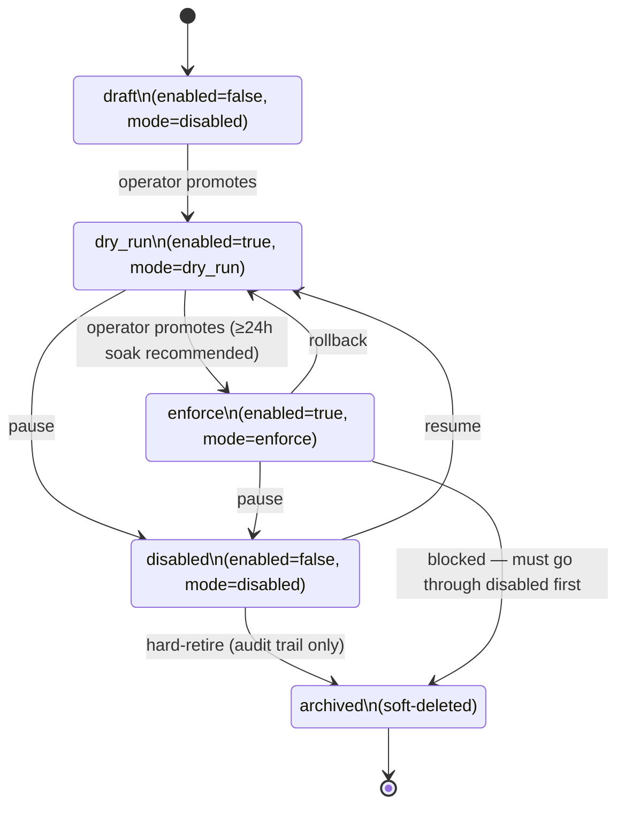
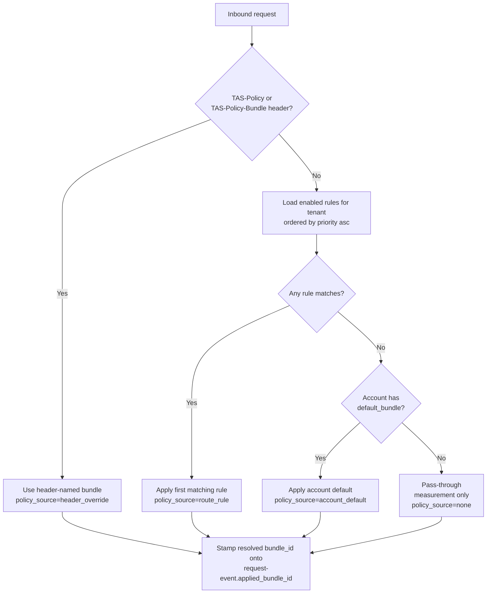

# AIQG Route Rule Node

---

**Metadata**

```yaml
service: aiqg-dashboard-be
model: AIQGRouteRule
database: Neo4j
node_label: AIQGRouteRule
version: 1.0.0
last_updated: 2026-05-31
status: planned (new node label; non-breaking addition)
spec_refs: source-spec-v0.2.md §3.5.2 (route-attached policy / resolution order), §4.5 (screen 7 — route policy editor)
plan_ref: build-vs-reuse.md §2.5 (routes), §7.5 (MVP matchers vs. Phase-2 matchers)
```

---

## 1. Overview

### Purpose
The `AIQGRouteRule` node binds a [[policy-bundle]] to traffic patterns **without requiring customer application code changes**. A route rule matches the request shape — URL path, source application, vendor / model, customer header values — and, on first match, applies its bound bundle to that request. Rules are evaluated **top-to-bottom by `priority`** for a given tenant; the first match wins.

A per-request `TAS-Policy` or `TAS-Policy-Bundle` header **overrides** any route match (per spec §3.5.2 resolution order). Route rules are the "policy as configuration" half of the policy-as-headers-or-routes design; per-request headers are the "policy as code" half. Together they let customers stage policy migrations: try a new bundle inline first via header, then promote to a route rule once it's proven.

### Ownership
- **Owning service**: `aiqg-dashboard-be` (CRUD via UI screen 7 + API)
- **Read-only consumers**:
  - `tas-llm-router` (`internal/policy/resolver.go`) — loads rules per tenant on cache miss and computes the matching bundle per request
  - `aiqg-ui` (route policy editor, dry-run preview tool)
  - `tas-spark-jobs/aiqg_aggregator` (joins requests to the rule that matched them for per-route reporting)

### Lifecycle Summary
A rule is created in `draft` (`enabled=false`), promoted to `dry_run` so the gateway records what *would have* matched without enforcing actions, then promoted to `enforce` once an operator reviews the dry-run findings. Rules can be rolled back from `enforce` to `dry_run`, soft-deleted via `disabled`, and finally `archived` (audit trail only). All transitions are recorded in [[audit-log-entry]].

### Key Characteristics
- **Tenant-scoped** by `tenant_id` (always — there are no cross-tenant rules)
- **Priority-ordered** evaluation; first match applies. Reserved priority ranges keep system / tenant / normal rules from colliding (see §3)
- **Header-override-aware** — per-request `TAS-Policy*` headers bypass route matching entirely; that path is logged with `policy_source=header_override` on [[request-event]]
- **Staged rollout** via `mode` (`enforce` / `dry_run` / `disabled`) per spec §3.5.2
- **MVP matcher set is intentionally small** (URL path, source app, vendor, model, customer header). `workflow_type` and `time_window` matchers are **reserved for Phase 2** and the create / update API rejects them in MVP with a clear error message (per build-vs-reuse §7.5)
- **Non-breaking**: new label + new relationships only; no existing schema is mutated

---

## 2. Schema Definition

### Storage
- **Database**: Neo4j (same instance as `aether-be` — `neo4j.aether-be.svc.cluster.local:7687`)
- **Label**: `AIQGRouteRule`
- **Migration impact**: additive only — new label + new relationships `HAS_ROUTE_RULE`, `APPLIES_BUNDLE`

### Properties

#### Core Identity

| Property | Type | Required | Default | Description |
|---|---|---|---|---|
| `id` | UUID string | Yes | generated | Primary key (`rr_<ulid>` format recommended) |
| `tenant_id` | UUID string | Yes | inherited from parent `AIQGAccount` | Tenant scope; rules never cross tenants |
| `name` | string | Yes | — | Human-readable label, **unique per tenant** (case-insensitive) |
| `description` | text | No | `null` | Free-form rationale, displayed in the editor list view |

#### Evaluation Control

| Property | Type | Required | Default | Description |
|---|---|---|---|---|
| `priority` | int | Yes | `100` | Lower number = evaluated first. **Reserved ranges**: `0-9` system rules (TAS platform only), `10-99` tenant override slots, `100-999998` normal rules, `999999` the tenant default rule (matchers all-null, see §4) |
| `enabled` | bool | Yes | `false` | Master enable switch. A rule with `enabled=false` is never evaluated regardless of `mode`. Editor uses this for `draft`. |
| `mode` | enum | Yes | `disabled` | One of `enforce`, `dry_run`, `disabled` (spec §3.5.2). `disabled` is the safe default at creation. |

#### Matchers (JSONB / map)

Stored as a single `matchers` map property on the node for atomic updates and simpler editor binding. All sub-fields are nullable; rule matches a request only when every non-null matcher matches.

| Sub-field | Type | MVP / Phase | Description |
|---|---|---|---|
| `url_path` | string (RE2 regex) | MVP | Matches the request URL path. Example: `^/openai/v1/chat/completions$`. Anchors recommended. |
| `source_app` | string[] | MVP | Matches any value of the `source_app` claim on the `TAS-Auth` token. Example: `["billing-api-prod", "claims-api-prod"]`. |
| `vendor` | enum[] | MVP | One or more of `openai`, `anthropic` (extensible). |
| `model` | string[] | MVP | One or more model identifiers, e.g., `["gpt-4o-mini", "claude-3-7-sonnet"]`. Exact match. |
| `customer_header_match` | `{header_name: string, regex_value: string}` | MVP | Single header match, regex on the value. Example: `{header_name: "X-Environment", regex_value: "^production$"}`. Header names matched case-insensitively. |
| `workflow_type` | enum[] | **Phase 2** | Reserved field. One or more of `single_turn_qa`, `rag`, `agentic`, `summarization`, `code_generation`, `classification_extraction`. MVP API rejects creation if set. |
| `time_window` | `{tz: string, days_of_week: int[], start_hour: int, end_hour: int}` | **Phase 2** | Reserved field. Time-of-day / day-of-week gating. MVP API rejects creation if set. |

#### Attribution / Timestamps (ISO-8601 UTC)

| Property | Type | Required | Default | Description |
|---|---|---|---|---|
| `created_at` | datetime | Yes | now | Rule creation time |
| `updated_at` | datetime | Yes | now | Last mutation |
| `created_by_user_id` | UUID | Yes | from caller JWT `sub` | Keycloak user id who created the rule |
| `last_modified_by_user_id` | UUID | No | from caller JWT `sub` | Keycloak user id of last modifier |

### Constraints & Indexes

```cypher
// Tenant + name uniqueness
CREATE CONSTRAINT aiqg_route_rule_id_unique IF NOT EXISTS
  FOR (r:AIQGRouteRule) REQUIRE r.id IS UNIQUE;

CREATE CONSTRAINT aiqg_route_rule_name_per_tenant_unique IF NOT EXISTS
  FOR (r:AIQGRouteRule) REQUIRE (r.tenant_id, r.name) IS UNIQUE;

// Hot lookup: enabled rules for a tenant ordered by priority
CREATE INDEX aiqg_route_rule_tenant_priority IF NOT EXISTS
  FOR (r:AIQGRouteRule) ON (r.tenant_id, r.enabled, r.priority);
```

---

## 3. Fields Reference

### `priority` — reserved ranges

| Range | Owner | Purpose |
|---|---|---|
| `0-9` | TAS platform | System rules (e.g., abuse mitigation kill-switch). Hidden from tenant editor. |
| `10-99` | Tenant | Operator override slots (incident response, surgical fixes ahead of normal config). |
| `100-999998` | Tenant | Normal rules. Default `100`. |
| `999999` | Tenant | The tenant default rule (matchers all-null). At most one per tenant. |

The editor reserves the system range; an attempt to write `priority < 10` via the public API is rejected.

### `mode` semantics

- **`disabled`** — rule exists but is never evaluated. Use during authoring or to retire a rule without losing it.
- **`dry_run`** — rule is evaluated and its matched-bundle resolution is **recorded** to [[audit-log-entry]] and stamped onto [[request-event]] as `policy_resolution_source=route_rule_dry_run`, but **actions are not enforced**. The actual enforced bundle (if any) is the next-best match. This is the staged-rollout mode per spec §3.5.2.
- **`enforce`** — rule is evaluated and its bundle's actions are applied. This is the production mode.

### `matchers.customer_header_match`

A single header-and-value match. Header name comparison is case-insensitive (HTTP semantics); the value is compared via RE2 regex. To match on multiple headers, model them as multiple rules with descending `priority`, or wait for Phase 2 where the matcher block will be extended to accept an array.

### Phase-2 placeholders — `workflow_type`, `time_window`

These are documented in the schema so storage and serialization don't need a breaking change when Phase 2 lands. The MVP API explicitly rejects them so no rule depending on a feature that does not exist can be created:

```json
{
  "error": "matcher_not_supported_in_mvp",
  "field": "matchers.workflow_type",
  "message": "workflow_type and time_window matchers are reserved for Phase 2 (build-vs-reuse §7.5). Use url_path, source_app, vendor, model, or customer_header_match for MVP."
}
```

---

## 4. Validation Rules

Enforced by `aiqg-dashboard-be` on create + update before any Neo4j write.

1. **Tenant ownership** — `tenant_id` must reference an `AIQGAccount` in `status` `active` or `provisioning`. Suspended/archived accounts cannot edit rules.
2. **Name uniqueness** — `(tenant_id, name)` unique (case-insensitive).
3. **Priority bounds** — integer in `[10, 999999]` via public API. `0-9` reserved for TAS platform.
4. **At least one non-null matcher** — a rule with every matcher field null is the **default rule**, and only **one default rule per tenant** is allowed. It must have `priority=999999` exactly. Any other rule must set at least one matcher.
5. **`url_path` must compile as RE2** — rejected if `regexp.Compile()` fails.
6. **`customer_header_match.regex_value` must compile as RE2**.
7. **`customer_header_match.header_name` syntax** — must match `^[A-Za-z0-9!#$%&'*+\-.^_`|~]+$` (RFC 7230 token).
8. **Bundle existence + state** — the `APPLIES_BUNDLE`-target [[policy-bundle]] must exist within the same `tenant_id` and be in `state` `active` or `staged`. Cannot reference an `archived` bundle.
9. **MVP-only matcher gate** — reject creation/update if `matchers.workflow_type` or `matchers.time_window` is non-null (per §3).
10. **Mode transition rules** (see §6 lifecycle) — e.g., `enforce` requires the rule to have spent ≥24h in `dry_run` (configurable per tenant; the dashboard surfaces this as a soft warning when below threshold).
11. **System-priority guard** — creating or updating a rule with `priority < 10` via the public API returns 403.

All validation errors are returned as a stable `{error: <code>, field: <path>, message: <human-readable>}` payload so the UI can map them to inline form errors.

---

## 5. Relationships

### Neo4j relationships

```cypher
(:AIQGAccount {tenant_id})-[:HAS_ROUTE_RULE]->(:AIQGRouteRule {tenant_id})
(:AIQGRouteRule)-[:APPLIES_BUNDLE]->(:AIQGPolicyBundle)
(:AIQGRouteRule)-[:LAST_MODIFIED_BY]->(:User)  // Keycloak user mirror in aether-be
```

### Cardinality

| From | Rel | To | Cardinality |
|---|---|---|---|
| `AIQGAccount` | `HAS_ROUTE_RULE` | `AIQGRouteRule` | 0..N |
| `AIQGRouteRule` | `APPLIES_BUNDLE` | `AIQGPolicyBundle` | 1..1 (required) |
| `AIQGRouteRule` | `LAST_MODIFIED_BY` | `User` | 0..1 |

### Referential constraints

- Deleting a `AIQGPolicyBundle` that any `AIQGRouteRule` references is blocked at the API layer. The dashboard returns the offending rule list and asks the operator to re-point or delete them first.
- Archiving an `AIQGAccount` cascades all child route rules to `archived` (soft delete) but never hard-deletes them — they remain joinable for historical [[request-event]] / [[audit-log-entry]] queries.

---

## 6. Lifecycle & State Machines

State machine encoded by `(enabled, mode)`. Rendered:



### Transition semantics

- **`draft -> dry_run`** — first time a rule starts being evaluated. Gateway picks it up on next route-rule cache refresh (≤60s, see §10).
- **`dry_run -> enforce`** — promotion to production. The dashboard surfaces the count of dry-run matches over the soak window so the operator has data to decide. Recommended ≥24h soak; technically permitted at any time but logged as a soft warning if below threshold.
- **`enforce -> dry_run`** — rollback path. Used when a rule starts producing unexpected blocks; flipping to dry_run keeps recording without enforcing.
- **`* -> disabled`** — universal pause. Rule stays in the database and remains editable.
- **`disabled -> archived`** — terminal. Rule is no longer editable, but the row is retained so [[audit-log-entry]] entries referencing it stay joinable.

Every transition writes one [[audit-log-entry]] entry (`event_type=route_rule.state_changed`).

---

## 7. API Examples

### 7.1 Resolution algorithm (gateway-side)

The exact resolution algorithm executed by `tas-llm-router` per request (per spec §3.5.2):



Each terminal state writes `applied_bundle_id` and `policy_resolution_source` onto [[request-event]] so reporting can attribute outcomes back to the resolution that produced them.

### 7.2 Three example route rules from spec §4.5 screen 7

Translated literally to API shape. Rules 2 and 3 are MVP-friendly variants (no workflow_type matcher, which is Phase 2).

```json
[
  {
    "id": "rr_01H...A",
    "name": "Production billing inquiry pipeline",
    "description": "Strict policy for billing-api-prod traffic in production environment",
    "priority": 100,
    "enabled": true,
    "mode": "enforce",
    "matchers": {
      "url_path": "^/openai/v1/chat/completions$",
      "source_app": ["billing-api-prod"],
      "customer_header_match": {
        "header_name": "X-Environment",
        "regex_value": "^production$"
      }
    },
    "applies_bundle_id": "pb_production_strict"
  },
  {
    "id": "rr_01H...B",
    "name": "Compliance-sensitive workflows",
    "description": "PII strip for known compliance-sensitive source apps. PCI bundle deferred to Phase 3.",
    "priority": 110,
    "enabled": true,
    "mode": "dry_run",
    "matchers": {
      "source_app": ["billing-api-prod", "claims-api-prod"]
    },
    "applies_bundle_id": "pb_pii_strip"
  },
  {
    "id": "rr_01H...C",
    "name": "Staging traffic (all)",
    "description": "Lenient policy for any staging-tagged request",
    "priority": 500,
    "enabled": true,
    "mode": "enforce",
    "matchers": {
      "customer_header_match": {
        "header_name": "X-Environment",
        "regex_value": "^staging$"
      }
    },
    "applies_bundle_id": "pb_development_lenient"
  }
]
```

### 7.3 Cypher — create a route rule

```cypher
MATCH (a:AIQGAccount {tenant_id: $tenant_id, status: 'active'})
MATCH (b:AIQGPolicyBundle {id: $bundle_id, tenant_id: $tenant_id})
WHERE b.state IN ['active', 'staged']
CREATE (r:AIQGRouteRule {
  id: $id,
  tenant_id: $tenant_id,
  name: $name,
  description: $description,
  priority: $priority,
  enabled: $enabled,
  mode: $mode,
  matchers: $matchers,         // JSON map
  created_at: datetime(),
  updated_at: datetime(),
  created_by_user_id: $user_id
})
MERGE (a)-[:HAS_ROUTE_RULE]->(r)
MERGE (r)-[:APPLIES_BUNDLE]->(b)
RETURN r;
```

### 7.4 Cypher — list rules for a tenant ordered by priority

```cypher
MATCH (a:AIQGAccount {tenant_id: $tenant_id})-[:HAS_ROUTE_RULE]->(r:AIQGRouteRule)
WHERE r.enabled = true
OPTIONAL MATCH (r)-[:APPLIES_BUNDLE]->(b:AIQGPolicyBundle)
RETURN r, b
ORDER BY r.priority ASC, r.created_at ASC;
```

### 7.5 Cypher — dry-run prediction: which rule would match this request?

Used by the editor's "preview" tool to make matcher precedence concrete (see §12). Returns the first match along with all rules considered, so the operator can see priority interactions.

```cypher
MATCH (a:AIQGAccount {tenant_id: $tenant_id})-[:HAS_ROUTE_RULE]->(r:AIQGRouteRule)
WHERE r.enabled = true
WITH r ORDER BY r.priority ASC
// matcher evaluation is performed in the app layer in Go; Cypher returns the candidate set
RETURN r.id AS rule_id, r.name AS name, r.priority AS priority,
       r.mode AS mode, r.matchers AS matchers;
```

The app then evaluates each rule's matchers against the sample request and returns `{matched: <rule_id_or_null>, considered: [...]}` to the UI.

### 7.6 REST API — `GET /api/v1/aiqg/route-rules` response

```json
{
  "rules": [
    {
      "id": "rr_01H...A",
      "name": "Production billing inquiry pipeline",
      "description": "...",
      "priority": 100,
      "enabled": true,
      "mode": "enforce",
      "matchers": {
        "url_path": "^/openai/v1/chat/completions$",
        "source_app": ["billing-api-prod"],
        "customer_header_match": {
          "header_name": "X-Environment",
          "regex_value": "^production$"
        }
      },
      "applies_bundle": {
        "id": "pb_production_strict",
        "name": "production_strict",
        "state": "active"
      },
      "created_at": "2026-05-31T14:00:00Z",
      "updated_at": "2026-05-31T14:00:00Z",
      "created_by_user_id": "kc_user_abc123"
    }
  ],
  "total": 1,
  "tenant_id": "tnt_..."
}
```

---

## 8. Cross-Service Integration

### 8.1 Resolution stamping onto [[request-event]]

For every request, the resolution result is captured on [[request-event]]:

| `request-event` field | Possible values |
|---|---|
| `applied_bundle_id` | `pb_<id>` or `null` (pass-through) |
| `policy_resolution_source` | `header_override`, `route_rule`, `route_rule_dry_run`, `account_default`, `none` |
| `matched_route_rule_id` | `rr_<id>` if `policy_resolution_source` is `route_rule` or `route_rule_dry_run`; else `null` |

This is the join key for "what bundle applied to what traffic" reporting in `aiqg-dashboard-be`.

### 8.2 Header override interaction

When a request carries `TAS-Policy` or `TAS-Policy-Bundle`, route rule evaluation is **skipped entirely** and `policy_resolution_source` is set to `header_override`. The platform-side compliance team monitors header-override volume in Grafana to catch route-rule bypass patterns that might indicate misconfiguration.

### 8.3 Bundle change propagation

When an [[policy-bundle]] referenced by a rule changes state (e.g., `staged -> active` or `active -> archived`), `aiqg-dashboard-be` emits `com.tas.aiqg.policy_bundle.changed.v1` on Kafka. The gateway's route-rule resolver subscribes and invalidates its local cache for the affected tenant.

### 8.4 Cascading lifecycle

- `AIQGAccount` `archived` → all child `AIQGRouteRule` rows transition to `archived` (soft).
- `AIQGPolicyBundle` `archived` → API blocks the archive if any non-archived rule still references it; operator must re-point or archive the rule first.

---

## 9. Performance Considerations

### 9.1 Gateway resolution path

Per-request resolution is the latency-critical path. Budget: **≤ 1ms p99** added to the request lifecycle.

- **L1 cache** (gateway-local): `(tenant_id, request_fingerprint) -> resolved_bundle_id` with **60s TTL**, where `request_fingerprint = sha256(url_path | source_app | normalized_matched_headers)`. Eliminates the rule-list walk on the hot path for repeated request shapes.
- **L2 cache** (gateway-local): the **full rule list** for a tenant, refreshed on demand or by Kafka invalidation. Keyed by `tenant_id`. The Neo4j query that backs an L2 fill is bounded by `tenant_id` and uses the `(tenant_id, enabled, priority)` index, so it returns in single-digit ms even with thousands of rules.

### 9.2 Cache invalidation

- Mutation of any rule (create, update, state transition, delete) emits a Kafka event `com.tas.aiqg.route_rule.changed.v1` on topic `tas.aiqg.config`. All gateway replicas subscribe and invalidate L1 + L2 for the affected `tenant_id`.
- 60s TTL on L1 caps staleness in the (rare) event of a missed Kafka invalidation.

### 9.3 Query patterns

The `(tenant_id, enabled, priority)` composite index serves the two hot Neo4j queries (list-for-tenant, list-by-priority). No other index is required for MVP rule volumes (typical tenant: < 100 rules; max defensible: ~10,000 before the editor UX breaks down).

### 9.4 Matcher evaluation cost

RE2 regex matching on `url_path` is constant-time relative to pattern complexity (linear in input). The matcher block per rule is small (≤ a few dozen bytes), so the worst-case rule walk for a tenant with 10K rules is dominated by Go map indexing, not regex cost. Profile shows < 100µs for 1K rules.

---

## 10. Migration Strategies

### 10.1 Initial rollout

1. Deploy schema (constraints + index).
2. Seed every existing `AIQGAccount` with a default rule at `priority=999999` referencing the account's default bundle (or pass-through if none).
3. Surface the editor in `aiqg-ui` behind a feature flag for internal tenants first.

### 10.2 Phase 2 matcher expansion

Adding `workflow_type` and `time_window` enforcement is additive:

1. Remove the validator gate in `aiqg-dashboard-be` (step 9 in §4).
2. Implement matcher evaluation in `tas-llm-router/internal/policy/resolver.go`.
3. Existing stored rules with these fields `null` continue to work unchanged — `null` matchers are no-ops.

### 10.3 Field deprecation

**Removing or renaming a matcher field is a breaking change for stored rules and must not be done.** Use the additive pattern: introduce a new field, migrate writes via dual-write, leave the old field readable until all stored rules are migrated, then mark it deprecated in the OpenAPI spec. Never delete a stored matcher field outright.

### 10.4 Schema additions

New top-level properties on `AIQGRouteRule` (e.g., metadata fields, additional matcher sub-fields) are added via a Neo4j migration script that:
1. Sets the new property to its default value on existing nodes.
2. Updates the dashboard-be repo's domain struct.
3. Adds the OpenAPI schema field.

No downtime; reads on rows missing the property fall back to the default.

---

## 11. Common Patterns

### 11.1 Staged rollout

The canonical workflow for introducing a new bundle on a route:

1. Create the rule in `mode=dry_run`.
2. Let it run ≥24h. Operators monitor the dry-run match count and findings on the dashboard.
3. Review false positives / surprises in [[audit-log-entry]].
4. Promote to `mode=enforce`. Bundle's actions now apply.

### 11.2 Surgical override

Inject a high-priority rule (priority 10-50) ahead of normal rules during an incident:

```json
{
  "name": "INCIDENT-2026-05-31: block model X",
  "priority": 20,
  "mode": "enforce",
  "matchers": { "model": ["gpt-4-0125-preview"] },
  "applies_bundle_id": "pb_block_all"
}
```

Once the incident is resolved, the rule is set to `disabled` and kept for the audit trail.

### 11.3 Environment fan-out by header

Single header (`X-Environment`) fans traffic into per-environment bundles via three rules at descending priority for `production`, `staging`, `development`. Customers wire this header into their application's outbound request middleware once and never touch the gateway again.

### 11.4 Default rule

Every tenant should have a rule at `priority=999999` with matchers all-null and bundle = pass-through-measurement-only. This guarantees deterministic behavior for traffic that matches no other rule (rather than depending on the implicit account default chain).

---

## 12. Error Handling

### 12.1 API error codes

| Code | HTTP | When |
|---|---|---|
| `route_rule_name_conflict` | 409 | `(tenant_id, name)` collision on create |
| `route_rule_priority_reserved` | 403 | `priority < 10` requested via public API |
| `route_rule_no_matchers` | 400 | All matcher fields null and `priority != 999999` |
| `route_rule_default_already_exists` | 409 | Second rule at `priority=999999` |
| `route_rule_invalid_regex` | 400 | `url_path` or `customer_header_match.regex_value` fails RE2 compile |
| `route_rule_bundle_not_found` | 404 | Referenced bundle id does not exist in tenant |
| `route_rule_bundle_archived` | 409 | Referenced bundle is `archived` |
| `matcher_not_supported_in_mvp` | 400 | `workflow_type` or `time_window` set in MVP |
| `route_rule_state_transition_invalid` | 409 | E.g., `enforce -> archived` without going through `disabled` first |
| `route_rule_in_use_by_audit_log` | 409 | Hard-delete attempt on a rule referenced by audit log entries (use `archived` instead) |

### 12.2 Resolution-time race

A rule can be edited while a request is mid-flight. The resolution result is **frozen for that request's lifetime** by stamping the resolved bundle id into the request's `context.Value` at ingress. Subsequent middleware reads the frozen value, not the live config. This guarantees a single request never sees two policies.

### 12.3 Editor preview

The editor's "preview matcher" tool (§7.5) is the primary defense against matcher precedence confusion. It accepts a sample request shape (URL, headers, source_app, model) and returns the first-matching rule plus the considered list, so the operator can see why a rule did or didn't win.

---

## 13. Testing Strategies

### 13.1 Unit tests

- Matcher evaluation: table-driven tests for each matcher field, every combination of null / non-null. Coverage target: 100% of `internal/policy/matcher.go`.
- Priority ordering: tests assert that a rule at priority 50 always wins over a rule at priority 100 even if both match.
- Reserved priority guard: API rejects `priority=5` from a non-system caller.
- Default rule constraint: API rejects a second `priority=999999` rule per tenant.

### 13.2 Integration tests

- End-to-end resolution: spin up `tas-llm-router` + a stub `aiqg-dashboard-be` with seeded rules, fire requests with various shapes, assert the right bundle resolved and the right `policy_resolution_source` stamped on the emitted CloudEvent.
- Cache invalidation: mutate a rule via the dashboard API, fire a request 2s later, assert the new resolution is in effect (not the stale L1 entry).
- Header override: assert `TAS-Policy` skips route eval entirely and stamps `policy_source=header_override`.

### 13.3 Property tests

- "Adding a rule never changes the resolution for requests that didn't match it" — fuzz request shapes, snapshot resolution, add a non-matching rule, snapshot again, assert equality.
- "Higher priority always wins" — generate two random rules with overlapping matchers and different priorities; assert the lower-priority-number rule resolves.

### 13.4 Wire-compat tests

Per build-vs-reuse §10, the route-rule additions to `tas-llm-router` must not change any existing surface. The relevant gates:

- §10.4 CloudEvent payload stability — existing `com.tas.activity.llm.*` events keep their schema; AIQG resolution stamps go onto the new `com.tas.aiqg.request.v1` schema only.
- §10.9 Default-config boot — a router with no AIQG account / no rules must behave exactly like today (no resolution overhead, no extra log lines).

### 13.5 Load tests

- 10K rules per tenant, 1K req/s sustained, p99 added latency < 1ms.
- Cache invalidation storm: invalidate every tenant's cache simultaneously, assert no thundering-herd on Neo4j (the resolver back-fills L2 with single-flight per tenant).

---

## 14. Related Documentation

### Cross-references in this docset
- [[policy-bundle]] — what a rule applies; the bundle a rule resolves to is the unit of enforcement.
- [[policy-rule]] — the individual rule definitions inside a bundle (orthogonal to a *route* rule).
- [[audit-log-entry]] — every route-rule mutation and every dry-run resolution writes one entry.
- [[account]] — the parent node; rules are tenant-scoped.
- [[request-event]] — receives the `applied_bundle_id`, `policy_resolution_source`, `matched_route_rule_id` stamps.
- [[workflow-classification]] — Phase-2 `workflow_type` matcher will depend on the classifier's output.

### Spec references
- `source-spec-v0.2.md §3.5.2` — Policy resolution order (per-request header > route > account default > pass-through).
- `source-spec-v0.2.md §4.5` — Screen 7, the route policy editor UX.
- `build-vs-reuse.md §2.5` — Route resolver placement (`tas-llm-router/internal/policy/resolver.go`).
- `build-vs-reuse.md §7.5` — MVP matchers (URL path + source identifier + customer header) vs. Phase-2 matchers (workflow_type, time_window).

---

## Changelog

| Version | Date | Author | Notes |
|---|---|---|---|
| v1.0.0 | 2026-05-31 | TAS Platform | Initial spec draft |
