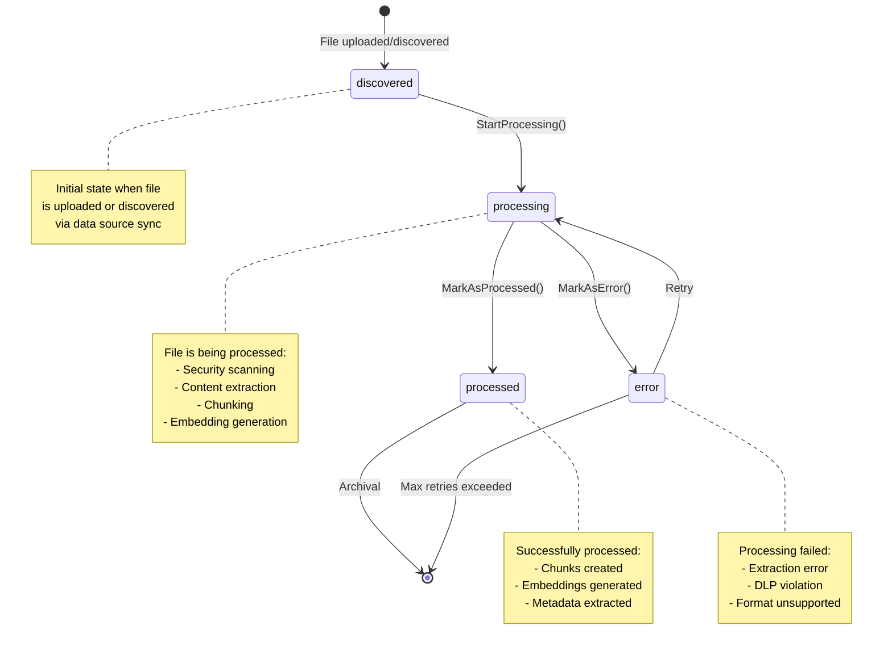
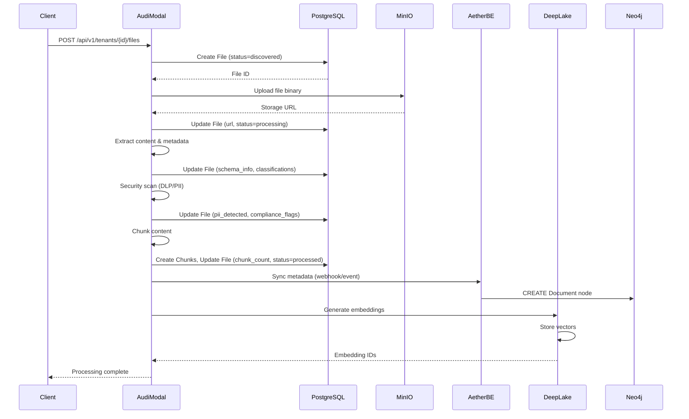

# AudiModal File Entity

---
service: audimodal
model: File
database: PostgreSQL
version: 1.0
last_updated: 2026-01-05
author: TAS Platform Team
---

## 1. Overview

**Purpose**: The File entity represents files ingested, processed, and analyzed by the AudiModal multi-modal document processing service. It tracks file metadata, processing status, content analysis results, security scanning outcomes, and compliance flags for all documents uploaded to the platform.

**Lifecycle**:
- **Created**: When a file is uploaded directly or discovered via data source sync
- **Updated**: During processing stages (security scanning, extraction, chunking, embedding generation)
- **Deleted**: Soft-deleted when removed from the system (hard delete after retention period)

**Ownership**: AudiModal service (Go-based microservice)

**Key Characteristics**:
- Multi-tenant isolation via `tenant_id` field
- Comprehensive processing status tracking (discovered → processing → processed/error)
- Three-tier processing model (tier1: <10MB, tier2: <1GB, tier3: >1GB)
- JSONB fields for flexible metadata and schema information
- PII detection and compliance flag tracking
- Security scanning integration with DLP (Data Loss Prevention)
- Support for structured, semi-structured, and unstructured data formats
- Integration with MinIO/S3 for file storage and Neo4j for metadata relationships
- Chunk management for vector embedding generation
- Processing session tracking for batch operations

---

## 2. Schema Definition

### PostgreSQL Schema

#### Fields/Properties

| Field Name | Type | Required | Default | Description |
|------------|------|----------|---------|-------------|
| **Identity & Relationships** |
| `id` | UUID | Yes | gen_random_uuid() | Unique file identifier |
| `tenant_id` | UUID | Yes | - | Tenant isolation identifier |
| `data_source_id` | UUID | No | NULL | Foreign key to data_sources table |
| `processing_session_id` | UUID | No | NULL | Foreign key to processing_sessions table |
| **File Identification** |
| `url` | string | Yes | - | File location (s3://, gs://, file://, etc.) |
| `path` | string | Yes | - | File path within storage |
| `filename` | string | Yes | - | Original filename |
| `extension` | string | No | - | File extension (pdf, docx, etc.) |
| `content_type` | string | Yes | - | MIME type (application/pdf, text/plain) |
| **File Metadata** |
| `size` | int64 | Yes | - | File size in bytes |
| `checksum` | string | No | - | File checksum for integrity verification |
| `checksum_type` | string | No | 'md5' | Checksum algorithm (md5, sha256) |
| `last_modified` | timestamp | No | - | Last modification time from source |
| **Processing Status** |
| `status` | string | Yes | 'discovered' | Processing status (see state machine) |
| `processing_tier` | string | No | - | Processing tier (tier1/tier2/tier3) |
| `processed_at` | timestamp | No | NULL | Completion timestamp |
| `processing_error` | text | No | NULL | Error message if processing failed |
| `processing_duration` | int64 | No | NULL | Processing duration in milliseconds |
| **Content Analysis** |
| `language` | string | No | - | Detected language (en, es, fr, etc.) |
| `language_confidence` | float64 | No | - | Language detection confidence (0.0-1.0) |
| `content_category` | string | No | - | Document category (financial, medical, legal) |
| `sensitivity_level` | string | No | - | Sensitivity classification (public, internal, confidential, restricted) |
| `classifications` | JSONB | No | [] | Array of classification tags |
| **Schema Information** |
| `schema_info` | JSONB | No | {} | Structured data schema (FileSchemaInfo) |
| **Chunk Information** |
| `chunk_count` | int | No | 0 | Number of chunks created |
| `chunking_strategy` | string | No | - | Strategy used (fixed, semantic, paragraph) |
| **Compliance & Security** |
| `pii_detected` | bool | Yes | false | Whether PII was detected |
| `compliance_flags` | JSONB | No | [] | Array of compliance flags (GDPR, HIPAA, PCI) |
| `encryption_status` | string | Yes | 'none' | Encryption status (none, at-rest, in-transit, both) |
| **Flexible Fields** |
| `metadata` | JSONB | No | {} | Custom metadata key-value pairs |
| `custom_fields` | JSONB | No | {} | User-defined custom fields |
| **Timestamps** |
| `created_at` | timestamp | Yes | now() | Creation timestamp |
| `updated_at` | timestamp | Yes | now() | Last update timestamp |
| `deleted_at` | timestamp | No | NULL | Soft delete timestamp |

#### Indexes

| Index Name | Fields | Type | Purpose |
|------------|--------|------|---------|
| `files_pkey` | `id` | PRIMARY KEY | Unique file identification |
| `idx_files_tenant_id` | `tenant_id` | B-tree | Tenant isolation queries |
| `idx_files_data_source_id` | `data_source_id` | B-tree | Data source lookup |
| `idx_files_processing_session_id` | `processing_session_id` | B-tree | Session association |
| `idx_files_url` | `url` | B-tree | File location lookup |
| `idx_files_path` | `path` | B-tree | Path-based queries |
| `idx_files_filename` | `filename` | B-tree | Filename search |
| `idx_files_extension` | `extension` | B-tree | Filter by file type |
| `idx_files_content_type` | `content_type` | B-tree | MIME type filtering |
| `idx_files_checksum` | `checksum` | B-tree | Duplicate detection |
| `idx_files_processing_tier` | `processing_tier` | B-tree | Tier-based processing |
| `idx_files_pii_detected` | `pii_detected` | B-tree | PII compliance queries |
| `idx_files_deleted_at` | `deleted_at` | B-tree | Soft delete filtering |

#### Constraints

- **Primary Key**: `id`
- **Foreign Keys**:
  - `tenant_id` → `tenants.id` (ON DELETE CASCADE)
  - `data_source_id` → `data_sources.id` (ON DELETE SET NULL)
  - `processing_session_id` → `processing_sessions.id` (ON DELETE SET NULL)
- **Check Constraints**:
  - `size >= 0` (file size must be non-negative)
  - `chunk_count >= 0` (chunk count must be non-negative)
  - `status IN ('discovered', 'processing', 'processed', 'completed', 'error', 'failed')` (valid status values)
  - `processing_tier IN ('tier1', 'tier2', 'tier3')` (valid tier values)
  - `encryption_status IN ('none', 'at-rest', 'in-transit', 'both')` (valid encryption values)

---

## 3. Relationships

### Foreign Key Relationships (PostgreSQL)

| FK Column | References | On Delete | On Update | Description |
|-----------|------------|-----------|-----------|-------------|
| `tenant_id` | `tenants.id` | CASCADE | CASCADE | Tenant ownership |
| `data_source_id` | `data_sources.id` | SET NULL | CASCADE | Source configuration |
| `processing_session_id` | `processing_sessions.id` | SET NULL | CASCADE | Batch processing context |

### Related Entities

**Parent Relationships (Incoming)**:
- `Tenant` (1:N) - One tenant has many files
- `DataSource` (1:N) - One data source can import many files
- `ProcessingSession` (1:N) - One session can process many files

**Child Relationships (Outgoing)**:
- `Chunk` (1:N) - One file is divided into many chunks for vector embedding
- `DLPViolation` (1:N) - One file can have multiple DLP violations detected

### GORM Relationship Configuration

```go
type File struct {
    // ... fields ...

    // GORM Relationships
    Tenant            *Tenant            `gorm:"foreignKey:TenantID"`
    DataSource        *DataSource        `gorm:"foreignKey:DataSourceID"`
    ProcessingSession *ProcessingSession `gorm:"foreignKey:ProcessingSessionID"`
    Chunks            []Chunk            `gorm:"foreignKey:FileID"`
    DLPViolations     []DLPViolation     `gorm:"foreignKey:FileID"`
}
```

---

## 4. Validation Rules

### Business Logic Constraints

- **Rule 1**: Tenant ID must exist and be active
  - Implementation: `internal/database/tenant_isolation.go`
  - Error: `TENANT_NOT_FOUND` or `TENANT_INACTIVE`

- **Rule 2**: File size must not exceed tenant quota
  - Implementation: Tenant quotas validation in upload handler
  - Error: `QUOTA_EXCEEDED`

- **Rule 3**: URL must be valid and accessible
  - Implementation: URL scheme validation in storage service
  - Error: `INVALID_FILE_URL`

- **Rule 4**: Required fields must be present (tenant_id, url, filename, size, content_type)
  - Implementation: GORM model validation
  - Error: `VALIDATION_ERROR`

- **Rule 5**: Processing tier automatically assigned based on file size
  - Implementation: `GetProcessingTier()` method
  - Tier1: < 10MB, Tier2: < 1GB, Tier3: >= 1GB

- **Rule 6**: Checksum must be unique per tenant (duplicate detection)
  - Implementation: Database query before file creation
  - Error: `DUPLICATE_FILE`

### Data Integrity

- All tenant-scoped queries MUST filter by `tenant_id`
- Status transitions follow state machine rules (see section 5)
- Soft deletes preserve data for retention period
- JSONB fields validated on insert/update
- FileSchemaInfo structure validated for structured/semi-structured files

---

## 5. Lifecycle & State Transitions

### State Machine



### Transition Rules

| From State | To State | Trigger | Conditions | Side Effects |
|------------|----------|---------|------------|--------------|
| `discovered` | `processing` | `StartProcessing()` | File accessible, tenant active | Set `processing_tier`, update `status` |
| `processing` | `processed` | `MarkAsProcessed()` | Chunks created successfully | Set `processed_at`, `chunk_count`, `chunking_strategy` |
| `processing` | `error` | `MarkAsError()` | Processing failure | Set `processing_error`, `processed_at` |
| `error` | `processing` | Manual retry | Retry count < max retries | Increment retry counter |
| `processed` | (archived) | Retention period elapsed | `deleted_at` set | Soft delete, eligible for cleanup |

### Status Values

- **discovered**: File has been uploaded or discovered via sync, awaiting processing
- **processing**: File is currently being processed (extraction, chunking, embedding)
- **processed**: Successfully processed, chunks and metadata extracted
- **completed**: Alias for `processed` (legacy compatibility)
- **error**: Processing failed with errors
- **failed**: Alias for `error` (legacy compatibility)

---

## 6. Examples

### Creating a New File

**Application Code (Go)**:
```go
file := &models.File{
    ID:          uuid.New(),
    TenantID:    tenantID,
    URL:         "s3://bucket/path/to/document.pdf",
    Path:        "/path/to/document.pdf",
    Filename:    "document.pdf",
    Extension:   "pdf",
    ContentType: "application/pdf",
    Size:        1024768,
    Checksum:    "abc123def456",
    ChecksumType: "md5",
    Status:      "discovered",
    CreatedAt:   time.Now(),
    UpdatedAt:   time.Now(),
}
err := db.Create(file).Error
```

**PostgreSQL (SQL)**:
```sql
INSERT INTO files (
    id, tenant_id, url, path, filename, extension, content_type,
    size, checksum, checksum_type, status, created_at, updated_at
) VALUES (
    gen_random_uuid(),
    '9855e094-36a6-4d3a-a4f5-d77da4614439',
    's3://bucket/path/to/document.pdf',
    '/path/to/document.pdf',
    'document.pdf',
    'pdf',
    'application/pdf',
    1024768,
    'abc123def456',
    'md5',
    'discovered',
    NOW(),
    NOW()
)
RETURNING *;
```

### Starting File Processing

**Go Code**:
```go
// Start processing
file.StartProcessing()

// Update in database
db.Model(&file).Updates(map[string]interface{}{
    "status": file.Status,
    "processing_tier": file.ProcessingTier,
    "updated_at": time.Now(),
})
```

### Marking File as Processed

**Go Code**:
```go
startTime := time.Now()

// Process file...
chunks := 15
strategy := "semantic"

// Mark as processed
file.MarkAsProcessed(chunks, strategy)
file.CalculateProcessingDuration(startTime)

// Update in database
db.Model(&file).Updates(map[string]interface{}{
    "status": "processed",
    "processed_at": file.ProcessedAt,
    "chunk_count": file.ChunkCount,
    "chunking_strategy": file.ChunkingStrategy,
    "processing_duration": file.ProcessingDuration,
    "updated_at": time.Now(),
})
```

### Querying Files

**Find by ID**:
```go
// Go
var file models.File
err := db.Where("id = ? AND tenant_id = ?", fileID, tenantID).First(&file).Error

// SQL
SELECT * FROM files WHERE id = $1 AND tenant_id = $2 AND deleted_at IS NULL;
```

**List Files for Tenant with Filters**:
```go
// Go - List files with PII detected
var files []models.File
err := db.Where("tenant_id = ? AND pii_detected = ?", tenantID, true).
    Order("created_at DESC").
    Limit(20).
    Find(&files).Error

// SQL
SELECT * FROM files
WHERE tenant_id = $1
  AND pii_detected = true
  AND deleted_at IS NULL
ORDER BY created_at DESC
LIMIT 20;
```

**Search by Processing Status**:
```sql
-- Find all files currently processing for a tenant
SELECT id, filename, processing_tier, status, created_at
FROM files
WHERE tenant_id = $1
  AND status = 'processing'
  AND deleted_at IS NULL
ORDER BY created_at ASC;
```

**Complex Query with JSONB**:
```sql
-- Find files with specific classification
SELECT id, filename, classifications, sensitivity_level
FROM files
WHERE tenant_id = $1
  AND classifications @> '["financial"]'::jsonb
  AND sensitivity_level = 'restricted'
  AND deleted_at IS NULL;
```

### Updating File Metadata

**Add Classification**:
```go
// Go
file.AddClassification("financial")
file.AddClassification("tax-document")

db.Model(&file).Updates(map[string]interface{}{
    "classifications": file.Classifications,
    "updated_at": time.Now(),
})
```

**Add Compliance Flag**:
```go
// Go
file.AddComplianceFlag("GDPR")
file.AddComplianceFlag("HIPAA")

db.Model(&file).Updates(map[string]interface{}{
    "compliance_flags": file.ComplianceFlags,
    "updated_at": time.Now(),
})
```

### Soft Delete

```go
// Go
err := db.Model(&file).Update("deleted_at", time.Now()).Error

// SQL
UPDATE files
SET deleted_at = NOW(), updated_at = NOW()
WHERE id = $1 AND tenant_id = $2;
```

---

## 7. Cross-Service References

### Services That Use This Model

| Service | Purpose | Access Pattern | Notes |
|---------|---------|----------------|-------|
| **AudiModal** | Primary owner | Read/Write | Creates, processes, and manages files |
| **Aether Backend** | Document metadata sync | Read | Syncs file metadata to Neo4j Document nodes |
| **DeepLake API** | Vector embeddings | Read | Retrieves file chunks for embedding generation |
| **TAS LLM Router** | Context retrieval | Read | Queries file metadata for LLM context |
| **MinIO/S3** | File storage | Write/Read | Stores actual file binary data |

### ID Mapping

| This Service | Other Service | Mapping | Notes |
|--------------|---------------|---------|-------|
| `file.id` | `aether-be.Document.id` | Direct UUID mapping | File ID becomes Document ID |
| `file.tenant_id` | `aether-be.Document.tenant_id` | Direct | Tenant isolation maintained |
| `file.url` | MinIO S3 path | Direct | Storage location reference |
| `file.id` | `deeplake-api.embedding.file_id` | Foreign key | File chunks reference |
| `file.chunks[].id` | `aether-be.Chunk.id` | Direct | Chunk synchronization |

### Data Flow



---

## 8. Tenant & Space Isolation

### Multi-Tenancy Fields

| Field | Purpose | Pattern | Example |
|-------|---------|---------|---------|
| `tenant_id` | Tenant isolation | UUID from Keycloak user attributes | `9855e094-36a6-4d3a-a4f5-d77da4614439` |

**Note**: AudiModal currently uses `tenant_id` only. Space-based isolation (`space_id`) is planned for future implementation to align with Aether Backend's space-based multi-tenancy model.

### Isolation Queries

**Always filter by tenant_id**:
```sql
-- CORRECT: All file queries must include tenant_id
SELECT * FROM files
WHERE tenant_id = $1
  AND deleted_at IS NULL;

-- INCORRECT: Never query across tenant boundaries
SELECT * FROM files WHERE deleted_at IS NULL; -- SECURITY RISK!
```

**Go Example with Tenant Isolation**:
```go
// Middleware extracts tenant_id from JWT claims
tenantID := c.Get("tenant_id").(uuid.UUID)

// All queries scoped to tenant
var files []models.File
err := db.Where("tenant_id = ?", tenantID).
    Where("deleted_at IS NULL").
    Find(&files).Error
```

### Validation

- ✅ All CREATE operations MUST include valid `tenant_id`
- ✅ All READ queries MUST filter by `tenant_id`
- ✅ All UPDATE operations MUST verify `tenant_id` matches
- ✅ All DELETE operations MUST verify `tenant_id` matches
- ✅ Never expose data across tenant boundaries
- ⚠️ Future: Add `space_id` for space-based isolation within tenants

---

## 9. Performance Considerations

### Indexes for Performance

- **Tenant Queries**: `idx_files_tenant_id` enables fast tenant-scoped lookups
- **Processing Queue**: `idx_files_processing_tier` for tier-based processing prioritization
- **Status Filtering**: Composite index on `(tenant_id, status, processing_tier)` for queue optimization
- **Duplicate Detection**: `idx_files_checksum` for fast duplicate file detection
- **PII Compliance**: `idx_files_pii_detected` for compliance reporting
- **Soft Delete**: `idx_files_deleted_at` for efficient filtering of active files

### Query Optimization Tips

- Always include `tenant_id` in WHERE clause for index usage
- Add `deleted_at IS NULL` to filter soft-deleted files
- Use JSONB operators efficiently:
  - `@>` for containment checks
  - `?` for key existence
  - `->` for extraction
- Limit result sets with `LIMIT` and `OFFSET` for pagination
- Use `SELECT` specific columns instead of `SELECT *` for large result sets
- Consider partitioning by `tenant_id` for large multi-tenant deployments

### Caching Strategy

**Redis Cache for File Metadata**:
- **Cache Key**: `file:{tenant_id}:{file_id}`
- **TTL**: 15 minutes
- **Invalidation**: On file update, processing completion, or deletion
- **Use Case**: Frequently accessed file metadata (status checks, metadata queries)

**Example Caching Pattern**:
```go
// Try cache first
cacheKey := fmt.Sprintf("file:%s:%s", tenantID, fileID)
cached, err := redis.Get(ctx, cacheKey).Result()
if err == nil {
    // Cache hit
    json.Unmarshal([]byte(cached), &file)
    return file, nil
}

// Cache miss - query database
db.Where("id = ? AND tenant_id = ?", fileID, tenantID).First(&file)

// Cache result
json, _ := json.Marshal(file)
redis.Set(ctx, cacheKey, json, 15*time.Minute)
```

### JSONB Performance

- Index on JSONB columns for frequent queries:
  ```sql
  CREATE INDEX idx_files_classifications_gin ON files USING GIN (classifications);
  CREATE INDEX idx_files_schema_info_gin ON files USING GIN (schema_info);
  ```
- Use GIN indexes for JSONB containment queries
- Keep JSONB documents relatively small (< 1KB recommended)
- Consider extracting frequently queried JSONB fields to dedicated columns

---

## 10. Security & Compliance

### Sensitive Data

| Field | Sensitivity | Encryption | PII | Retention |
|-------|-------------|------------|-----|-----------|
| `filename` | Low | None | Possible | 90 days post-delete |
| `url` | Medium | At rest (PostgreSQL) | No | 90 days post-delete |
| `metadata` | Variable | Depends on content | Possible | 90 days post-delete |
| `custom_fields` | Variable | Depends on content | Possible | 90 days post-delete |
| `pii_detected` | High | None (boolean flag) | Metadata about PII | 90 days post-delete |
| `compliance_flags` | High | None | Compliance metadata | 7 years (regulatory) |
| `checksum` | Low | None | No | 90 days post-delete |

### Access Control

**Create**:
- Authenticated users with valid tenant_id
- Tenant must be active
- Tenant quota must not be exceeded

**Read**:
- Users belonging to the tenant
- Service accounts with tenant scope

**Update**:
- File owner (same tenant_id)
- System processes (AudiModal worker processes)
- Admin users with tenant override permission

**Delete**:
- File owner (same tenant_id)
- Tenant admin users
- System cleanup jobs (hard delete after retention)

### Audit Logging

**Events Logged**:
- `FILE_CREATED` - New file uploaded or discovered
- `FILE_PROCESSING_STARTED` - Processing initiated
- `FILE_PROCESSED` - Successfully processed
- `FILE_PROCESSING_FAILED` - Processing error occurred
- `FILE_UPDATED` - Metadata updated
- `FILE_DELETED` - Soft deleted
- `FILE_PURGED` - Hard deleted (retention cleanup)
- `PII_DETECTED` - PII found during scan
- `DLP_VIOLATION` - DLP policy violation detected

**Audit Fields** (stored in audit_logs table):
- `tenant_id` - Tenant context
- `user_id` - User who initiated action
- `file_id` - File affected
- `action` - Event type
- `timestamp` - When event occurred
- `metadata` - Additional context (JSON)

**Compliance Flags**:
- `GDPR` - EU data protection regulation
- `HIPAA` - US health information privacy
- `PCI` - Payment card industry standards
- `SOX` - Financial reporting compliance
- `CCPA` - California consumer privacy
- `FERPA` - Student record privacy

---

## 11. Migration History

### Version 1.0 (2025-12-15)
- Initial File entity implementation
- Basic fields: id, tenant_id, url, path, filename, size, content_type
- Processing status tracking (discovered, processing, processed, error)
- Relationships to Tenant, DataSource, ProcessingSession

### Version 1.1 (2025-12-20)
- Added `schema_info` JSONB field for structured data
- Added FileSchemaInfo, FieldInfo, FieldStats nested types
- Support for row/column count, field statistics

### Version 1.2 (2026-01-02)
- Added `pii_detected` boolean field
- Added `compliance_flags` JSONB array
- Added `encryption_status` field
- Enhanced DLP integration

### Version 1.3 (2026-01-05)
- Added `classifications` JSONB array
- Added `sensitivity_level` field
- Added `language` and `language_confidence` fields
- Enhanced content categorization

---

## 12. Known Issues & Limitations

**Issue 1**: Space-based isolation not yet implemented
- **Description**: Currently only tenant-level isolation exists; space_id field missing
- **Workaround**: Use tenant-level isolation only
- **Tracking**: Documented in `SPACE_BASED_IMPLEMENTATION_PLAN.md`
- **Future**: Add `space_id` field in v2.0

**Issue 2**: Large JSONB documents can impact performance
- **Description**: schema_info and metadata can grow large for complex files
- **Workaround**: Extract frequently queried fields to dedicated columns
- **Impact**: Query performance on large result sets
- **Future**: Consider separate metadata table for complex schemas

**Limitation 1**: Processing tier auto-assignment based only on file size
- **Description**: GetProcessingTier() uses file size only; doesn't consider file type complexity
- **Impact**: PDF files may need tier2/tier3 even if small
- **Future**: Enhance tier assignment with file type and complexity analysis

**Limitation 2**: Soft delete retention period hardcoded
- **Description**: 90-day retention period not configurable per tenant
- **Impact**: All tenants have same retention policy
- **Future**: Add tenant-specific retention settings in TenantCompliance

**Limitation 3**: Checksum uniqueness not enforced at database level
- **Description**: Duplicate detection happens in application code, not database constraint
- **Impact**: Race conditions could allow duplicates
- **Future**: Add unique constraint on (tenant_id, checksum) with conflict handling

---

## 13. Related Documentation

- [AudiModal Service Overview](../../audimodal/README.md)
- [Tenant Entity](./tenant.md)
- [DataSource Entity](./datasource.md)
- [ProcessingSession Entity](./processing-session.md)
- [Chunk Entity](./chunk.md)
- [DLPViolation Entity](./dlp-violation.md)
- [Aether Backend Document Node](../aether-be/nodes/document.md)
- [DeepLake Vector Structure](../deeplake-api/vectors/embedding-structure.md)
- [Cross-Service Data Flows](../cross-service/flows/document-upload.md)
- [Space-Based Implementation Plan](../../audimodal/docs/SPACE_BASED_IMPLEMENTATION_PLAN.md)

---

## 14. Changelog

| Date | Version | Author | Changes |
|------|---------|--------|---------|
| 2025-12-15 | 1.0 | TAS Team | Initial File entity implementation |
| 2025-12-20 | 1.1 | TAS Team | Added schema_info for structured data support |
| 2026-01-02 | 1.2 | TAS Team | Added PII detection and compliance flags |
| 2026-01-05 | 1.3 | TAS Team | Added content classification and language detection |
| 2026-01-05 | - | TAS Team | Created comprehensive documentation |

---

**Maintained by**: TAS Platform Team
**Last Reviewed**: 2026-01-05
**Next Review**: 2026-01-19
