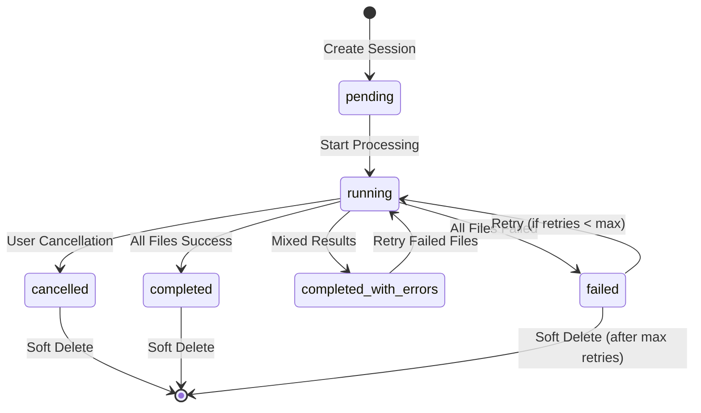
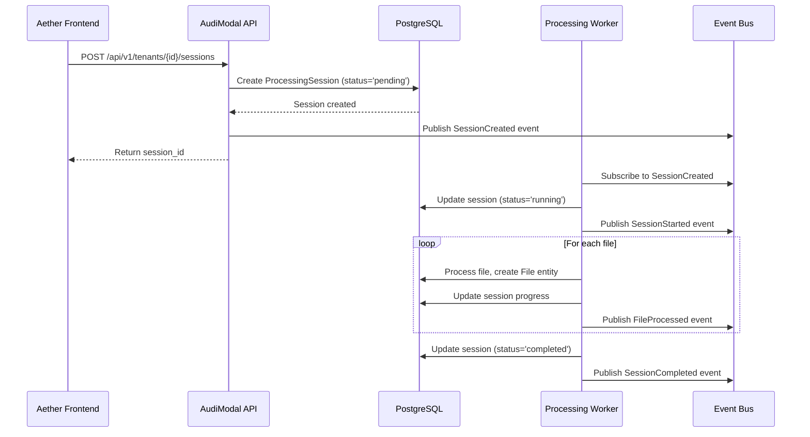

# AudiModal ProcessingSession Entity

---
service: audimodal
model: ProcessingSession
database: PostgreSQL
version: 1.0
last_updated: 2026-01-05
author: TAS Platform Team
---

## 1. Overview

**Purpose**: The ProcessingSession entity represents a batch processing operation for multiple files in the AudiModal system. It tracks the lifecycle, progress, configuration, and results of multi-file processing jobs including file ingestion, content extraction, chunking, embedding generation, and DLP scanning.

**Lifecycle**:
- **Created**: When a batch file processing job is initiated (API upload, data source sync, scheduled job)
- **Updated**: Throughout processing as files complete, fail, or are retried
- **Deleted**: Soft-deleted after job completion and retention period expires

**Ownership**: AudiModal service (Go-based microservice)

**Key Characteristics**:
- Multi-tenant isolation via `tenant_id` field
- Batch processing coordination for multiple files (1 session → N files)
- Progress tracking with file counts, byte counts, and chunk metrics
- JSONB fields for flexible file specifications and processing options
- Retry logic with configurable max retries (default: 3)
- Status-based state machine (pending → running → completed/failed/cancelled)
- Priority-based queue management (low, normal, high, critical)
- Parallel processing support with configurable batch sizes
- Chunking strategy configuration (fixed, semantic, paragraph)
- Embedding type selection (text-embedding-ada-002, all-MiniLM-L6-v2, etc.)
- DLP scanning integration with compliance flag tracking
- Resource usage metrics (processed_bytes, chunks_created)

---

## 2. Schema Definition

### PostgreSQL Schema

#### Fields/Properties

| Field Name | Type | Required | Default | Description |
|------------|------|----------|---------|-------------|
| **Identity & Relationships** |
| `id` | UUID | Yes | gen_random_uuid() | Unique processing session identifier |
| `tenant_id` | UUID | Yes | - | Tenant isolation identifier |
| `name` | string | Yes | - | Unique session name (identifier slug) |
| `display_name` | string | Yes | - | Human-readable session name |
| **File Specifications** |
| `file_specs` | JSONB | No | [] | Array of ProcessingFileSpec objects |
| **Processing Options** |
| `options` | JSONB | No | {} | Processing configuration (ProcessingOptions struct) |
| `options.chunking_strategy` | string | No | - | Chunking method (fixed, semantic, paragraph, sentence) |
| `options.embedding_types` | []string | No | [] | Embedding models to generate |
| `options.dlp_scan_enabled` | bool | No | false | Enable DLP/security scanning |
| `options.priority` | string | No | 'normal' | Queue priority (low, normal, high, critical) |
| `options.max_chunk_size` | int | No | - | Maximum chunk size in characters |
| `options.overlap_size` | int | No | - | Overlap between chunks in characters |
| `options.parallel_processing` | bool | No | false | Enable parallel file processing |
| `options.batch_size` | int | No | 10 | Files processed per batch |
| `options.custom_options` | map | No | {} | Additional custom options |
| **Status & Progress** |
| `status` | string | Yes | 'pending' | Processing status (see state machine) |
| `progress` | float64 | No | 0.0 | Progress percentage (0.0-100.0) |
| `total_files` | int | No | 0 | Total files in session |
| `processed_files` | int | No | 0 | Successfully processed files |
| `failed_files` | int | No | 0 | Failed files |
| **Timing** |
| `started_at` | timestamp | No | NULL | Session start timestamp |
| `completed_at` | timestamp | No | NULL | Session completion timestamp |
| `created_at` | timestamp | Yes | now() | Creation timestamp |
| `updated_at` | timestamp | Yes | now() | Last update timestamp |
| `deleted_at` | timestamp | No | NULL | Soft delete timestamp |
| **Error Handling** |
| `last_error` | text | No | NULL | Most recent error message |
| `error_count` | int | No | 0 | Total errors encountered |
| `retry_count` | int | No | 0 | Number of retry attempts |
| `max_retries` | int | No | 3 | Maximum retry attempts |
| **Resource Usage** |
| `processed_bytes` | int64 | No | 0 | Total bytes processed |
| `total_bytes` | int64 | No | 0 | Total bytes to process |
| `chunks_created` | int64 | No | 0 | Total chunks generated |

#### Indexes

| Index Name | Fields | Type | Purpose |
|------------|--------|------|---------|
| `processing_sessions_pkey` | `id` | PRIMARY KEY | Unique session identification |
| `idx_processing_sessions_tenant_id` | `tenant_id` | B-tree | Tenant isolation queries |
| `idx_processing_sessions_name` | `name` | B-tree | Session lookup by name |
| `idx_processing_sessions_deleted_at` | `deleted_at` | B-tree | Soft delete filtering |

#### Constraints

- **Primary Key**: `id` (UUID)
- **Foreign Keys**:
  - `tenant_id` → `tenants.id` (CASCADE on delete/update)
- **Check Constraints**:
  - `status` must be one of: 'pending', 'running', 'completed', 'failed', 'cancelled', 'completed_with_errors'
  - `progress` must be between 0.0 and 100.0
  - `total_files` >= `processed_files` + `failed_files`

---

## 3. Relationships

### Foreign Key Relationships (SQL)

| Relationship | Table | FK Column | On Delete | On Update | Description |
|--------------|-------|-----------|-----------|-----------|-------------|
| Belongs to | `tenants` | `tenant_id` | CASCADE | CASCADE | Session owned by tenant |
| Has many | `files` | `processing_session_id` | SET NULL | CASCADE | Files in this session |

### Relationship Cardinality

- **ProcessingSession → Tenant**: N:1 (many sessions belong to one tenant)
- **ProcessingSession → Files**: 1:N (one session has many files)

---

## 4. Validation Rules

### Business Logic Constraints

- **Rule 1**: Session must belong to a valid tenant
  - Implementation: Foreign key constraint + application validation
  - Error: `"invalid tenant_id"`

- **Rule 2**: File specifications must be valid JSON array
  - Implementation: `processing_session.go:74-83` - Scan/Value methods
  - Error: `"invalid file_specs format"`

- **Rule 3**: Progress percentage must be 0-100
  - Implementation: `processing_session.go:131-136` - GetProgress() calculation
  - Error: Database check constraint violation

- **Rule 4**: Retry count cannot exceed max_retries
  - Implementation: `processing_session.go:154-157` - CanRetry() method
  - Error: `"max retries exceeded"`

### Data Integrity

- When status is 'completed', `completed_at` timestamp must be set
- When status is 'running', `started_at` timestamp must be set
- `processed_files` + `failed_files` should not exceed `total_files`
- Files with `processing_session_id` must exist in `processing_sessions` table

---

## 5. Lifecycle & State Transitions

### State Machine



### Transition Rules

| From State | To State | Trigger | Conditions | Side Effects |
|------------|----------|---------|------------|--------------|
| `[none]` | `pending` | Session creation | Valid file_specs | Set `created_at`, initialize counters |
| `pending` | `running` | Start() called | Has files to process | Set `started_at`, `status='running'` |
| `running` | `completed` | All files processed | `failed_files == 0` | Set `completed_at`, `progress=100.0` |
| `running` | `failed` | All files failed | `processed_files == 0` | Set `completed_at`, increment `error_count` |
| `running` | `completed_with_errors` | Mixed results | Both successes and failures | Set `completed_at`, `progress=100.0` |
| `running` | `cancelled` | Cancel() called | User/admin request | Set `completed_at`, stop processing |
| `failed` | `running` | Retry attempt | `retry_count < max_retries` | Increment `retry_count`, reset counters |

---

## 6. Examples

### Creating a New Processing Session

**PostgreSQL (SQL)**:
```sql
INSERT INTO processing_sessions (
  id, tenant_id, name, display_name,
  files, options, status, total_files, total_bytes,
  created_at, updated_at
) VALUES (
  gen_random_uuid(),
  '9855e094-36a6-4d3a-a4f5-d77da4614439',
  'batch-upload-2026-01-05',
  'January 2026 Document Batch',
  '[{
    "url": "s3://bucket/file1.pdf",
    "size": 1048576,
    "content_type": "application/pdf",
    "checksum": "abc123"
  }]'::jsonb,
  '{
    "chunking_strategy": "semantic",
    "embedding_types": ["text-embedding-ada-002"],
    "dlp_scan_enabled": true,
    "priority": "high",
    "parallel_processing": true,
    "batch_size": 20
  }'::jsonb,
  'pending',
  1,
  1048576,
  NOW(),
  NOW()
)
RETURNING *;
```

**Application Code (Go)**:
```go
package main

import (
	"time"
	"github.com/google/uuid"
	"audimodal/internal/database/models"
)

func createProcessingSession(tenantID uuid.UUID, files []models.ProcessingFileSpec) (*models.ProcessingSession, error) {
	totalBytes := int64(0)
	for _, f := range files {
		totalBytes += f.Size
	}

	session := &models.ProcessingSession{
		ID:          uuid.New(),
		TenantID:    tenantID,
		Name:        "batch-upload-2026-01-05",
		DisplayName: "January 2026 Document Batch",
		FileSpecs:   files,
		Options: models.ProcessingOptions{
			ChunkingStrategy:   "semantic",
			EmbeddingTypes:     []string{"text-embedding-ada-002"},
			DLPScanEnabled:     true,
			Priority:           "high",
			ParallelProcessing: true,
			BatchSize:          20,
		},
		Status:     "pending",
		TotalFiles: len(files),
		TotalBytes: totalBytes,
		MaxRetries: 3,
		CreatedAt:  time.Now(),
		UpdatedAt:  time.Now(),
	}

	err := db.Create(&session).Error
	return session, err
}
```

### Starting a Processing Session

```go
func startSession(session *models.ProcessingSession) error {
	session.Start()
	return db.Save(session).Error
}

// Internal implementation (from processing_session.go:184-189)
func (p *ProcessingSession) Start() {
	p.Status = "running"
	now := time.Now()
	p.StartedAt = &now
}
```

### Updating Session Progress

```go
func updateSessionProgress(session *models.ProcessingSession, processed, failed int, bytes int64) error {
	session.UpdateProgress(processed, failed, bytes)
	return db.Save(session).Error
}

// Internal implementation (from processing_session.go:159-182)
func (p *ProcessingSession) UpdateProgress(processedFiles, failedFiles int, processedBytes int64) {
	p.ProcessedFiles = processedFiles
	p.FailedFiles = failedFiles
	p.ProcessedBytes = processedBytes
	p.Progress = p.GetProgress()

	// Update status based on progress
	if p.ProcessedFiles+p.FailedFiles >= p.TotalFiles {
		if p.FailedFiles == 0 {
			p.Status = "completed"
			now := time.Now()
			p.CompletedAt = &now
		} else if p.ProcessedFiles == 0 {
			p.Status = "failed"
			now := time.Now()
			p.CompletedAt = &now
		} else {
			p.Status = "completed_with_errors"
			now := time.Now()
			p.CompletedAt = &now
		}
	}
}
```

### Querying Sessions

**Find Active Sessions**:
```sql
SELECT * FROM processing_sessions
WHERE tenant_id = $1
AND status IN ('pending', 'running')
AND deleted_at IS NULL
ORDER BY created_at DESC;
```

**Find Sessions by Priority**:
```sql
SELECT * FROM processing_sessions
WHERE tenant_id = $1
AND options->>'priority' = 'high'
AND deleted_at IS NULL
ORDER BY created_at ASC
LIMIT 10;
```

**Get Session Statistics**:
```sql
SELECT
  COUNT(*) AS total_sessions,
  SUM(CASE WHEN status = 'completed' THEN 1 ELSE 0 END) AS completed,
  SUM(CASE WHEN status = 'failed' THEN 1 ELSE 0 END) AS failed,
  SUM(total_files) AS total_files_processed,
  SUM(processed_bytes) / (1024*1024*1024) AS total_gb_processed
FROM processing_sessions
WHERE tenant_id = $1
AND created_at >= NOW() - INTERVAL '30 days'
AND deleted_at IS NULL;
```

---

## 7. Cross-Service References

### Services That Use This Model

| Service | Purpose | Access Pattern | Notes |
|---------|---------|----------------|-------|
| **AudiModal** | Primary owner | Read/Write | Creates, updates, and manages processing sessions |
| **Aether Backend** | Session monitoring | Read only | Displays job status in UI |
| **Kafka Event Bus** | Progress events | Write | Publishes session status changes |

### ID Mapping

| This Service | Other Service | Mapping | Notes |
|--------------|---------------|---------|-------|
| `processing_session.id` | `files.processing_session_id` | Direct UUID | Files link to session |
| `processing_session.tenant_id` | `tenants.id` | Direct UUID | Session belongs to tenant |

### Data Flow



---

## 8. Tenant & Space Isolation

### Multi-Tenancy Fields

| Field | Purpose | Pattern | Example |
|-------|---------|---------|---------|
| `tenant_id` | Tenant isolation | UUID | `9855e094-36a6-4d3a-a4f5-d77da4614439` |

### Isolation Queries

**All queries MUST filter by tenant_id**:

```sql
-- CORRECT: Filter by tenant_id
SELECT * FROM processing_sessions
WHERE tenant_id = $1
AND deleted_at IS NULL;

-- INCORRECT: Missing tenant_id (security vulnerability)
SELECT * FROM processing_sessions
WHERE name = $1; -- ❌ Can leak sessions across tenants
```

### Validation

- ✅ All API requests MUST include tenant context
- ✅ Session creation MUST validate tenant_id exists
- ✅ File processing MUST verify files belong to same tenant as session
- ✅ Progress updates MUST check tenant ownership

---

## 9. Performance Considerations

### Indexes for Performance

- **Index 1**: `idx_processing_sessions_tenant_id` (B-tree)
  - Purpose: Fast tenant isolation queries
  - Use case: List all sessions for a tenant

- **Index 2**: `idx_processing_sessions_name` (B-tree)
  - Purpose: Session lookup by unique name
  - Use case: API requests with session name

### Query Optimization Tips

- **Tip 1**: Use `status IN ('pending', 'running')` for active session queries
- **Tip 2**: JSONB operators (`->`, `->>`) for querying options fields
- **Tip 3**: Batch update progress to reduce database writes
- **Tip 4**: Use partial indexes for common status queries

### Caching Strategy

- **Cache Key**: `processing_session:{session_id}`
- **TTL**: 300 seconds (5 minutes)
- **Invalidation**: On status change or progress update
- **Cache Warming**: Not needed (sessions are transient)

---

## 10. Security & Compliance

### Sensitive Data

| Field | Sensitivity | Encryption | PII | Retention |
|-------|-------------|------------|-----|-----------|
| `file_specs` | Medium | In-transit | Possible (URLs) | Per tenant compliance |
| `options` | Low | None | No | Indefinite |
| `last_error` | Low | None | No | 90 days |

### Access Control

- **Create**: Tenant admins, API keys with write permissions
- **Read**: Tenant users can read their own sessions
- **Update**: System only (progress updates)
- **Delete**: Tenant admins, automatic after retention period

### Audit Logging

- **Events Logged**: Session creation, status changes, completion
- **Audit Table**: `audit_logs` with `entity_type='processing_session'`

---

## 11. Migration History

### Version 1.0 (2026-01-05)
- Initial processing session model definition
- JSONB fields for file_specs and options
- Progress tracking with retry logic
- Status-based state machine

---

## 12. Known Issues & Limitations

- **Limitation 1**: File specifications stored as JSONB, not normalized
  - **Impact**: Cannot query individual files within a session efficiently
  - **Future**: Consider `processing_session_files` join table

- **Issue 1**: Progress percentage can drift due to async updates
  - **Workaround**: Recalculate progress from file counts periodically
  - **Tracking**: Acceptable for current use case

---

## 13. Related Documentation

- [AudiModal File Entity](./file.md)
- [AudiModal Tenant Entity](./tenant.md)
- [Aether Backend Document Node](../../aether-be/nodes/document.md)
- [Cross-Service ID Mapping](../../cross-service/mappings/id-mapping-chain.md)

---

## 14. Changelog

| Date | Version | Author | Changes |
|------|---------|--------|---------|
| 2026-01-05 | 1.0 | TAS Platform Team | Initial documentation with schema, state machine, and cross-service integration |

---

**Maintained by**: TAS Platform Team
**Last Reviewed**: 2026-01-05
**Next Review**: 2026-01-12
