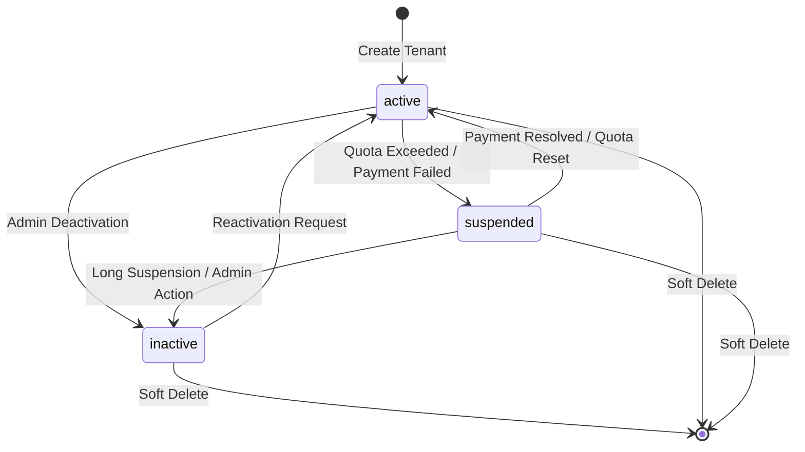
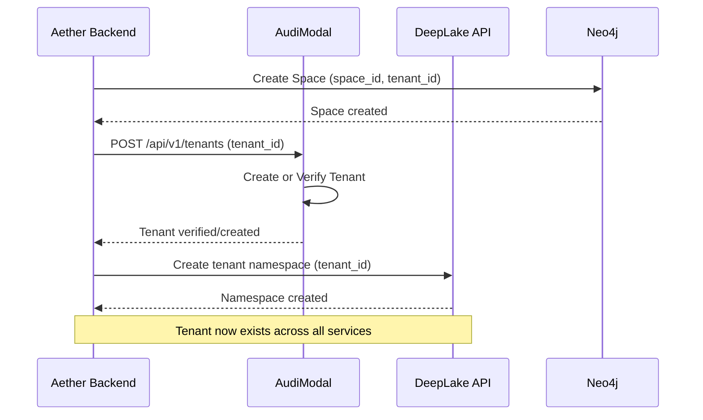

# AudiModal Tenant Entity

---
service: audimodal
model: Tenant
database: PostgreSQL
version: 1.0
last_updated: 2026-01-05
author: TAS Platform Team
---

## 1. Overview

**Purpose**: The Tenant entity represents a top-level organizational boundary in the AudiModal multi-tenant document processing system. It manages tenant-specific configuration, quotas, compliance requirements, billing information, and relationships to all tenant-scoped resources (files, processing sessions, DLP policies, data sources).

**Lifecycle**:
- **Created**: During tenant onboarding when a new organization registers with the platform
- **Updated**: When quotas are adjusted, billing plans change, or compliance requirements are modified
- **Deleted**: Soft-deleted when a tenant is deactivated (hard delete after retention period with cascade cleanup)

**Ownership**: AudiModal service (Go-based microservice)

**Key Characteristics**:
- Root-level multi-tenancy isolation entity
- JSONB fields for flexible quotas, compliance settings, and contact information
- Billing plan management with email notifications
- Resource quotas for API rate limiting, storage limits, and compute throttling
- Compliance flags for GDPR, HIPAA, SOX, PCI requirements
- One-to-many relationships with files, processing sessions, DLP policies, and data sources
- Status-based lifecycle management (active, suspended, inactive)
- Soft delete support with cascade deletion of related resources
- Contact management for admin, security, billing, and technical stakeholders

---

## 2. Schema Definition

### PostgreSQL Schema

#### Fields/Properties

| Field Name | Type | Required | Default | Description |
|------------|------|----------|---------|-------------|
| **Identity & Billing** |
| `id` | UUID | Yes | gen_random_uuid() | Unique tenant identifier |
| `name` | string | Yes | - | Unique tenant name (slug format) |
| `display_name` | string | Yes | - | Human-readable tenant display name |
| `billing_plan` | string | Yes | - | Billing plan tier (free, basic, pro, enterprise) |
| `billing_email` | string | Yes | - | Primary billing contact email |
| **Quotas** |
| `quotas` | JSONB | No | {} | Resource quotas (TenantQuotas struct) |
| `quotas.files_per_hour` | int64 | No | 0 | Max files uploadable per hour |
| `quotas.storage_gb` | int64 | No | 0 | Max storage in gigabytes |
| `quotas.compute_hours` | int64 | No | 0 | Max compute hours per billing period |
| `quotas.api_requests_per_minute` | int64 | No | 0 | API rate limit (requests/minute) |
| `quotas.max_concurrent_jobs` | int64 | No | 0 | Max concurrent processing jobs |
| `quotas.max_file_size` | int64 | No | 0 | Max single file size in bytes |
| `quotas.max_chunks_per_file` | int64 | No | 0 | Max chunks generated per file |
| `quotas.vector_storage_gb` | int64 | No | 0 | Max vector database storage in GB |
| **Compliance** |
| `compliance` | JSONB | No | {} | Compliance requirements (TenantCompliance struct) |
| `compliance.gdpr` | bool | No | false | GDPR compliance required (EU data protection) |
| `compliance.hipaa` | bool | No | false | HIPAA compliance required (healthcare data) |
| `compliance.sox` | bool | No | false | SOX compliance required (financial records) |
| `compliance.pci` | bool | No | false | PCI-DSS compliance required (payment card data) |
| `compliance.data_residency` | []string | No | [] | Data residency requirements (e.g., ["US", "EU"]) |
| `compliance.retention_days` | int | No | 0 | Data retention period in days |
| `compliance.encryption_required` | bool | No | false | Whether encryption is mandatory |
| **Contact Information** |
| `contact_info` | JSONB | No | {} | Contact information (TenantContactInfo struct) |
| `contact_info.admin_email` | string | Yes | - | Primary admin contact email |
| `contact_info.security_email` | string | No | - | Security incident contact email |
| `contact_info.billing_email` | string | No | - | Billing contact email (can differ from primary) |
| `contact_info.technical_email` | string | No | - | Technical support contact email |
| **Status & Timestamps** |
| `status` | string | Yes | 'active' | Tenant status (active, suspended, inactive) |
| `created_at` | timestamp | Yes | now() | Tenant creation timestamp |
| `updated_at` | timestamp | Yes | now() | Last update timestamp |
| `deleted_at` | timestamp | No | NULL | Soft delete timestamp |

#### Indexes

| Index Name | Fields | Type | Purpose |
|------------|--------|------|---------|
| `tenants_pkey` | `id` | PRIMARY KEY | Unique tenant identification |
| `idx_tenants_name` | `name` | UNIQUE B-tree | Unique tenant name lookup |
| `idx_tenants_deleted_at` | `deleted_at` | B-tree | Soft delete filtering |

#### Constraints

- **Primary Key**: `id` (UUID)
- **Unique**: `name` (tenant slug must be unique across platform)
- **Foreign Keys**: None (Tenant is root-level entity)
- **Check Constraints**:
  - `status` must be one of: 'active', 'suspended', 'inactive'
  - `billing_plan` must be one of: 'free', 'basic', 'pro', 'enterprise'
  - `name` must match pattern: `^[a-z0-9-]+$` (lowercase alphanumeric with hyphens)

---

## 3. Relationships

### Foreign Key Relationships (SQL)

| Relationship | Table | FK Column | On Delete | On Update | Description |
|--------------|-------|-----------|-----------|-----------|-------------|
| Has many | `files` | `tenant_id` | CASCADE | CASCADE | Tenant owns files |
| Has many | `data_sources` | `tenant_id` | CASCADE | CASCADE | Tenant owns data sources |
| Has many | `processing_sessions` | `tenant_id` | CASCADE | CASCADE | Tenant owns processing sessions |
| Has many | `dlp_policies` | `tenant_id` | CASCADE | CASCADE | Tenant owns DLP policies |
| Has many | `chunks` | `tenant_id` | CASCADE | CASCADE | Tenant owns document chunks |

### Relationship Cardinality

- **Tenant → Files**: 1:N (one tenant has many files)
- **Tenant → DataSources**: 1:N (one tenant has many data sources)
- **Tenant → ProcessingSessions**: 1:N (one tenant has many processing sessions)
- **Tenant → DLPPolicies**: 1:N (one tenant has many DLP policies)
- **Tenant → Chunks**: 1:N (one tenant has many chunks)

---

## 4. Validation Rules

### Business Logic Constraints

- **Rule 1**: Tenant name must be unique across the platform
  - Implementation: `tenant.go:159` - `Validate()` method
  - Error: `"name is required"` or `"name already exists"`

- **Rule 2**: Billing email must be provided for all billing plans
  - Implementation: `tenant.go:175`
  - Error: `"billing email is required"`

- **Rule 3**: Admin email in contact_info is mandatory
  - Implementation: `tenant.go:194`
  - Error: `"contact_info.admin_email is required"`

- **Rule 4**: Quotas must be non-negative
  - Implementation: `tenant.go:185-191`
  - Error: `"quotas.files_per_hour must be non-negative"`, `"quotas.storage_gb must be non-negative"`

- **Rule 5**: Status must be valid enum value
  - Implementation: `tenant.go:180`
  - Error: `"invalid status value"`

### Data Integrity

- Email fields must be valid email addresses (validated by application layer)
- Tenant name must be lowercase with hyphens only (slug format)
- JSONB fields must deserialize correctly to their respective structs
- Soft-deleted tenants (`deleted_at IS NOT NULL`) cannot be reactivated

---

## 5. Lifecycle & State Transitions

### State Machine



### Transition Rules

| From State | To State | Trigger | Conditions | Side Effects |
|------------|----------|---------|------------|--------------|
| `[none]` | `active` | Tenant onboarding | Valid registration, payment method configured | Create default quotas, send welcome email |
| `active` | `suspended` | Quota exceeded | `files_per_hour` limit reached, payment failed | Disable API access, send notification |
| `active` | `inactive` | Admin deactivation | Admin request, contract termination | Stop processing jobs, archive data |
| `suspended` | `active` | Quota reset | Payment resolved, quota limit reset | Re-enable API access, clear suspension flags |
| `suspended` | `inactive` | Long suspension | Suspended > 30 days, admin decision | Archive data, prepare for deletion |
| `inactive` | `active` | Reactivation | Admin approval, contract renewal | Restore access, re-enable quotas |
| `active` | `[deleted]` | Soft delete | Contract ended, GDPR deletion request | Set `deleted_at`, cascade delete related resources |

---

## 6. Examples

### Creating a New Tenant

**PostgreSQL (SQL)**:
```sql
INSERT INTO tenants (
  id, name, display_name, billing_plan, billing_email,
  quotas, compliance, contact_info, status, created_at, updated_at
) VALUES (
  gen_random_uuid(),
  'acme-corp',
  'ACME Corporation',
  'enterprise',
  'billing@acme.com',
  '{"files_per_hour": 10000, "storage_gb": 5000, "compute_hours": 1000, "api_requests_per_minute": 1000, "max_concurrent_jobs": 50, "max_file_size": 10737418240, "max_chunks_per_file": 10000, "vector_storage_gb": 500}'::jsonb,
  '{"gdpr": true, "hipaa": false, "sox": true, "pci": false, "data_residency": ["US", "EU"], "retention_days": 2555, "encryption_required": true}'::jsonb,
  '{"admin_email": "admin@acme.com", "security_email": "security@acme.com", "billing_email": "billing@acme.com", "technical_email": "tech@acme.com"}'::jsonb,
  'active',
  NOW(),
  NOW()
)
RETURNING *;
```

**Application Code (Go)**:
```go
package main

import (
	"time"
	"github.com/google/uuid"
	"audimodal/internal/database/models"
)

func createTenant() (*models.Tenant, error) {
	tenant := &models.Tenant{
		ID:          uuid.New(),
		Name:        "acme-corp",
		DisplayName: "ACME Corporation",
		BillingPlan: "enterprise",
		BillingEmail: "billing@acme.com",
		Quotas: models.TenantQuotas{
			FilesPerHour:         10000,
			StorageGB:            5000,
			ComputeHours:         1000,
			APIRequestsPerMinute: 1000,
			MaxConcurrentJobs:    50,
			MaxFileSize:          10 * 1024 * 1024 * 1024, // 10GB
			MaxChunksPerFile:     10000,
			VectorStorageGB:      500,
		},
		Compliance: models.TenantCompliance{
			GDPR:               true,
			HIPAA:              false,
			SOX:                true,
			PCI:                false,
			DataResidency:      []string{"US", "EU"},
			RetentionDays:      2555, // 7 years
			EncryptionRequired: true,
		},
		ContactInfo: models.TenantContactInfo{
			AdminEmail:     "admin@acme.com",
			SecurityEmail:  "security@acme.com",
			BillingEmail:   "billing@acme.com",
			TechnicalEmail: "tech@acme.com",
		},
		Status:    "active",
		CreatedAt: time.Now(),
		UpdatedAt: time.Now(),
	}

	// Validate before saving
	if err := tenant.Validate(); len(err.Errors) > 0 {
		return nil, err
	}

	// Save to database
	err := db.Create(&tenant).Error
	return tenant, err
}
```

### Querying Tenants

**Find by ID**:
```sql
-- PostgreSQL
SELECT * FROM tenants WHERE id = $1 AND deleted_at IS NULL;
```

**Find by Name**:
```sql
-- PostgreSQL
SELECT * FROM tenants WHERE name = $1 AND deleted_at IS NULL;
```

**List Active Tenants**:
```sql
-- PostgreSQL
SELECT * FROM tenants
WHERE status = 'active'
AND deleted_at IS NULL
ORDER BY created_at DESC
LIMIT 20;
```

**List Tenants with GDPR Compliance**:
```sql
-- PostgreSQL
SELECT * FROM tenants
WHERE compliance->>'gdpr' = 'true'
AND deleted_at IS NULL;
```

**Check Quota Usage** (requires join with files table):
```sql
-- PostgreSQL: Check storage quota usage
SELECT
  t.id,
  t.name,
  t.quotas->>'storage_gb' AS quota_gb,
  COALESCE(SUM(f.size) / (1024*1024*1024), 0) AS used_gb,
  (t.quotas->>'storage_gb')::int - COALESCE(SUM(f.size) / (1024*1024*1024), 0) AS remaining_gb
FROM tenants t
LEFT JOIN files f ON f.tenant_id = t.id AND f.deleted_at IS NULL
WHERE t.id = $1
GROUP BY t.id, t.name, t.quotas;
```

### Updating Tenant

**Update Quotas**:
```sql
-- PostgreSQL
UPDATE tenants
SET quotas = jsonb_set(
  quotas,
  '{storage_gb}',
  '10000'
),
updated_at = NOW()
WHERE id = $1
RETURNING *;
```

**Update Status**:
```sql
-- PostgreSQL
UPDATE tenants
SET status = 'suspended',
    updated_at = NOW()
WHERE id = $1
RETURNING *;
```

**Add Compliance Requirement**:
```sql
-- PostgreSQL
UPDATE tenants
SET compliance = jsonb_set(
  compliance,
  '{hipaa}',
  'true'
),
updated_at = NOW()
WHERE id = $1
RETURNING *;
```

### Deleting (Soft Delete)

```sql
-- PostgreSQL: Soft delete tenant
UPDATE tenants
SET deleted_at = NOW(),
    status = 'inactive'
WHERE id = $1
RETURNING *;
```

**Note**: Soft deleting a tenant will cascade delete all related resources (files, processing sessions, DLP policies, data sources, chunks) due to `ON DELETE CASCADE` foreign key constraints.

---

## 7. Cross-Service References

### Services That Use This Model

| Service | Purpose | Access Pattern | Notes |
|---------|---------|----------------|-------|
| **AudiModal** | Primary owner | Read/Write | Creates, updates, and manages tenants |
| **Aether Backend** | Tenant lookup | Read only | Verifies tenant_id from Space.tenant_id mapping |
| **DeepLake API** | Namespace isolation | Read only | Uses tenant_id for vector storage namespacing |
| **TAS LLM Router** | Quota enforcement | Read only | Checks API rate limits via tenant quotas |
| **Agent Builder** | Tenant context | Read only | Associates agents with tenant spaces |

### ID Mapping

| This Service | Other Service | Mapping | Notes |
|--------------|---------------|---------|-------|
| `tenant.id` | `aether-be.Space.tenant_id` | Direct UUID mapping | 1:1 relationship (one Space per Tenant) |
| `tenant.id` | `deeplake-api.tenant_id` | Direct UUID mapping | Namespace prefix for vector collections |
| `tenant.id` | `audimodal.files.tenant_id` | Direct UUID mapping | All files belong to a tenant |
| `tenant.id` | `audimodal.processing_sessions.tenant_id` | Direct UUID mapping | Processing sessions scoped to tenant |

### Data Flow



---

## 8. Tenant & Space Isolation

### Multi-Tenancy Architecture

AudiModal uses the Tenant entity as the **root-level isolation boundary**. All resources (files, processing sessions, DLP policies) are scoped to a tenant via the `tenant_id` foreign key.

### Space Mapping

In the TAS platform, there is a **1:1 mapping** between Aether Spaces and AudiModal Tenants:

```
Aether Space (space_id: "9855e094-36a6-4d3a-a4f5-d77da4614439")
    ↓ (has property)
Space.tenant_id: "tenant_1767395606"
    ↓ (maps to)
AudiModal Tenant (id: "tenant_1767395606")
```

### Isolation Queries

**All queries MUST filter by tenant_id** to ensure data isolation:

```sql
-- CORRECT: Always filter by tenant_id
SELECT * FROM files
WHERE tenant_id = $1
AND deleted_at IS NULL;

-- INCORRECT: Missing tenant_id filter (security vulnerability)
SELECT * FROM files
WHERE filename = $1; -- ❌ Can leak data across tenants
```

### Validation

- ✅ All API requests MUST include tenant context (via Space headers or JWT claims)
- ✅ Database queries MUST filter by `tenant_id`
- ✅ Never expose tenant data across boundaries
- ✅ Soft deletes MUST cascade to all related resources
- ✅ Hard deletes (after retention period) MUST be audited

---

## 9. Performance Considerations

### Indexes for Performance

- **Index 1**: `idx_tenants_name` (UNIQUE B-tree)
  - Purpose: Fast tenant lookup by name (slug)
  - Use case: API requests with tenant name in URL path

- **Index 2**: `idx_tenants_deleted_at` (B-tree)
  - Purpose: Efficiently filter soft-deleted tenants
  - Use case: `WHERE deleted_at IS NULL` in all active tenant queries

### Query Optimization Tips

- **Tip 1**: Always include `deleted_at IS NULL` in WHERE clauses for active tenant queries
- **Tip 2**: Use JSONB operators (`->`, `->>`, `@>`) for querying quotas and compliance fields
- **Tip 3**: For quota usage calculations, use aggregate queries with LEFT JOINs to avoid excluding tenants with zero usage
- **Tip 4**: Cache tenant objects in Redis with TTL=3600s to reduce database load
- **Tip 5**: Use prepared statements for tenant ID lookups to leverage query plan caching

### Caching Strategy

- **Cache Key**: `tenant:{tenant_id}` or `tenant:name:{tenant_name}`
- **TTL**: 3600 seconds (1 hour)
- **Invalidation**: On tenant update, delete cache keys for both `tenant:{id}` and `tenant:name:{name}`
- **Cache Warming**: Pre-load active tenants into Redis on service startup

Example Redis cache:
```redis
SET tenant:9855e094-36a6-4d3a-a4f5-d77da4614439 '{"id":"9855e094...","name":"acme-corp",...}' EX 3600
SET tenant:name:acme-corp '{"id":"9855e094...","name":"acme-corp",...}' EX 3600
```

---

## 10. Security & Compliance

### Sensitive Data

| Field | Sensitivity | Encryption | PII | Retention |
|-------|-------------|------------|-----|-----------|
| `billing_email` | Medium | In-transit | Yes | Per compliance.retention_days |
| `contact_info.admin_email` | Medium | In-transit | Yes | Per compliance.retention_days |
| `contact_info.security_email` | Medium | In-transit | Yes | Per compliance.retention_days |
| `quotas` | Low | None | No | Indefinite |
| `compliance` | Low | None | No | Indefinite |

### Access Control

- **Create**: Platform admins only (not exposed via public API)
- **Read**: Tenant users can read their own tenant information
- **Update**: Platform admins (quotas, billing plan) or tenant admins (contact info)
- **Delete**: Platform admins only (soft delete with audit trail)

### Audit Logging

- **Events Logged**:
  - Tenant creation (who, when, initial quotas)
  - Quota changes (old values, new values, changed by)
  - Status transitions (active → suspended → inactive)
  - Soft deletes (deleted by, reason)
  - Hard deletes (deleted by, retention period expired)

- **Audit Fields**: Tracked separately in `audit_logs` table with `entity_type='tenant'`, `entity_id=tenant.id`

### Compliance Requirements

When `compliance.gdpr = true`:
- Tenant data must support right to erasure (GDPR Article 17)
- All related files, chunks, and processing sessions must be cascade-deleted
- Audit trail must be maintained for compliance verification

When `compliance.hipaa = true`:
- Encryption at rest and in transit is mandatory
- Access logs must be retained for minimum 6 years
- PHI (Protected Health Information) in files must be flagged

When `compliance.retention_days` is set:
- Automatic data deletion after retention period expires
- Soft-deleted tenants are hard-deleted after `retention_days`

---

## 11. Migration History

### Version 1.0 (2026-01-05)
- Initial tenant model definition
- JSONB fields for quotas, compliance, and contact info
- Foreign key relationships to files, data_sources, processing_sessions, dlp_policies, chunks
- Soft delete support with `deleted_at` timestamp
- Validation methods for quotas, compliance, and contact information
- Helper methods: `IsActive()`, `HasComplianceRequirement()`, `GetQuotaLimit()`

---

## 12. Known Issues & Limitations

- **Issue 1**: JSONB field updates require full struct replacement
  - **Description**: Updating a single quota value requires reading the entire `quotas` JSONB, modifying it, and writing it back
  - **Workaround**: Use `jsonb_set()` in SQL for atomic field updates
  - **Tracking**: Acceptable performance trade-off for flexibility

- **Limitation 1**: Tenant name cannot be changed after creation
  - **Description**: Tenant `name` field is immutable to maintain referential integrity across services
  - **Impact**: If tenant needs rebranding, must create new tenant and migrate data
  - **Future**: Consider adding `slug` field separate from `name` for migration support

- **Limitation 2**: Hard delete cascade is irreversible
  - **Description**: When a tenant is hard-deleted, all related resources are permanently removed
  - **Impact**: Requires careful validation before hard delete operations
  - **Future**: Implement backup/restore workflow before hard deletes

- **Issue 2**: Quota enforcement is application-layer only
  - **Description**: No database-level triggers to enforce quota limits
  - **Workaround**: Application code must check quotas before operations
  - **Tracking**: Consider adding database triggers for critical quotas (storage_gb)

---

## 13. Related Documentation

- [AudiModal File Entity](./file.md)
- [AudiModal Service Overview](../../../audimodal/README.md)
- [Aether Space Node](../../aether-be/nodes/space.md) - 1:1 Space-to-Tenant mapping
- [Cross-Service ID Mapping](../../cross-service/mappings/id-mapping-chain.md)
- [Multi-Tenancy Architecture](../../overview/INCONSISTENCIES-FOUND.md#audimodal-shared-tenant-issue)

---

## 14. Changelog

| Date | Version | Author | Changes |
|------|---------|--------|---------|
| 2026-01-05 | 1.0 | TAS Platform Team | Initial documentation with schema, relationships, validation rules, and cross-service integration |

---

**Maintained by**: TAS Platform Team
**Last Reviewed**: 2026-01-05
**Next Review**: 2026-01-12
