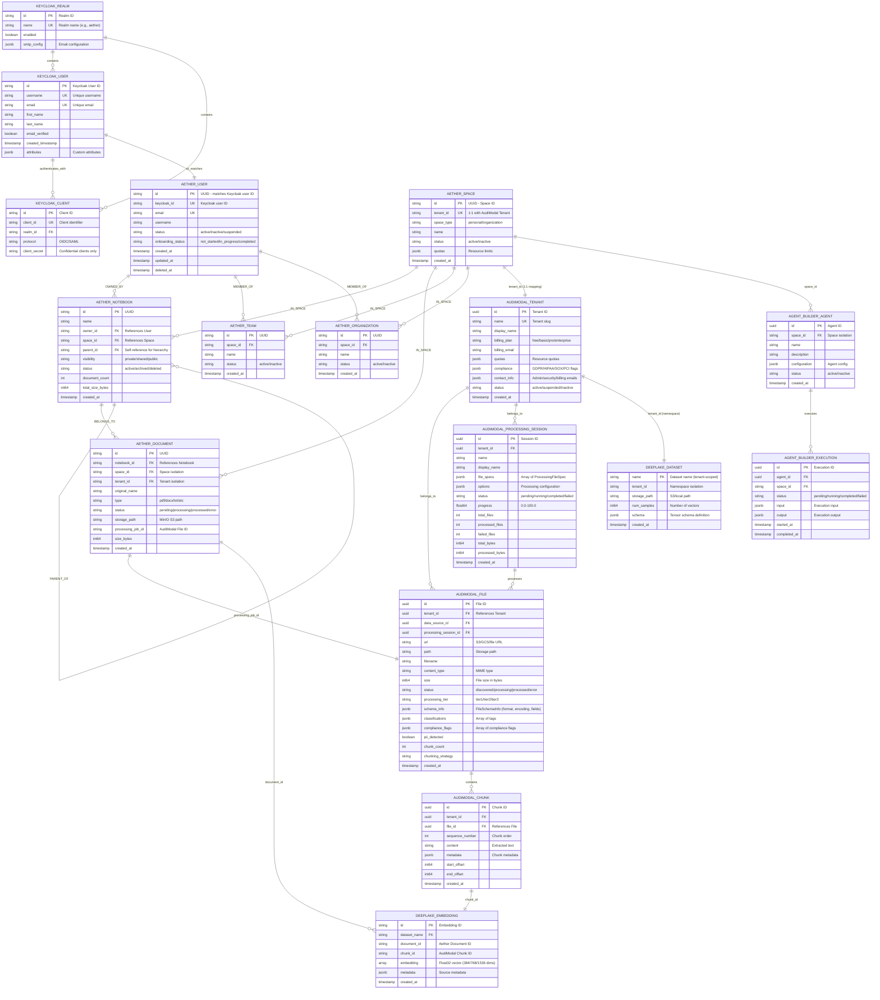

# TAS Platform-Wide Entity Relationship Diagram

---
scope: Cross-Service
diagram_type: Entity Relationship Diagram (ERD)
services: All TAS Services
version: 1.0
last_updated: 2026-01-05
author: TAS Platform Team
---

## 1. Overview

**Purpose**: This document provides a comprehensive Entity Relationship Diagram (ERD) showing all major entities across the TAS (Tributary AI Services) platform and their relationships. It serves as a visual reference for understanding cross-service data flows, isolation boundaries, and integration patterns.

**Scope**:
- Keycloak (Authentication & Identity)
- Aether Backend (Neo4j graph database)
- AudiModal (Multi-modal document processing - PostgreSQL)
- DeepLake API (Vector database)
- TAS Agent Builder (Agent orchestration - PostgreSQL)
- TAS LLM Router (LLM provider routing)

**Key Concepts**:
- **Multi-Tenancy**: tenant_id and space_id isolation across all services
- **Cross-Service Integration**: UUID-based foreign key relationships
- **1:1 Mapping**: Aether Space ↔ AudiModal Tenant
- **Data Flow**: Keycloak → Aether → AudiModal → DeepLake → Agent Builder

---

## 2. Platform-Wide ERD

### Complete Entity Relationship Diagram



---

## 3. Service-by-Service Entity Details

### 3.1 Keycloak (Authentication & Identity)

**Database**: PostgreSQL
**Purpose**: Centralized authentication and user management

**Key Entities**:
- **user_entity**: Core user accounts with credentials
- **realm**: Multi-realm support (aether realm)
- **client**: OAuth2/OIDC clients (aether-backend, aether-frontend)

**Primary Keys**: Keycloak-generated UUIDs

### 3.2 Aether Backend (Graph Database)

**Database**: Neo4j
**Purpose**: Document organization, team collaboration, knowledge management

**Key Nodes**:
- **User**: Synchronized from Keycloak, owns notebooks
- **Space**: Top-level tenant boundary (1:1 with AudiModal Tenant)
- **Notebook**: Hierarchical document containers
- **Document**: References to processed files
- **Team**: Group collaboration entity
- **Organization**: Enterprise-level entity

**Primary Keys**: Self-generated UUIDs

**Key Relationships** (Neo4j):
- `(User)-[:OWNED_BY]->(Notebook)`
- `(Document)-[:BELONGS_TO]->(Notebook)`
- `(User)-[:MEMBER_OF]->(Team|Organization)`
- `(Notebook)-[:IN_SPACE]->(Space)`

### 3.3 AudiModal (Document Processing)

**Database**: PostgreSQL
**Purpose**: Multi-modal file processing, extraction, chunking, security scanning

**Key Entities**:
- **tenants**: Root-level multi-tenancy (1:1 with Aether Space)
- **files**: Processed documents with metadata
- **processing_sessions**: Batch processing jobs
- **chunks**: Text segments for embedding generation

**Primary Keys**: PostgreSQL-generated UUIDs (gen_random_uuid())

**Foreign Keys**:
- `files.tenant_id → tenants.id`
- `chunks.file_id → files.id`
- `processing_sessions.tenant_id → tenants.id`

### 3.4 DeepLake (Vector Database)

**Database**: DeepLake (custom vector store)
**Purpose**: Embedding storage and similarity search

**Key Entities**:
- **Dataset**: Tenant-scoped vector collections
- **Embedding**: Individual vector representations

**Namespacing**: `tenant_{tenant_id}_{dataset_name}`

**Integration Points**:
- Receives chunks from AudiModal
- Indexed by Aether Document ID
- Queried by Aether for RAG workflows

### 3.5 TAS Agent Builder (Agent Orchestration)

**Database**: PostgreSQL
**Purpose**: Dynamic agent creation and execution tracking

**Key Entities**:
- **agents**: AI agent definitions with configuration
- **executions**: Agent run history and results

**Isolation**: space_id for multi-tenancy

---

## 4. Cross-Service Integration Patterns

### 4.1 ID Mapping Chain

```
Keycloak User ID
    ↓ (1:1 sync)
Aether User ID (keycloak_id field)
    ↓ (owns)
Aether Notebook ID
    ↓ (contains)
Aether Document ID
    ↓ (references)
AudiModal File ID (processing_job_id)
    ↓ (chunks into)
AudiModal Chunk ID
    ↓ (embeds into)
DeepLake Embedding ID (with metadata.document_id, metadata.chunk_id)
```

### 4.2 Tenant Isolation Pattern

```
Aether Space (space_id: UUID)
    ├─ space.tenant_id → AudiModal Tenant (1:1 mapping)
    ├─ All Aether entities filter by space_id
    ├─ AudiModal entities filter by tenant_id
    ├─ DeepLake datasets namespaced by tenant_id
    └─ Agent Builder agents filter by space_id
```

### 4.3 Document Processing Flow

```
1. User uploads file via Aether Frontend
2. Aether creates Document node (status='pending')
3. Aether calls AudiModal API → creates File entity
4. AudiModal processes file:
   - Extracts text
   - Creates Chunks
   - Publishes to Kafka
5. DeepLake listens to Kafka → generates embeddings
6. AudiModal updates File status → 'processed'
7. Aether updates Document status → 'processed'
```

---

## 5. Cardinality Reference

### One-to-One (1:1)
- Keycloak User ↔ Aether User (synchronized)
- Aether Space ↔ AudiModal Tenant (1:1 mapping via tenant_id)
- Aether Document ↔ AudiModal File (via processing_job_id)
- AudiModal Chunk ↔ DeepLake Embedding (via chunk_id)

### One-to-Many (1:N)
- Aether User → Notebooks (user can own many notebooks)
- Aether Notebook → Documents (notebook contains many documents)
- AudiModal Tenant → Files (tenant has many files)
- AudiModal File → Chunks (file split into many chunks)
- Aether Space → Teams/Organizations (space contains many teams/orgs)
- Agent Builder Agent → Executions (agent has many execution runs)

### Many-to-Many (N:M)
- Aether User ↔ Teams (via MEMBER_OF relationship with role property)
- Aether User ↔ Organizations (via MEMBER_OF relationship)

---

## 6. Critical Foreign Key Constraints

### Must Exist Constraints (CASCADE)
- `Aether Document.notebook_id` → `Aether Notebook.id` (CASCADE DELETE)
- `AudiModal File.tenant_id` → `AudiModal Tenant.id` (CASCADE DELETE)
- `AudiModal Chunk.file_id` → `AudiModal File.id` (CASCADE DELETE)
- `Agent Execution.agent_id` → `Agent.id` (CASCADE DELETE)

### Nullable Foreign Keys (SET NULL)
- `Aether Document.processing_job_id` → `AudiModal File.id` (SET NULL on delete)
- `AudiModal File.processing_session_id` → `Processing Session.id` (SET NULL)

---

## 7. Index Strategy

### Primary Indexes (All Services)
- Primary Key indexes on `id` fields (automatic)
- Unique indexes on natural keys (email, username, name+tenant_id)

### Multi-Tenancy Indexes
- **CRITICAL**: `tenant_id` B-tree indexes on all tenant-scoped tables
- **CRITICAL**: `space_id` B-tree indexes on all space-scoped tables
- Composite indexes: `(tenant_id, status)`, `(space_id, created_at DESC)`

### Performance Indexes
- Aether: `(notebook_id, status)` for document queries
- AudiModal: `(file_id, sequence_number)` for chunk ordering
- DeepLake: Vector indexes (HNSW/IVF) for similarity search

---

## 8. Data Consistency Patterns

### Eventual Consistency
- Keycloak User → Aether User synchronization (webhook-based)
- AudiModal File status → Aether Document status (polling or Kafka events)
- AudiModal Chunks → DeepLake Embeddings (async embedding generation)

### Strong Consistency
- Aether Notebook ↔ Documents (Neo4j transactions)
- AudiModal Tenant ↔ Files (PostgreSQL foreign keys)
- Processing Session ↔ Files (PostgreSQL transactions)

---

## 9. Migration & Schema Evolution

### Version History

**Version 1.0** (2026-01-05):
- Initial platform-wide ERD
- All core entities across 5 services
- Cross-service relationships documented
- Multi-tenancy isolation patterns established

### Schema Change Protocol

When adding new entities or relationships:

1. **Update ERD**: Add entity to this document
2. **Document Entity**: Create detailed entity documentation
3. **Update ID Mapping**: Update `cross-service/mappings/id-mapping-chain.md`
4. **Migration Scripts**: Create database migrations
5. **Update APIs**: Implement cross-service integration
6. **Update Tests**: Add integration tests

---

## 10. Known Inconsistencies

### Resolved Issues
- ✅ **AudiModal Shared Tenant Issue**: Fixed - now 1:1 mapping with Space
- ✅ **Document Status Sync**: Now using processing_job_id for tracking

### Pending Issues
- ⏳ **Agent Builder Space Isolation**: Needs verification that space_id column exists
- ⏳ **DeepLake Tenant Namespacing**: Documentation needed for dataset naming conventions
- ⏳ **LLM Router Space Tracking**: Enhancement needed for space-based quotas

---

## 11. Related Documentation

- [ID Mapping Chain](../mappings/id-mapping-chain.md)
- [Aether User Node](../../aether-be/nodes/user.md)
- [Aether Space Node](../../aether-be/nodes/space.md)
- [Aether Notebook Node](../../aether-be/nodes/notebook.md)
- [Aether Document Node](../../aether-be/nodes/document.md)
- [AudiModal Tenant Entity](../../audimodal/entities/tenant.md)
- [AudiModal File Entity](../../audimodal/entities/file.md)
- [AudiModal ProcessingSession Entity](../../audimodal/entities/processing-session.md)
- [Keycloak User Model](../../keycloak/users/user-model.md)
- [Keycloak JWT Structure](../../keycloak/tokens/jwt-structure.md)

---

## 12. Usage Guide

### For Developers

**When designing new features**:
1. Consult this ERD to understand entity relationships
2. Identify which services need to be updated
3. Check ID mapping chain for foreign key references
4. Verify multi-tenancy isolation (tenant_id/space_id)

**When debugging data issues**:
1. Trace data flow through services using this diagram
2. Verify foreign key constraints
3. Check for orphaned records (missing parent entities)

### For Architects

**When planning cross-service changes**:
1. Identify all affected entities in this ERD
2. Plan migration strategy (eventual vs strong consistency)
3. Update documentation before implementation

---

## 13. Changelog

| Date | Version | Author | Changes |
|------|---------|--------|---------|
| 2026-01-05 | 1.0 | TAS Platform Team | Initial platform-wide ERD with 6 services, 25+ entities, cross-service relationships |

---

**Maintained by**: TAS Platform Team
**Last Reviewed**: 2026-01-05
**Next Review**: 2026-01-12
**Status**: ✅ Complete and Accurate
