# Document Upload Flow - Cross-Service Integration

## Metadata

- **Document Type**: Cross-Service Workflow
- **Service Scope**: Aether Frontend, Aether Backend, MinIO, AudiModal, DeepLake, Kafka
- **Last Updated**: 2026-01-06
- **Owner**: TAS Platform Team
- **Status**: Active

---

## Overview

### Purpose

This document describes the complete end-to-end workflow for document upload and processing in the TAS platform. The flow spans six services and involves file storage, metadata creation, content extraction, text chunking, vector embedding generation, and asynchronous processing coordination.

### Workflow Summary

The document upload flow involves:
1. **File Upload** - User selects and uploads file via frontend
2. **Initial Validation** - File type, size, and quota checks
3. **Storage** - File uploaded to MinIO/S3 object storage
4. **Metadata Creation** - Document node created in Neo4j
5. **Processing Initiation** - AudiModal called to extract content
6. **Content Extraction** - OCR, text extraction, metadata extraction
7. **Chunking** - Document split into semantic chunks
8. **Embedding Generation** - DeepLake creates vector embeddings
9. **Status Updates** - Async updates via Kafka events
10. **Completion** - Document ready for AI queries

### Service Dependencies

```
Frontend → Backend → MinIO (storage) → AudiModal (processing) → DeepLake (vectors)
                          ↓
                       Kafka (events)
                          ↓
                       Backend (status updates)
```

### Processing Tiers

AudiModal uses a three-tier processing model based on file size:
- **Tier 1** (<10MB): Fast processing, real-time response
- **Tier 2** (10MB-1GB): Moderate processing, async with polling
- **Tier 3** (>1GB): Batch processing, long-running jobs

---

## Complete Document Upload Flow Diagram

```mermaid
sequenceDiagram
    participant User
    participant Frontend as Aether Frontend
    participant Backend as Aether Backend
    participant Neo4j
    participant MinIO as MinIO Storage
    participant AudiModal
    participant Postgres as AudiModal DB
    participant Kafka
    participant DeepLake
    participant VectorDB as DeepLake Storage

    %% Step 1-3: File Selection and Validation
    User->>Frontend: Select file in notebook UI
    Frontend->>Frontend: Validate file locally<br/>(size, type, extension)
    Note over Frontend: Client-side checks:<br/>- Max 100MB per file<br/>- Allowed types: PDF, DOCX, etc.<br/>- Filename sanitization

    %% Step 4-6: Upload Initiation
    User->>Frontend: Click "Upload"
    Frontend->>Frontend: Create FormData with file<br/>+ metadata (name, tags, desc)
    Frontend->>Backend: POST /api/v1/documents<br/>multipart/form-data<br/>Headers: Authorization, X-Space-ID

    %% Step 7-9: Backend Validation
    Backend->>Backend: Validate JWT token
    Backend->>Backend: Extract user_id from token
    Backend->>Neo4j: Verify user has access to space
    Neo4j-->>Backend: Space access confirmed

    Backend->>Neo4j: MATCH (n:Notebook {id: $notebook_id})<br/>WHERE n.space_id = $space_id
    Neo4j-->>Backend: Notebook found + tenant_id

    Backend->>Backend: Check tenant quotas<br/>(storage, file count, rate limits)
    Note over Backend: Quota checks:<br/>- Total storage < limit<br/>- Files per hour < limit<br/>- User permissions

    %% Step 10-12: Document Node Creation
    Backend->>Backend: Generate document UUID<br/>Calculate checksum (MD5)
    Backend->>Neo4j: CREATE (d:Document)<br/>{id, name, status='uploading', ...}
    Note over Neo4j: Document node created<br/>status = 'uploading'<br/>All tenant fields set
    Neo4j-->>Backend: Document created

    Backend->>Neo4j: CREATE (d)-[:BELONGS_TO]->(n:Notebook)
    Backend->>Neo4j: UPDATE n SET document_count++, total_size+=...
    Neo4j-->>Backend: Relationships created

    %% Step 13-15: MinIO Upload
    Backend->>Backend: Generate storage path:<br/>{tenant_id}/{space_id}/documents/{doc_id}/
    Backend->>MinIO: PUT object<br/>Bucket: aether-storage<br/>Path: {tenant_id}/.../{filename}
    Note over MinIO: File stored with metadata:<br/>- Content-Type<br/>- Checksum<br/>- Custom tags
    MinIO-->>Backend: 200 OK (ETag, version)

    Backend->>Neo4j: SET d.storage_path = $path,<br/>d.storage_bucket = 'aether-storage',<br/>d.status = 'processing'
    Neo4j-->>Backend: Document updated

    %% Step 16-18: AudiModal Processing Initiation
    Backend->>AudiModal: POST /api/v1/tenants/{tenant_id}/files<br/>{<br/>  url: "s3://aether-storage/...",<br/>  filename: "doc.pdf",<br/>  content_type: "application/pdf",<br/>  size: 12345,<br/>  checksum: "abc123",<br/>  processing_options: {<br/>    chunking_strategy: "semantic",<br/>    embedding_types: ["openai-ada-002"]<br/>  }<br/>}

    AudiModal->>AudiModal: Determine processing tier<br/>based on file size
    Note over AudiModal: Tier selection:<br/>Tier 1: <10MB (sync)<br/>Tier 2: 10MB-1GB (async)<br/>Tier 3: >1GB (batch)

    AudiModal->>Postgres: INSERT INTO files<br/>(id, tenant_id, url, status='processing')
    Postgres-->>AudiModal: File record created

    AudiModal-->>Backend: 202 Accepted<br/>{<br/>  job_id: "audimodal-file-uuid",<br/>  status: "processing",<br/>  estimated_time_seconds: 30<br/>}

    Backend->>Neo4j: SET d.processing_job_id = $job_id
    Neo4j-->>Backend: Document updated

    Backend-->>Frontend: 201 Created<br/>{<br/>  id: "doc-uuid",<br/>  name: "document.pdf",<br/>  status: "processing"<br/>}

    Frontend->>Frontend: Show upload success<br/>Start polling for status
    Frontend-->>User: "Document uploaded<br/>Processing in progress..."

    %% Step 19-22: AudiModal Content Extraction
    Note over AudiModal: Async processing begins

    AudiModal->>MinIO: GET object<br/>s3://aether-storage/{tenant_id}/...
    MinIO-->>AudiModal: File stream

    AudiModal->>AudiModal: Extract content:<br/>- PDF: PDFium/Poppler OCR<br/>- DOCX: python-docx<br/>- Images: Tesseract OCR<br/>- Audio: Whisper STT
    Note over AudiModal: Content extraction:<br/>- Text extraction<br/>- Metadata parsing<br/>- Language detection<br/>- PII scanning (DLP)

    AudiModal->>Postgres: UPDATE files<br/>SET extracted_text = $text,<br/>language = 'en',<br/>pii_detected = false,<br/>processing_duration = 2345

    %% Step 23-26: Text Chunking
    AudiModal->>AudiModal: Chunk text using strategy:<br/>- semantic (spaCy NLP)<br/>- fixed (1000 chars/chunk)<br/>- paragraph-based
    Note over AudiModal: Chunking produces:<br/>- 10-50 chunks per doc<br/>- Metadata per chunk<br/>- Overlap for context

    AudiModal->>Postgres: INSERT INTO chunks<br/>(file_id, text, position, ...)
    Postgres-->>AudiModal: Chunks created

    AudiModal->>Postgres: UPDATE files<br/>SET chunk_count = 25,<br/>chunking_strategy = 'semantic'

    %% Step 27-30: Embedding Generation
    AudiModal->>DeepLake: POST /api/v1/embeddings<br/>{<br/>  tenant_id: "...",<br/>  chunks: [<br/>    {id: "chunk1", text: "...", metadata: {}},<br/>    {id: "chunk2", text: "...", metadata: {}}<br/>  ],<br/>  embedding_model: "openai-ada-002"<br/>}

    DeepLake->>DeepLake: Generate embeddings:<br/>- Call OpenAI API (batch)<br/>- 1536-dim vectors<br/>- Normalize vectors
    Note over DeepLake: Embedding generation:<br/>- Batch processing (25 chunks)<br/>- API rate limiting<br/>- Error handling

    DeepLake->>VectorDB: Store embeddings in dataset:<br/>tenants/{tenant_id}/default
    Note over VectorDB: Vector storage:<br/>- id, embedding, text, metadata<br/>- Indexed for similarity search

    VectorDB-->>DeepLake: Embeddings stored

    DeepLake-->>AudiModal: 200 OK<br/>{<br/>  embedding_ids: [...],<br/>  count: 25<br/>}

    %% Step 31-34: Completion and Events
    AudiModal->>Postgres: UPDATE files<br/>SET status = 'processed',<br/>processed_at = NOW()

    AudiModal->>Kafka: Publish event:<br/>Topic: aether.document.processed<br/>{<br/>  document_id: "doc-uuid",<br/>  tenant_id: "...",<br/>  status: "processed",<br/>  extracted_text: "Full text...",<br/>  chunk_count: 25,<br/>  processing_time: 3421,<br/>  confidence_score: 0.95<br/>}

    Kafka->>Backend: Consume event<br/>(Kafka consumer group)

    Backend->>Neo4j: MATCH (d:Document {id: $document_id})<br/>SET d.status = 'processed',<br/>d.extracted_text = $text,<br/>d.chunk_count = $count,<br/>d.processing_time = $duration,<br/>d.confidence_score = $score,<br/>d.processed_at = datetime()

    Neo4j-->>Backend: Document updated

    Backend->>Backend: Update search index:<br/>d.search_text = name + desc + text

    %% Step 35-37: Frontend Polling and Display
    Note over Frontend: Polling continues every 2s

    Frontend->>Backend: GET /api/v1/documents/{id}<br/>Authorization: Bearer {token}<br/>X-Space-ID: {space_id}

    Backend->>Neo4j: MATCH (d:Document {id: $id})<br/>WHERE d.space_id = $space_id<br/>RETURN d

    Neo4j-->>Backend: Document data (status='processed')

    Backend-->>Frontend: 200 OK<br/>{<br/>  id: "doc-uuid",<br/>  name: "document.pdf",<br/>  status: "processed",<br/>  extracted_text: "Full text...",<br/>  chunk_count: 25,<br/>  processed_at: "2026-01-06T12:30:45Z"<br/>}

    Frontend->>Frontend: Stop polling<br/>Update UI to show "Ready"
    Frontend-->>User: "Document ready!<br/>You can now query it."

    User->>Frontend: View document details
    Frontend->>Backend: GET /api/v1/documents/{id}/chunks
    Backend->>AudiModal: GET /api/v1/tenants/{tenant_id}/files/{file_id}/chunks
    AudiModal->>Postgres: SELECT * FROM chunks WHERE file_id = $id
    Postgres-->>AudiModal: Chunk data
    AudiModal-->>Backend: 200 OK (chunks array)
    Backend-->>Frontend: 200 OK (chunks)
    Frontend-->>User: Display chunks with highlights
```



---

## Step-by-Step Breakdown

### Phase 1: File Selection and Client-Side Validation (Steps 1-3)

#### Step 1: User Selects File
- **Service**: Aether Frontend
- **UI Component**: File input in notebook view
- **Action**: User clicks "Upload Document" button or drags file into drop zone
- **Supported Formats**:
  - Documents: PDF, DOC, DOCX, RTF, TXT, MD
  - Spreadsheets: XLS, XLSX, CSV
  - Presentations: PPT, PPTX
  - Images: PNG, JPG, JPEG, GIF, TIFF
  - Audio: MP3, WAV, M4A, FLAC
  - Video: MP4, MOV, AVI, MKV

#### Step 2: Client-Side Validation
- **Service**: Aether Frontend
- **Validation Logic**:
  ```typescript
  const validateFile = (file: File): ValidationResult => {
    const errors: string[] = [];

    // Size check (100MB limit)
    const MAX_SIZE = 100 * 1024 * 1024;
    if (file.size > MAX_SIZE) {
      errors.push(`File too large. Max size: 100MB`);
    }

    // Type check
    const allowedTypes = [
      'application/pdf',
      'application/msword',
      'application/vnd.openxmlformats-officedocument.wordprocessingml.document',
      'image/png',
      'image/jpeg',
      'audio/mpeg',
      'video/mp4',
      // ... more types
    ];

    if (!allowedTypes.includes(file.type)) {
      errors.push(`File type not supported: ${file.type}`);
    }

    // Filename validation
    const invalidChars = /[<>:"/\\|?*\x00-\x1F]/g;
    if (invalidChars.test(file.name)) {
      errors.push(`Filename contains invalid characters`);
    }

    return {
      valid: errors.length === 0,
      errors
    };
  };
  ```

#### Step 3: Preview and Metadata Entry
- **Service**: Aether Frontend
- **UI**: Show file preview modal with fields:
  - Document name (pre-filled with filename)
  - Description (optional)
  - Tags (optional, comma-separated)
- **Frontend State**:
  ```typescript
  const [uploadState, setUploadState] = useState({
    file: selectedFile,
    name: selectedFile.name,
    description: '',
    tags: [],
    progress: 0,
    status: 'pending'
  });
  ```

---

### Phase 2: Upload Initiation and Backend Validation (Steps 4-9)

#### Step 4: Create Multipart Form Data
- **Service**: Aether Frontend
- **HTTP Request Preparation**:
  ```typescript
  const uploadDocument = async (notebookId: string) => {
    const formData = new FormData();
    formData.append('file', uploadState.file);
    formData.append('name', uploadState.name);
    formData.append('description', uploadState.description);
    formData.append('tags', JSON.stringify(uploadState.tags));
    formData.append('notebook_id', notebookId);

    const response = await fetch('/api/v1/documents', {
      method: 'POST',
      headers: {
        'Authorization': `Bearer ${accessToken}`,
        'X-Space-ID': currentSpace.space_id,
        // Content-Type: multipart/form-data is set automatically
      },
      body: formData,
      onUploadProgress: (progressEvent) => {
        const percentCompleted = Math.round(
          (progressEvent.loaded * 100) / progressEvent.total
        );
        setUploadState(prev => ({ ...prev, progress: percentCompleted }));
      }
    });

    return response.json();
  };
  ```

#### Step 5: Backend Token Validation
- **Service**: Aether Backend
- **Endpoint**: `POST /api/v1/documents`
- **Middleware Chain**:
  ```go
  router.POST("/api/v1/documents",
      middleware.AuthRequired(),          // JWT validation
      middleware.SpaceContextRequired(),  // X-Space-ID header
      middleware.RateLimiter(100, time.Hour), // 100 uploads/hour
      handler.UploadDocument,
  )
  ```
- **Token Validation**:
  ```go
  func (m *AuthMiddleware) AuthRequired() gin.HandlerFunc {
      return func(c *gin.Context) {
          authHeader := c.GetHeader("Authorization")
          if authHeader == "" {
              c.AbortWithStatusJSON(401, gin.H{"error": "Missing authorization header"})
              return
          }

          token := strings.TrimPrefix(authHeader, "Bearer ")

          // Validate JWT with Keycloak public key
          claims, err := m.keycloakClient.ValidateToken(token)
          if err != nil {
              c.AbortWithStatusJSON(401, gin.H{"error": "Invalid token"})
              return
          }

          // Extract user ID from sub claim
          userID := claims["sub"].(string)
          c.Set("user_id", userID)
          c.Next()
      }
  }
  ```

#### Step 6-7: Space Access Verification
- **Service**: Aether Backend
- **Neo4j Query**:
  ```cypher
  MATCH (u:User {id: $user_id})-[:MEMBER_OF]->(s:Space {space_id: $space_id})
  WHERE s.deleted_at IS NULL
  RETURN s, u
  ```
- **Authorization Check**:
  - User must be member of space (MEMBER_OF relationship exists)
  - Space must not be deleted
  - Fails with 403 Forbidden if user lacks access

#### Step 8: Notebook Verification and Tenant ID Retrieval
- **Service**: Aether Backend
- **Neo4j Query**:
  ```cypher
  MATCH (n:Notebook {id: $notebook_id})-[:IN_SPACE]->(s:Space {space_id: $space_id})
  WHERE n.deleted_at IS NULL AND s.deleted_at IS NULL
  RETURN n.id, s.tenant_id, s.space_id
  ```
- **Validation**:
  - Notebook exists and is not deleted
  - Notebook belongs to the requested space
  - Retrieve tenant_id for multi-service operations

#### Step 9: Quota Checks
- **Service**: Aether Backend
- **Quota Types Checked**:
  ```go
  type QuotaCheck struct {
      TenantID string
      SpaceID  string
      UserID   string
  }

  func (s *DocumentService) CheckQuotas(ctx context.Context, check QuotaCheck, fileSize int64) error {
      // 1. Check storage quota
      currentUsage, err := s.neo4jRepo.GetTotalStorageUsage(check.SpaceID)
      if err != nil {
          return err
      }

      storageLimit := s.getTenantStorageLimit(check.TenantID) // From config or DB
      if currentUsage + fileSize > storageLimit {
          return ErrStorageQuotaExceeded
      }

      // 2. Check rate limit (files per hour)
      uploadCount, err := s.redis.Get(ctx, fmt.Sprintf("uploads:%s:hour", check.UserID)).Int()
      if uploadCount >= 100 {
          return ErrRateLimitExceeded
      }

      // 3. Check concurrent uploads
      activeUploads, err := s.neo4jRepo.CountDocuments(check.SpaceID, "uploading")
      if activeUploads >= 10 {
          return ErrTooManyConcurrentUploads
      }

      return nil
  }
  ```

---

### Phase 3: Document Node Creation (Steps 10-12)

#### Step 10: Generate Document Metadata
- **Service**: Aether Backend
- **Metadata Generation**:
  ```go
  import (
      "crypto/md5"
      "github.com/google/uuid"
  )

  func (s *DocumentService) GenerateDocumentMetadata(file *multipart.FileHeader) (*DocumentMetadata, error) {
      // Generate UUID
      docID := uuid.New().String()

      // Calculate checksum
      f, _ := file.Open()
      defer f.Close()
      hash := md5.New()
      io.Copy(hash, f)
      checksum := hex.EncodeToString(hash.Sum(nil))

      // Detect MIME type
      mimeType := file.Header.Get("Content-Type")
      if mimeType == "" {
          mimeType = detectMimeType(file.Filename)
      }

      return &DocumentMetadata{
          ID:           docID,
          OriginalName: file.Filename,
          Name:         sanitizeFilename(file.Filename),
          MimeType:     mimeType,
          Type:         mimeTypeToDocType(mimeType),
          SizeBytes:    file.Size,
          Checksum:     checksum,
      }, nil
  }

  func mimeTypeToDocType(mimeType string) string {
      switch {
      case strings.HasPrefix(mimeType, "application/pdf"):
          return "pdf"
      case strings.Contains(mimeType, "word"):
          return "document"
      case strings.Contains(mimeType, "excel") || strings.Contains(mimeType, "spreadsheet"):
          return "spreadsheet"
      case strings.HasPrefix(mimeType, "image/"):
          return "image"
      case strings.HasPrefix(mimeType, "audio/"):
          return "audio"
      case strings.HasPrefix(mimeType, "video/"):
          return "video"
      default:
          return "text"
      }
  }
  ```

#### Step 11: Create Document Node in Neo4j
- **Service**: Aether Backend
- **Cypher Query**:
  ```cypher
  CREATE (d:Document {
    id: $id,
    name: $name,
    description: $description,
    original_name: $original_name,
    mime_type: $mime_type,
    type: $type,
    size_bytes: $size_bytes,
    checksum: $checksum,
    status: 'uploading',
    notebook_id: $notebook_id,
    owner_id: $owner_id,
    space_type: $space_type,
    space_id: $space_id,
    tenant_id: $tenant_id,
    tags: $tags,
    metadata: $metadata,
    search_text: $name + ' ' + $description + ' ' + $tags_text,
    created_at: datetime(),
    updated_at: datetime(),
    created_by: $user_id
  })
  RETURN d
  ```
- **Initial Status**: `uploading` (will transition to `processing` after MinIO upload)

#### Step 12: Create Relationships
- **Service**: Aether Backend
- **Cypher Queries**:
  ```cypher
  // Link document to notebook
  MATCH (d:Document {id: $document_id})
  MATCH (n:Notebook {id: $notebook_id})
  CREATE (d)-[:BELONGS_TO]->(n)

  // Update notebook statistics
  MATCH (n:Notebook {id: $notebook_id})
  SET n.document_count = COALESCE(n.document_count, 0) + 1,
      n.total_size = COALESCE(n.total_size, 0) + $size_bytes,
      n.updated_at = datetime()
  ```
- **Atomic Transaction**: Both queries run in single transaction for consistency

---

### Phase 4: MinIO Storage Upload (Steps 13-15)

#### Step 13: Generate Storage Path
- **Service**: Aether Backend
- **Path Pattern**: `{tenant_id}/{space_id}/documents/{document_id}/{original_name}`
- **Example**: `tenant_1234/space_5678/documents/doc-uuid-abc/report.pdf`
- **Code**:
  ```go
  func (s *DocumentService) GenerateStoragePath(tenantID, spaceID, documentID, filename string) string {
      sanitized := sanitizeFilename(filename)
      return fmt.Sprintf("%s/%s/documents/%s/%s", tenantID, spaceID, documentID, sanitized)
  }

  func sanitizeFilename(filename string) string {
      // Remove invalid characters
      reg := regexp.MustCompile(`[<>:"/\\|?*\x00-\x1F]`)
      sanitized := reg.ReplaceAllString(filename, "_")

      // Limit length
      if len(sanitized) > 255 {
          ext := filepath.Ext(sanitized)
          sanitized = sanitized[:255-len(ext)] + ext
      }

      return sanitized
  }
  ```

#### Step 14: Upload to MinIO
- **Service**: Aether Backend
- **MinIO Client Usage**:
  ```go
  import "github.com/minio/minio-go/v7"

  func (s *DocumentService) UploadToStorage(ctx context.Context, file multipart.File, path string, metadata *DocumentMetadata) error {
      bucketName := "aether-storage"

      // Set object metadata
      opts := minio.PutObjectOptions{
          ContentType: metadata.MimeType,
          UserMetadata: map[string]string{
              "x-amz-meta-document-id": metadata.ID,
              "x-amz-meta-tenant-id":   metadata.TenantID,
              "x-amz-meta-checksum":    metadata.Checksum,
              "x-amz-meta-uploaded-by": metadata.OwnerID,
          },
      }

      // Upload file
      info, err := s.minioClient.PutObject(ctx, bucketName, path, file, metadata.SizeBytes, opts)
      if err != nil {
          return fmt.Errorf("MinIO upload failed: %w", err)
      }

      log.Printf("Uploaded object: bucket=%s path=%s size=%d etag=%s",
          bucketName, path, info.Size, info.ETag)

      return nil
  }
  ```

#### Step 15: Update Document Node with Storage Info
- **Service**: Aether Backend
- **Cypher Query**:
  ```cypher
  MATCH (d:Document {id: $document_id})
  SET d.storage_path = $storage_path,
      d.storage_bucket = 'aether-storage',
      d.status = 'processing',
      d.updated_at = datetime()
  RETURN d
  ```
- **Status Transition**: `uploading` → `processing`

---

### Phase 5: AudiModal Processing Initiation (Steps 16-18)

#### Step 16: Call AudiModal API
- **Service**: Aether Backend → AudiModal
- **HTTP Request**:
  ```http
  POST /api/v1/tenants/{tenant_id}/files HTTP/1.1
  Host: audimodal:8080
  Content-Type: application/json
  Authorization: Bearer {service_account_token}

  {
    "url": "s3://aether-storage/tenant_1234/space_5678/documents/doc-uuid/report.pdf",
    "filename": "report.pdf",
    "content_type": "application/pdf",
    "size": 1234567,
    "checksum": "abc123def456",
    "checksum_type": "md5",
    "processing_options": {
      "chunking_strategy": "semantic",
      "embedding_types": ["openai-ada-002"],
      "dlp_scan_enabled": true,
      "priority": "normal",
      "max_chunk_size": 1000,
      "overlap_size": 200
    },
    "metadata": {
      "document_id": "doc-uuid-abc",
      "space_id": "space_5678",
      "uploaded_by": "user-uuid"
    }
  }
  ```

#### Step 17: AudiModal Determines Processing Tier
- **Service**: AudiModal
- **Tier Logic**:
  ```go
  func DetermineProcessingTier(size int64) string {
      const (
          Tier1Threshold = 10 * 1024 * 1024   // 10MB
          Tier2Threshold = 1024 * 1024 * 1024 // 1GB
      )

      switch {
      case size < Tier1Threshold:
          return "tier1" // Real-time processing
      case size < Tier2Threshold:
          return "tier2" // Async processing with polling
      default:
          return "tier3" // Batch processing
      }
  }
  ```
- **Processing Characteristics**:
  - **Tier 1**: Synchronous response, 5-30 seconds
  - **Tier 2**: Async with job ID, 30s-5min
  - **Tier 3**: Long-running batch job, 5min-1hour

#### Step 18: Create File Record in PostgreSQL
- **Service**: AudiModal
- **SQL Insert**:
  ```sql
  INSERT INTO files (
    id, tenant_id, url, path, filename, extension, content_type,
    size, checksum, checksum_type, status, processing_tier,
    chunking_strategy, metadata, created_at, updated_at
  ) VALUES (
    gen_random_uuid(),
    $1, -- tenant_id
    $2, -- s3://...
    $3, -- path within bucket
    $4, -- filename
    $5, -- extension
    $6, -- content_type
    $7, -- size
    $8, -- checksum
    $9, -- checksum_type
    'processing',
    $10, -- tier1/tier2/tier3
    $11, -- chunking_strategy
    $12, -- metadata JSONB
    NOW(),
    NOW()
  )
  RETURNING id;
  ```
- **Response to Aether Backend**:
  ```json
  {
    "job_id": "audimodal-file-uuid-123",
    "status": "processing",
    "processing_tier": "tier2",
    "estimated_time_seconds": 45
  }
  ```

---

### Phase 6: Content Extraction (Steps 19-22)

#### Step 19: AudiModal Fetches File from MinIO
- **Service**: AudiModal
- **S3 Client**:
  ```go
  import "github.com/aws/aws-sdk-go/service/s3"

  func (p *ProcessingService) FetchFile(url string) (io.Reader, error) {
      // Parse S3 URL: s3://bucket/path
      bucket, key := parseS3URL(url)

      input := &s3.GetObjectInput{
          Bucket: aws.String(bucket),
          Key:    aws.String(key),
      }

      result, err := p.s3Client.GetObject(input)
      if err != nil {
          return nil, fmt.Errorf("failed to fetch file: %w", err)
      }

      return result.Body, nil
  }
  ```

#### Step 20-21: Content Extraction by File Type
- **Service**: AudiModal
- **PDF Extraction**:
  ```go
  func (p *ProcessingService) ExtractPDF(reader io.Reader) (*ExtractionResult, error) {
      // Use PDFium or Poppler for text extraction
      doc, err := pdfium.LoadDocument(reader)
      if err != nil {
          return nil, err
      }
      defer doc.Close()

      var fullText strings.Builder
      var pages []PageInfo

      for i := 0; i < doc.PageCount(); i++ {
          page := doc.Page(i)
          text := page.Text()
          fullText.WriteString(text)
          fullText.WriteString("\n\n")

          pages = append(pages, PageInfo{
              Number: i + 1,
              Text:   text,
              Width:  page.Width(),
              Height: page.Height(),
          })
      }

      // Detect language
      lang := detectLanguage(fullText.String())

      return &ExtractionResult{
          ExtractedText:      fullText.String(),
          PageCount:          doc.PageCount(),
          Language:           lang,
          LanguageConfidence: 0.95,
          Pages:              pages,
      }, nil
  }
  ```
- **Image OCR**:
  ```go
  import "github.com/otiai10/gosseract/v2"

  func (p *ProcessingService) ExtractImage(reader io.Reader) (*ExtractionResult, error) {
      client := gosseract.NewClient()
      defer client.Close()

      // Read image bytes
      imageBytes, _ := io.ReadAll(reader)
      client.SetImageFromBytes(imageBytes)

      // Run OCR
      text, err := client.Text()
      if err != nil {
          return nil, err
      }

      return &ExtractionResult{
          ExtractedText: text,
          PageCount:     1,
          Language:      "en",
      }, nil
  }
  ```

#### Step 22: DLP Scanning and PII Detection
- **Service**: AudiModal
- **PII Detection**:
  ```go
  import "github.com/presidentio/presidio-go-analyzer"

  func (p *ProcessingService) ScanForPII(text string) (*PIIResult, error) {
      analyzer := presidio.NewAnalyzer()

      // Detect PII entities
      entities, err := analyzer.Analyze(text, "en", []string{
          "CREDIT_CARD",
          "SSN",
          "EMAIL_ADDRESS",
          "PHONE_NUMBER",
          "PERSON",
          "LOCATION",
      })
      if err != nil {
          return nil, err
      }

      piiDetected := len(entities) > 0

      // Classify sensitivity
      sensitivity := "public"
      if piiDetected {
          sensitivity = "confidential"
      }

      return &PIIResult{
          PIIDetected:      piiDetected,
          Entities:         entities,
          SensitivityLevel: sensitivity,
      }, nil
  }
  ```
- **Update Database**:
  ```sql
  UPDATE files
  SET extracted_text = $1,
      language = $2,
      language_confidence = $3,
      pii_detected = $4,
      sensitivity_level = $5,
      processing_duration = $6,
      updated_at = NOW()
  WHERE id = $7;
  ```

---

### Phase 7: Text Chunking (Steps 23-26)

#### Step 23: Semantic Chunking Strategy
- **Service**: AudiModal
- **Chunking Algorithm**:
  ```go
  import "github.com/jdkato/prose/v2"

  func (p *ProcessingService) ChunkTextSemantic(text string, maxChunkSize int, overlap int) ([]Chunk, error) {
      doc, err := prose.NewDocument(text)
      if err != nil {
          return nil, err
      }

      var chunks []Chunk
      sentences := doc.Sentences()

      var currentChunk strings.Builder
      var chunkSentences []string
      position := 0

      for _, sentence := range sentences {
          sentText := sentence.Text

          // Check if adding sentence exceeds max size
          if currentChunk.Len()+len(sentText) > maxChunkSize && currentChunk.Len() > 0 {
              // Save current chunk
              chunks = append(chunks, Chunk{
                  ID:       uuid.New().String(),
                  Position: position,
                  Text:     currentChunk.String(),
                  Metadata: ChunkMetadata{
                      SentenceCount: len(chunkSentences),
                      StartOffset:   calculateOffset(text, chunkSentences[0]),
                      EndOffset:     calculateOffset(text, chunkSentences[len(chunkSentences)-1]),
                  },
              })

              position++

              // Start new chunk with overlap
              overlapSentences := chunkSentences[max(0, len(chunkSentences)-overlap):]
              currentChunk.Reset()
              chunkSentences = overlapSentences
              for _, s := range overlapSentences {
                  currentChunk.WriteString(s)
                  currentChunk.WriteString(" ")
              }
          }

          currentChunk.WriteString(sentText)
          currentChunk.WriteString(" ")
          chunkSentences = append(chunkSentences, sentText)
      }

      // Add final chunk
      if currentChunk.Len() > 0 {
          chunks = append(chunks, Chunk{
              ID:       uuid.New().String(),
              Position: position,
              Text:     currentChunk.String(),
          })
      }

      return chunks, nil
  }
  ```

#### Step 24-25: Insert Chunks into Database
- **Service**: AudiModal
- **Batch Insert**:
  ```sql
  INSERT INTO chunks (
    id, file_id, tenant_id, position, text,
    char_count, token_count, metadata, created_at
  )
  SELECT * FROM UNNEST(
    $1::uuid[],     -- ids
    $2::uuid[],     -- file_ids (all same)
    $3::uuid[],     -- tenant_ids (all same)
    $4::int[],      -- positions
    $5::text[],     -- texts
    $6::int[],      -- char_counts
    $7::int[],      -- token_counts
    $8::jsonb[],    -- metadata
    $9::timestamp[] -- created_ats (all NOW())
  );
  ```
- **Update File Record**:
  ```sql
  UPDATE files
  SET chunk_count = $1,
      chunking_strategy = 'semantic',
      average_chunk_size = $2,
      updated_at = NOW()
  WHERE id = $3;
  ```

#### Step 26: Calculate Chunk Statistics
- **Service**: AudiModal
- **Statistics**:
  ```go
  func CalculateChunkStats(chunks []Chunk) ChunkStats {
      var totalChars, totalTokens int
      for _, chunk := range chunks {
          totalChars += len(chunk.Text)
          totalTokens += estimateTokenCount(chunk.Text)
      }

      return ChunkStats{
          Count:            len(chunks),
          AverageCharCount: totalChars / len(chunks),
          AverageTokens:    totalTokens / len(chunks),
          TotalChars:       totalChars,
          TotalTokens:      totalTokens,
      }
  }

  func estimateTokenCount(text string) int {
      // Simple estimation: ~4 chars per token
      return len(text) / 4
  }
  ```

---

### Phase 8: Embedding Generation (Steps 27-30)

#### Step 27: Call DeepLake API
- **Service**: AudiModal → DeepLake
- **HTTP Request**:
  ```http
  POST /api/v1/embeddings HTTP/1.1
  Host: deeplake-api:8000
  Content-Type: application/json
  Authorization: Bearer {service_token}

  {
    "tenant_id": "tenant_1234",
    "dataset_name": "default",
    "chunks": [
      {
        "id": "chunk-uuid-1",
        "text": "This is the first chunk of text from the document...",
        "metadata": {
          "document_id": "doc-uuid",
          "file_id": "file-uuid",
          "position": 0,
          "source_page": 1
        }
      },
      {
        "id": "chunk-uuid-2",
        "text": "This is the second chunk continuing from the first...",
        "metadata": {
          "document_id": "doc-uuid",
          "file_id": "file-uuid",
          "position": 1,
          "source_page": 1
        }
      }
      // ... more chunks (batched, max 100 per request)
    ],
    "embedding_model": "openai-ada-002",
    "batch_size": 25
  }
  ```

#### Step 28-29: Generate and Store Embeddings
- **Service**: DeepLake
- **Embedding Generation**:
  ```python
  import openai
  import deeplake

  async def generate_embeddings(tenant_id: str, chunks: List[ChunkInput]):
      # Open tenant-specific dataset
      dataset_path = f"tenants/{tenant_id}/default"
      ds = deeplake.load(dataset_path)

      # Batch chunks for OpenAI API (max 2048 inputs per request)
      batch_size = 100
      for i in range(0, len(chunks), batch_size):
          batch = chunks[i:i + batch_size]

          # Call OpenAI API
          response = await openai.Embedding.acreate(
              model="text-embedding-ada-002",
              input=[chunk.text for chunk in batch]
          )

          # Extract embeddings (1536-dimensional vectors)
          embeddings = [item['embedding'] for item in response['data']]

          # Append to Deep Lake dataset
          with ds:
              for chunk, embedding in zip(batch, embeddings):
                  ds.append({
                      'id': chunk.id,
                      'embedding': embedding,
                      'text': chunk.text,
                      'metadata': chunk.metadata,
                      'chunk_id': chunk.id,
                      'document_id': chunk.metadata['document_id'],
                      'created_at': datetime.now().isoformat()
                  })

      # Commit changes
      ds.commit(message=f"Added {len(chunks)} embeddings for document")

      return {
          "embedding_ids": [chunk.id for chunk in chunks],
          "count": len(chunks),
          "model": "openai-ada-002",
          "dimensions": 1536
      }
  ```

#### Step 30: Return Embedding Result
- **Service**: DeepLake → AudiModal
- **Response**:
  ```json
  {
    "embedding_ids": [
      "chunk-uuid-1",
      "chunk-uuid-2",
      "chunk-uuid-3"
    ],
    "count": 25,
    "model": "openai-ada-002",
    "dimensions": 1536,
    "dataset_path": "tenants/tenant_1234/default"
  }
  ```

---

### Phase 9: Completion and Event Publishing (Steps 31-34)

#### Step 31: Mark Processing Complete
- **Service**: AudiModal
- **SQL Update**:
  ```sql
  UPDATE files
  SET status = 'processed',
      processed_at = NOW(),
      processing_duration = EXTRACT(EPOCH FROM (NOW() - created_at)) * 1000
  WHERE id = $1
  RETURNING *;
  ```

#### Step 32: Publish Kafka Event
- **Service**: AudiModal
- **Kafka Producer**:
  ```go
  import "github.com/confluentinc/confluent-kafka-go/v2/kafka"

  func (p *ProcessingService) PublishProcessingComplete(file *File) error {
      topic := "aether.document.processed"

      event := ProcessingCompleteEvent{
          DocumentID:       file.Metadata["document_id"].(string),
          TenantID:         file.TenantID.String(),
          FileID:           file.ID.String(),
          Status:           "processed",
          ExtractedText:    file.ExtractedText,
          ChunkCount:       file.ChunkCount,
          ProcessingTime:   file.ProcessingDuration,
          ConfidenceScore:  0.95,
          Language:         file.Language,
          PIIDetected:      file.PIIDetected,
          SensitivityLevel: file.SensitivityLevel,
          Timestamp:        time.Now(),
      }

      message, _ := json.Marshal(event)

      return p.kafkaProducer.Produce(&kafka.Message{
          TopicPartition: kafka.TopicPartition{
              Topic:     &topic,
              Partition: kafka.PartitionAny,
          },
          Key:   []byte(file.TenantID.String()),
          Value: message,
          Headers: []kafka.Header{
              {Key: "event_type", Value: []byte("document.processed")},
              {Key: "tenant_id", Value: []byte(file.TenantID.String())},
          },
      }, nil)
  }
  ```

#### Step 33: Backend Consumes Kafka Event
- **Service**: Aether Backend (Kafka Consumer)
- **Consumer Group**:
  ```go
  func (s *EventConsumer) ConsumeDocumentEvents(ctx context.Context) {
      topics := []string{"aether.document.processed", "aether.document.failed"}

      consumer, _ := kafka.NewConsumer(&kafka.ConfigMap{
          "bootstrap.servers": "tas-kafka-shared:9092",
          "group.id":          "aether-backend-consumers",
          "auto.offset.reset": "earliest",
      })

      consumer.SubscribeTopics(topics, nil)

      for {
          msg, err := consumer.ReadMessage(time.Second)
          if err != nil {
              continue
          }

          var event ProcessingCompleteEvent
          json.Unmarshal(msg.Value, &event)

          s.handleProcessingComplete(ctx, &event)
      }
  }

  func (s *EventConsumer) handleProcessingComplete(ctx context.Context, event *ProcessingCompleteEvent) error {
      // Update Neo4j document node
      query := `
          MATCH (d:Document {id: $document_id})
          SET d.status = $status,
              d.extracted_text = $extracted_text,
              d.chunk_count = $chunk_count,
              d.processing_time = $processing_time,
              d.confidence_score = $confidence_score,
              d.processed_at = datetime(),
              d.search_text = d.name + ' ' + COALESCE(d.description, '') + ' ' + $extracted_text,
              d.updated_at = datetime()
          RETURN d
      `

      _, err := s.neo4jSession.Run(ctx, query, map[string]interface{}{
          "document_id":      event.DocumentID,
          "status":           event.Status,
          "extracted_text":   event.ExtractedText,
          "chunk_count":      event.ChunkCount,
          "processing_time":  event.ProcessingTime,
          "confidence_score": event.ConfidenceScore,
      })

      return err
  }
  ```

#### Step 34: Update Document in Neo4j
- **Service**: Aether Backend
- **Cypher Query** (from Step 33):
  ```cypher
  MATCH (d:Document {id: $document_id})
  SET d.status = 'processed',
      d.extracted_text = $extracted_text,
      d.chunk_count = $chunk_count,
      d.processing_time = $processing_time,
      d.confidence_score = $confidence_score,
      d.processed_at = datetime(),
      d.search_text = d.name + ' ' + COALESCE(d.description, '') + ' ' + $extracted_text,
      d.updated_at = datetime()
  RETURN d
  ```
- **Status Transition**: `processing` → `processed`

---

### Phase 10: Frontend Polling and Display (Steps 35-37)

#### Step 35: Frontend Polls for Status
- **Service**: Aether Frontend
- **Polling Strategy**:
  ```typescript
  const pollDocumentStatus = async (documentId: string) => {
      const maxAttempts = 60; // 2 minutes max (60 * 2s intervals)
      let attempts = 0;

      const poll = async () => {
          if (attempts >= maxAttempts) {
              throw new Error('Processing timeout');
          }

          const response = await fetch(`/api/v1/documents/${documentId}`, {
              headers: {
                  'Authorization': `Bearer ${accessToken}`,
                  'X-Space-ID': currentSpace.space_id
              }
          });

          const document = await response.json();

          if (document.status === 'processed') {
              return document;
          } else if (document.status === 'failed') {
              throw new Error('Processing failed');
          } else {
              // Still processing, wait and retry
              attempts++;
              await sleep(2000); // 2 second interval
              return poll();
          }
      };

      return poll();
  };
  ```

#### Step 36: Backend Retrieves Document
- **Service**: Aether Backend
- **Endpoint**: `GET /api/v1/documents/:id`
- **Cypher Query**:
  ```cypher
  MATCH (d:Document {id: $id})
  WHERE d.space_id = $space_id AND d.deleted_at IS NULL
  OPTIONAL MATCH (d)-[:BELONGS_TO]->(n:Notebook)
  OPTIONAL MATCH (d)-[:OWNED_BY]->(u:User)
  RETURN d {
    .*,
    notebook_id: n.id,
    notebook_name: n.name,
    owner_id: u.id,
    owner_name: u.first_name + ' ' + u.last_name
  }
  ```

#### Step 37: Display Document Ready Status
- **Service**: Aether Frontend
- **UI Update**:
  ```typescript
  const handleProcessingComplete = (document: Document) => {
      // Stop polling
      clearInterval(pollInterval);

      // Update Redux store
      dispatch(updateDocument(document));

      // Show success notification
      toast.success(`${document.name} is ready!`, {
          description: `Extracted ${document.chunk_count} chunks in ${document.processing_time}ms`,
          action: {
              label: 'View',
              onClick: () => navigate(`/documents/${document.id}`)
          }
      });

      // Update UI status
      setDocumentStatus({
          status: 'ready',
          message: 'Document processed successfully',
          canQuery: true
      });
  };
  ```

---

## Error Handling & Recovery

### Upload Failures

**Scenario**: Network error during file upload
- **Detection**: Frontend receives 500/502/503 status
- **Retry Logic**: Exponential backoff (1s, 2s, 4s, 8s, 16s)
- **Max Retries**: 5 attempts
- **User Notification**: "Upload failed, retrying..."
- **Recovery**: User can cancel and re-upload

**Scenario**: File too large
- **Detection**: Backend quota check fails
- **Response**: `413 Payload Too Large`
- **User Action**: Compress file or split into smaller files

### Processing Failures

**Scenario**: AudiModal processing fails (corrupted file)
- **Detection**: AudiModal returns error status
- **Kafka Event**: `aether.document.failed` with error details
- **Backend Action**: Update document status to `failed`
- **User Notification**: "Processing failed: corrupted file"
- **Recovery**: User can re-upload corrected file

**Scenario**: Embedding generation fails (OpenAI API error)
- **Detection**: DeepLake returns 500 error
- **Retry Logic**: Retry embedding generation 3 times
- **Fallback**: Mark document as `processed` but without embeddings
- **User Impact**: Document searchable by text, but not by semantic similarity
- **Background Job**: Retry embedding generation in background

### Quota Exceeded

**Scenario**: User exceeds storage quota
- **Detection**: Pre-upload quota check fails
- **Response**: `429 Too Many Requests` or `507 Insufficient Storage`
- **User Message**: "Storage quota exceeded. Please upgrade plan or delete old documents."
- **Recovery**: User deletes documents or admin increases quota

---

## Performance Considerations

### Upload Optimization

**Chunked Upload** (for large files):
- Split file into 5MB chunks
- Upload chunks in parallel
- Reassemble on backend
- Provides progress tracking and resume capability

**Direct Browser → MinIO Upload** (bypass backend):
- Backend generates presigned S3 URL
- Frontend uploads directly to MinIO
- Reduces backend load
- Faster upload for large files

### Processing Optimization

**Parallel Chunking and Embedding**:
- Chunk text while extraction is in progress
- Generate embeddings in batches of 100
- Parallel processing reduces total time by 40%

**Caching**:
- Cache language detection models
- Cache embedding model (warm start)
- Cache frequent queries to Neo4j

### Database Performance

**Bulk Insert Chunks**:
- Use UNNEST for batch inserts (25 chunks per statement)
- Reduces database roundtrips from 25 to 1

**Neo4j Indexes**:
- Index on `Document.status` for active processing queries
- Index on `Document.search_text` for full-text search
- Composite index on `(space_id, status)` for dashboard queries

---

## Monitoring & Observability

### Key Metrics

**Upload Metrics**:
- `uploads_total` - Counter (labels: `status`, `file_type`, `tier`)
- `upload_duration_seconds` - Histogram (p50, p95, p99)
- `upload_size_bytes` - Histogram

**Processing Metrics**:
- `processing_duration_seconds` - Histogram (labels: `tier`, `file_type`)
- `processing_failures_total` - Counter (labels: `tier`, `error_type`)
- `chunks_created_total` - Counter
- `embeddings_generated_total` - Counter

**System Health**:
- `documents_processing_current` - Gauge (active jobs)
- `minio_storage_used_bytes` - Gauge (per tenant)
- `kafka_consumer_lag` - Gauge (event processing delay)

### Logging

**Structured Logs**:
```json
{
  "timestamp": "2026-01-06T12:30:00Z",
  "level": "info",
  "service": "aether-backend",
  "event": "document_upload_complete",
  "document_id": "doc-uuid",
  "tenant_id": "tenant_1234",
  "user_id": "user-uuid",
  "size_bytes": 1234567,
  "processing_time_ms": 3421,
  "chunk_count": 25,
  "trace_id": "abc-123-def"
}
```

### Alerting

**Critical Alerts**:
- Processing failure rate > 10% over 5 minutes
- Upload failure rate > 5% over 5 minutes
- Kafka consumer lag > 1000 messages

**Warning Alerts**:
- Processing P95 latency > 60 seconds
- Storage usage > 90% of quota
- Embedding API error rate > 2%

---

## Related Documentation

### Internal References
- [Document Node Documentation](../aether-be/nodes/document.md) - Document schema
- [AudiModal File Entity](../audimodal/entities/file.md) - File processing schema
- [Platform-wide ERD](./diagrams/platform-erd.md) - Entity relationships
- [User Onboarding Flow](./user-onboarding.md) - User provisioning

### External References
- MinIO SDK: https://min.io/docs/minio/linux/developers/go/API.html
- Kafka Go Client: https://docs.confluent.io/kafka-clients/go/current/overview.html
- Deep Lake API: https://docs.deeplake.ai/

---

## Known Issues & Limitations

### Current Limitations

1. **No Resume for Large Uploads**
   - If upload fails midway, must restart from beginning
   - Mitigation: Client-side retry with exponential backoff
   - Future: Implement multipart upload with resume capability

2. **Sequential Processing**
   - Extraction → Chunking → Embedding done sequentially
   - Mitigation: Pipeline optimization in progress
   - Future: Parallel processing stages

3. **Limited File Format Support**
   - Some formats (CAD, 3D models) not supported
   - Mitigation: Fallback to raw file storage without extraction
   - Future: Expand format support

4. **Embedding Model Lock-In**
   - Only OpenAI ada-002 currently supported
   - Mitigation: Model selection API exists
   - Future: Support for Cohere, Anthropic, local models

---

## Changelog

### 2026-01-06
- Initial documentation created
- Documented complete 37-step upload and processing flow
- Added Mermaid sequence diagram
- Documented error handling and performance patterns
- Added monitoring and alerting guidelines

---

**Maintained by**: TAS Platform Team
**Document Owner**: Backend Architecture Team
**Review Frequency**: Quarterly
**Next Review**: 2026-04-06
