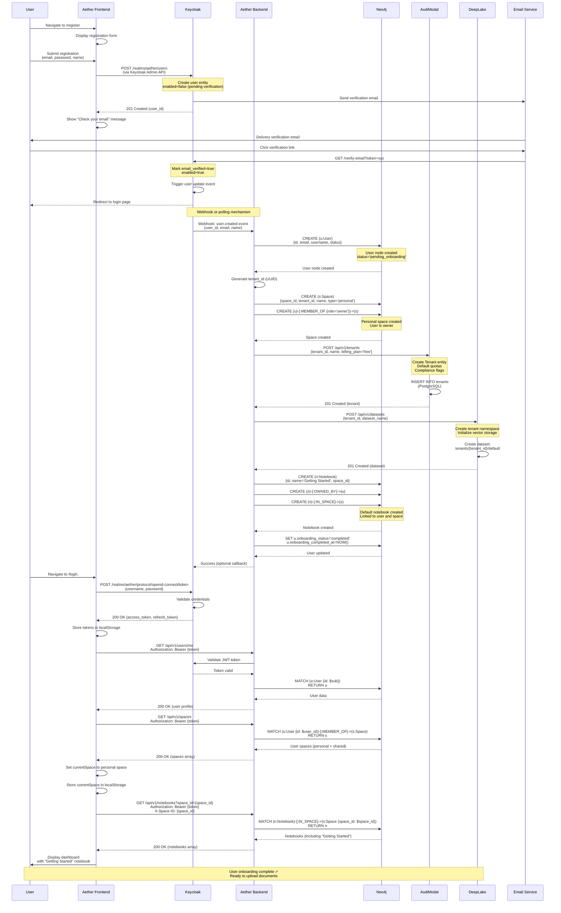

# User Onboarding Flow - Cross-Service Integration

## Metadata

- **Document Type**: Cross-Service Workflow
- **Service Scope**: Keycloak, Aether Frontend, Aether Backend, AudiModal, DeepLake
- **Last Updated**: 2026-01-06
- **Owner**: TAS Platform Team
- **Status**: Active

---

## Overview

### Purpose

This document describes the complete multi-service workflow for user registration and onboarding in the TAS platform. The onboarding process orchestrates data synchronization across five services to provision a fully functional user environment with authentication, graph database identity, multi-tenant isolation, and vector storage capabilities.

### Workflow Summary

The user onboarding flow spans multiple services and involves:
1. **User Registration** - Keycloak user creation with email verification
2. **Identity Synchronization** - Keycloak → Aether Backend user sync
3. **Graph Database Provisioning** - User node creation in Neo4j
4. **Space Creation** - Personal workspace with tenant_id generation
5. **Tenant Provisioning** - AudiModal tenant creation with quotas
6. **Vector Storage Setup** - DeepLake dataset namespace creation
7. **Initial Content** - Default notebook creation
8. **Onboarding Status Tracking** - Progress state machine

### Service Dependencies

```
Keycloak (Auth) → Aether Backend (API) → Neo4j (Graph DB)
                                       ↓
                              AudiModal (Document Processing)
                                       ↓
                              DeepLake (Vector Storage)
```

---

## Complete Onboarding Flow Diagram



---

## Step-by-Step Breakdown

### Phase 1: User Registration (Steps 1-3)

#### Step 1: User Navigates to Registration Page
- **Service**: Aether Frontend
- **Action**: User clicks "Sign Up" or navigates to `/register`
- **UI**: Display registration form with fields: email, password, first name, last name

#### Step 2: User Submits Registration Form
- **Service**: Aether Frontend
- **Validation**:
  - Email format validation
  - Password strength requirements (min 8 chars, uppercase, lowercase, number)
  - Required field checks
- **Frontend Logic**:
  ```typescript
  const handleRegister = async (formData: RegisterFormData) => {
    // Client-side validation
    if (!validateEmail(formData.email)) {
      throw new Error('Invalid email format');
    }
    if (formData.password.length < 8) {
      throw new Error('Password must be at least 8 characters');
    }

    // Call Keycloak Admin API
    const response = await keycloakAdminApi.createUser({
      username: formData.email,
      email: formData.email,
      firstName: formData.firstName,
      lastName: formData.lastName,
      enabled: false, // Will be enabled after email verification
      emailVerified: false,
      credentials: [
        {
          type: 'password',
          value: formData.password,
          temporary: false
        }
      ],
      requiredActions: ['VERIFY_EMAIL']
    });

    return response;
  };
  ```

#### Step 3: Keycloak User Creation
- **Service**: Keycloak
- **Database**: PostgreSQL (`keycloak` database)
- **Table**: `user_entity`
- **SQL**:
  ```sql
  INSERT INTO user_entity (
    id, email, email_verified, enabled, realm_id, username,
    created_timestamp, email_constraint, first_name, last_name
  ) VALUES (
    gen_random_uuid(),
    'user@example.com',
    false,
    false,
    'aether-realm-id',
    'user@example.com',
    EXTRACT(EPOCH FROM NOW()) * 1000,
    'aether-realm-id:user@example.com',
    'John',
    'Doe'
  );
  ```
- **Email Trigger**: Keycloak sends verification email with token

---

### Phase 2: Email Verification (Steps 4-5)

#### Step 4: User Receives Verification Email
- **Service**: Keycloak + Email Provider
- **Email Content**:
  - Subject: "Verify your TAS account"
  - Body: Link to `https://keycloak.tas.scharber.com/realms/aether/login-actions/action-token?key={token}`
  - Token validity: 24 hours (configurable)

#### Step 5: User Clicks Verification Link
- **Service**: Keycloak
- **Action**:
  - Validate token
  - Update user entity: `email_verified=true`, `enabled=true`
  - Remove `VERIFY_EMAIL` from required actions
- **SQL**:
  ```sql
  UPDATE user_entity
  SET email_verified = true,
      enabled = true
  WHERE id = '{user_id}';

  DELETE FROM required_action_provider
  WHERE user_id = '{user_id}' AND action = 'VERIFY_EMAIL';
  ```
- **Event**: Keycloak triggers `user.updated` event (webhook or event listener)

---

### Phase 3: User Synchronization (Steps 6-7)

#### Step 6: Keycloak → Aether Backend Webhook
- **Trigger Mechanism**: Two options:

  **Option A: Keycloak Event Listener (Recommended)**
  - Custom Keycloak SPI (Service Provider Interface)
  - Listens for `user.created`, `user.updated` events
  - Sends HTTP POST to Aether Backend webhook endpoint

  **Option B: Polling (Fallback)**
  - Aether Backend polls Keycloak Admin API every 30 seconds
  - Query: `GET /admin/realms/aether/users?briefRepresentation=false&max=100`
  - Compare `created_timestamp` with last sync timestamp

- **Webhook Payload**:
  ```json
  {
    "event_type": "user.created",
    "realm": "aether",
    "user_id": "550e8400-e29b-41d4-a716-446655440000",
    "email": "user@example.com",
    "username": "user@example.com",
    "email_verified": true,
    "enabled": true,
    "first_name": "John",
    "last_name": "Doe",
    "timestamp": "2026-01-06T12:00:00Z"
  }
  ```

#### Step 7: Aether Backend Creates User Node
- **Service**: Aether Backend
- **Database**: Neo4j
- **Cypher Query**:
  ```cypher
  CREATE (u:User {
    id: $keycloak_user_id,
    email: $email,
    username: $username,
    first_name: $first_name,
    last_name: $last_name,
    email_verified: true,
    status: 'pending_onboarding',
    onboarding_status: 'not_started',
    created_at: datetime(),
    updated_at: datetime(),
    last_login_at: null,
    is_active: true
  })
  RETURN u
  ```
- **Status**: User marked as `pending_onboarding` until all provisioning steps complete

---

### Phase 4: Personal Space Creation (Steps 8-9)

#### Step 8: Generate Tenant ID
- **Service**: Aether Backend
- **Logic**:
  ```go
  import "github.com/google/uuid"

  tenantID := uuid.New().String()
  // Example: "9855e094-36a6-4d3a-a4f5-d77da4614439"
  ```
- **Naming Convention**:
  - Space name: "{username}'s Space" (e.g., "John's Space")
  - Space ID: Auto-generated UUID
  - Tenant ID: Auto-generated UUID (used across all services)

#### Step 9: Create Personal Space in Neo4j
- **Service**: Aether Backend
- **Database**: Neo4j
- **Cypher Query**:
  ```cypher
  MATCH (u:User {id: $user_id})
  CREATE (s:Space {
    space_id: $space_id,
    tenant_id: $tenant_id,
    name: $space_name,
    description: 'Personal workspace',
    type: 'personal',
    visibility: 'private',
    is_default: true,
    created_at: datetime(),
    updated_at: datetime(),
    created_by: $user_id
  })
  CREATE (u)-[:MEMBER_OF {
    role: 'owner',
    joined_at: datetime(),
    invited_by: null,
    status: 'active'
  }]->(s)
  RETURN s
  ```
- **Relationship**: User owns personal space with `role='owner'`
- **1:1 Mapping**: `space.tenant_id` will be used across all services for multi-tenancy

---

### Phase 5: AudiModal Tenant Provisioning (Steps 10-11)

#### Step 10: Aether Backend → AudiModal API
- **Service**: Aether Backend calls AudiModal
- **HTTP Request**:
  ```http
  POST /api/v1/tenants HTTP/1.1
  Host: audimodal:8080
  Content-Type: application/json
  Authorization: Bearer {service_account_token}

  {
    "id": "9855e094-36a6-4d3a-a4f5-d77da4614439",
    "name": "user-example-com",
    "display_name": "John's Workspace",
    "billing_plan": "free",
    "billing_email": "user@example.com",
    "quotas": {
      "files_per_hour": 100,
      "storage_gb": 10,
      "compute_hours": 5,
      "api_requests_per_minute": 60,
      "max_concurrent_jobs": 2,
      "max_file_size": 104857600,
      "max_chunks_per_file": 1000,
      "vector_storage_gb": 5
    },
    "compliance": {
      "gdpr": false,
      "hipaa": false,
      "sox": false,
      "pci": false,
      "iso27001": false,
      "fedramp": false,
      "data_residency": "us-east-1"
    },
    "contact_info": {
      "admin_email": "user@example.com",
      "billing_email": "user@example.com",
      "technical_email": "user@example.com",
      "support_email": "user@example.com"
    },
    "status": "active"
  }
  ```

#### Step 11: AudiModal Creates Tenant Entity
- **Service**: AudiModal
- **Database**: PostgreSQL
- **Table**: `tenants`
- **SQL**:
  ```sql
  INSERT INTO tenants (
    id, name, display_name, billing_plan, billing_email,
    quotas, compliance, contact_info, status,
    created_at, updated_at, deleted_at
  ) VALUES (
    '9855e094-36a6-4d3a-a4f5-d77da4614439',
    'user-example-com',
    'John''s Workspace',
    'free',
    'user@example.com',
    '{"files_per_hour": 100, "storage_gb": 10, ...}'::jsonb,
    '{"gdpr": false, "hipaa": false, ...}'::jsonb,
    '{"admin_email": "user@example.com", ...}'::jsonb,
    'active',
    NOW(),
    NOW(),
    NULL
  );
  ```
- **Response**: `201 Created` with tenant details

---

### Phase 6: DeepLake Dataset Creation (Steps 12-13)

#### Step 12: Aether Backend → DeepLake API
- **Service**: Aether Backend calls DeepLake API
- **HTTP Request**:
  ```http
  POST /api/v1/datasets HTTP/1.1
  Host: deeplake-api:8083
  Content-Type: application/json
  Authorization: Bearer {service_account_token}

  {
    "tenant_id": "9855e094-36a6-4d3a-a4f5-d77da4614439",
    "dataset_name": "default",
    "description": "Default vector storage for user's space",
    "create_default_indices": true
  }
  ```

#### Step 13: DeepLake Creates Tenant Namespace
- **Service**: DeepLake API
- **Storage**: Deep Lake vector database
- **Namespace Pattern**: `tenants/{tenant_id}/default`
- **Python Logic** (DeepLake API):
  ```python
  import deeplake

  tenant_id = request.json['tenant_id']
  dataset_name = request.json['dataset_name']

  # Create dataset path
  dataset_path = f"tenants/{tenant_id}/{dataset_name}"

  # Create Deep Lake dataset
  ds = deeplake.empty(dataset_path, overwrite=False)

  # Create default tensors
  ds.create_tensor('id', htype='text')
  ds.create_tensor('embedding', htype='embedding')
  ds.create_tensor('text', htype='text')
  ds.create_tensor('metadata', htype='json')
  ds.create_tensor('chunk_id', htype='text')
  ds.create_tensor('document_id', htype='text')
  ds.create_tensor('created_at', htype='text')

  # Create index for similarity search
  ds.create_vector_index('embedding', distance_metric='cosine')

  return {
    "dataset_path": dataset_path,
    "tenant_id": tenant_id,
    "tensors": list(ds.tensors.keys())
  }
  ```
- **Response**: `201 Created` with dataset details

---

### Phase 7: Default Notebook Creation (Steps 14-15)

#### Step 14: Create "Getting Started" Notebook
- **Service**: Aether Backend
- **Database**: Neo4j
- **Purpose**: Provide user with initial notebook for exploration
- **Cypher Query**:
  ```cypher
  MATCH (u:User {id: $user_id})
  MATCH (s:Space {space_id: $space_id})
  CREATE (n:Notebook {
    id: randomUUID(),
    name: 'Getting Started',
    description: 'Welcome to TAS! This notebook contains helpful resources.',
    space_id: $space_id,
    visibility: 'private',
    status: 'active',
    document_count: 0,
    total_size: 0,
    created_at: datetime(),
    updated_at: datetime(),
    created_by: $user_id
  })
  CREATE (n)-[:OWNED_BY]->(u)
  CREATE (n)-[:IN_SPACE]->(s)
  RETURN n
  ```

#### Step 15: Link Notebook Relationships
- **Relationships Created**:
  - `(Notebook)-[:OWNED_BY]->(User)` - User owns the notebook
  - `(Notebook)-[:IN_SPACE]->(Space)` - Notebook belongs to personal space
- **Future Enhancement**: Could pre-populate with sample documents or tutorials

---

### Phase 8: Onboarding Status Update (Steps 16-17)

#### Step 16: Mark Onboarding Complete
- **Service**: Aether Backend
- **Database**: Neo4j
- **Cypher Query**:
  ```cypher
  MATCH (u:User {id: $user_id})
  SET u.onboarding_status = 'completed',
      u.onboarding_completed_at = datetime(),
      u.status = 'active',
      u.updated_at = datetime()
  RETURN u
  ```
- **State Transition**: `pending_onboarding` → `active`
- **Onboarding Status**: `not_started` → `completed`

#### Step 17: Optional Webhook to Keycloak
- **Service**: Aether Backend → Keycloak (optional)
- **Purpose**: Update custom user attributes in Keycloak
- **HTTP Request**:
  ```http
  PUT /admin/realms/aether/users/{user_id} HTTP/1.1
  Host: tas-keycloak-shared:8080
  Content-Type: application/json
  Authorization: Bearer {admin_token}

  {
    "attributes": {
      "onboarding_status": ["completed"],
      "tenant_id": ["9855e094-36a6-4d3a-a4f5-d77da4614439"],
      "space_id": ["{space_id}"]
    }
  }
  ```

---

### Phase 9: First Login (Steps 18-20)

#### Step 18: User Logs In
- **Service**: Aether Frontend → Keycloak
- **HTTP Request**:
  ```http
  POST /realms/aether/protocol/openid-connect/token HTTP/1.1
  Host: tas-keycloak-shared:8080
  Content-Type: application/x-www-form-urlencoded

  grant_type=password&
  client_id=aether-frontend&
  username=user@example.com&
  password=user_password&
  scope=openid profile email
  ```

#### Step 19: Keycloak Issues Tokens
- **Service**: Keycloak
- **Response**:
  ```json
  {
    "access_token": "eyJhbGciOiJSUzI1NiIsInR5cCI6IkpXVCJ9...",
    "expires_in": 300,
    "refresh_expires_in": 1800,
    "refresh_token": "eyJhbGciOiJIUzI1NiIsInR5cCI6IkpXVCJ9...",
    "token_type": "Bearer",
    "not-before-policy": 0,
    "session_state": "8f8b8f8b-8f8b-8f8b-8f8b-8f8b8f8b8f8b",
    "scope": "openid profile email"
  }
  ```
- **JWT Payload**:
  ```json
  {
    "exp": 1704553500,
    "iat": 1704553200,
    "jti": "abc-123-def",
    "iss": "https://keycloak.tas.scharber.com/realms/aether",
    "sub": "550e8400-e29b-41d4-a716-446655440000",
    "typ": "Bearer",
    "azp": "aether-frontend",
    "session_state": "8f8b8f8b-8f8b-8f8b-8f8b-8f8b8f8b8f8b",
    "acr": "1",
    "scope": "openid profile email",
    "email_verified": true,
    "name": "John Doe",
    "preferred_username": "user@example.com",
    "given_name": "John",
    "family_name": "Doe",
    "email": "user@example.com"
  }
  ```

#### Step 20: Frontend Stores Tokens
- **Service**: Aether Frontend
- **Storage**: `localStorage`
- **Keys**:
  ```typescript
  localStorage.setItem('access_token', response.access_token);
  localStorage.setItem('refresh_token', response.refresh_token);
  localStorage.setItem('token_expires_at', Date.now() + (response.expires_in * 1000));
  ```

---

### Phase 10: Load User Profile (Steps 21-22)

#### Step 21: Fetch User Profile
- **Service**: Aether Frontend → Aether Backend
- **HTTP Request**:
  ```http
  GET /api/v1/users/me HTTP/1.1
  Host: aether-backend:8080
  Authorization: Bearer {access_token}
  ```

#### Step 22: Backend Validates Token and Returns User Data
- **Service**: Aether Backend
- **Token Validation**:
  ```go
  // Validate JWT signature and claims
  token, err := keycloakClient.ValidateToken(accessToken)
  if err != nil {
      return http.StatusUnauthorized
  }

  userID := token.Claims["sub"].(string)
  ```
- **Neo4j Query**:
  ```cypher
  MATCH (u:User {id: $user_id})
  RETURN u {
    .id,
    .email,
    .username,
    .first_name,
    .last_name,
    .status,
    .onboarding_status,
    .created_at,
    .last_login_at
  }
  ```
- **Response**:
  ```json
  {
    "id": "550e8400-e29b-41d4-a716-446655440000",
    "email": "user@example.com",
    "username": "user@example.com",
    "first_name": "John",
    "last_name": "Doe",
    "status": "active",
    "onboarding_status": "completed",
    "created_at": "2026-01-06T12:00:00Z",
    "last_login_at": "2026-01-06T12:05:00Z"
  }
  ```

---

### Phase 11: Load User Spaces (Steps 23-24)

#### Step 23: Fetch User Spaces
- **Service**: Aether Frontend → Aether Backend
- **HTTP Request**:
  ```http
  GET /api/v1/spaces HTTP/1.1
  Host: aether-backend:8080
  Authorization: Bearer {access_token}
  ```

#### Step 24: Backend Returns Spaces
- **Service**: Aether Backend
- **Neo4j Query**:
  ```cypher
  MATCH (u:User {id: $user_id})-[m:MEMBER_OF]->(s:Space)
  WHERE s.deleted_at IS NULL
  RETURN s {
    .space_id,
    .tenant_id,
    .name,
    .description,
    .type,
    .visibility,
    .is_default,
    .created_at,
    role: m.role,
    joined_at: m.joined_at
  }
  ORDER BY s.is_default DESC, s.created_at ASC
  ```
- **Response**:
  ```json
  {
    "spaces": [
      {
        "space_id": "abc-123-def",
        "tenant_id": "9855e094-36a6-4d3a-a4f5-d77da4614439",
        "name": "John's Space",
        "description": "Personal workspace",
        "type": "personal",
        "visibility": "private",
        "is_default": true,
        "created_at": "2026-01-06T12:00:30Z",
        "role": "owner",
        "joined_at": "2026-01-06T12:00:30Z"
      }
    ]
  }
  ```
- **Frontend Action**: Set `currentSpace` to personal space
  ```typescript
  const defaultSpace = spaces.find(s => s.is_default) || spaces[0];
  dispatch(setCurrentSpace(defaultSpace));
  localStorage.setItem('currentSpace', JSON.stringify(defaultSpace));
  ```

---

### Phase 12: Load Default Notebook (Steps 25-26)

#### Step 25: Fetch Notebooks for Current Space
- **Service**: Aether Frontend → Aether Backend
- **HTTP Request**:
  ```http
  GET /api/v1/notebooks?space_id={space_id} HTTP/1.1
  Host: aether-backend:8080
  Authorization: Bearer {access_token}
  X-Space-ID: {space_id}
  ```

#### Step 26: Display Dashboard
- **Service**: Aether Frontend
- **Neo4j Query** (Backend):
  ```cypher
  MATCH (n:Notebook)-[:IN_SPACE]->(s:Space {space_id: $space_id})
  WHERE n.deleted_at IS NULL
  OPTIONAL MATCH (n)-[:OWNED_BY]->(owner:User)
  RETURN n {
    .id,
    .name,
    .description,
    .visibility,
    .status,
    .document_count,
    .total_size,
    .created_at,
    .updated_at,
    owner_id: owner.id,
    owner_name: owner.first_name + ' ' + owner.last_name
  }
  ORDER BY n.created_at DESC
  ```
- **Response**:
  ```json
  {
    "notebooks": [
      {
        "id": "notebook-123-abc",
        "name": "Getting Started",
        "description": "Welcome to TAS! This notebook contains helpful resources.",
        "visibility": "private",
        "status": "active",
        "document_count": 0,
        "total_size": 0,
        "created_at": "2026-01-06T12:00:40Z",
        "updated_at": "2026-01-06T12:00:40Z",
        "owner_id": "550e8400-e29b-41d4-a716-446655440000",
        "owner_name": "John Doe"
      }
    ]
  }
  ```
- **UI Display**:
  - Dashboard with sidebar showing spaces
  - Main content area showing "Getting Started" notebook
  - Empty state with "Upload your first document" CTA

---

## Data Consistency Patterns

### Eventual Consistency

**Keycloak → Aether User Sync**:
- **Delay**: 0-30 seconds (depending on webhook vs polling)
- **Handling**: Frontend shows "Setting up your account..." during sync
- **Retry**: Exponential backoff if webhook fails (1s, 2s, 4s, 8s)

**Aether → AudiModal Tenant Creation**:
- **Delay**: 0-5 seconds (HTTP request)
- **Handling**: Aether Backend retries 3 times with 2s delay
- **Fallback**: Tenant can be created on-demand during first document upload

**AudiModal → DeepLake Dataset Creation**:
- **Delay**: 0-10 seconds (dataset initialization)
- **Handling**: Async task queue (Kafka or background job)
- **Lazy Creation**: Dataset can be created on first embedding request

### Strong Consistency

**Neo4j Transactions**:
- All User, Space, Notebook creation happens in a single Cypher transaction
- ACID guarantees ensure all nodes and relationships are created or none

**PostgreSQL Transactions** (AudiModal):
- Tenant creation uses database transaction
- Rollback if any constraint violation

---

## Error Handling & Recovery

### Registration Failures

**Scenario**: Keycloak user creation fails (duplicate email)
- **HTTP Status**: `409 Conflict`
- **Frontend Action**: Display "Email already registered" error
- **User Action**: Try login or password reset

**Scenario**: Email delivery fails
- **Keycloak State**: User created but not verified
- **Recovery**: User can request new verification email via `/resend-verification`
- **Auto-Cleanup**: Unverified users deleted after 7 days (Keycloak policy)

### Synchronization Failures

**Scenario**: Webhook from Keycloak to Aether fails
- **Retry Logic**: Exponential backoff (1s, 2s, 4s, 8s, 16s)
- **Max Retries**: 5 attempts
- **Fallback**: Polling mechanism detects missing user within 30 seconds
- **Alert**: Log error and trigger monitoring alert after max retries

**Scenario**: Neo4j user creation fails
- **HTTP Status**: `500 Internal Server Error`
- **Retry**: Webhook will retry (user doesn't exist yet)
- **Manual Recovery**: Admin can trigger user sync via API: `POST /api/v1/admin/sync-users`

### Provisioning Failures

**Scenario**: AudiModal tenant creation fails
- **Aether Response**: Continue with onboarding, mark tenant as `pending_provision`
- **Background Job**: Retry tenant creation every 5 minutes
- **User Impact**: First document upload will retry tenant creation
- **Monitoring**: Alert after 3 failed provision attempts

**Scenario**: DeepLake dataset creation fails
- **Lazy Creation**: Dataset created on first embedding request
- **Fallback**: Document processing continues without embeddings
- **Retry Queue**: Failed embedding jobs queued for retry

### Partial Onboarding State

**Scenario**: User created in Neo4j but not in AudiModal
- **Detection**: Health check endpoint verifies data consistency
- **Query**:
  ```cypher
  MATCH (u:User {onboarding_status: 'completed'})
  WHERE u.created_at > datetime() - duration('PT1H')
  RETURN u.id, u.email
  ```
- **Verification**: For each user, check if AudiModal tenant exists
- **Auto-Repair**: Create missing tenants in background job

---

## Performance Considerations

### Synchronous vs Asynchronous Steps

**Synchronous** (blocks user registration):
1. Keycloak user creation (100-200ms)
2. Email sending (50-100ms)
3. Neo4j user node creation (50-100ms)
4. Neo4j space creation (100-150ms)

**Asynchronous** (can happen in background):
1. AudiModal tenant creation (can retry)
2. DeepLake dataset creation (lazy)
3. Default notebook creation (nice-to-have)

**Total Registration Time**: ~500ms for critical path

### Optimization Strategies

**Batch Operations**:
- Create User, Space, and MEMBER_OF relationship in single Neo4j transaction
- Reduces network roundtrips from 3 to 1

**Lazy Provisioning**:
- DeepLake dataset created on first document upload (not during registration)
- Reduces onboarding time by ~5 seconds

**Caching**:
- Cache Keycloak JWT public keys (5-minute TTL)
- Cache user profile data (1-minute TTL)

**Connection Pooling**:
- Maintain persistent connections to Neo4j, PostgreSQL, Keycloak
- Avoid connection overhead on each request

---

## Security Considerations

### Sensitive Data Handling

**Passwords**:
- Never stored or logged by Aether Backend
- Handled exclusively by Keycloak
- bcrypt hashing with cost factor 10

**JWT Tokens**:
- Short-lived access tokens (5 minutes)
- Refresh tokens stored in httpOnly cookies (recommended) or localStorage
- Token validation on every API request

**Email Verification**:
- Required before user can access system
- Token single-use and time-limited (24 hours)
- Prevents account takeover via email enumeration

### Authorization Checks

**Every API Request**:
1. Validate JWT signature against Keycloak public key
2. Check token expiration (`exp` claim)
3. Verify issuer matches expected Keycloak realm (`iss` claim)
4. Extract user ID from `sub` claim
5. Verify user exists in Neo4j
6. Check user status is `active`

**Space Isolation**:
- Verify `X-Space-ID` header matches user's accessible spaces
- Query: `MATCH (u:User {id: $user_id})-[:MEMBER_OF]->(s:Space {space_id: $space_id})`
- Return 403 Forbidden if user not member of space

---

## Monitoring & Observability

### Key Metrics

**Registration Funnel**:
- `registration_started_total` - Counter
- `registration_completed_total` - Counter
- `email_verification_completed_total` - Counter
- `first_login_total` - Counter
- **Conversion Rate**: `first_login / registration_started`

**Onboarding Duration**:
- `onboarding_duration_seconds` - Histogram
- Labels: `phase={email_verification, user_sync, space_creation, tenant_provision}`
- P50, P95, P99 latencies

**Synchronization Health**:
- `user_sync_failures_total` - Counter (labels: `reason`)
- `tenant_provision_failures_total` - Counter
- `dataset_creation_failures_total` - Counter

**Active Users**:
- `users_active_total` - Gauge (users logged in within 24h)
- `users_onboarding_pending_total` - Gauge
- `users_registered_total` - Counter

### Logging Strategy

**Structured Logs** (JSON format):
```json
{
  "timestamp": "2026-01-06T12:00:00Z",
  "level": "info",
  "service": "aether-backend",
  "event": "user_onboarding_started",
  "user_id": "550e8400-e29b-41d4-a716-446655440000",
  "email": "user@example.com",
  "trace_id": "abc-123-def",
  "phase": "user_sync"
}
```

**Trace Context**:
- Generate `trace_id` at registration start
- Pass through all services (Keycloak → Aether → AudiModal → DeepLake)
- Enables end-to-end request tracing in Grafana

### Alerting Rules

**Critical Alerts**:
- Registration failure rate > 5% over 5 minutes
- User sync failure rate > 10% over 5 minutes
- Onboarding P95 latency > 30 seconds

**Warning Alerts**:
- Tenant provision failure rate > 5% over 15 minutes
- Email verification completion rate < 50% over 24 hours

---

## Testing Scenarios

### Happy Path Test
```bash
# 1. Register user
curl -X POST http://localhost:8081/admin/realms/aether/users \
  -H "Authorization: Bearer $ADMIN_TOKEN" \
  -H "Content-Type: application/json" \
  -d '{
    "username": "test@example.com",
    "email": "test@example.com",
    "enabled": true,
    "emailVerified": true,
    "firstName": "Test",
    "lastName": "User",
    "credentials": [{"type": "password", "value": "test123", "temporary": false}]
  }'

# 2. Verify user created in Neo4j
cypher-shell "MATCH (u:User {email: 'test@example.com'}) RETURN u"

# 3. Verify personal space created
cypher-shell "MATCH (u:User {email: 'test@example.com'})-[:MEMBER_OF]->(s:Space) RETURN s"

# 4. Verify tenant created in AudiModal
curl -X GET http://localhost:8084/api/v1/tenants/{tenant_id} \
  -H "Authorization: Bearer $TOKEN"

# 5. Login and get token
curl -X POST http://localhost:8081/realms/aether/protocol/openid-connect/token \
  -d "grant_type=password&client_id=aether-frontend&username=test@example.com&password=test123"
```

### Error Recovery Test
```bash
# Simulate AudiModal failure
docker-compose stop audimodal

# Register user (should succeed despite AudiModal failure)
# ... registration steps ...

# Verify user marked as pending_provision
cypher-shell "MATCH (u:User {email: 'test@example.com'}) RETURN u.onboarding_status"

# Restart AudiModal
docker-compose start audimodal

# Trigger background provisioning
curl -X POST http://localhost:8080/api/v1/admin/provision-pending-tenants \
  -H "Authorization: Bearer $ADMIN_TOKEN"

# Verify tenant now exists
curl -X GET http://localhost:8084/api/v1/tenants/{tenant_id}
```

---

## Related Documentation

### Internal References
- [User Node Documentation](../aether-be/nodes/user.md) - User node schema and relationships
- [Space Node Documentation](../aether-be/nodes/space.md) - Space node schema and multi-tenancy
- [AudiModal Tenant Entity](../audimodal/entities/tenant.md) - Tenant schema and quotas
- [Keycloak JWT Structure](../keycloak/tokens/jwt-structure.md) - JWT token validation
- [Keycloak User Model](../keycloak/users/user-model.md) - User entity in PostgreSQL
- [Platform-wide ERD](./diagrams/platform-erd.md) - Complete entity relationship diagram

### External References
- Keycloak Admin REST API: https://www.keycloak.org/docs-api/latest/rest-api/index.html
- Neo4j Cypher Manual: https://neo4j.com/docs/cypher-manual/current/
- Deep Lake Documentation: https://docs.deeplake.ai/

---

## Known Issues & Limitations

### Current Limitations

1. **No Rollback on Partial Failure**
   - If AudiModal tenant creation fails, user still exists in Keycloak and Neo4j
   - Mitigation: Background job provisions missing tenants
   - Future: Implement distributed transaction (Saga pattern)

2. **Email Verification Not Enforced**
   - Users can be created with `emailVerified=true` via Admin API
   - Mitigation: Frontend always sets `emailVerified=false` on registration
   - Future: Keycloak event listener blocks unverified users

3. **No User Deletion Flow**
   - Deleting Keycloak user doesn't cascade to Aether/AudiModal
   - Mitigation: Soft delete in all services, background cleanup job
   - Future: Implement user deletion webhook

4. **Limited Quota Enforcement**
   - AudiModal tenant quotas documented but not fully enforced
   - Mitigation: API rate limiting at gateway level
   - Future: Implement quota middleware in each service

### Planned Improvements

1. **Onboarding Progress UI**
   - Show user real-time progress during onboarding (e.g., "Setting up your workspace... 75%")
   - WebSocket or SSE for live updates

2. **Custom Onboarding Flows**
   - Allow different onboarding paths for different user types (e.g., enterprise vs free tier)
   - Configurable space templates

3. **Batch User Import**
   - Admin API to bulk import users with automatic provisioning
   - CSV upload with validation

---

## Changelog

### 2026-01-06
- Initial documentation created
- Documented complete 26-step onboarding flow across 5 services
- Added Mermaid sequence diagram
- Documented error handling and recovery patterns
- Added testing scenarios and monitoring metrics

---

**Maintained by**: TAS Platform Team
**Document Owner**: Backend Architecture Team
**Review Frequency**: Quarterly
**Next Review**: 2026-04-06
