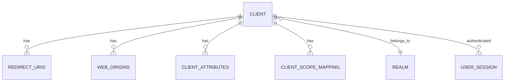
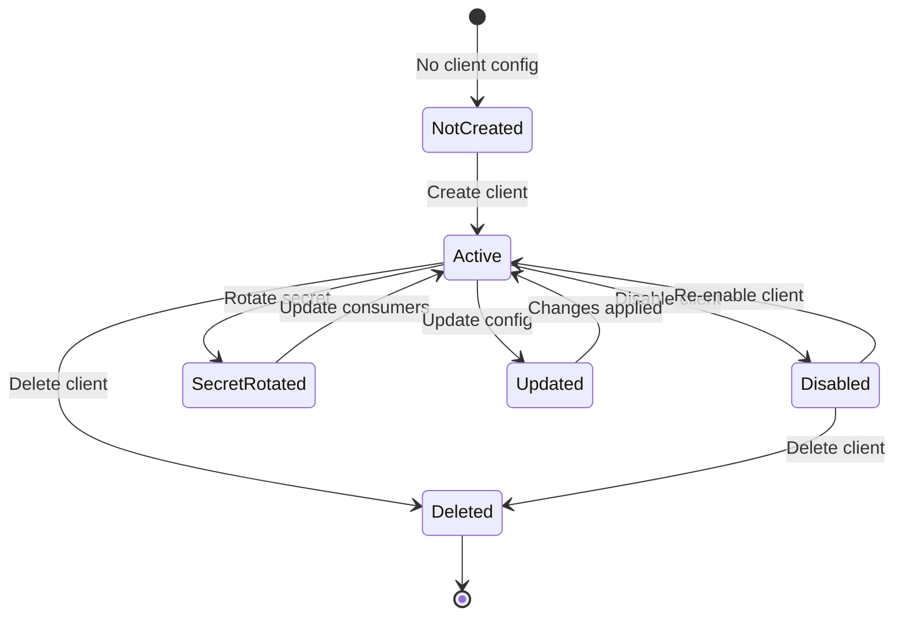
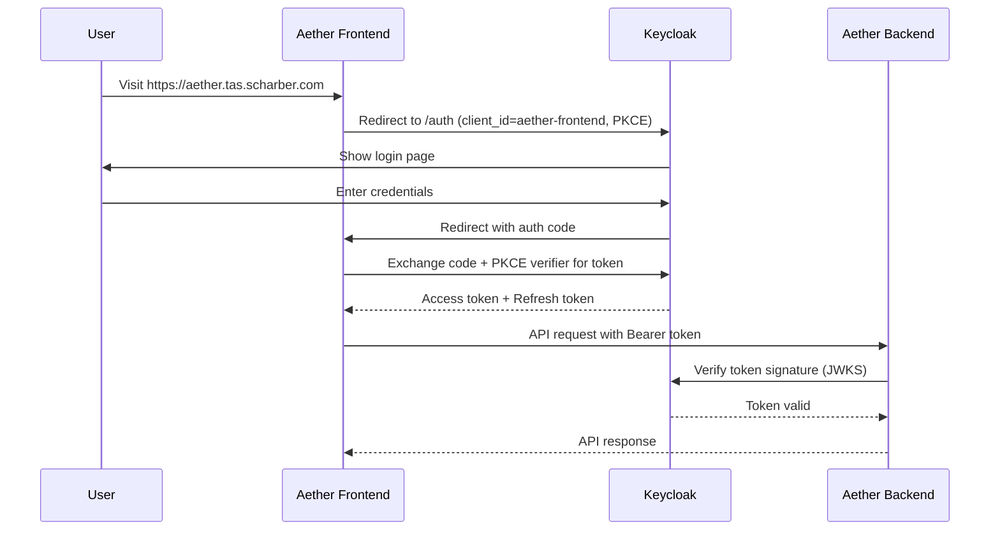
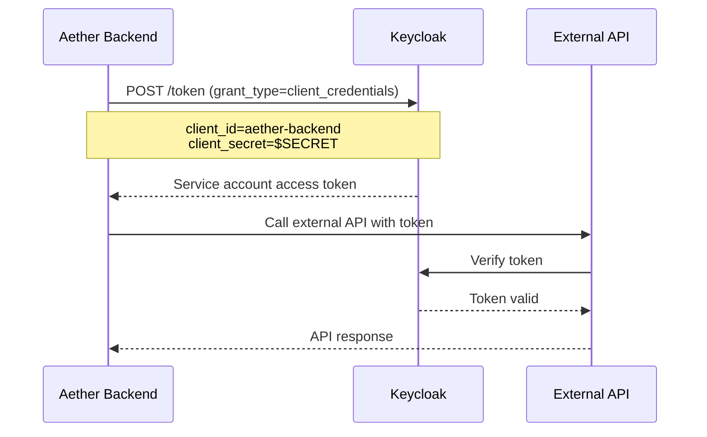

# Keycloak Client Configurations Documentation

---

## Metadata

```markdown
---
service: keycloak
model: OIDC Client Configurations
database: Keycloak (PostgreSQL backend)
version: 1.0
last_updated: 2026-01-05
author: TAS Platform Team
---
```

---

## 1. Overview

**Purpose**: OIDC (OpenID Connect) client configurations define how applications authenticate users and access resources via Keycloak. The TAS platform uses two primary clients: `aether-backend` (confidential client for server-side API) and `aether-frontend` (public client for browser-based SPA).

**Lifecycle**:
- **Created**: During Keycloak realm initialization via `init-keycloak.sh`
- **Updated**: When redirect URIs, scopes, or flows change
- **Rotated**: Client secrets rotated periodically or on security events
- **Deleted**: When services are decommissioned

**Ownership**: Keycloak service, configured by platform administrators

**Key Characteristics**:
- OIDC protocol compliant (OAuth 2.0 + identity layer)
- Two client types: confidential (backend) and public (frontend)
- Authorization Code Flow with PKCE for frontend
- Direct Access Grants for backend service accounts
- 5-minute access token lifespan
- Automatic CORS configuration with `webOrigins: ["+"]`
- Support for multiple redirect URIs (dev, staging, production)

---

## 2. Schema Definition

### Keycloak Database Schema (PostgreSQL)

#### Main Client Table: `client`

| Field Name | Type | Required | Default | Description |
|------------|------|----------|---------|-------------|
| `id` | UUID | Yes | Generated | Client UUID (internal ID) |
| `client_id` | VARCHAR(255) | Yes | - | Client ID (e.g., "aether-backend") |
| `name` | VARCHAR(255) | No | NULL | Display name |
| `description` | TEXT | No | NULL | Client description |
| `realm_id` | VARCHAR(255) | Yes | - | Foreign key to realm |
| `enabled` | BOOLEAN | Yes | true | Whether client is enabled |
| `protocol` | VARCHAR(255) | Yes | - | Auth protocol ("openid-connect") |
| `public_client` | BOOLEAN | Yes | false | Public vs confidential client |
| `bearer_only` | BOOLEAN | Yes | false | Bearer-only client (no browser flow) |
| `standard_flow_enabled` | BOOLEAN | Yes | true | Authorization Code Flow enabled |
| `implicit_flow_enabled` | BOOLEAN | Yes | false | Implicit Flow enabled (deprecated) |
| `direct_access_grants_enabled` | BOOLEAN | Yes | false | Resource Owner Password Credentials enabled |
| `service_accounts_enabled` | BOOLEAN | Yes | false | Service account enabled |
| `authorization_services_enabled` | BOOLEAN | Yes | false | Fine-grained authorization enabled |
| `not_before` | INTEGER | Yes | 0 | Revoke tokens before this time |
| `consent_required` | BOOLEAN | Yes | false | User consent required |
| `full_scope_allowed` | BOOLEAN | Yes | true | All scopes included by default |

#### Client Redirect URI Table: `redirect_uris`

| Field Name | Type | Required | Default | Description |
|------------|------|----------|---------|-------------|
| `client_id` | VARCHAR(36) | Yes | - | Foreign key to client |
| `value` | VARCHAR(255) | Yes | - | Redirect URI pattern |

#### Client Web Origins Table: `web_origins`

| Field Name | Type | Required | Default | Description |
|------------|------|----------|---------|-------------|
| `client_id` | VARCHAR(36) | Yes | - | Foreign key to client |
| `value` | VARCHAR(255) | Yes | - | Web origin (URL or "+") |

#### Client Attributes Table: `client_attributes`

| Field Name | Type | Required | Default | Description |
|------------|------|----------|---------|-------------|
| `client_id` | VARCHAR(36) | Yes | - | Foreign key to client |
| `name` | VARCHAR(255) | Yes | - | Attribute name |
| `value` | TEXT | No | NULL | Attribute value |

Common attributes:
- `access.token.lifespan` - Token expiry (seconds)
- `pkce.code.challenge.method` - PKCE method (S256)
- `client.secret.creation.time` - When secret was created

### Indexes

| Index Name | Fields | Type | Purpose |
|------------|--------|------|---------|
| `idx_client_id` | `client_id` | Unique | Client ID lookup |
| `idx_client_realm_id` | `realm_id` | Index | Realm's clients |
| `idx_redirect_uris_client` | `client_id` | Index | Client redirects |
| `idx_web_origins_client` | `client_id` | Index | Client origins |

### Constraints

- **Primary Key**: `id` (client table)
- **Unique**: `(realm_id, client_id)` - Client ID unique per realm
- **Foreign Keys**:
  - `realm_id` → `realm.id`
  - `redirect_uris.client_id` → `client.id` (CASCADE on delete)
  - `web_origins.client_id` → `client.id` (CASCADE on delete)
  - `client_attributes.client_id` → `client.id` (CASCADE on delete)

---

## 3. Relationships

### Client Relationships



| Relationship | Direction | Target | Cardinality | Description |
|--------------|-----------|--------|-------------|-------------|
| Has Redirect URIs | Outgoing | `redirect_uris` | 1:N | Valid OAuth callback URLs |
| Has Web Origins | Outgoing | `web_origins` | 1:N | CORS allowed origins |
| Has Attributes | Outgoing | `client_attributes` | 1:N | Client-specific config |
| Has Scope Mappings | Outgoing | `client_scope_mapping` | 1:N | Client protocol mappers |
| Belongs To Realm | Outgoing | `realm` | N:1 | Client realm membership |
| Has Sessions | Outgoing | `user_session` | 1:N | Active user sessions |

---

## 4. Validation Rules

### Business Logic Constraints

**Rule 1**: Confidential clients must have a client secret
- **Implementation**: `public_client = false` requires secret generation
- **Error**: `400 Bad Request - Confidential client requires secret`

**Rule 2**: Public clients cannot use client credentials grant
- **Implementation**: `public_client = true` → `service_accounts_enabled` must be `false`
- **Error**: `400 Bad Request - Public clients cannot have service accounts`

**Rule 3**: Redirect URIs must be valid URLs or localhost patterns
- **Implementation**: URI validation regex check
- **Error**: `400 Bad Request - Invalid redirect URI format`

**Rule 4**: Authorization Code Flow requires redirect URIs
- **Implementation**: `standard_flow_enabled = true` requires at least one redirect URI
- **Error**: `400 Bad Request - Authorization Code Flow requires redirect URIs`

**Rule 5**: PKCE recommended for public clients
- **Implementation**: Frontend client has `pkce.code.challenge.method = S256`
- **Error**: Warning (not enforced, but strongly recommended)

### Data Integrity

- Client ID must be unique within realm
- Redirect URIs validated against OWASP recommendations
- Web origins support wildcard ("+") for all redirect URI origins
- Client secrets stored encrypted in database
- Service account users linked to client (cascade delete)

---

## 5. Lifecycle & State Transitions

### Client States



### Transition Rules

| From State | To State | Trigger | Conditions | Side Effects |
|------------|----------|---------|------------|--------------|
| `Not Created` | `Active` | Admin creates client | Valid config | Generates client secret (if confidential) |
| `Active` | `Disabled` | Admin disables | Admin action | Revokes all active sessions |
| `Disabled` | `Active` | Admin enables | Admin action | Client can authenticate again |
| `Active` | `Secret Rotated` | Admin rotates secret | Confidential client | Old secret invalidated after grace period |
| `Active` | `Updated` | Config change | Admin action | May require service restart |
| `Active/Disabled` | `Deleted` | Admin deletes | Admin action | Cascade deletes sessions, credentials |

---

## 6. Examples

### Client 1: aether-backend (Confidential Client)

**Purpose**: Backend API service for server-side operations requiring secure authentication

**Configuration**:
```json
{
  "clientId": "aether-backend",
  "name": "Aether Backend API",
  "description": "Backend API service for Aether platform",
  "enabled": true,
  "protocol": "openid-connect",
  "publicClient": false,
  "bearerOnly": false,
  "standardFlowEnabled": true,
  "implicitFlowEnabled": false,
  "directAccessGrantsEnabled": true,
  "serviceAccountsEnabled": true,
  "authorizationServicesEnabled": false,
  "redirectUris": [
    "https://aether-api.tas.scharber.com/*",
    "https://aether.tas.scharber.com/*",
    "http://localhost:*",
    "http://localhost:8080/*"
  ],
  "webOrigins": ["+"],
  "attributes": {
    "access.token.lifespan": "300",
    "client.secret.creation.time": "1704499200"
  }
}
```

**Key Features**:
- **Confidential Client**: Requires client secret for authentication
- **Service Accounts**: Can act as a service account for server-to-server auth
- **Direct Access Grants**: Supports Resource Owner Password Credentials (for testing)
- **Standard Flow**: Authorization Code Flow enabled for OAuth callbacks
- **Token Lifespan**: 5-minute access tokens (300 seconds)
- **CORS**: `webOrigins: ["+"]` allows all redirect URI origins

**Usage Example**:
```go
// Backend authenticates with Keycloak
config := &oauth2.Config{
    ClientID:     "aether-backend",
    ClientSecret: os.Getenv("KEYCLOAK_CLIENT_SECRET"),
    Endpoint: oauth2.Endpoint{
        AuthURL:  "https://keycloak.tas.scharber.com/realms/aether/protocol/openid-connect/auth",
        TokenURL: "https://keycloak.tas.scharber.com/realms/aether/protocol/openid-connect/token",
    },
    RedirectURL: "https://aether-api.tas.scharber.com/callback",
    Scopes:      []string{"openid", "email", "profile"},
}

// Exchange authorization code for token
token, err := config.Exchange(ctx, authCode)
```

### Client 2: aether-frontend (Public Client)

**Purpose**: Browser-based single-page application (React) for end-user interface

**Configuration**:
```json
{
  "clientId": "aether-frontend",
  "name": "Aether Frontend",
  "description": "Frontend web application for Aether platform",
  "enabled": true,
  "protocol": "openid-connect",
  "publicClient": true,
  "bearerOnly": false,
  "standardFlowEnabled": true,
  "implicitFlowEnabled": false,
  "directAccessGrantsEnabled": true,
  "serviceAccountsEnabled": false,
  "authorizationServicesEnabled": false,
  "redirectUris": [
    "https://aether.tas.scharber.com/*",
    "http://localhost:3000/*",
    "http://localhost:3001/*"
  ],
  "webOrigins": ["+"],
  "attributes": {
    "pkce.code.challenge.method": "S256"
  }
}
```

**Key Features**:
- **Public Client**: No client secret (browser-based app cannot keep secrets)
- **PKCE**: Uses Proof Key for Code Exchange (S256) for security
- **Standard Flow**: Authorization Code Flow with PKCE
- **Direct Access Grants**: Enabled for username/password login (dev/test)
- **Multiple Redirect URIs**: Supports localhost dev + production URLs
- **No Service Accounts**: Public clients cannot have service accounts

**Usage Example (Keycloak JS)**:
```javascript
// Frontend Keycloak configuration
const keycloak = new Keycloak({
  url: 'https://keycloak.tas.scharber.com',
  realm: 'aether',
  clientId: 'aether-frontend'
});

// Initialize with PKCE
await keycloak.init({
  onLoad: 'login-required',
  pkceMethod: 'S256',
  checkLoginIframe: false
});

// Use token for API calls
const token = keycloak.token;
fetch('https://aether.tas.scharber.com/api/v1/notebooks', {
  headers: {
    'Authorization': `Bearer ${token}`
  }
});

// Auto-refresh before expiry
setInterval(() => {
  keycloak.updateToken(30).then(refreshed => {
    if (refreshed) {
      console.log('Token refreshed');
    }
  });
}, 60000); // Check every minute
```

### Creating a Client (Admin API)

```bash
curl -X POST "https://keycloak.tas.scharber.com/admin/realms/aether/clients" \
  -H "Authorization: Bearer $ADMIN_TOKEN" \
  -H "Content-Type: application/json" \
  -d '{
    "clientId": "new-service",
    "name": "New Service",
    "enabled": true,
    "protocol": "openid-connect",
    "publicClient": false,
    "standardFlowEnabled": true,
    "directAccessGrantsEnabled": true,
    "serviceAccountsEnabled": true,
    "redirectUris": ["https://new-service.example.com/*"],
    "webOrigins": ["+"]
  }'
```

### Retrieving Client Secret

```bash
# 1. Get client UUID
CLIENT_UUID=$(curl -s "https://keycloak.tas.scharber.com/admin/realms/aether/clients?clientId=aether-backend" \
  -H "Authorization: Bearer $ADMIN_TOKEN" | jq -r '.[0].id')

# 2. Get client secret
curl -s "https://keycloak.tas.scharber.com/admin/realms/aether/clients/$CLIENT_UUID/client-secret" \
  -H "Authorization: Bearer $ADMIN_TOKEN" | jq -r '.value'
```

### Regenerating Client Secret

```bash
curl -X POST "https://keycloak.tas.scharber.com/admin/realms/aether/clients/$CLIENT_UUID/client-secret" \
  -H "Authorization: Bearer $ADMIN_TOKEN"
```

**Response**:
```json
{
  "type": "secret",
  "value": "e78dEfml7xy6YKyHyiQWMMmw7fDs6Kz8"
}
```

### Updating Client Configuration

```bash
curl -X PUT "https://keycloak.tas.scharber.com/admin/realms/aether/clients/$CLIENT_UUID" \
  -H "Authorization: Bearer $ADMIN_TOKEN" \
  -H "Content-Type: application/json" \
  -d '{
    "redirectUris": [
      "https://aether.tas.scharber.com/*",
      "https://staging.aether.tas.scharber.com/*",
      "http://localhost:3001/*"
    ]
  }'
```

---

## 7. Cross-Service References

### Services Using These Clients

| Service | Client Used | Flow | Notes |
|---------|-------------|------|-------|
| Aether Frontend | `aether-frontend` | Authorization Code + PKCE | Browser-based SPA |
| Aether Backend | `aether-backend` | Service Account + JWT verification | API server |
| AudiModal | `aether-backend` | JWT verification only | Validates tokens from frontend |
| Agent Builder | `aether-backend` | JWT verification only | Validates tokens from frontend |
| DeepLake API | `aether-backend` | JWT verification only | Validates tokens from frontend |
| LLM Router | `aether-backend` | JWT verification only | Validates tokens from frontend |
| Admin Scripts | `admin-cli` (master realm) | Direct Access Grants | Automation |

### Authentication Flows

**Flow 1: Frontend User Login**



**Flow 2: Backend Service Account**



### Client Secret Management

**Storage Locations**:
1. **Kubernetes Secret**: `aether-backend-secret` in `aether-be` namespace
2. **Docker Compose**: `.env` file or `env_file` reference
3. **Secret Manager**: Production uses external secret management (future)

**Access Pattern**:
```bash
# Kubernetes
kubectl create secret generic aether-backend-secret \
  --from-literal=KEYCLOAK_CLIENT_SECRET=$SECRET \
  -n aether-be

# Docker Compose
KEYCLOAK_CLIENT_SECRET=e78dEfml7xy6YKyHyiQWMMmw7fDs6Kz8 docker-compose up -d
```

---

## 8. Tenant & Space Isolation

### Client Scope for Multi-Tenancy

Keycloak clients do NOT enforce tenant isolation directly. Tenant/space isolation is handled by:

1. **JWT Claims**: User-specific tenant/space resolved from Neo4j User node
2. **Custom Headers**: Backend adds `X-Tenant-ID` and `X-Space-ID` headers
3. **Application Logic**: Each service enforces isolation via filters

**Pattern**:
```
User logs in (aether-frontend client)
    ↓
Keycloak issues JWT (sub = keycloak_id)
    ↓
Aether Backend receives JWT
    ↓
Backend queries: MATCH (u:User {keycloak_id: $sub}) RETURN u.tenant_id, u.personal_space_id
    ↓
Backend adds headers: X-Tenant-ID, X-Space-ID
    ↓
Downstream services (AudiModal, DeepLake) use headers for isolation
```

### Future: Multi-Realm Architecture

For large-scale multi-tenancy, consider separate realms per organization:

```
Realm: aether (shared) - Default for individual users
Realm: org-acme - Dedicated for Acme Corp
Realm: org-globex - Dedicated for Globex Inc

Each realm has:
- Separate user databases
- Separate clients (acme-frontend, globex-frontend)
- Separate roles and groups
- Separate SSO sessions
```

**Benefits**:
- Complete data isolation at Keycloak level
- Organization-specific branding
- Independent user management
- Isolated security policies

**Trade-offs**:
- Higher operational complexity
- More clients to manage
- Cross-realm user access requires federation

---

## 9. Performance Considerations

### Connection Pooling

- Keycloak uses HikariCP for PostgreSQL connection pooling
- Default pool size: 100 connections
- Tune based on client count and request rate

### Token Validation Caching

**JWKS Caching**:
- Public keys cached by `go-oidc` library (5-minute default)
- Reduces load on Keycloak JWKS endpoint
- First request fetches JWKS, subsequent requests use cache

**Optimization**:
```go
// Reuse Keycloak client across requests
var keycloakClient *auth.KeycloakClient

func init() {
    keycloakClient, _ = auth.NewKeycloakClient(config)
    // Internally caches provider and JWKS
}

func verifyToken(token string) (*TokenClaims, error) {
    return keycloakClient.VerifyIDToken(ctx, token)
    // Uses cached JWKS, fast verification (~1-2ms)
}
```

### Client Secret Rotation

**Zero-Downtime Rotation**:
1. Generate new secret in Keycloak
2. Update half of backend instances with new secret
3. Verify new secret works
4. Update remaining instances
5. Delete old secret after grace period

**Grace Period**: 24-48 hours recommended

---

## 10. Security & Compliance

### Sensitive Data

| Field | Sensitivity | Encryption | PII | Retention |
|-------|-------------|------------|-----|-----------|
| `client_id` | Low | No | No | Permanent |
| `client_secret` | Critical | Yes (DB encryption) | No | Until rotated |
| `redirect_uris` | Low | No | No | Config lifetime |

### Client Secret Security

- **Storage**: Encrypted at rest in Keycloak database
- **Transmission**: HTTPS only
- **Access**: Admin API requires authentication
- **Rotation**: Recommended every 90 days
- **Exposure**: Never log or expose in responses

### Access Control

- **Create Client**: Keycloak admin only (`manage-clients` role)
- **View Client**: Admins only
- **Update Client**: Admins only
- **Delete Client**: Admins only
- **View Secret**: Admins only
- **Rotate Secret**: Admins only

### Audit Logging

**Events Logged**:
- Client created
- Client updated
- Client deleted
- Client secret regenerated
- Client enabled/disabled

**Example Query**:
```sql
SELECT * FROM admin_event_entity
WHERE resource_type = 'CLIENT'
AND resource_path LIKE '%aether-backend%'
ORDER BY event_time DESC
LIMIT 10;
```

### CORS Security

**`webOrigins: ["+"]` Meaning**:
- Automatically allows CORS from all redirect URI origins
- Convenient but permissive
- Production alternative: List specific origins

**Stricter Configuration**:
```json
{
  "webOrigins": [
    "https://aether.tas.scharber.com",
    "https://staging.aether.tas.scharber.com"
  ]
}
```

---

## 11. Migration History

### Version 1.0 (2026-01-05)
- Initial client configurations
- `aether-backend`: Confidential client with service accounts
- `aether-frontend`: Public client with PKCE
- Access token lifespan: 5 minutes (300 seconds)
- PKCE method: S256 (SHA-256)
- Redirect URIs: Production + localhost dev environments
- CORS: Permissive (`webOrigins: ["+"]`)

**Migration Notes**:
- Clients created via `aether-shared/scripts/init-keycloak.sh`
- Client secrets stored in Kubernetes secrets
- No client migration required (new platform)

---

## 12. Known Issues & Limitations

### Issue 1: Client Secret Not Rotated Automatically
- **Description**: No automatic secret rotation policy
- **Impact**: Secrets remain valid indefinitely
- **Workaround**: Manual rotation via Admin API
- **Future**: Implement automated rotation job

### Issue 2: Direct Access Grants Enabled in Production
- **Description**: `directAccessGrantsEnabled: true` allows password grant
- **Impact**: Less secure than Authorization Code Flow
- **Workaround**: Used only for testing/dev, disabled in production frontend
- **Future**: Disable for production frontend client

### Issue 3: Permissive CORS with `webOrigins: ["+"]`
- **Description**: Allows CORS from all redirect URI origins
- **Impact**: Potentially allows unintended origins
- **Workaround**: Works fine for current setup (controlled redirect URIs)
- **Future**: Explicit origin whitelist for production

### Limitation 1: No Client-Specific Token Lifespan
- **Description**: All clients share realm-level token lifespan (5 minutes)
- **Impact**: Cannot have different expiry for different clients
- **Mitigation**: Client-level `access.token.lifespan` attribute overrides realm default
- **Future**: Per-client token policies

### Limitation 2: Single Realm for All Users
- **Description**: All users/clients in single `aether` realm
- **Impact**: Cannot isolate organizations at Keycloak level
- **Mitigation**: Application-level multi-tenancy via tenant_id/space_id
- **Future**: Multi-realm architecture for enterprise customers

---

## 13. Related Documentation

- [Keycloak JWT Structure](../tokens/jwt-structure.md) - Token format and validation
- [Keycloak User Model](../users/user-model.md) - User management
- [Aether Backend User Node](../../aether-be/nodes/user.md) - Neo4j user sync
- [Authentication Middleware](../../aether-be/middleware/auth.md) - JWT verification implementation
- [Frontend Authentication](../../aether/auth/keycloak-integration.md) - React Keycloak setup
- [Security Best Practices](../../overview/security-guidelines.md) - Platform security
- [Cross-Service Integration](../../cross-service/flows/authentication.md) - Auth flows

**External References**:
- [Keycloak Admin REST API - Clients](https://www.keycloak.org/docs-api/latest/rest-api/#_clients)
- [OIDC Authorization Code Flow](https://openid.net/specs/openid-connect-core-1_0.html#CodeFlowAuth)
- [OAuth 2.0 PKCE](https://datatracker.ietf.org/doc/html/rfc7636)
- [Keycloak Client Configuration Guide](https://www.keycloak.org/docs/latest/server_admin/#_clients)

---

## 14. Changelog

| Date | Version | Author | Changes |
|------|---------|--------|---------|
| 2026-01-05 | 1.0 | TAS Platform Team | Initial client configuration documentation: aether-backend (confidential) and aether-frontend (public) with complete OIDC flows, PKCE, security patterns |

---

**Maintained by**: TAS Platform Team
**Last Reviewed**: 2026-01-05
**Next Review**: 2026-02-05
**Configuration Script**: `/home/jscharber/eng/TAS/aether-shared/scripts/init-keycloak.sh`
**Realm**: `aether`
**Keycloak Version**: 23.0+ (OIDC-compliant)
