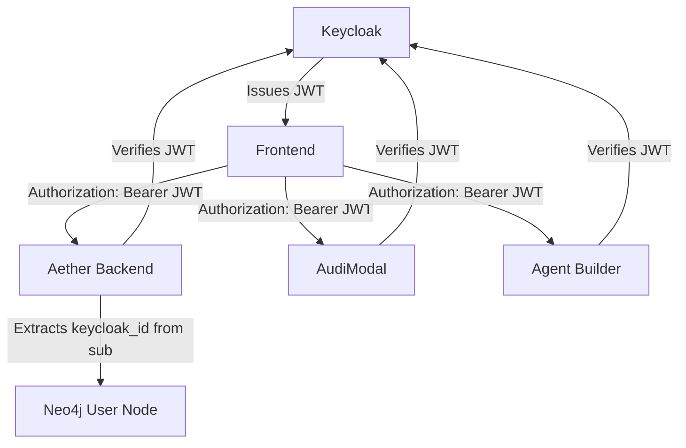
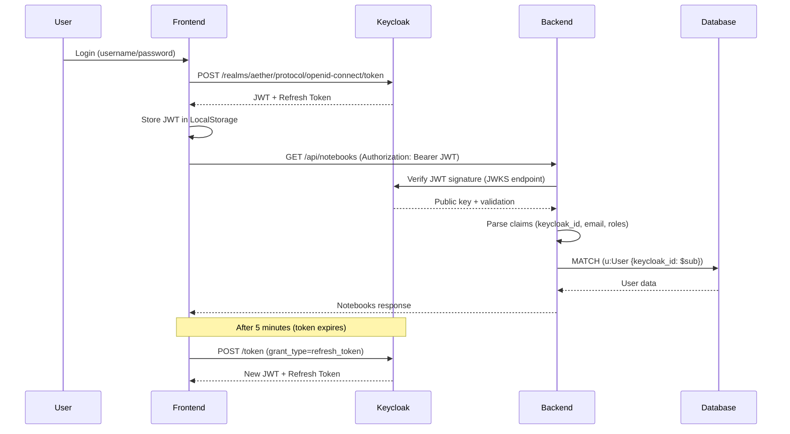
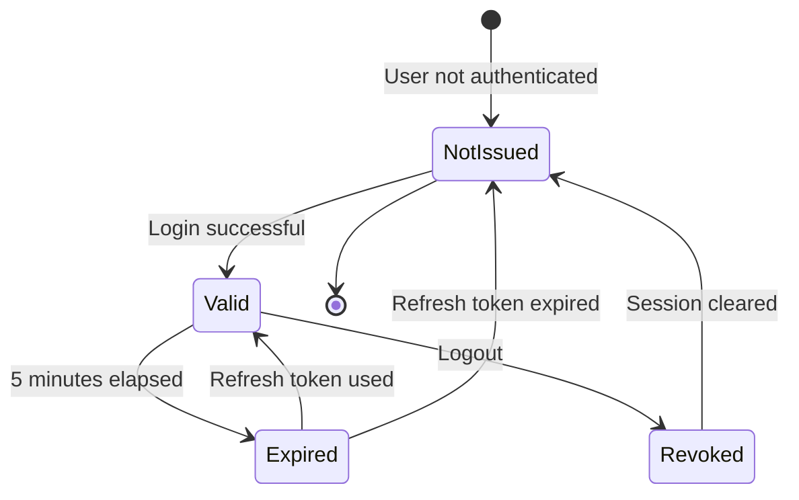
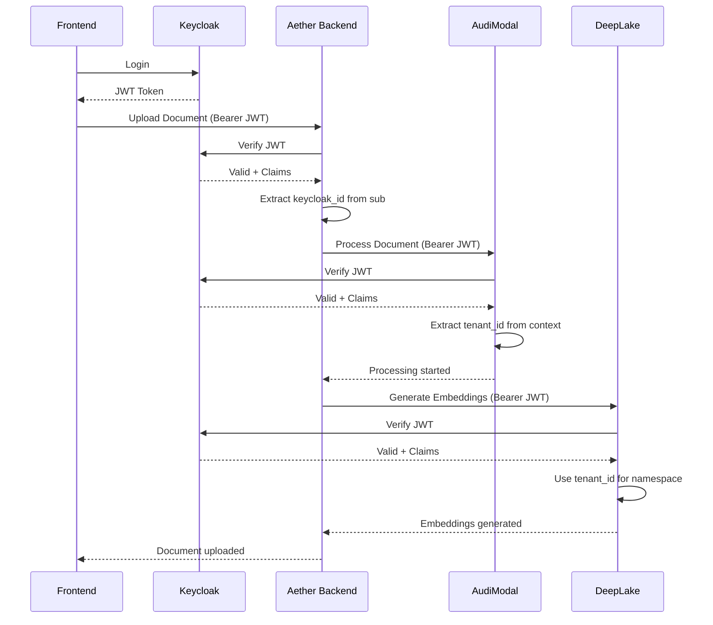

# JWT Token Structure Documentation

---

## Metadata

```markdown
---
service: keycloak
model: JWT Token (ID Token & Access Token)
database: N/A (Stateless tokens)
version: 1.0
last_updated: 2026-01-05
author: TAS Platform Team
---
```

---

## 1. Overview

**Purpose**: JWT (JSON Web Token) tokens are the primary authentication and authorization mechanism for the TAS platform. Keycloak issues OIDC-compliant tokens that carry user identity, roles, and permissions across all microservices.

**Lifecycle**:
- **Created**: Upon successful user authentication via Keycloak
- **Validated**: On every API request by backend services
- **Refreshed**: Using refresh tokens when access tokens expire (5-minute default expiry)
- **Revoked**: On logout or when refresh token expires

**Ownership**: Keycloak (issuer), consumed by all TAS services (aether-be, audimodal, tas-agent-builder, etc.)

**Key Characteristics**:
- Stateless authentication (no server-side session storage)
- Cryptographically signed using RS256 (RSA + SHA256)
- Contains user identity, roles, and custom claims
- Short-lived access tokens (5 minutes) for security
- Longer-lived refresh tokens (configurable, typically 30 minutes to 24 hours)
- Multi-issuer support for dev/staging/production environments
- OIDC-compliant structure with standard and custom claims

---

## 2. Schema Definition

### JWT Token Structure

JWT tokens consist of three Base64-encoded parts separated by dots (`.`):

```
{header}.{payload}.{signature}
```

#### Header

```json
{
  "alg": "RS256",
  "typ": "JWT",
  "kid": "W3kRRnWUpO-VV8IzsUGGqNIgyoPYp7yC1M3lg6LjO7c"
}
```

| Field | Type | Required | Description |
|-------|------|----------|-------------|
| `alg` | string | Yes | Signature algorithm (RS256) |
| `typ` | string | Yes | Token type (JWT) |
| `kid` | string | Yes | Key ID for signature verification |

#### Payload (Claims)

The payload contains the TokenClaims structure as implemented in `aether-be/internal/auth/keycloak.go`:

| Claim Name | Type | Required | Example | Description |
|------------|------|----------|---------|-------------|
| `sub` | string | Yes | `"570d9941-f4be-46d6-9662-15a2ed0a3cb1"` | Subject - Keycloak user ID (UUID) |
| `iss` | string | Yes | `"https://keycloak.tas.scharber.com/realms/aether"` | Issuer - Keycloak realm URL |
| `aud` | string/array | Yes | `"aether-backend"` or `["aether-backend", "aether-frontend"]` | Audience - intended recipients |
| `exp` | int64 | Yes | `1767395906` | Expiration time (Unix timestamp) |
| `iat` | int64 | Yes | `1767395606` | Issued at time (Unix timestamp) |
| `email` | string | Yes | `"john@scharber.com"` | User email address |
| `email_verified` | boolean | Yes | `true` | Whether email has been verified |
| `preferred_username` | string | Yes | `"john@scharber.com"` | Username for display |
| `name` | string | No | `"John Scharber"` | Full name |
| `given_name` | string | No | `"John"` | First name |
| `family_name` | string | No | `"Scharber"` | Last name |
| `realm_access` | object | Yes | `{"roles": ["user", "admin"]}` | Realm-level roles |
| `resource_access` | object | No | `{"aether-backend": {"roles": ["user"]}}` | Client-specific roles |
| `groups` | array | No | `["/engineers", "/admins"]` | User group memberships |
| `azp` | string | No | `"aether-frontend"` | Authorized party (client ID) |
| `session_state` | string | No | `"751779b82-9557-4278-b9e9-46e44b916674"` | Keycloak session ID |
| `acr` | string | No | `"1"` | Authentication context class reference |
| `scope` | string | No | `"openid email profile"` | Granted OAuth scopes |
| `sid` | string | No | `"751779b82-9557-4278-b9e9-46e44b916674"` | Session ID |
| `allowed-origins` | array | No | `["https://aether.tas.scharber.com"]` | CORS allowed origins |

#### Signature

The signature is computed as:

```
RSASHA256(
  base64UrlEncode(header) + "." + base64UrlEncode(payload),
  privateKey
)
```

Verified using Keycloak's public key from the JWKS endpoint.

---

## 3. Relationships

### Service Dependencies



| Service | Role | JWT Usage | Notes |
|---------|------|-----------|-------|
| Keycloak | Issuer | Creates and signs JWTs | OIDC provider |
| Aether Frontend | Client | Stores JWT, sends in requests | LocalStorage/SessionStorage |
| Aether Backend | Verifier | Validates JWT, extracts claims | Uses `go-oidc` library |
| AudiModal | Verifier | Validates JWT for file processing | Extracts tenant context |
| Agent Builder | Verifier | Validates JWT for agent operations | Space-aware routing |
| DeepLake API | Verifier | Validates JWT for vector operations | Tenant isolation |
| LLM Router | Verifier | Validates JWT for LLM requests | Compliance scanning |

### Data Flow



---

## 4. Validation Rules

### Token Validation Process

As implemented in `aether-be/internal/middleware/auth.go`:

**Step 1: Extract Token**
```go
authHeader := c.GetHeader("Authorization")
if !strings.HasPrefix(authHeader, "Bearer ") {
    return errors.New("missing or invalid Authorization header")
}
idToken := strings.TrimPrefix(authHeader, "Bearer ")
```

**Validation Rule 1**: Authorization header must be present and start with "Bearer "
- **Implementation**: `internal/middleware/auth.go:AuthMiddleware`
- **Error**: `401 Unauthorized - Missing or invalid Authorization header`

**Step 2: Verify Signature**
```go
token, err := keycloakClient.VerifyIDToken(ctx, idToken)
```

**Validation Rule 2**: Token signature must be valid (verified with Keycloak's public key)
- **Implementation**: `internal/auth/keycloak.go:VerifyIDToken`
- **Error**: `401 Unauthorized - Invalid token signature`

**Step 3: Check Expiration**
```go
if claims.Exp < time.Now().Unix() {
    return errors.New("token expired")
}
```

**Validation Rule 3**: Token must not be expired (`exp` > current time)
- **Implementation**: `go-oidc` library automatic validation
- **Error**: `401 Unauthorized - Token expired`

**Step 4: Verify Issuer**
```go
allowedIssuers := []string{
    "https://keycloak.tas.scharber.com/realms/aether",
    "http://localhost:8081/realms/aether",
    "http://tas-keycloak-shared:8080/realms/aether",
}
if !contains(allowedIssuers, claims.Iss) {
    return errors.New("invalid issuer")
}
```

**Validation Rule 4**: Issuer must match one of the configured allowed issuers
- **Implementation**: `internal/auth/keycloak.go:NewKeycloakClient`
- **Error**: `401 Unauthorized - Invalid issuer`

**Step 5: Verify Audience**
```go
// Audience can be string or array
expectedAudience := "aether-backend"
```

**Validation Rule 5**: Audience must include the service's client ID
- **Implementation**: `go-oidc` library automatic validation
- **Error**: `401 Unauthorized - Invalid audience`

**Step 6: Extract Claims**
```go
var claims TokenClaims
if err := token.Claims(&claims); err != nil {
    return nil, err
}
```

**Validation Rule 6**: Claims must be parsable into TokenClaims structure
- **Implementation**: `internal/auth/keycloak.go:VerifyIDToken`
- **Error**: `401 Unauthorized - Invalid token claims`

### Business Logic Constraints

- **Email Verification**: Some operations may require `email_verified = true`
- **Role Requirements**: Certain endpoints require specific roles in `realm_access.roles`
- **Scope Requirements**: Some operations require specific OAuth scopes (e.g., `openid`, `profile`)

---

## 5. Lifecycle & State Transitions

### Token Lifecycle



### Transition Rules

| From State | To State | Trigger | Conditions | Side Effects |
|------------|----------|---------|------------|--------------|
| `Not Issued` | `Valid` | User login | Valid credentials | JWT created, stored in frontend |
| `Valid` | `Expired` | Time passes | `exp` < current time | Frontend must refresh |
| `Valid` | `Revoked` | User logout | Logout action | Session cleared in Keycloak |
| `Expired` | `Valid` | Refresh token | Valid refresh token, not expired | New JWT issued |
| `Expired` | `Not Issued` | Refresh token expired | Refresh token > max lifetime | User must re-authenticate |

### Token Refresh Flow

**Access Token Expiry**: 5 minutes (default)
**Refresh Token Expiry**: Configurable (typically 30 minutes to 24 hours)

```
Initial Login:
- Access Token (5 min)
- Refresh Token (30 min)

After 5 minutes:
- Use Refresh Token → Get new Access Token (5 min) + new Refresh Token (30 min)

After 30 minutes:
- Refresh Token expired → User must re-login
```

---

## 6. Examples

### Example JWT Token (Decoded)

**Header**:
```json
{
  "alg": "RS256",
  "typ": "JWT",
  "kid": "W3kRRnWUpO-VV8IzsUGGqNIgyoPYp7yC1M3lg6LjO7c"
}
```

**Payload**:
```json
{
  "sub": "570d9941-f4be-46d6-9662-15a2ed0a3cb1",
  "iss": "https://keycloak.tas.scharber.com/realms/aether",
  "aud": ["aether-backend", "aether-frontend"],
  "exp": 1767395906,
  "iat": 1767395606,
  "email": "john@scharber.com",
  "email_verified": true,
  "preferred_username": "john@scharber.com",
  "name": "John Scharber",
  "given_name": "John",
  "family_name": "Scharber",
  "realm_access": {
    "roles": ["user", "offline_access", "uma_authorization"]
  },
  "resource_access": {
    "aether-backend": {
      "roles": ["user"]
    },
    "account": {
      "roles": ["manage-account", "view-profile"]
    }
  },
  "groups": ["/users", "/engineers"],
  "azp": "aether-frontend",
  "session_state": "751779b82-9557-4278-b9e9-46e44b916674",
  "acr": "1",
  "scope": "openid email profile",
  "sid": "751779b82-9557-4278-b9e9-46e44b916674",
  "allowed-origins": ["https://aether.tas.scharber.com", "http://localhost:3001"]
}
```

### Obtaining a JWT Token

**Frontend (JavaScript)**:
```javascript
// Using Keycloak JS adapter
const keycloak = new Keycloak({
  url: 'https://keycloak.tas.scharber.com',
  realm: 'aether',
  clientId: 'aether-frontend'
});

await keycloak.init({ onLoad: 'login-required' });

// Access token is now available
const token = keycloak.token;
const refreshToken = keycloak.refreshToken;

// Use in API calls
fetch('https://aether.tas.scharber.com/api/v1/notebooks', {
  headers: {
    'Authorization': `Bearer ${token}`,
    'Content-Type': 'application/json'
  }
});

// Auto-refresh before expiry
keycloak.updateToken(30).then(refreshed => {
  if (refreshed) {
    console.log('Token refreshed');
  }
});
```

**Direct Token Request (curl)**:
```bash
# Password grant (for testing only, not for production)
curl -X POST https://keycloak.tas.scharber.com/realms/aether/protocol/openid-connect/token \
  -H "Content-Type: application/x-www-form-urlencoded" \
  -d "grant_type=password" \
  -d "client_id=aether-frontend" \
  -d "username=john@scharber.com" \
  -d "password=password123" \
  -d "scope=openid email profile"

# Response:
{
  "access_token": "eyJhbGciOiJSUzI1NiIsInR5cCI6IkpXVCIsImtpZCI6Ilcza1JG...",
  "expires_in": 300,
  "refresh_expires_in": 1800,
  "refresh_token": "eyJhbGciOiJIUzI1NiIsInR5cCI6IkpXVCJ9...",
  "token_type": "Bearer",
  "session_state": "751779b82-9557-4278-b9e9-46e44b916674",
  "scope": "openid email profile"
}
```

### Verifying a JWT Token

**Backend (Go) - As Implemented**:
```go
// From aether-be/internal/middleware/auth.go

func AuthMiddleware(keycloakClient *auth.KeycloakClient, log *logger.Logger) gin.HandlerFunc {
    return func(c *gin.Context) {
        // 1. Extract token from Authorization header
        authHeader := c.GetHeader("Authorization")
        if authHeader == "" || !strings.HasPrefix(authHeader, "Bearer ") {
            c.JSON(http.StatusUnauthorized, gin.H{
                "error": "Missing or invalid Authorization header",
            })
            c.Abort()
            return
        }

        tokenString := strings.TrimPrefix(authHeader, "Bearer ")
        ctx := c.Request.Context()

        // 2. Verify token signature and extract claims
        claims, err := keycloakClient.VerifyIDToken(ctx, tokenString)
        if err != nil {
            log.ErrorWithContext(ctx, "Failed to verify ID token",
                "error", err.Error(),
            )
            c.JSON(http.StatusUnauthorized, gin.H{
                "error": "Invalid or expired token",
            })
            c.Abort()
            return
        }

        // 3. Store claims in Gin context for downstream handlers
        c.Set("user_id", claims.Sub)
        c.Set("keycloak_id", claims.Sub)
        c.Set("user_email", claims.Email)
        c.Set("user_name", claims.Name)
        c.Set("username", claims.PreferredUsername)
        c.Set("user_claims", claims)

        log.InfoWithContext(ctx, "User authenticated",
            "user_id", claims.Sub,
            "email", claims.Email,
        )

        c.Next()
    }
}

// Helper function to extract claims from context
func GetUserClaims(c *gin.Context) (*auth.TokenClaims, bool) {
    claims, exists := c.Get("user_claims")
    if !exists {
        return nil, false
    }

    if userClaims, ok := claims.(*auth.TokenClaims); ok {
        return userClaims, true
    }
    return nil, false
}
```

**Keycloak Client Implementation**:
```go
// From aether-be/internal/auth/keycloak.go

func (kc *KeycloakClient) VerifyIDToken(ctx context.Context, rawIDToken string) (*TokenClaims, error) {
    // Verify signature and standard claims using go-oidc
    idToken, err := kc.verifier.Verify(ctx, rawIDToken)
    if err != nil {
        return nil, fmt.Errorf("failed to verify token: %w", err)
    }

    // Parse custom claims
    var claims TokenClaims
    if err := idToken.Claims(&claims); err != nil {
        return nil, fmt.Errorf("failed to parse claims: %w", err)
    }

    // Additional issuer validation (multi-environment support)
    if !kc.isAllowedIssuer(claims.Iss) {
        return nil, fmt.Errorf("invalid issuer: %s", claims.Iss)
    }

    return &claims, nil
}

func (kc *KeycloakClient) isAllowedIssuer(issuer string) bool {
    for _, allowed := range kc.allowedIssuers {
        if issuer == allowed {
            return true
        }
    }
    return false
}
```

### Refreshing a JWT Token

**Frontend (JavaScript)**:
```javascript
// Manual refresh
async function refreshToken(refreshToken) {
  const response = await fetch('https://keycloak.tas.scharber.com/realms/aether/protocol/openid-connect/token', {
    method: 'POST',
    headers: {
      'Content-Type': 'application/x-www-form-urlencoded',
    },
    body: new URLSearchParams({
      grant_type: 'refresh_token',
      client_id: 'aether-frontend',
      refresh_token: refreshToken,
    }),
  });

  const data = await response.json();

  // Store new tokens
  localStorage.setItem('access_token', data.access_token);
  localStorage.setItem('refresh_token', data.refresh_token);

  return data.access_token;
}

// Automatic refresh with axios interceptor
axios.interceptors.response.use(
  response => response,
  async error => {
    const originalRequest = error.config;

    if (error.response.status === 401 && !originalRequest._retry) {
      originalRequest._retry = true;

      const refreshToken = localStorage.getItem('refresh_token');
      const newAccessToken = await refreshToken(refreshToken);

      originalRequest.headers['Authorization'] = `Bearer ${newAccessToken}`;
      return axios(originalRequest);
    }

    return Promise.reject(error);
  }
);
```

### Extracting User Information

**Backend (Go)**:
```go
// In a Gin handler
func GetUserProfile(c *gin.Context) {
    // Get claims from context (set by AuthMiddleware)
    claims, exists := GetUserClaims(c)
    if !exists {
        c.JSON(http.StatusUnauthorized, gin.H{"error": "No user claims"})
        return
    }

    // Extract user information
    userID := claims.Sub                    // Keycloak user ID
    email := claims.Email                   // Email address
    username := claims.PreferredUsername    // Username
    fullName := claims.Name                 // Full name
    roles := claims.RealmAccess.Roles       // User roles

    // Check for admin role
    isAdmin := contains(roles, "admin")

    c.JSON(http.StatusOK, gin.H{
        "user_id":  userID,
        "email":    email,
        "username": username,
        "name":     fullName,
        "is_admin": isAdmin,
    })
}
```

---

## 7. Cross-Service References

### Services That Use JWT Tokens

| Service | Purpose | Validation Method | Notes |
|---------|---------|-------------------|-------|
| Aether Frontend | Request authentication | Keycloak JS adapter | Stores in LocalStorage |
| Aether Backend | API protection | `go-oidc` library | Extracts `keycloak_id` for user lookup |
| AudiModal | File processing auth | JWT middleware | Extracts tenant context |
| Agent Builder | Agent operations | JWT middleware | Space-aware routing |
| DeepLake API | Vector operations | JWT middleware | Tenant isolation |
| LLM Router | LLM request auth | JWT middleware | Compliance scanning |
| TAS MCP | MCP protocol auth | JWT middleware | Federation routing |

### ID Mapping

| JWT Claim | Aether Backend Field | Mapping | Notes |
|-----------|---------------------|---------|-------|
| `sub` | `User.keycloak_id` | Direct 1:1 | Primary user identifier |
| `email` | `User.email` | Direct copy | Updated on token refresh |
| `preferred_username` | `User.username` | Direct copy | Display name |
| `name` | `User.name` | Direct copy | Full name |

**Critical Pattern**: The `sub` claim (Keycloak user ID) is used to find or create users in Neo4j:

```cypher
// Find user by keycloak_id
MATCH (u:User {keycloak_id: $sub})
RETURN u

// Or auto-create if not exists
MERGE (u:User {keycloak_id: $sub})
ON CREATE SET
  u.id = $sub,
  u.email = $email,
  u.username = $preferred_username,
  u.created_at = datetime()
RETURN u
```

### Authentication Flow Across Services



---

## 8. Tenant & Space Isolation

### JWT and Multi-Tenancy

**JWT tokens do NOT directly contain `tenant_id` or `space_id`**. These are derived on the backend:

```go
// From JWT sub claim → Find user in Neo4j → Get tenant/space
keycloakID := claims.Sub  // from JWT

// Query Neo4j
MATCH (u:User {keycloak_id: $keycloak_id})
RETURN u.tenant_id, u.personal_space_id

// Now we have:
tenantID := user.TenantID           // e.g., "tenant_1767395606"
spaceID := user.PersonalSpaceID     // e.g., "space_1767395606"
```

### Space Context Derivation

**Pattern**: Every authenticated request resolves to a SpaceContext:

```go
// From middleware
func ResolveSpaceContext(c *gin.Context) (*SpaceContext, error) {
    claims, _ := GetUserClaims(c)

    // Get user from database using keycloak_id
    user, err := userRepo.FindByKeycloakID(ctx, claims.Sub)
    if err != nil {
        return nil, err
    }

    // Build space context
    spaceCtx := &SpaceContext{
        SpaceType:   SpaceTypePersonal,
        SpaceID:     user.PersonalSpaceID,
        TenantID:    user.TenantID,
        UserID:      user.ID,
        UserRole:    "owner", // Personal space owner
        Permissions: []string{"read", "write", "delete"},
    }

    return spaceCtx, nil
}
```

### Propagating Context to Services

When calling other services (AudiModal, DeepLake), the backend adds custom headers:

```go
// Forward JWT + add custom headers
req.Header.Set("Authorization", fmt.Sprintf("Bearer %s", jwt))
req.Header.Set("X-Tenant-ID", spaceCtx.TenantID)
req.Header.Set("X-Space-ID", spaceCtx.SpaceID)
req.Header.Set("X-User-ID", spaceCtx.UserID)
```

**Services then use these headers for isolation**:

```go
// AudiModal file processing
tenantID := r.Header.Get("X-Tenant-ID")
spaceID := r.Header.Get("X-Space-ID")

// Store file with tenant isolation
storagePath := fmt.Sprintf("%s/%s/files/%s", tenantID, spaceID, fileID)
```

---

## 9. Performance Considerations

### Token Verification Performance

**Caching Strategy**:
- **JWKS Caching**: Public keys are cached by `go-oidc` library (default 5 minutes)
- **Token Validation**: Signature verification is CPU-intensive but fast (~1-2ms)
- **Claims Parsing**: Negligible overhead (<1ms)

**Optimization Tips**:
1. **Reuse Keycloak client**: Initialize once, use for all requests
2. **Connection pooling**: `go-oidc` maintains HTTP connection pool to Keycloak
3. **Local JWKS cache**: Reduces network calls to Keycloak JWKS endpoint
4. **Skip validation in dev**: Optional for local development (NOT for production)

### Network Considerations

**Keycloak Availability**:
- Token verification requires network call to Keycloak (for JWKS on first request)
- JWKS endpoint should be highly available
- Consider using Keycloak cluster for high availability

**Latency Impact**:
- First token verification: ~50-100ms (fetch JWKS)
- Subsequent verifications: ~1-2ms (cached JWKS)

### Recommended Patterns

```go
// ✅ GOOD: Initialize once, reuse
var keycloakClient *auth.KeycloakClient

func init() {
    keycloakClient, _ = auth.NewKeycloakClient(config)
}

func AuthMiddleware() gin.HandlerFunc {
    return func(c *gin.Context) {
        claims, err := keycloakClient.VerifyIDToken(ctx, token)
        // ...
    }
}

// ❌ BAD: Create new client per request
func AuthMiddleware() gin.HandlerFunc {
    return func(c *gin.Context) {
        keycloakClient, _ := auth.NewKeycloakClient(config)  // Inefficient!
        // ...
    }
}
```

---

## 10. Security & Compliance

### Sensitive Data in JWT

| Claim | Sensitivity | PII | Exposure | Mitigation |
|-------|-------------|-----|----------|------------|
| `sub` | Medium | No | Public (UUID) | Use as opaque identifier |
| `email` | High | Yes | Authenticated users only | Required for user identification |
| `name` | Medium | Yes | Authenticated users only | Optional, can be omitted |
| `given_name` | Medium | Yes | Authenticated users only | Optional |
| `family_name` | Medium | Yes | Authenticated users only | Optional |
| `groups` | Low | No | Authenticated users only | Role-based access |
| `roles` | Low | No | Authenticated users only | Authorization |

**Security Considerations**:
1. **No secrets in JWT**: Never include passwords, API keys, or sensitive credentials
2. **HTTPS only**: Always transmit JWTs over HTTPS
3. **Short expiry**: 5-minute access tokens reduce replay attack window
4. **Signature verification**: Always verify RS256 signature
5. **Audience validation**: Prevent token reuse across different services
6. **Issuer validation**: Prevent tokens from untrusted issuers

### Access Control

- **Create Token**: Only Keycloak (via OIDC flow)
- **Read Token**: Any service with the token (bearer auth)
- **Verify Token**: Any service with access to Keycloak JWKS endpoint
- **Revoke Token**: Keycloak admin or user logout

### Audit Logging

**Events Logged**:
- Token issuance (Keycloak audit logs)
- Failed token verification (backend service logs)
- Token expiry (backend service logs)
- Refresh token usage (Keycloak audit logs)

**Example Log Entry**:
```json
{
  "timestamp": "2026-01-05T10:30:45Z",
  "level": "INFO",
  "service": "aether-backend",
  "event": "token_verified",
  "user_id": "570d9941-f4be-46d6-9662-15a2ed0a3cb1",
  "email": "john@scharber.com",
  "issuer": "https://keycloak.tas.scharber.com/realms/aether",
  "client_id": "aether-frontend"
}
```

### Compliance

- **GDPR**: Email and name are PII, must be handled accordingly
- **Data Minimization**: Only include necessary claims in tokens
- **Right to Erasure**: User deletion must invalidate all tokens (session revocation)
- **Audit Trail**: Token usage logged for compliance audits

---

## 11. Migration History

### Version 1.0 (2026-01-05)
- Initial JWT structure documentation
- Standard OIDC claims (sub, iss, aud, exp, iat)
- Custom claims (email, name, roles)
- Multi-issuer support for dev/staging/prod environments
- RS256 signature algorithm
- 5-minute access token expiry
- Refresh token support

**Migration Notes**:
- No schema migrations required (stateless tokens)
- Keycloak realm configuration changes require token re-issuance
- Claims structure changes require backend code updates

---

## 12. Known Issues & Limitations

### Issue 1: Multi-Issuer Environment Complexity
- **Description**: Supporting multiple Keycloak URLs (localhost, internal Docker, public domain) requires extensive configuration
- **Workaround**: `allowedIssuers` array in backend configuration
- **Implementation**: `aether-be/internal/auth/keycloak.go:78-83`
- **Impact**: Low - Handled transparently
- **Future**: Consider single issuer with DNS resolution

### Issue 2: Token Expiry Too Short for Long Operations
- **Description**: 5-minute access token expiry can interrupt long-running file uploads or processing
- **Workaround**: Frontend auto-refresh logic before expiry
- **Impact**: Medium - Requires robust refresh handling
- **Future**: Consider operation-specific token lifetimes or background refresh

### Issue 3: No tenant_id/space_id in JWT
- **Description**: JWT doesn't contain tenant/space context, requires database lookup on every request
- **Workaround**: Resolve space context once per request, cache in request context
- **Impact**: Low - Minimal performance overhead (~1-2ms)
- **Future**: Consider custom JWT claims for tenant/space (requires Keycloak customization)

### Limitation 1: Stateless Nature
- **Description**: JWTs cannot be revoked before expiry (stateless design)
- **Impact**: Compromised tokens valid until expiry
- **Mitigation**: Short expiry window (5 minutes), refresh token revocation on logout
- **Future**: Consider token blacklist for critical security events

### Limitation 2: Token Size
- **Description**: JWTs grow large with many roles/groups (~1-2KB typical, up to 8KB max)
- **Impact**: HTTP header size limits, network bandwidth
- **Mitigation**: Minimize roles/groups, use reference tokens for edge cases
- **Future**: Consider opaque tokens for high-role users

---

## 13. Related Documentation

- [Keycloak User Model](../users/user-model.md) - User attributes and profiles
- [Keycloak Client Configurations](../clients/) - OIDC client setup
- [Aether Backend User Node](../../aether-be/nodes/user.md) - Neo4j user model
- [Authentication Middleware](../../aether-be/middleware/auth.md) - Implementation details
- [Space Context](../../aether-be/models/space-context.md) - Multi-tenancy context
- [Cross-Service ID Mapping](../../cross-service/mappings/id-mapping-chain.md) - ID flow diagrams
- [Security Best Practices](../../overview/security-guidelines.md) - Platform security standards

**External References**:
- [OIDC Specification](https://openid.net/specs/openid-connect-core-1_0.html)
- [JWT Specification (RFC 7519)](https://datatracker.ietf.org/doc/html/rfc7519)
- [Keycloak Documentation](https://www.keycloak.org/documentation)
- [go-oidc Library](https://github.com/coreos/go-oidc)

---

## 14. Changelog

| Date | Version | Author | Changes |
|------|---------|--------|---------|
| 2026-01-05 | 1.0 | TAS Platform Team | Initial JWT structure documentation with complete TokenClaims, validation flow, examples, and cross-service integration |

---

**Maintained by**: TAS Platform Team
**Last Reviewed**: 2026-01-05
**Next Review**: 2026-02-05
**Source Code**: `aether-be/internal/auth/keycloak.go`, `aether-be/internal/middleware/auth.go`
