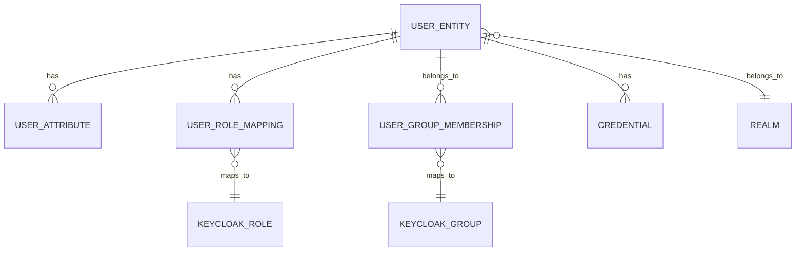
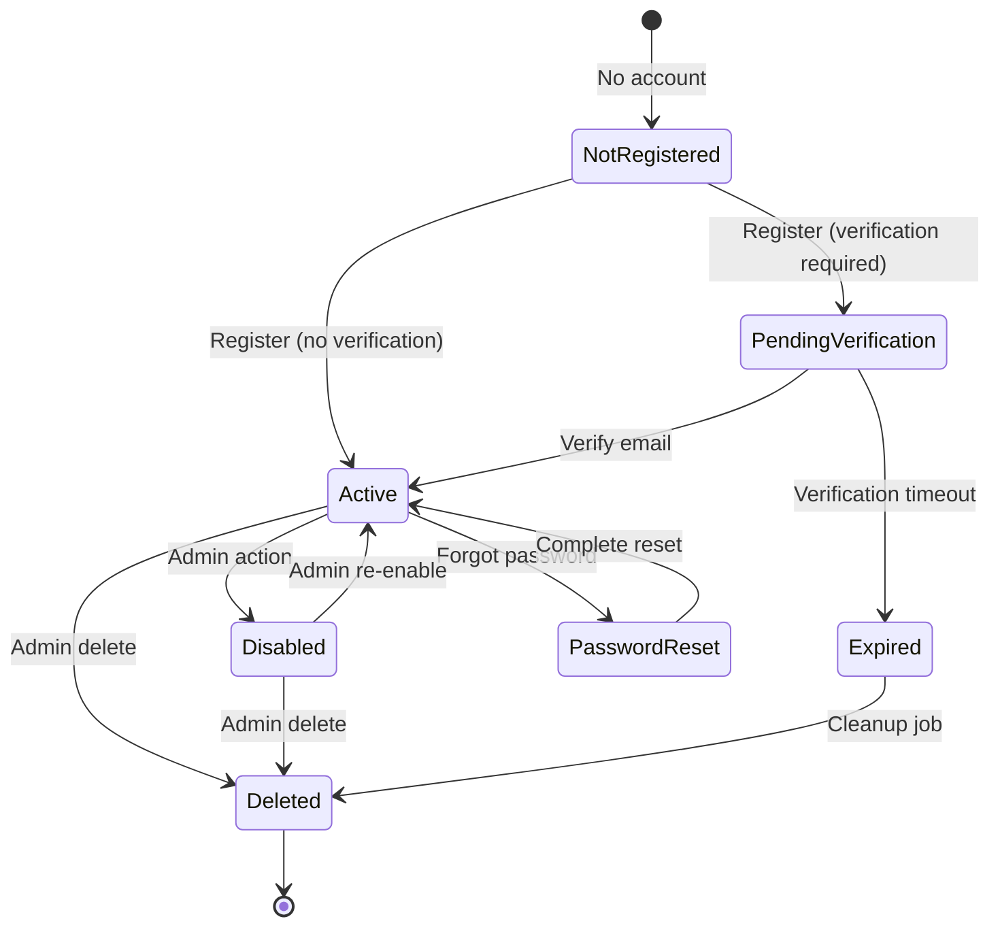

# Keycloak User Model Documentation

---

## Metadata

```markdown
---
service: keycloak
model: User
database: Keycloak (PostgreSQL backend)
version: 1.0
last_updated: 2026-01-05
author: TAS Platform Team
---
```

---

## 1. Overview

**Purpose**: The Keycloak User model represents user identities, authentication credentials, and profile information in the TAS platform. It serves as the single source of truth for authentication and is synchronized with the Aether Backend's Neo4j User node for application-specific data.

**Lifecycle**:
- **Created**: Upon user registration or admin creation
- **Updated**: Profile updates, password changes, role/group assignments
- **Synced**: Data synchronized to Aether Backend on first login and periodically
- **Disabled/Deleted**: Can be soft-disabled or hard-deleted by admins

**Ownership**: Keycloak service (identity provider), consumed by all TAS services via OIDC/OAuth2

**Key Characteristics**:
- OIDC-compliant user identity storage
- Password hashing with bcrypt/PBKDF2
- Multi-factor authentication support
- Role-Based Access Control (RBAC) via realm and client roles
- Group-based permissions
- Custom user attributes for application-specific metadata
- Email verification workflow
- Password reset capability
- Session management across multiple clients

---

## 2. Schema Definition

### Keycloak Database Schema (PostgreSQL)

Keycloak uses a complex relational schema. Key tables for users:

#### Main User Table: `user_entity`

| Field Name | Type | Required | Default | Description |
|------------|------|----------|---------|-------------|
| `id` | UUID | Yes | Generated | Primary key - Keycloak user ID |
| `email` | VARCHAR(255) | No | NULL | User email address |
| `email_constraint` | VARCHAR(255) | No | NULL | Email uniqueness constraint value |
| `email_verified` | BOOLEAN | Yes | false | Whether email has been verified |
| `enabled` | BOOLEAN | Yes | true | Whether user account is enabled |
| `federation_link` | VARCHAR(255) | No | NULL | Link to federated identity provider |
| `first_name` | VARCHAR(255) | No | NULL | User's first name |
| `last_name` | VARCHAR(255) | No | NULL | User's last name |
| `realm_id` | VARCHAR(255) | Yes | - | Foreign key to realm |
| `username` | VARCHAR(255) | Yes | - | Username (unique per realm) |
| `created_timestamp` | BIGINT | Yes | now() | Creation timestamp (milliseconds) |
| `service_account_client_link` | VARCHAR(255) | No | NULL | Link to service account client |
| `not_before` | INTEGER | Yes | 0 | Revoke tokens before this time |

#### User Attributes Table: `user_attribute`

| Field Name | Type | Required | Default | Description |
|------------|------|----------|---------|-------------|
| `id` | VARCHAR(36) | Yes | Generated | Attribute ID |
| `name` | VARCHAR(255) | Yes | - | Attribute name |
| `value` | TEXT | No | NULL | Attribute value |
| `user_id` | VARCHAR(36) | Yes | - | Foreign key to user_entity |

Common custom attributes in TAS:
- `personal_tenant_id` - User's personal tenant ID
- `personal_space_id` - User's personal space ID
- `phone_number` - Contact phone
- `department` - Organization department
- `job_title` - User's job title
- `locale` - Preferred language/locale

#### User Role Mapping Table: `user_role_mapping`

| Field Name | Type | Required | Default | Description |
|------------|------|----------|---------|-------------|
| `role_id` | VARCHAR(255) | Yes | - | Foreign key to keycloak_role |
| `user_id` | VARCHAR(36) | Yes | - | Foreign key to user_entity |

#### User Group Membership Table: `user_group_membership`

| Field Name | Type | Required | Default | Description |
|------------|------|----------|---------|-------------|
| `group_id` | VARCHAR(36) | Yes | - | Foreign key to keycloak_group |
| `user_id` | VARCHAR(36) | Yes | - | Foreign key to user_entity |

#### Credentials Table: `credential`

| Field Name | Type | Required | Default | Description |
|------------|------|----------|---------|-------------|
| `id` | VARCHAR(36) | Yes | Generated | Credential ID |
| `type` | VARCHAR(255) | Yes | - | Credential type (password, otp) |
| `user_id` | VARCHAR(36) | Yes | - | Foreign key to user_entity |
| `created_date` | BIGINT | No | NULL | Creation timestamp |
| `secret_data` | TEXT | No | NULL | Encrypted secret data |
| `credential_data` | TEXT | No | NULL | Credential configuration |
| `priority` | INTEGER | No | 10 | Priority for credential selection |

### Indexes

| Index Name | Fields | Type | Purpose |
|------------|--------|------|---------|
| `idx_user_email` | `email` | Index | Fast email lookup |
| `idx_user_username` | `username` | Index | Fast username lookup |
| `idx_user_email_constraint` | `email_constraint` | Unique | Email uniqueness per realm |
| `idx_user_service_account` | `service_account_client_link` | Index | Service account lookup |
| `idx_user_attribute_user` | `user_id` | Index | User attribute lookup |
| `idx_user_role_mapping_user` | `user_id` | Index | User role lookup |
| `idx_user_group_membership_user` | `user_id` | Index | User group lookup |

### Constraints

- **Primary Key**: `id` (user_entity)
- **Unique**: `(realm_id, username)` - Username unique per realm
- **Unique**: `(realm_id, email_constraint)` - Email unique per realm (if configured)
- **Foreign Keys**:
  - `realm_id` → `realm.id`
  - `user_attribute.user_id` → `user_entity.id` (CASCADE on delete)
  - `user_role_mapping.user_id` → `user_entity.id` (CASCADE on delete)
  - `user_group_membership.user_id` → `user_entity.id` (CASCADE on delete)
  - `credential.user_id` → `user_entity.id` (CASCADE on delete)

---

## 3. Relationships

### Keycloak Internal Relationships



| Relationship | Direction | Target | Cardinality | Description |
|--------------|-----------|--------|-------------|-------------|
| Has Attributes | Outgoing | `user_attribute` | 1:N | User custom attributes |
| Has Roles | Outgoing | `user_role_mapping` | 1:N | User role assignments |
| Belongs To Groups | Outgoing | `user_group_membership` | 1:N | User group memberships |
| Has Credentials | Outgoing | `credential` | 1:N | User passwords/MFA |
| Belongs To Realm | Outgoing | `realm` | N:1 | User realm membership |

### Cross-Service Relationships

**Keycloak User → Aether Backend User (Neo4j)**:
- **Mapping**: `keycloak.id` (UUID) = `aether.User.keycloak_id` (UUID)
- **Synchronization**: On first login, JWT claims populate Neo4j User node
- **Pattern**: Keycloak is source of truth for identity, Neo4j for app-specific data

```cypher
// Find Aether user by Keycloak ID
MATCH (u:User {keycloak_id: $keycloak_id})
RETURN u

// Or auto-create if not exists
MERGE (u:User {keycloak_id: $keycloak_id})
ON CREATE SET
  u.id = $keycloak_id,
  u.email = $email,
  u.username = $username,
  u.full_name = $name,
  u.created_at = datetime()
RETURN u
```

---

## 4. Validation Rules

### Business Logic Constraints

**Rule 1**: Username must be unique within a realm
- **Implementation**: Database unique constraint on `(realm_id, username)`
- **Error**: `409 Conflict - Username already exists`

**Rule 2**: Email must be unique within a realm (if `duplicateEmailsAllowed = false`)
- **Implementation**: `email_constraint` field with unique index
- **Error**: `409 Conflict - Email already exists`

**Rule 3**: Password must meet complexity requirements
- **Implementation**: Keycloak password policy (configurable per realm)
- **Default**: Minimum 8 characters
- **Error**: `400 Bad Request - Password does not meet requirements`

**Rule 4**: Email verification required for certain operations
- **Implementation**: `email_verified` boolean flag
- **Error**: `403 Forbidden - Email not verified`

**Rule 5**: Enabled users only can authenticate
- **Implementation**: `enabled` boolean flag checked during login
- **Error**: `401 Unauthorized - Account disabled`

### Data Integrity

- Email format validated (RFC 5322 compliant)
- Username cannot contain special characters (configurable regex)
- First/last name sanitized to prevent XSS
- Credential secrets encrypted at rest (AES-256)
- Passwords hashed with bcrypt (cost factor 10) or PBKDF2

---

## 5. Lifecycle & State Transitions

### User Account States



### Transition Rules

| From State | To State | Trigger | Conditions | Side Effects |
|------------|----------|---------|------------|--------------|
| `Not Registered` | `Pending Verification` | User registration | `verifyEmail=true` | Sends verification email |
| `Not Registered` | `Active` | User registration | `verifyEmail=false` | Creates active account |
| `Pending Verification` | `Active` | Email verification | Valid verification token | Sets `email_verified=true` |
| `Active` | `Disabled` | Admin action | Admin privileges | Sets `enabled=false`, revokes sessions |
| `Active` | `Password Reset` | Forgot password | Email exists | Sends reset email |
| `Password Reset` | `Active` | Complete reset | Valid reset token | Updates password hash |
| `Disabled` | `Active` | Admin action | Admin privileges | Sets `enabled=true` |
| `Active/Disabled` | `Deleted` | Admin action | Admin privileges | Hard delete from database |

### Session Lifecycle

**SSO Session**: User can have one active SSO session per realm
**Client Sessions**: Multiple client sessions per SSO session
**Session Timeout**: Configurable idle timeout (default 30 minutes) and max lifespan (default 10 hours)

---

## 6. Examples

### Creating a User (Keycloak Admin API)

**REST API (JSON)**:
```bash
curl -X POST "https://keycloak.tas.scharber.com/admin/realms/aether/users" \
  -H "Authorization: Bearer $ADMIN_TOKEN" \
  -H "Content-Type: application/json" \
  -d '{
    "username": "john.doe",
    "email": "john.doe@example.com",
    "firstName": "John",
    "lastName": "Doe",
    "enabled": true,
    "emailVerified": false,
    "attributes": {
      "department": ["Engineering"],
      "job_title": ["Software Engineer"]
    },
    "credentials": [{
      "type": "password",
      "value": "SecureP@ssw0rd",
      "temporary": true
    }],
    "realmRoles": ["user"],
    "groups": ["/engineers"]
  }'
```

**Response**:
```
Location: https://keycloak.tas.scharber.com/admin/realms/aether/users/570d9941-f4be-46d6-9662-15a2ed0a3cb1
```

### User Registration Flow (Self-Service)

**Step 1: User registers**:
```bash
# User fills registration form at:
# https://keycloak.tas.scharber.com/realms/aether/protocol/openid-connect/registrations

# Keycloak creates user with:
# - enabled=true
# - email_verified=false (if verification required)
# - default role: "user"
```

**Step 2: Email verification (if required)**:
```bash
# User clicks link in verification email:
# https://keycloak.tas.scharber.com/realms/aether/login-actions/action-token?key={token}

# Keycloak updates:
# UPDATE user_entity SET email_verified = true WHERE id = $user_id;
```

**Step 3: First login triggers Aether sync**:
```cypher
// Aether Backend creates Neo4j User node
MERGE (u:User {keycloak_id: $keycloak_id})
ON CREATE SET
  u.id = $keycloak_id,
  u.email = $email,
  u.username = $username,
  u.full_name = $name,
  u.status = 'active',
  u.created_at = datetime()
RETURN u
```

### Querying Users (Admin API)

**Find by Email**:
```bash
curl -X GET "https://keycloak.tas.scharber.com/admin/realms/aether/users?email=john.doe@example.com" \
  -H "Authorization: Bearer $ADMIN_TOKEN"
```

**Find by Username**:
```bash
curl -X GET "https://keycloak.tas.scharber.com/admin/realms/aether/users?username=john.doe" \
  -H "Authorization: Bearer $ADMIN_TOKEN"
```

**Get User Details**:
```bash
curl -X GET "https://keycloak.tas.scharber.com/admin/realms/aether/users/570d9941-f4be-46d6-9662-15a2ed0a3cb1" \
  -H "Authorization: Bearer $ADMIN_TOKEN"
```

**Response**:
```json
{
  "id": "570d9941-f4be-46d6-9662-15a2ed0a3cb1",
  "createdTimestamp": 1767395606000,
  "username": "john.doe",
  "enabled": true,
  "totp": false,
  "emailVerified": true,
  "firstName": "John",
  "lastName": "Doe",
  "email": "john.doe@example.com",
  "attributes": {
    "department": ["Engineering"],
    "job_title": ["Software Engineer"],
    "personal_tenant_id": ["tenant_1767395606"],
    "personal_space_id": ["space_1767395606"]
  },
  "disableableCredentialTypes": [],
  "requiredActions": [],
  "notBefore": 0,
  "access": {
    "manageGroupMembership": true,
    "view": true,
    "mapRoles": true,
    "impersonate": true,
    "manage": true
  }
}
```

### Updating User

**Update Profile**:
```bash
curl -X PUT "https://keycloak.tas.scharber.com/admin/realms/aether/users/570d9941-f4be-46d6-9662-15a2ed0a3cb1" \
  -H "Authorization: Bearer $ADMIN_TOKEN" \
  -H "Content-Type: application/json" \
  -d '{
    "firstName": "Jonathan",
    "attributes": {
      "department": ["Engineering"],
      "job_title": ["Senior Software Engineer"]
    }
  }'
```

**Reset Password**:
```bash
curl -X PUT "https://keycloak.tas.scharber.com/admin/realms/aether/users/570d9941-f4be-46d6-9662-15a2ed0a3cb1/reset-password" \
  -H "Authorization: Bearer $ADMIN_TOKEN" \
  -H "Content-Type: application/json" \
  -d '{
    "type": "password",
    "value": "NewSecureP@ssw0rd",
    "temporary": false
  }'
```

### Deleting User

**Soft Disable**:
```bash
curl -X PUT "https://keycloak.tas.scharber.com/admin/realms/aether/users/570d9941-f4be-46d6-9662-15a2ed0a3cb1" \
  -H "Authorization: Bearer $ADMIN_TOKEN" \
  -H "Content-Type: application/json" \
  -d '{
    "enabled": false
  }'
```

**Hard Delete**:
```bash
curl -X DELETE "https://keycloak.tas.scharber.com/admin/realms/aether/users/570d9941-f4be-46d6-9662-15a2ed0a3cb1" \
  -H "Authorization: Bearer $ADMIN_TOKEN"
```

---

## 7. Cross-Service References

### Services That Use Keycloak Users

| Service | Purpose | Access Pattern | Notes |
|---------|---------|----------------|-------|
| Aether Frontend | User login/registration | OIDC authorization code flow | Keycloak JS adapter |
| Aether Backend | User authentication | JWT verification | Syncs to Neo4j on first login |
| AudiModal | Document processing auth | JWT verification | Extracts tenant from user |
| Agent Builder | Agent operations | JWT verification | Space-aware routing |
| DeepLake API | Vector operations | JWT verification | Tenant isolation |
| LLM Router | LLM request auth | JWT verification | Compliance scanning |
| Admin CLI | User management | Direct Admin API | Automated provisioning |

### ID Mapping Chain

```
Keycloak User Registration
    ↓
User ID: 570d9941-f4be-46d6-9662-15a2ed0a3cb1
    ↓
JWT Issued (sub claim = user ID)
    ↓
Aether Backend receives JWT
    ↓
Extract keycloak_id from sub claim
    ↓
MERGE (u:User {keycloak_id: '570d9941-f4be-46d6-9662-15a2ed0a3cb1'})
    ↓
Auto-create personal tenant
    ↓
tenant_id: tenant_1767395606
space_id: space_1767395606
    ↓
Create AudiModal tenant (same ID)
    ↓
Create DeepLake namespace (same ID)
    ↓
All services use same tenant_id for isolation
```

### Synchronization Pattern

**Keycloak → Aether Backend (Neo4j)**:

```go
// From aether-be/internal/services/user.go
func (s *UserService) SyncFromKeycloak(ctx context.Context, claims *auth.TokenClaims) (*models.User, error) {
    // Try to find existing user
    user, err := s.repo.FindByKeycloakID(ctx, claims.Sub)

    if err == ErrUserNotFound {
        // Auto-create user from JWT claims
        user = &models.User{
            ID:         uuid.New().String(),
            KeycloakID: claims.Sub,
            Email:      claims.Email,
            Username:   claims.PreferredUsername,
            FullName:   claims.Name,
            Status:     "active",
            CreatedAt:  time.Now(),
        }

        // Sync roles and groups
        user.KeycloakRoles = claims.RealmAccess.Roles
        user.KeycloakGroups = claims.Groups

        // Create user in Neo4j
        err = s.repo.Create(ctx, user)
        if err != nil {
            return nil, err
        }

        // Trigger onboarding (create personal tenant, space, notebook)
        go s.onboardingService.OnboardUser(context.Background(), user)
    }

    // Update last login
    user.UpdateLastLogin()
    s.repo.Update(ctx, user)

    return user, nil
}
```

---

## 8. Tenant & Space Isolation

### Custom Attributes for Multi-Tenancy

Keycloak users have custom attributes to store tenant/space context:

```json
{
  "attributes": {
    "personal_tenant_id": ["tenant_1767395606"],
    "personal_space_id": ["space_1767395606"],
    "organization_memberships": ["org_123", "org_456"]
  }
}
```

**Pattern**: These attributes are NOT included in JWT tokens by default. They are:
1. Set during user onboarding in Aether Backend
2. Stored back to Keycloak via Admin API
3. Retrieved when needed for admin operations
4. Derived from Neo4j User node for active sessions

### User Attribute Update

```bash
# Update user's tenant/space attributes
curl -X PUT "https://keycloak.tas.scharber.com/admin/realms/aether/users/$USER_ID" \
  -H "Authorization: Bearer $ADMIN_TOKEN" \
  -H "Content-Type: application/json" \
  -d '{
    "attributes": {
      "personal_tenant_id": ["tenant_1767395606"],
      "personal_space_id": ["space_1767395606"]
    }
  }'
```

### Realm-Level Isolation

**Multiple Realms**: Can create separate realms for different tenants/organizations:
- `aether` - Main application realm
- `org-acme` - Dedicated realm for Acme Corp
- `org-globex` - Dedicated realm for Globex Inc

Each realm has:
- Separate user databases
- Separate roles and groups
- Separate client configurations
- Separate session management

---

## 9. Performance Considerations

### Indexes for Performance

- **Email Index**: Fast user lookup by email during login
- **Username Index**: Fast user lookup by username
- **Attribute Index**: User attribute queries optimized
- **Role Mapping Index**: Quick role checks
- **Group Membership Index**: Fast group queries

### Query Optimization Tips

1. **Use specific queries**: Query by `username` or `email` (indexed) instead of `search`
2. **Limit pagination**: Use `first` and `max` parameters to limit results
3. **Avoid full scans**: Don't query all users without filters
4. **Cache user data**: Cache user details in application layer (Redis)
5. **Batch operations**: Use bulk admin API for multiple user updates

### Caching Strategy

**Keycloak Internal Caching**:
- User credentials cached in memory
- Realm configuration cached
- Client configuration cached

**Application-Level Caching** (Recommended):
```go
// Cache user data in Redis
cacheKey := fmt.Sprintf("user:%s", keycloakID)
ttl := 5 * time.Minute

// Try cache first
userData, err := redis.Get(cacheKey)
if err == nil {
    return unmarshal(userData)
}

// Fetch from Keycloak Admin API
user, err := keycloakClient.GetUser(keycloakID)

// Cache result
redis.Set(cacheKey, marshal(user), ttl)
```

### Connection Pooling

- Keycloak database connection pool (PostgreSQL)
- Admin API HTTP client connection pooling
- go-oidc library maintains HTTP connection pool

---

## 10. Security & Compliance

### Sensitive Data

| Field | Sensitivity | Encryption | PII | Retention |
|-------|-------------|------------|-----|-----------|
| `id` | Low | No | No | Permanent |
| `email` | High | At rest (TLS) | Yes | User lifetime |
| `username` | Medium | No | Maybe | User lifetime |
| `first_name` | High | At rest (TLS) | Yes | User lifetime |
| `last_name` | High | At rest (TLS) | Yes | User lifetime |
| `password` | Critical | Hashed (bcrypt) | Yes | Until reset |
| `attributes` | Varies | At rest (TLS) | Maybe | User lifetime |

### Password Security

- **Algorithm**: bcrypt (default cost factor 10) or PBKDF2
- **Salting**: Unique salt per password
- **Storage**: `credential` table with encrypted `secret_data`
- **Policy**: Configurable per realm (length, complexity, history, expiry)

### Access Control

- **Create User**: Admins only (`manage-users` role)
- **Read User**: Self or admins (`view-users` role)
- **Update User**: Self (limited fields) or admins (`manage-users`)
- **Delete User**: Admins only (`manage-users` role)
- **Reset Password**: Self (with current password) or admins

### Audit Logging

Keycloak emits admin and user events:

**Admin Events** (stored in `admin_event_entity` table):
- User created
- User updated
- User deleted
- Role assigned
- Group membership changed

**User Events** (stored in `event_entity` table):
- Login success/failure
- Logout
- Password change
- Email verification
- Account update

**Example Query**:
```sql
SELECT * FROM event_entity
WHERE user_id = '570d9941-f4be-46d6-9662-15a2ed0a3cb1'
AND type IN ('LOGIN', 'LOGOUT', 'UPDATE_PASSWORD')
ORDER BY event_time DESC
LIMIT 50;
```

### GDPR Compliance

- **Right to Access**: Admin API provides full user data export
- **Right to Erasure**: Hard delete removes all user data
- **Right to Portability**: JSON export of user profile
- **Data Minimization**: Only required fields collected
- **Consent Management**: Can track via custom attributes

---

## 11. Migration History

### Version 1.0 (2026-01-05)
- Initial Keycloak user model documentation
- Standard OIDC user schema
- Custom attributes for tenant/space isolation
- Realm configuration: `aether`
- Default roles: `user`, `admin`, `viewer`
- Password policy: Minimum 8 characters
- Email verification: Optional (currently disabled)
- Registration: Self-service enabled

**Migration Notes**:
- Keycloak realm created via `/home/jscharber/eng/TAS/aether-shared/scripts/init-keycloak.sh`
- Users auto-synced to Neo4j on first login
- No user data migration required (new platform)

---

## 12. Known Issues & Limitations

### Issue 1: Email Verification Currently Disabled
- **Description**: Email verification is disabled in realm config (`verifyEmail: false`)
- **Impact**: Users can register with unverified emails
- **Workaround**: Manual verification or rely on trusted auth providers
- **Future**: Enable verification with SMTP configuration

### Issue 2: Custom Attributes Not in JWT by Default
- **Description**: `personal_tenant_id` and `personal_space_id` not included in JWT tokens
- **Impact**: Requires database lookup on every request to get tenant context
- **Workaround**: Retrieve from Neo4j User node, cache in request context
- **Future**: Add protocol mapper to include custom claims in JWT

### Issue 3: No Automated User Cleanup
- **Description**: Disabled/inactive users remain in database indefinitely
- **Impact**: Database growth over time
- **Workaround**: Manual periodic cleanup
- **Future**: Implement scheduled cleanup job for disabled users

### Limitation 1: Single Realm Per Environment
- **Description**: Currently using single `aether` realm for all users
- **Impact**: Cannot isolate users by organization at Keycloak level
- **Mitigation**: Use groups and custom attributes for organization membership
- **Future**: Consider multi-realm architecture for large organizations

### Limitation 2: No Built-In User Provisioning
- **Description**: No SCIM or LDAP integration for user provisioning
- **Impact**: Manual user creation or custom provisioning scripts
- **Mitigation**: Use Keycloak Admin API for programmatic user management
- **Future**: Implement SCIM server or LDAP federation

---

## 13. Related Documentation

- [Keycloak JWT Structure](../tokens/jwt-structure.md) - Token claims and validation
- [Keycloak Client Configurations](../clients/) - OIDC client setup
- [Aether Backend User Node](../../aether-be/nodes/user.md) - Neo4j user model
- [Keycloak Roles](../roles/role-model.md) - Role-based access control
- [Keycloak Groups](../groups/group-model.md) - Group-based permissions
- [Authentication Middleware](../../aether-be/middleware/auth.md) - JWT verification
- [User Onboarding Flow](../../cross-service/flows/user-onboarding.md) - Complete onboarding process
- [Security Best Practices](../../overview/security-guidelines.md) - Platform security

**External References**:
- [Keycloak Admin REST API](https://www.keycloak.org/docs-api/latest/rest-api/)
- [Keycloak Server Admin Guide](https://www.keycloak.org/docs/latest/server_admin/)
- [OIDC Specification](https://openid.net/specs/openid-connect-core-1_0.html)
- [Keycloak Database Schema](https://www.keycloak.org/docs/latest/server_development/#_database)

---

## 14. Changelog

| Date | Version | Author | Changes |
|------|---------|--------|---------|
| 2026-01-05 | 1.0 | TAS Platform Team | Initial Keycloak user model documentation with complete schema, lifecycle, cross-service sync patterns, and security considerations |

---

**Maintained by**: TAS Platform Team
**Last Reviewed**: 2026-01-05
**Next Review**: 2026-02-05
**Configuration**: `aether-shared/scripts/init-keycloak.sh`
**Keycloak Version**: 23.0+ (OIDC-compliant)
