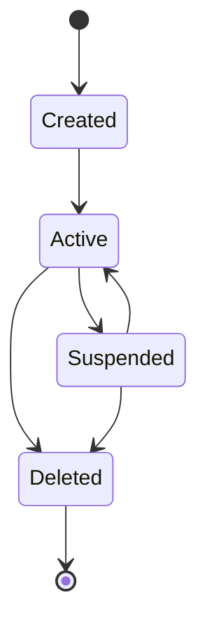
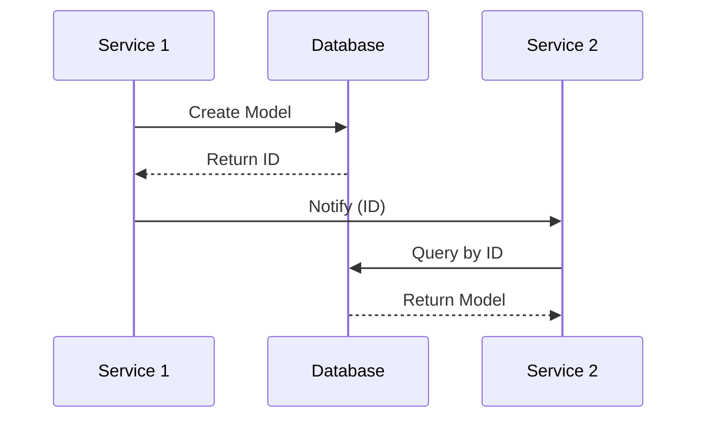

# Model Documentation Template

Use this template for documenting all data models across TAS services.

---

## Metadata

```markdown
---
service: {service-name}          # e.g., aether-be, keycloak, audimodal
model: {ModelName}               # e.g., User, Notebook, Realm
database: {database-type}        # e.g., Neo4j, PostgreSQL, Redis
version: {version}               # e.g., 1.0, 2.1
last_updated: {YYYY-MM-DD}      # Date of last modification
author: {team/person}            # Who maintains this
---
```

---

## 1. Overview

**Purpose**: {Brief description of what this model represents and why it exists}

**Lifecycle**: {When is this created, updated, deleted}

**Ownership**: {Which service owns/manages this model}

**Key Characteristics**:
- {Characteristic 1}
- {Characteristic 2}
- {Characteristic 3}

---

## 2. Schema Definition

### {Database Type} Schema

#### Fields/Properties

| Field Name | Type | Required | Default | Description |
|------------|------|----------|---------|-------------|
| `id` | UUID | Yes | Generated | Unique identifier |
| `field_name` | string | Yes | - | Field description |
| `another_field` | integer | No | 0 | Another field |
| `created_at` | timestamp | Yes | now() | Creation timestamp |
| `updated_at` | timestamp | Yes | now() | Last update timestamp |

#### Indexes

| Index Name | Fields | Type | Purpose |
|------------|--------|------|---------|
| `idx_primary` | `id` | Primary | Unique identifier lookup |
| `idx_example` | `field_name` | Index | Fast querying by field |

#### Constraints

- **Primary Key**: `id`
- **Unique**: `{field_name}` (if applicable)
- **Foreign Keys**:
  - `{field_name}` → `{other_table}.id`
- **Check Constraints**:
  - `{constraint_description}`

---

## 3. Relationships

### Neo4j Relationships (if applicable)

```cypher
// Example relationship
(Model)-[:RELATIONSHIP_TYPE]->(OtherModel)
```

| Relationship | Direction | Target Model | Cardinality | Description |
|--------------|-----------|--------------|-------------|-------------|
| `OWNS` | Outgoing | `{Model}` | 1:N | {Description} |
| `BELONGS_TO` | Incoming | `{Model}` | N:1 | {Description} |

### Foreign Key Relationships (SQL)

| FK Column | References | On Delete | On Update | Description |
|-----------|------------|-----------|-----------|-------------|
| `user_id` | `users.id` | CASCADE | CASCADE | {Description} |

---

## 4. Validation Rules

### Business Logic Constraints

- **Rule 1**: {Description of validation rule}
  - Implementation: {Where/how it's enforced}
  - Error: {Error message if violated}

- **Rule 2**: {Description}
  - Implementation: {Location}
  - Error: {Error code/message}

### Data Integrity

- {Integrity constraint 1}
- {Integrity constraint 2}

---

## 5. Lifecycle & State Transitions

### State Machine (if applicable)



### Transition Rules

| From State | To State | Trigger | Conditions | Side Effects |
|------------|----------|---------|------------|--------------|
| `created` | `active` | {Action} | {Conditions} | {Side effects} |

---

## 6. Examples

### Creating a New Instance

**Neo4j (Cypher)**:
```cypher
CREATE (m:ModelName {
  id: $id,
  field_name: $field_name,
  created_at: datetime(),
  updated_at: datetime()
})
RETURN m
```

**PostgreSQL (SQL)**:
```sql
INSERT INTO model_name (
  id, field_name, created_at, updated_at
) VALUES (
  gen_random_uuid(), 'example', NOW(), NOW()
)
RETURNING *;
```

**Application Code (Go)**:
```go
model := &ModelName{
    ID:        uuid.New(),
    FieldName: "example",
    CreatedAt: time.Now(),
    UpdatedAt: time.Now(),
}
err := repo.Create(ctx, model)
```

### Querying

**Find by ID**:
```cypher
// Neo4j
MATCH (m:ModelName {id: $id})
RETURN m

// PostgreSQL
SELECT * FROM model_name WHERE id = $1;
```

**List with Filters**:
```cypher
// Neo4j
MATCH (m:ModelName)
WHERE m.field_name = $filter
AND m.deleted_at IS NULL
RETURN m
ORDER BY m.created_at DESC
LIMIT 20

// PostgreSQL
SELECT * FROM model_name
WHERE field_name = $1
AND deleted_at IS NULL
ORDER BY created_at DESC
LIMIT 20;
```

### Updating

```cypher
// Neo4j
MATCH (m:ModelName {id: $id})
SET m.field_name = $new_value,
    m.updated_at = datetime()
RETURN m

// PostgreSQL
UPDATE model_name
SET field_name = $1, updated_at = NOW()
WHERE id = $2
RETURNING *;
```

### Deleting (Soft Delete)

```cypher
// Neo4j
MATCH (m:ModelName {id: $id})
SET m.deleted_at = datetime()
RETURN m

// PostgreSQL
UPDATE model_name
SET deleted_at = NOW()
WHERE id = $1;
```

---

## 7. Cross-Service References

### Services That Use This Model

| Service | Purpose | Access Pattern | Notes |
|---------|---------|----------------|-------|
| `{service-1}` | {Purpose} | {Read/Write/Both} | {Notes} |
| `{service-2}` | {Purpose} | {Read only} | {Notes} |

### ID Mapping

| This Service | Other Service | Mapping | Notes |
|--------------|---------------|---------|-------|
| `model.id` | `{service}.{field}` | Direct | {Notes} |
| `model.external_id` | `{service}.id` | Foreign key | {Notes} |

### Data Flow



---

## 8. Tenant & Space Isolation (if applicable)

### Multi-Tenancy Fields

| Field | Purpose | Pattern | Example |
|-------|---------|---------|---------|
| `tenant_id` | Tenant isolation | `tenant_<timestamp>` | `tenant_1767395606` |
| `space_id` | Space isolation | `space_<timestamp>` | `space_1767395606` |

### Isolation Queries

```cypher
// Always filter by tenant_id and space_id for isolation
MATCH (m:ModelName)
WHERE m.tenant_id = $tenant_id
  AND m.space_id = $space_id
  AND m.deleted_at IS NULL
RETURN m
```

### Validation

- ✅ All queries MUST filter by `tenant_id`
- ✅ All queries MUST filter by `space_id` (if space-aware)
- ✅ Never expose data across tenant boundaries

---

## 9. Performance Considerations

### Indexes for Performance

- **Index 1**: {Description and when to use}
- **Index 2**: {Description and when to use}

### Query Optimization Tips

- {Tip 1}
- {Tip 2}

### Caching Strategy

- **Cache Key**: `{pattern}`
- **TTL**: {duration}
- **Invalidation**: {when to invalidate}

---

## 10. Security & Compliance

### Sensitive Data

| Field | Sensitivity | Encryption | PII | Retention |
|-------|-------------|------------|-----|-----------|
| `{field}` | High | At rest | Yes | 90 days |

### Access Control

- **Create**: {Who can create}
- **Read**: {Who can read}
- **Update**: {Who can update}
- **Delete**: {Who can delete}

### Audit Logging

- **Events Logged**: {List of events}
- **Audit Fields**: `created_by`, `updated_by`, `deleted_by`

---

## 11. Migration History

### Version 1.0 (YYYY-MM-DD)
- Initial model definition
- {Key changes}

### Version 1.1 (YYYY-MM-DD)
- Added `{field}`
- {Migration notes}

---

## 12. Known Issues & Limitations

- **Issue 1**: {Description}
  - **Workaround**: {Workaround}
  - **Tracking**: {Link to ticket}

- **Limitation 1**: {Description}
  - **Impact**: {Impact}
  - **Future**: {Future plans}

---

## 13. Related Documentation

- [Service Overview](../../{service}/README.md)
- [API Documentation](../../{service}/api/)
- [Cross-Service Mapping](../cross-service/mappings/)
- [Validation Scripts](../validation/scripts/)

---

## 14. Changelog

| Date | Version | Author | Changes |
|------|---------|--------|---------|
| YYYY-MM-DD | 1.0 | {Author} | Initial documentation |

---

**Maintained by**: {Team Name}
**Last Reviewed**: {YYYY-MM-DD}
**Next Review**: {YYYY-MM-DD}
